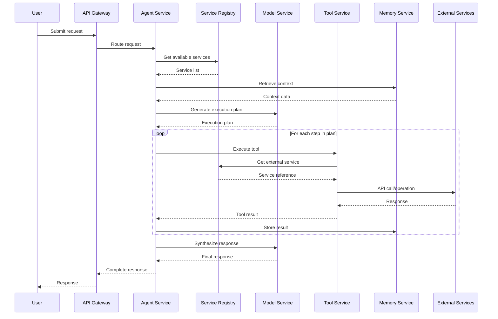
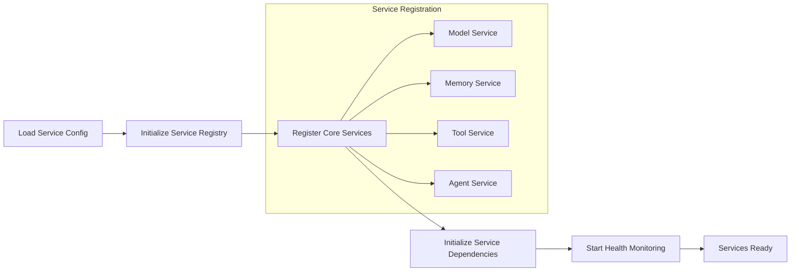
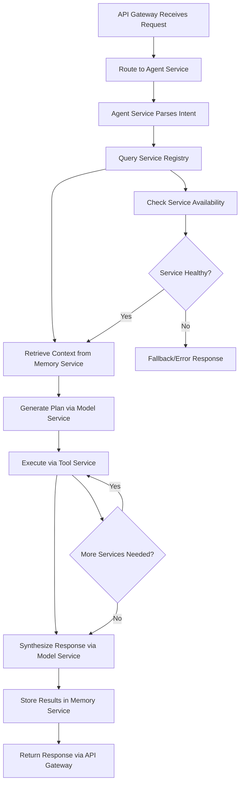

# Agent Development Kit (ADK) - Architecture

## 📚 Table of Contents
1. [Core Concepts](#core-concepts)
2. [System Architecture](#system-architecture)  
3. [Component Details](#component-details)
4. [Agent Lifecycle](#agent-lifecycle)
5. [Tool Integration](#tool-integration)
6. [Service Architecture](#service-architecture)
7. [Deployment Models](#deployment-models)

## 🎯 Core Concepts

The Agent Development Kit (ADK) is built around several key architectural concepts:

### Agents
**Intelligent entities** that can reason, plan, and execute complex tasks through tool orchestration.

### Tools  
**Specialized functions** that provide specific capabilities like API calls, data processing, or external system integration.

### Services
**Modular components** that provide infrastructure capabilities like model inference, memory management, and monitoring.

### Models
**Language model integrations** that power agent reasoning and natural language understanding.

## 🏗️ System Architecture

### High-Level Service Architecture

```mermaid
graph TB
    subgraph "Application Layer"
        AGENT[🤖 Agent Service]
        TOOLS[🔧 Tool Service]
        API_GW[🌐 API Gateway]
        
        AGENT -->|orchestrates| TOOLS
        API_GW -->|routes to| AGENT
    end
    
    subgraph "Service Registry & Management"
        SR[📋 Service Registry]
        SM[⚙️ Service Manager]
        SC[🔧 Service Config]
        
        SR -->|manages| SM
        SM -->|configures| SC
    end
    
    subgraph "Core Services"
        MODEL[🧠 Model Service]
        MEMORY[💾 Memory Service] 
        CONFIG[⚙️ Configuration Service]
        HEALTH[🏥 Health Service]
        LOGGING[📊 Logging Service]
        
        SR -->|registers| MODEL
        SR -->|registers| MEMORY
        SR -->|registers| CONFIG
        SR -->|registers| HEALTH
        SR -->|registers| LOGGING
    end
    
    subgraph "Integration Services"
        GCP_SVC[☁️ GCP Service]
        AI_SVC[🔥 AI Provider Service]
        API_SVC[🌐 External API Service]
        
        SR -->|registers| GCP_SVC
        SR -->|registers| AI_SVC
        SR -->|registers| API_SVC
    end
    
    subgraph "Infrastructure Layer"
        CONTAINER[🐳 Container Runtime]
        MONITOR[📈 Monitoring Service]
        STORAGE[💿 Storage Service]
        
        SR -->|registers| MONITOR
        SR -->|registers| STORAGE
        CONTAINER -->|hosts| SR
    end
    
    AGENT -->|uses| MODEL
    AGENT -->|stores| MEMORY
    AGENT -->|configures| CONFIG
    TOOLS -->|calls| GCP_SVC
    TOOLS -->|calls| AI_SVC
    TOOLS -->|calls| API_SVC
    HEALTH -->|monitors| SR
    LOGGING -->|aggregates| SR
    
    classDef app fill:#e3f2fd,stroke:#1976d2,stroke-width:2px
    classDef registry fill:#fff3e0,stroke:#ff9800,stroke-width:2px
    classDef core fill:#f3e5f5,stroke:#7b1fa2,stroke-width:2px  
    classDef integration fill:#e8f5e8,stroke:#388e3c,stroke-width:2px
    classDef infra fill:#fce4ec,stroke:#e91e63,stroke-width:2px
    
    class AGENT,TOOLS,API_GW app
    class SR,SM,SC registry
    class MODEL,MEMORY,CONFIG,HEALTH,LOGGING core
    class GCP_SVC,AI_SVC,API_SVC integration
    class CONTAINER,MONITOR,STORAGE infra
```



### Service Interaction Flow



## 🔧 Service Details

### Agent Service
The core agent execution service that:
- **Processes requests** using natural language understanding
- **Plans execution** by breaking down complex tasks
- **Orchestrates tool services** to gather information and perform actions
- **Manages context** across multi-turn conversations through Memory Service
- **Handles errors** and retries failed operations

**Service Features:**
- Asynchronous execution for concurrent service calls
- Built-in retry mechanisms with exponential backoff  
- Context window management for long conversations
- Dynamic service selection and parameter binding
- Response synthesis and formatting
- Health monitoring and graceful degradation

### Model Service
Provides unified interface to multiple LLM providers through a service abstraction:

**Supported Providers:**
- **Vertex AI Service** - Google's enterprise AI platform
- **OpenAI Service** - GPT models and embeddings
- **Anthropic Service** - Claude models  
- **Local Model Service** - Self-hosted or on-premise models

**Service Features:**
- Provider-agnostic API
- Automatic model selection and failover
- Cost optimization and routing
- Response streaming support
- Token usage tracking and quotas
- Service-level authentication management

### Tool Service  
Standardized service for integrating external capabilities through managed tool execution:

**Tool Service Categories:**
- **API Tool Services** - REST/GraphQL API integrations
- **Data Tool Services** - File processing, databases, analytics
- **Cloud Tool Services** - Cloud provider specific operations
- **Utility Tool Services** - Text processing, calculations, formatting

**Tool Service Lifecycle:**
```python
@tool_service
def my_tool_service(param: str) -> str:
    """Tool service description for agent understanding."""
    # Tool service implementation with error handling
    return result

# Tool services are automatically:
# 1. Registered with the service registry
# 2. Described to the model service
# 3. Called with proper parameters via Tool Service
# 4. Results integrated into agent reasoning
# 5. Health monitored and logged
```

### Memory Service
Persistent storage service for agent context and knowledge:

**Memory Service Types:**
- **Short-term Memory Service** - Current conversation context
- **Long-term Memory Service** - Persistent knowledge across sessions  
- **Semantic Memory Service** - Vector-based knowledge retrieval
- **Episodic Memory Service** - Historical interaction patterns

**Storage Service Backends:**
- In-memory service (development)
- PostgreSQL service (production)
- Vector database services (Pinecone, Weaviate)
- Cloud storage services (GCS, S3)

## 🔄 Service Lifecycle

### Service Initialization Phase


1. **Service Configuration Loading** - Environment variables, service definitions
2. **Service Registry Initialization** - Central service management setup
3. **Core Service Registration** - Register essential services with dependencies
4. **Service Dependency Resolution** - Ensure all service dependencies are met
5. **Health Monitoring Setup** - Start continuous health checks for all services
6. **Service Readiness Verification** - Confirm all services are operational

### Service Request Processing


### Service Shutdown Phase
- **Graceful service termination** of all registered services
- **Service state persistence** via Memory Service
- **Service registry cleanup** and deregistration
- **Health monitoring shutdown** and final status updates
- **Resource cleanup** across all service layers

## 🔧 Tool Integration

### Tool Discovery
ADK automatically discovers tools through:
- **Function decorators** - `@tool` decorator registration
- **Module scanning** - Automatic discovery in specified packages
- **Configuration files** - YAML/JSON tool definitions
- **Runtime registration** - Dynamic tool loading

### Tool Execution
```python
# Tool definition
@tool  
def get_weather(location: str) -> str:
    """Get current weather for a location."""
    # Implementation
    return weather_data

# Agent automatically:
# 1. Understands tool purpose from docstring
# 2. Extracts required parameters from user request
# 3. Calls tool with appropriate parameters
# 4. Integrates results into response
```

### Error Handling
- **Validation** - Parameter type checking and validation
- **Retries** - Automatic retry with exponential backoff
- **Fallbacks** - Alternative tools for similar functionality
- **Logging** - Detailed error logging and debugging information

## 🏛️ Service Architecture

### Service Discovery
ADK uses a service registry pattern for managing components:

```python
# Service registration
@service(name="model_service")
class VertexAIService:
    async def initialize(self):
        # Service startup logic
        pass
        
    async def shutdown(self):
        # Cleanup logic  
        pass
        
    async def health_check(self):
        # Health verification
        return {"healthy": True}
```

### Configuration Management
- **Environment Variables** - Runtime configuration
- **YAML Files** - Complex configuration structures
- **Service Discovery** - Automatic service configuration
- **Hot Reloading** - Configuration updates without restart

### Health Monitoring
Built-in health checking system:
- **Service Health** - Individual service status
- **Dependency Checks** - External service connectivity
- **Resource Monitoring** - CPU, memory, disk usage
- **Performance Metrics** - Response times, error rates

## 🚀 Deployment Models

### Local Development
```bash
# Single-process deployment
python -m adk.server --port 8000

# Development with auto-reload
python -m adk.server --reload --debug
```

### Docker Container
```dockerfile
FROM python:3.11-slim
COPY . /app
RUN pip install -e .
CMD ["python", "-m", "adk.server"]
```

### Kubernetes
```yaml
apiVersion: apps/v1
kind: Deployment
metadata:
  name: adk-agent
spec:
  replicas: 3
  selector:
    matchLabels:
      app: adk-agent
  template:
    spec:
      containers:
      - name: adk-agent
        image: adk-agent:latest
        ports:
        - containerPort: 8000
        env:
        - name: ADK_MODEL_PROVIDER
          value: "vertex_ai"
```

### Serverless (Cloud Run)
```yaml
apiVersion: serving.knative.dev/v1
kind: Service
metadata:
  name: adk-agent
spec:
  template:
    metadata:
      annotations:
        autoscaling.knative.dev/maxScale: "100"
        run.googleapis.com/memory: "2Gi"
        run.googleapis.com/cpu: "2"
    spec:
      containers:
      - image: gcr.io/project/adk-agent
        ports:
        - containerPort: 8000
```

## 🔒 Security Architecture

### Authentication & Authorization
- **Service Account Authentication** - For cloud providers
- **API Key Management** - Secure credential storage
- **Role-Based Access** - Fine-grained permissions
- **Audit Logging** - Complete request/response logging

### Data Security
- **Encryption at Rest** - Encrypted storage of sensitive data
- **Encryption in Transit** - TLS for all communications
- **Data Isolation** - Multi-tenant data separation
- **Privacy Controls** - Data retention and deletion policies

### Network Security
- **VPC Integration** - Private network deployment
- **Firewall Rules** - Network access controls
- **Rate Limiting** - Request throttling and abuse prevention
- **DDoS Protection** - Traffic analysis and filtering

## 📊 Observability

### Logging
- **Structured Logging** - JSON formatted logs with correlation IDs
- **Log Aggregation** - Centralized log collection and analysis
- **Error Tracking** - Automatic error detection and alerting
- **Debug Tracing** - Detailed execution path logging

### Metrics  
- **Performance Metrics** - Response times, throughput, error rates
- **Business Metrics** - Usage patterns, feature adoption
- **Infrastructure Metrics** - Resource utilization, health status
- **Custom Metrics** - Application-specific measurements

### Tracing
- **Distributed Tracing** - Request flow across services
- **Dependency Mapping** - Service interaction visualization  
- **Performance Analysis** - Bottleneck identification
- **Error Attribution** - Root cause analysis

This architecture provides a robust, scalable foundation for building intelligent agents while maintaining simplicity for developers and operators.