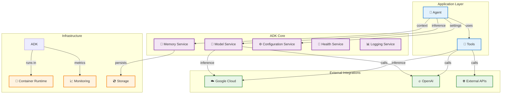
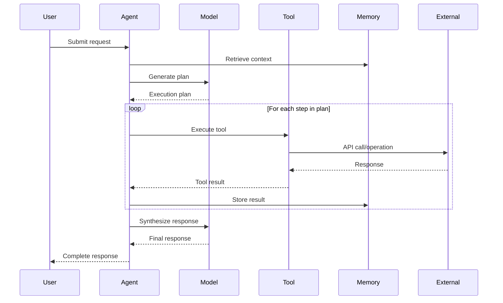
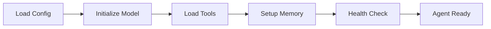
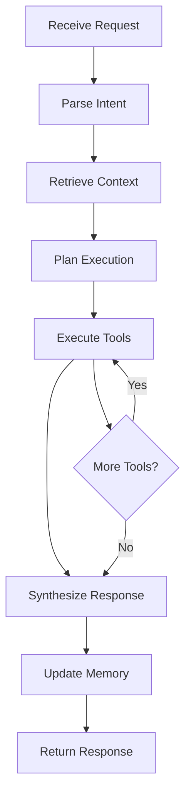

# Agent Development Kit (ADK) - Architecture

## 📚 Table of Contents
1. [Core Concepts](#core-concepts)
2. [System Architecture](#system-architecture)  
3. [Component Details](#component-details)
4. [Agent Lifecycle](#agent-lifecycle)
5. [Tool Integration](#tool-integration)
6. [Service Architecture](#service-architecture)
7. [Deployment Models](#deployment-models)

## 🎯 Core Concepts

The Agent Development Kit (ADK) is built around several key architectural concepts:

### Agents
**Intelligent entities** that can reason, plan, and execute complex tasks through tool orchestration.

### Tools  
**Specialized functions** that provide specific capabilities like API calls, data processing, or external system integration.

### Services
**Modular components** that provide infrastructure capabilities like model inference, memory management, and monitoring.

### Models
**Language model integrations** that power agent reasoning and natural language understanding.

## 🏗️ System Architecture

### High-Level Architecture



### Component Interaction Flow



## 🔧 Component Details

### Agent Runtime
The core agent execution environment that:
- **Processes requests** using natural language understanding
- **Plans execution** by breaking down complex tasks
- **Orchestrates tools** to gather information and perform actions
- **Manages context** across multi-turn conversations
- **Handles errors** and retries failed operations

**Key Features:**
- Asynchronous execution for concurrent tool usage
- Built-in retry mechanisms with exponential backoff  
- Context window management for long conversations
- Tool selection and parameter binding
- Response synthesis and formatting

### Model Abstraction Layer
Provides unified interface to multiple LLM providers:

**Supported Providers:**
- **Vertex AI** - Google's enterprise AI platform
- **OpenAI** - GPT models and embeddings
- **Anthropic** - Claude models  
- **Local Models** - Self-hosted or on-premise models

**Features:**
- Provider-agnostic API
- Automatic model selection
- Cost optimization and routing
- Response streaming support
- Token usage tracking

### Tool Framework  
Standardized system for integrating external capabilities:

**Tool Types:**
- **API Tools** - REST/GraphQL API integrations
- **Data Tools** - File processing, databases, analytics
- **Cloud Tools** - Cloud provider specific operations
- **Utility Tools** - Text processing, calculations, formatting

**Tool Lifecycle:**
```python
@tool
def my_tool(param: str) -> str:
    """Tool description for agent understanding."""
    # Tool implementation
    return result

# Tools are automatically:
# 1. Registered with the agent
# 2. Described to the language model  
# 3. Called with proper parameters
# 4. Results integrated into agent reasoning
```

### Memory Management
Persistent storage for agent context and knowledge:

**Memory Types:**
- **Short-term** - Current conversation context
- **Long-term** - Persistent knowledge across sessions  
- **Semantic** - Vector-based knowledge retrieval
- **Episodic** - Historical interaction patterns

**Storage Backends:**
- In-memory (development)
- PostgreSQL (production)
- Vector databases (Pinecone, Weaviate)
- Cloud storage (GCS, S3)

## 🔄 Agent Lifecycle

### Initialization Phase


1. **Configuration Loading** - Environment variables, YAML configs
2. **Model Initialization** - Provider authentication, model loading
3. **Tool Registration** - Discovery and validation of available tools
4. **Memory Setup** - Connection to storage backends
5. **Health Verification** - System readiness checks

### Request Processing


### Shutdown Phase
- **Graceful termination** of ongoing operations
- **Memory persistence** of current state
- **Resource cleanup** and connection closing
- **Health status updates**

## 🔧 Tool Integration

### Tool Discovery
ADK automatically discovers tools through:
- **Function decorators** - `@tool` decorator registration
- **Module scanning** - Automatic discovery in specified packages
- **Configuration files** - YAML/JSON tool definitions
- **Runtime registration** - Dynamic tool loading

### Tool Execution
```python
# Tool definition
@tool  
def get_weather(location: str) -> str:
    """Get current weather for a location."""
    # Implementation
    return weather_data

# Agent automatically:
# 1. Understands tool purpose from docstring
# 2. Extracts required parameters from user request
# 3. Calls tool with appropriate parameters
# 4. Integrates results into response
```

### Error Handling
- **Validation** - Parameter type checking and validation
- **Retries** - Automatic retry with exponential backoff
- **Fallbacks** - Alternative tools for similar functionality
- **Logging** - Detailed error logging and debugging information

## 🏛️ Service Architecture

### Service Discovery
ADK uses a service registry pattern for managing components:

```python
# Service registration
@service(name="model_service")
class VertexAIService:
    async def initialize(self):
        # Service startup logic
        pass
        
    async def shutdown(self):
        # Cleanup logic  
        pass
        
    async def health_check(self):
        # Health verification
        return {"healthy": True}
```

### Configuration Management
- **Environment Variables** - Runtime configuration
- **YAML Files** - Complex configuration structures
- **Service Discovery** - Automatic service configuration
- **Hot Reloading** - Configuration updates without restart

### Health Monitoring
Built-in health checking system:
- **Service Health** - Individual service status
- **Dependency Checks** - External service connectivity
- **Resource Monitoring** - CPU, memory, disk usage
- **Performance Metrics** - Response times, error rates

## 🚀 Deployment Models

### Local Development
```bash
# Single-process deployment
python -m adk.server --port 8000

# Development with auto-reload
python -m adk.server --reload --debug
```

### Docker Container
```dockerfile
FROM python:3.11-slim
COPY . /app
RUN pip install -e .
CMD ["python", "-m", "adk.server"]
```

### Kubernetes
```yaml
apiVersion: apps/v1
kind: Deployment
metadata:
  name: adk-agent
spec:
  replicas: 3
  selector:
    matchLabels:
      app: adk-agent
  template:
    spec:
      containers:
      - name: adk-agent
        image: adk-agent:latest
        ports:
        - containerPort: 8000
        env:
        - name: ADK_MODEL_PROVIDER
          value: "vertex_ai"
```

### Serverless (Cloud Run)
```yaml
apiVersion: serving.knative.dev/v1
kind: Service
metadata:
  name: adk-agent
spec:
  template:
    metadata:
      annotations:
        autoscaling.knative.dev/maxScale: "100"
        run.googleapis.com/memory: "2Gi"
        run.googleapis.com/cpu: "2"
    spec:
      containers:
      - image: gcr.io/project/adk-agent
        ports:
        - containerPort: 8000
```

## 🔒 Security Architecture

### Authentication & Authorization
- **Service Account Authentication** - For cloud providers
- **API Key Management** - Secure credential storage
- **Role-Based Access** - Fine-grained permissions
- **Audit Logging** - Complete request/response logging

### Data Security
- **Encryption at Rest** - Encrypted storage of sensitive data
- **Encryption in Transit** - TLS for all communications
- **Data Isolation** - Multi-tenant data separation
- **Privacy Controls** - Data retention and deletion policies

### Network Security
- **VPC Integration** - Private network deployment
- **Firewall Rules** - Network access controls
- **Rate Limiting** - Request throttling and abuse prevention
- **DDoS Protection** - Traffic analysis and filtering

## 📊 Observability

### Logging
- **Structured Logging** - JSON formatted logs with correlation IDs
- **Log Aggregation** - Centralized log collection and analysis
- **Error Tracking** - Automatic error detection and alerting
- **Debug Tracing** - Detailed execution path logging

### Metrics  
- **Performance Metrics** - Response times, throughput, error rates
- **Business Metrics** - Usage patterns, feature adoption
- **Infrastructure Metrics** - Resource utilization, health status
- **Custom Metrics** - Application-specific measurements

### Tracing
- **Distributed Tracing** - Request flow across services
- **Dependency Mapping** - Service interaction visualization  
- **Performance Analysis** - Bottleneck identification
- **Error Attribution** - Root cause analysis

This architecture provides a robust, scalable foundation for building intelligent agents while maintaining simplicity for developers and operators.