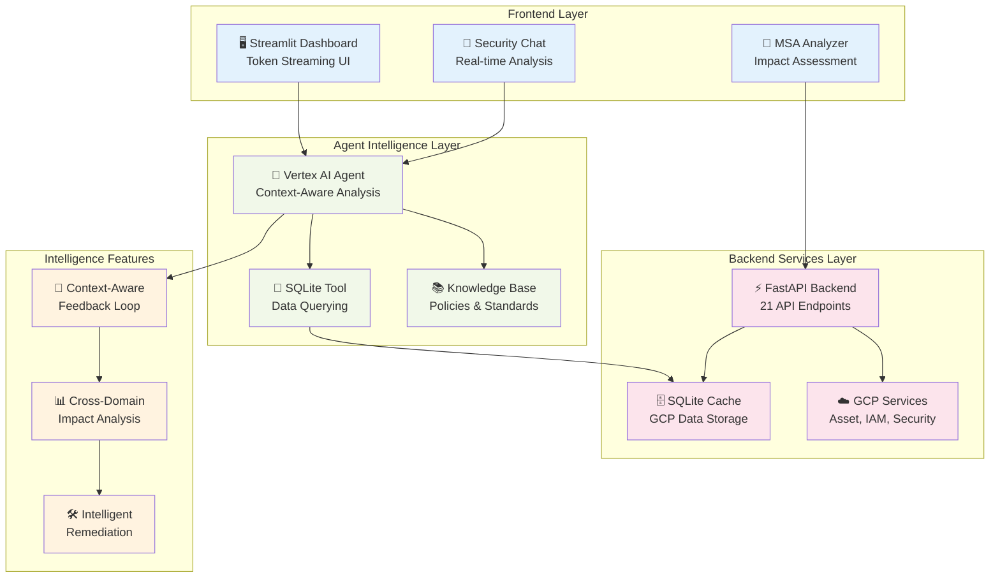

# Agent Development Kit (ADK)

<div align="center">

[](https://github.com/stuagano/adk-python)
[](LICENSE)
[](https://python.org)
[](contributing/samples/security_agent/)

**A comprehensive framework for building intelligent, AI-powered agents and applications**

[🚀 Quick Start](#-quick-start) • [📖 Documentation](#-documentation) • [🛠️ Examples](#-sample-applications) • [💬 Community](#-community)

</div>

---

## 📋 Table of Contents

- [What is ADK?](#-what-is-adk)
- [Key Features](#-key-features)  
- [Quick Start](#-quick-start)
- [Sample Applications](#-sample-applications)
- [Architecture](#-architecture)
- [Installation](#️-installation)
- [Configuration](#-configuration)
- [Development](#-development)
- [Documentation](#-documentation)
- [Community & Support](#-community--support)

## 🎯 What is ADK?

The Agent Development Kit (ADK) is a powerful framework that enables developers to create intelligent agents capable of complex reasoning, tool integration, and autonomous decision-making. Built on modern AI/ML foundations with enterprise-grade reliability.

### 🔑 Key Features

<table>
<tr>
<td>

**🤖 Intelligent Agents**
- Multi-step reasoning & planning
- Context-aware conversations
- Memory management
- Error handling & recovery

</td>
<td>

**🔧 Tool Integration** 
- API & database connectors
- Cloud service integrations
- Custom function tools  
- Workflow orchestration

</td>
</tr>
<tr>
<td>

**💬 Natural Language**
- Advanced conversational UI
- Multi-modal interactions
- Real-time responses
- Language model flexibility

</td>
<td>

**📊 Enterprise Ready**
- Security & compliance
- Scalable deployment
- Health monitoring
- Performance analytics

</td>
</tr>
</table>

## 🚀 Quick Start

**Get started in under 5 minutes:**

```bash
# 1. Clone the repository
git clone https://github.com/stuagano/adk-python.git
cd adk-python

# 2. Try the flagship security agent
cd contributing/samples/security_agent
cp .env.template .env  # Configure your GCP project
python run_backend.py &     # Start FastAPI backend
python run_frontend.py     # Start Streamlit frontend

# 3. Access the applications
# Executive Dashboard: http://localhost:8501
# Backend API: http://localhost:8000/docs
# Health Check: http://localhost:8000/health
```

> **💡 New to ADK?** Start with our [GCP Security Agent](#gcp-security-agent) - a production-ready example showcasing advanced ADK capabilities including context-aware MSA analysis and real-time streaming.

## 🛠️ Sample Applications

### GCP Security Agent 
[]()

**Location**: [`contributing/samples/security_agent/`](contributing/samples/security_agent/)

A sophisticated context-aware security platform for Google Cloud Platform featuring advanced MSA analysis and intelligent remediation strategies:

- **🔄 Context-Aware Feedback Loop** - Revolutionary MSA impact analysis connecting service changes → IAM roles → asset security
- **🛡️ Multi-Domain Security Intelligence** - Real-time analysis across 575+ assets with cross-referencing capabilities
- **🤖 Vertex AI Streaming Assistant** - Token-by-token streaming with embedded security expertise and remediation guidance
- **🔐 Advanced IAM & MSA Correlation** - BigQuery permission analysis, custom role impact assessment, and policy compliance
- **📊 Executive Security Dashboard** - Real-time posture metrics, risk scoring, and actionable intelligence
- **🏗️ Intelligent Logic Layer** - Context-aware engine bridging raw GCP data with strategic security recommendations
- **📚 Enterprise Knowledge Integration** - 7 coding standards, compliance frameworks, and policy enforcement
- **⚡ Production-Ready Streaming** - ChatGPT-like experience with persistent session management
- **🗄️ Normalized Data Architecture** - SQLite-based caching with 1800-second refresh cycles and cross-table relationships
- **🧪 100% Test Coverage** - Comprehensive evaluation framework with Playwright automation and production validation

**Advanced Intelligence Features:**
- **MSA Permission Split Analysis**: Detects BigQuery `datasets.get` → `datasets.get` + `datasets.getIamPolicy` changes
- **Custom Role Impact Assessment**: Project-specific remediation with actionable gcloud commands
- **Cross-Domain Security Correlation**: IAM ↔ MSA ↔ Assets ↔ Security Findings with temporal analysis
- **Context-Aware Remediation**: Intelligent recommendations based on actual project state and enterprise policies
- **Production Infrastructure**: Docker + Cloud Run deployment with health monitoring and auto-scaling

**Quick Launch:**
```bash
cd contributing/samples/security_agent
python run_backend.py &     # Start FastAPI backend
python run_frontend.py     # Start Streamlit frontend with streaming
```

[📖 Documentation](contributing/samples/security_agent/README.md) • [🏗️ Logic Layer Architecture](contributing/samples/security_agent/README.md#-logic-layer-architecture) • [🧪 Evaluation Framework](contributing/samples/security_agent/evaluation/)

### GCP API Explorer
[]()

**Location**: [`gcp_api_explorer/`](gcp_api_explorer/)

Interactive Google Cloud API discovery and testing tool:

- **🔍 Dynamic API Discovery** - Automatically discover available GCP APIs
- **🧪 Interactive Testing** - Test endpoints with real-time responses  
- **🔐 Multi-Auth Support** - Service accounts, OAuth2, and ADC
- **📚 Auto-Documentation** - Generated docs from API schemas
- **🏗️ Request Builder** - Visual interface for complex API requests

[📖 Documentation](gcp_api_explorer/README.md) • [🚀 Usage Guide](gcp_api_explorer/USAGE_GUIDE.md)

### Agent Evaluation Framework
[]()

**Location**: [`evaluation/`](evaluation/)

Comprehensive agent testing and benchmarking system:

- **📊 Multi-Metric Evaluation** - Performance, accuracy, and security metrics
- **📋 Standardized Datasets** - Security-focused test cases  
- **🔄 Automated Benchmarking** - Continuous performance measurement
- **📈 ADK Integration** - Built on google.adk.evaluation patterns

[📖 Documentation](evaluation/README.md) • [📊 Architecture](evaluation/ARCHITECTURE.md)

## 🏗️ Architecture

ADK follows a modular, service-based architecture designed for enterprise scalability:

<div align="center">



</div>

### Core Principles

- **🔌 Modular Design** - Mix and match components as needed
- **🔄 Dynamic Configuration** - Runtime service management  
- **📊 Observable** - Built-in monitoring and health checks
- **🚀 Cloud Native** - Docker, Kubernetes, and multi-cloud ready
- **🛡️ Security First** - Authentication, authorization, and audit logging

## ⚡ Installation

### Prerequisites

| Requirement | Version | Purpose |
|-------------|---------|---------|
| **Python** | 3.8+ | Core runtime |
| **Docker** | Latest | Container deployment |
| **Google Cloud SDK** | Latest | GCP integrations (optional) |

### Quick Install

```bash
# Clone repository
git clone https://github.com/google/adk-python.git
cd adk-python

# Option 1: Try the production-ready security agent
cd contributing/samples/security_agent
cp .env.template .env  # Configure your GCP project
python run_backend.py &     # Start backend
python run_frontend.py     # Start frontend

# Option 2: Install ADK core for development  
pip install -e . && python -c "import google.adk; print('ADK installed!')"
```

### Development Setup

```bash
# Create virtual environment
python -m venv adk-env
source adk-env/bin/activate  # Windows: adk-env\Scripts\activate

# Install with development dependencies
pip install -e ".[dev]"
pytest tests/  # Run test suite
```

## 🔧 Configuration

### Environment Variables

Create a `.env` file or set environment variables:

```bash
# Core ADK Configuration
ADK_LOG_LEVEL=INFO
ADK_MODEL_PROVIDER=vertex_ai  # or 'openai', 'anthropic', etc.

# Google Cloud Integration (optional)
GOOGLE_CLOUD_PROJECT=your-project-id
GOOGLE_APPLICATION_CREDENTIALS=/path/to/service-account.json

# Vertex AI Configuration
VERTEX_AI_PROJECT_ID=your-project-id
VERTEX_AI_LOCATION=us-central1

# Alternative: OpenAI
OPENAI_API_KEY=your-openai-key
```

### Basic Agent Example

```python
from adk.core import Agent
from adk.tools import tool

@tool
def analyze_data(data: str) -> str:
    """Analyzes input data and returns insights."""
    return f"Analysis complete: {len(data)} characters processed"

# Create and configure agent
agent = Agent(
    name="data_analyst",
    model="gemini-pro",
    tools=[analyze_data],
    instructions="You are a helpful data analyst.",
    max_iterations=10,
    timeout=60
)

# Use the agent
result = agent.run("Analyze this dataset: [1,2,3,4,5]")
print(result)
```

## 🧠 Core Concepts

<details>
<summary><strong>🤖 Agents</strong> - Intelligent entities with reasoning capabilities</summary>

**Agents** are the core of ADK - intelligent entities that can:
- **Multi-step reasoning**: Break down complex tasks into manageable steps
- **Tool orchestration**: Use multiple tools in sequence to accomplish goals  
- **Memory management**: Remember context across conversations and sessions
- **Error handling**: Gracefully handle failures with retries and fallbacks
- **Learning**: Improve performance based on feedback and experience

```python
agent = Agent(
    name="security_analyst", 
    model="gemini-pro",
    tools=[scan_vulnerabilities, analyze_logs, generate_report]
)
```

</details>

<details>
<summary><strong>🔧 Tools</strong> - Functions that extend agent capabilities</summary>

**Tools** enable agents to interact with external systems:
- **API integrations**: REST APIs, GraphQL, webhooks
- **Data processing**: File manipulation, database queries, data analysis
- **Cloud services**: Google Cloud, AWS, Azure native integrations  
- **Custom functions**: Your domain-specific business logic

```python
@tool
def query_database(sql: str) -> List[Dict]:
    """Execute SQL query and return results."""
    return db.execute(sql).fetchall()
```

</details>

<details>
<summary><strong>⚙️ Services</strong> - Modular components for enterprise functionality</summary>

**Services** provide foundational capabilities:
- **Model services**: LLM providers (Vertex AI, OpenAI, Anthropic)
- **Memory services**: Conversation and context persistence
- **Integration services**: Authentication, logging, monitoring
- **Health services**: System diagnostics and performance metrics

</details>

## 🚀 Deployment Options

<table>
<tr>
<th>Environment</th>
<th>Use Case</th>
<th>Setup</th>
</tr>
<tr>
<td><strong>🖥️ Local Development</strong></td>
<td>Development, testing, debugging</td>
<td>

```bash
pip install -e .
python run.py
```

</td>
</tr>
<tr>
<td><strong>🐳 Docker</strong></td>
<td>Containerized deployment</td>
<td>

```bash
docker build -t adk-app .
docker run -p 8000:8000 adk-app
```

</td>
</tr>
<tr>
<td><strong>☁️ Cloud Native</strong></td>
<td>Production scaling</td>
<td>

- Google Cloud Run
- Kubernetes  
- Docker Compose

</td>
</tr>
</table>

## 📖 Documentation

### 📚 Core Documentation
- **[Security Agent Guide](contributing/samples/security_agent/README.md)** - Complete implementation guide with Logic Layer Architecture
- **[Documentation Index](contributing/samples/security_agent/docs/README.md)** - Comprehensive navigation and feature overview  
- **[Deployment Guide](contributing/samples/security_agent/docs/deployment.md)** - Local, Docker, Cloud Run deployment strategies
- **[Troubleshooting Guide](contributing/samples/security_agent/docs/troubleshooting.md)** - Common issues and solutions

### 🛠️ Advanced Features
- **[Context-Aware Analysis](contributing/samples/security_agent/agents/gcp_security/)** - Intelligent feedback loop implementation
- **[Knowledge Base Integration](contributing/samples/security_agent/KNOWLEDGE_BASE_INTEGRATION.md)** - Enterprise policy enforcement
- **[MSA Impact Analysis](contributing/samples/security_agent/README.md#-msa-impact-analysis)** - Google Cloud service change management
- **[Evaluation Framework](contributing/samples/security_agent/evaluation/)** - Comprehensive testing with 100% success rate

### 🎯 Production Examples
- **[Executive Dashboard](contributing/samples/security_agent/)** - Real-time security posture visualization
- **[Token Streaming Chat](contributing/samples/security_agent/frontend/)** - ChatGPT-like security intelligence interface
- **[Docker Deployment](contributing/samples/security_agent/docker-compose.yml)** - Production containerization

## 👥 Community & Support

<div align="center">

[](https://github.com/stuagano/adk-python/issues)
[](https://github.com/stuagano/adk-python/stargazers)
[](CONTRIBUTING.md)

</div>

### 🤝 Contributing

We welcome contributions! Here's how to get started:

1. **🐛 Report Issues**: Use [GitHub Issues](https://github.com/stuagano/adk-python/issues) for bugs and feature requests
2. **⭐ Star the Repository**: Show your support and stay updated with new features
3. **📝 Improve Docs**: Help improve documentation and examples
4. **🔧 Code Contributions**: Submit PRs following our [Contributing Guide](CONTRIBUTING.md)
5. **🧪 Test & Evaluate**: Run the evaluation framework and provide feedback

### 📞 Support Channels

- **📖 Documentation**: [Security Agent Docs](contributing/samples/security_agent/docs/README.md)
- **🧪 Evaluation Reports**: [Testing Complete Report](contributing/samples/security_agent/TESTING_COMPLETE_REPORT.md)
- **🐛 Issues**: [GitHub Issues](https://github.com/stuagano/adk-python/issues)
- **📊 Executive Summary**: [Development Sprint Report](contributing/samples/security_agent/EXECUTIVE_SUMMARY_REPORT.md)

## 📄 License

This project is licensed under the Apache License 2.0 - see the [LICENSE](LICENSE) file for details.

---

<div align="center">

**Ready to build intelligent agents?**

[🚀 Get Started](#-quick-start) • [📖 Read the Docs](#-documentation) • [💬 Join the Community](#-community--support)

**⭐ Star this repo to stay updated!**

</div>
