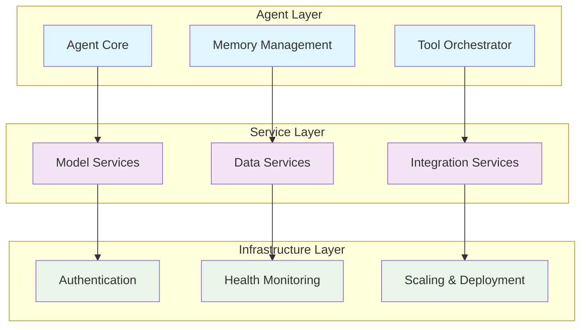

# Agent Development Kit (ADK)

<div align="center">

[](https://github.com/google/adk-python)
[](LICENSE)
[](https://python.org)
[](https://docs.adk.dev)

**A comprehensive framework for building intelligent, AI-powered agents and applications**

[🚀 Quick Start](#-quick-start) • [📖 Documentation](#-documentation) • [🛠️ Examples](#-sample-applications) • [💬 Community](#-community)

</div>

---

## 📋 Table of Contents

- [What is ADK?](#-what-is-adk)
- [Key Features](#-key-features)  
- [Quick Start](#-quick-start)
- [Sample Applications](#-sample-applications)
- [Architecture](#-architecture)
- [Installation](#️-installation)
- [Configuration](#-configuration)
- [Development](#-development)
- [Documentation](#-documentation)
- [Community & Support](#-community--support)

## 🎯 What is ADK?

The Agent Development Kit (ADK) is a powerful framework that enables developers to create intelligent agents capable of complex reasoning, tool integration, and autonomous decision-making. Built on modern AI/ML foundations with enterprise-grade reliability.

### 🔑 Key Features

<table>
<tr>
<td>

**🤖 Intelligent Agents**
- Multi-step reasoning & planning
- Context-aware conversations
- Memory management
- Error handling & recovery

</td>
<td>

**🔧 Tool Integration** 
- API & database connectors
- Cloud service integrations
- Custom function tools  
- Workflow orchestration

</td>
</tr>
<tr>
<td>

**💬 Natural Language**
- Advanced conversational UI
- Multi-modal interactions
- Real-time responses
- Language model flexibility

</td>
<td>

**📊 Enterprise Ready**
- Security & compliance
- Scalable deployment
- Health monitoring
- Performance analytics

</td>
</tr>
</table>

## 🚀 Quick Start

**Get started in under 5 minutes:**

```bash
# 1. Clone the repository
git clone https://github.com/google/adk-python.git
cd adk-python

# 2. Try the flagship security agent
cd contributing/samples/security_agent
python run.py

# 3. Access the applications
# Frontend: http://localhost:8501
# Backend API: http://localhost:8000/docs
```

> **💡 New to ADK?** Start with our [GCP Security Agent](#gcp-security-agent) - a full-featured example showcasing ADK capabilities.

## 🛠️ Sample Applications

### GCP Security Agent 
[]()

**Location**: [`contributing/samples/security_agent/`](contributing/samples/security_agent/)

A comprehensive security evaluation platform for Google Cloud Platform featuring:

- **🛡️ Multi-layered Security Analysis** - Real-time risk assessment & vulnerability scanning
- **🤖 AI-Powered Assistant** - Intelligent security recommendations with ADK integration  
- **🔐 Advanced IAM Analysis** - Deep permissions analysis & policy compliance
- **📊 Live Monitoring** - Performance dashboards with health monitoring
- **🏗️ Clean Architecture** - Well-organized codebase with clear separation of concerns
- **📋 Compliance Frameworks** - SOC2, ISO27001, GDPR evaluation

**Quick Launch:**
```bash
cd contributing/samples/security_agent && python run.py
```

[📖 Documentation](contributing/samples/security_agent/README.md) • [🏗️ Architecture](contributing/samples/security_agent/MODULAR_ARCHITECTURE.md) • [🔧 API Reference](contributing/samples/security_agent/API_REFERENCE.md)

### GCP API Explorer
[]()

**Location**: [`gcp_api_explorer/`](gcp_api_explorer/)

Interactive Google Cloud API discovery and testing tool:

- **🔍 Dynamic API Discovery** - Automatically discover available GCP APIs
- **🧪 Interactive Testing** - Test endpoints with real-time responses  
- **🔐 Multi-Auth Support** - Service accounts, OAuth2, and ADC
- **📚 Auto-Documentation** - Generated docs from API schemas
- **🏗️ Request Builder** - Visual interface for complex API requests

[📖 Documentation](gcp_api_explorer/README.md) • [🚀 Usage Guide](gcp_api_explorer/USAGE_GUIDE.md)

### Agent Evaluation Framework
[]()

**Location**: [`evaluation/`](evaluation/)

Comprehensive agent testing and benchmarking system:

- **📊 Multi-Metric Evaluation** - Performance, accuracy, and security metrics
- **📋 Standardized Datasets** - Security-focused test cases  
- **🔄 Automated Benchmarking** - Continuous performance measurement
- **📈 ADK Integration** - Built on google.adk.evaluation patterns

[📖 Documentation](evaluation/README.md) • [📊 Architecture](evaluation/ARCHITECTURE.md)

## 🏗️ Architecture

ADK follows a modular, service-based architecture designed for enterprise scalability:

<div align="center">



</div>

### Core Principles

- **🔌 Modular Design** - Mix and match components as needed
- **🔄 Dynamic Configuration** - Runtime service management  
- **📊 Observable** - Built-in monitoring and health checks
- **🚀 Cloud Native** - Docker, Kubernetes, and multi-cloud ready
- **🛡️ Security First** - Authentication, authorization, and audit logging

## ⚡ Installation

### Prerequisites

| Requirement | Version | Purpose |
|-------------|---------|---------|
| **Python** | 3.8+ | Core runtime |
| **Docker** | Latest | Container deployment |
| **Google Cloud SDK** | Latest | GCP integrations (optional) |

### Quick Install

```bash
# Clone repository
git clone https://github.com/google/adk-python.git
cd adk-python

# Option 1: Try sample applications
cd contributing/samples/security_agent && python run.py

# Option 2: Install ADK core for development  
pip install -e . && python -c "import adk; print('ADK installed!')"
```

### Development Setup

```bash
# Create virtual environment
python -m venv adk-env
source adk-env/bin/activate  # Windows: adk-env\Scripts\activate

# Install with development dependencies
pip install -e ".[dev]"
pytest tests/  # Run test suite
```

## 🔧 Configuration

### Environment Variables

Create a `.env` file or set environment variables:

```bash
# Core ADK Configuration
ADK_LOG_LEVEL=INFO
ADK_MODEL_PROVIDER=vertex_ai  # or 'openai', 'anthropic', etc.

# Google Cloud Integration (optional)
GOOGLE_CLOUD_PROJECT=your-project-id
GOOGLE_APPLICATION_CREDENTIALS=/path/to/service-account.json

# Vertex AI Configuration
VERTEX_AI_PROJECT_ID=your-project-id
VERTEX_AI_LOCATION=us-central1

# Alternative: OpenAI
OPENAI_API_KEY=your-openai-key
```

### Basic Agent Example

```python
from adk.core import Agent
from adk.tools import tool

@tool
def analyze_data(data: str) -> str:
    """Analyzes input data and returns insights."""
    return f"Analysis complete: {len(data)} characters processed"

# Create and configure agent
agent = Agent(
    name="data_analyst",
    model="gemini-pro",
    tools=[analyze_data],
    instructions="You are a helpful data analyst.",
    max_iterations=10,
    timeout=60
)

# Use the agent
result = agent.run("Analyze this dataset: [1,2,3,4,5]")
print(result)
```

## 🧠 Core Concepts

<details>
<summary><strong>🤖 Agents</strong> - Intelligent entities with reasoning capabilities</summary>

**Agents** are the core of ADK - intelligent entities that can:
- **Multi-step reasoning**: Break down complex tasks into manageable steps
- **Tool orchestration**: Use multiple tools in sequence to accomplish goals  
- **Memory management**: Remember context across conversations and sessions
- **Error handling**: Gracefully handle failures with retries and fallbacks
- **Learning**: Improve performance based on feedback and experience

```python
agent = Agent(
    name="security_analyst", 
    model="gemini-pro",
    tools=[scan_vulnerabilities, analyze_logs, generate_report]
)
```

</details>

<details>
<summary><strong>🔧 Tools</strong> - Functions that extend agent capabilities</summary>

**Tools** enable agents to interact with external systems:
- **API integrations**: REST APIs, GraphQL, webhooks
- **Data processing**: File manipulation, database queries, data analysis
- **Cloud services**: Google Cloud, AWS, Azure native integrations  
- **Custom functions**: Your domain-specific business logic

```python
@tool
def query_database(sql: str) -> List[Dict]:
    """Execute SQL query and return results."""
    return db.execute(sql).fetchall()
```

</details>

<details>
<summary><strong>⚙️ Services</strong> - Modular components for enterprise functionality</summary>

**Services** provide foundational capabilities:
- **Model services**: LLM providers (Vertex AI, OpenAI, Anthropic)
- **Memory services**: Conversation and context persistence
- **Integration services**: Authentication, logging, monitoring
- **Health services**: System diagnostics and performance metrics

</details>

## 🚀 Deployment Options

<table>
<tr>
<th>Environment</th>
<th>Use Case</th>
<th>Setup</th>
</tr>
<tr>
<td><strong>🖥️ Local Development</strong></td>
<td>Development, testing, debugging</td>
<td>

```bash
pip install -e .
python run.py
```

</td>
</tr>
<tr>
<td><strong>🐳 Docker</strong></td>
<td>Containerized deployment</td>
<td>

```bash
docker build -t adk-app .
docker run -p 8000:8000 adk-app
```

</td>
</tr>
<tr>
<td><strong>☁️ Cloud Native</strong></td>
<td>Production scaling</td>
<td>

- Google Cloud Run
- Kubernetes  
- Docker Compose

</td>
</tr>
</table>

## 📖 Documentation

### 📚 Core Documentation
- **[Project Structure](docs/PROPOSED_STRUCTURE.md)** - Project organization and structure
- **[Architecture Guide](contributing/samples/security_agent/ARCHITECTURE.md)** - System design and principles  
- **[Deployment Guide](deploy/README.md)** - Production deployment strategies
- **[API Reference](contributing/samples/security_agent/API_REFERENCE.md)** - Complete API documentation

### 🛠️ Component Guides
- **[Agent Development](docs/agents/README.md)** - Creating intelligent agents
- **[Tool Integration](docs/tools/README.md)** - Building custom tools
- **[Service Architecture](docs/services/README.md)** - Modular service design
- **[Testing & Evaluation](evaluation/README.md)** - Agent testing frameworks

### 🎯 Use Case Examples
- **[Security Analysis](contributing/samples/security_agent/README.md)** - GCP security evaluation
- **[API Discovery](gcp_api_explorer/README.md)** - Cloud API exploration
- **[Custom Agents](docs/examples/)** - Agent development tutorials

## 👥 Community & Support

<div align="center">

[](https://github.com/google/adk-python/issues)
[](https://github.com/google/adk-python/discussions)
[](CONTRIBUTING.md)

</div>

### 🤝 Contributing

We welcome contributions! Here's how to get started:

1. **🐛 Report Issues**: Use [GitHub Issues](https://github.com/google/adk-python/issues) for bugs and feature requests
2. **💬 Join Discussions**: Participate in [GitHub Discussions](https://github.com/google/adk-python/discussions)
3. **📝 Improve Docs**: Help improve documentation and examples
4. **🔧 Code Contributions**: Submit PRs following our [Contributing Guide](CONTRIBUTING.md)

### 📞 Support Channels

- **📖 Documentation**: [docs.adk.dev](https://docs.adk.dev) (coming soon)
- **💬 Discussions**: [GitHub Discussions](https://github.com/google/adk-python/discussions)
- **🐛 Issues**: [GitHub Issues](https://github.com/google/adk-python/issues)
- **📧 Email**: adk-support@google.com

## 📄 License

This project is licensed under the Apache License 2.0 - see the [LICENSE](LICENSE) file for details.

---

<div align="center">

**Ready to build intelligent agents?**

[🚀 Get Started](#-quick-start) • [📖 Read the Docs](#-documentation) • [💬 Join the Community](#-community--support)

**⭐ Star this repo to stay updated!**

</div>
