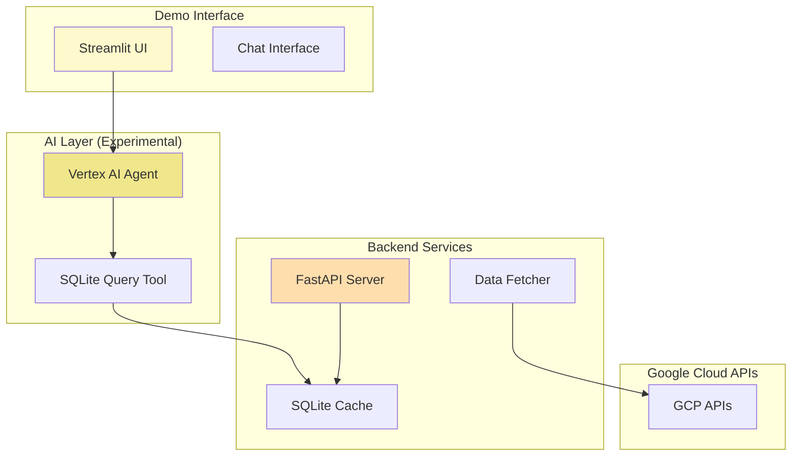

# GCP Security Agent - Proof of Concept

<div align="center">

[](contributing/samples/security_agent/)
[](https://python.org)
[](https://cloud.google.com/vertex-ai)
[](https://github.com/stuagano/adk-python)
[](LICENSE)

**An experimental GCP security analysis tool demonstrating AI-powered security insights and remediation suggestions**

[🚀 Quick Start](#-quick-start) • [✨ Features](#-features) • [🏗️ Architecture](#️-architecture) • [📖 Documentation](#-documentation) • [⚠️ Limitations](#️-limitations)

</div>

---

## 🎯 Overview

This proof-of-concept demonstrates how AI agents can analyze Google Cloud Platform security configurations and provide intelligent recommendations. Built using the ADK (Agent Development Kit) framework, it showcases the potential for automated security analysis with streaming AI assistance.

> **⚠️ Important**: This is a proof-of-concept project for demonstration and learning purposes. It is not intended for production use without significant hardening, testing, and security review.

### 🎓 Learning Objectives

This project demonstrates:
- Integration of Vertex AI with security analysis workflows
- Real-time token streaming in web interfaces
- SQLite-based caching strategies for API data
- Context-aware AI agent development
- Security analysis across multiple GCP services

## 🚀 Quick Start

**Try the demo in under 3 minutes:**

```bash
# 1. Clone the repository
git clone https://github.com/stuagano/adk-python.git
cd adk-python/contributing/samples/security_agent

# 2. Configure your environment
cp .env.template .env
# Edit .env with your GCP project details:
# - GOOGLE_CLOUD_PROJECT=your-project-id
# - GOOGLE_APPLICATION_CREDENTIALS=/path/to/service-account.json

# 3. Start the demo
python run_backend.py    # Terminal 1: FastAPI backend (port 8000)
python run_frontend.py   # Terminal 2: Streamlit frontend (port 8501)

# 4. Access the demo interface
open http://localhost:8501
```

## ✨ Features

This proof-of-concept explores several security analysis capabilities:

### 🔍 Security Analysis Areas (Experimental)

<table>
<tr>
<td width="50%">

**Identity & Access Management**
- IAM role analysis demonstrations
- Service account security checks
- Custom role impact assessment examples
- API key detection scenarios

</td>
<td width="50%">

**Cloud Storage Security**
- Public bucket detection demos
- Encryption status checking
- Access control analysis examples
- CORS configuration reviews

</td>
</tr>
<tr>
<td>

**Network Security**
- Firewall rule analysis samples
- VPC configuration reviews
- Open port detection examples
- Basic security assessments

</td>
<td>

**Compliance Checking**
- Basic compliance pattern matching
- Security finding aggregation
- Sample policy evaluations
- Risk scoring demonstrations

</td>
</tr>
</table>

### 🧪 Technical Demonstrations

- **Token Streaming** - Real-time AI response streaming (experimental)
- **Context Awareness** - Basic multi-turn conversation support
- **Data Caching** - SQLite-based API response caching
- **API Integration** - GCP service API integration examples
- **Knowledge Embedding** - Security remediation suggestions in agent prompts

## 🏗️ Architecture

### Proof-of-Concept Design



### Components

- **Frontend**: Streamlit-based demo interface
- **Backend**: FastAPI server for API endpoints
- **AI Agent**: Vertex AI integration (experimental)
- **Database**: SQLite for demonstration caching
- **APIs**: Basic GCP service integrations

## 📦 Installation

### Prerequisites

| Component | Version | Purpose |
|-----------|---------|---------|
| Python | 3.8+ | Runtime environment |
| Google Cloud SDK | Latest | GCP API access |
| Service Account | - | API authentication |

### Required Permissions (for demo)

Your service account needs these basic roles:
- `roles/cloudasset.viewer` - View assets
- `roles/securitycenter.adminViewer` - View security findings
- `roles/iam.securityReviewer` - Review IAM configurations
- `roles/storage.objectViewer` - View storage objects
- `roles/monitoring.viewer` - View metrics

### Setup Instructions

```bash
# 1. Clone the repository
git clone https://github.com/stuagano/adk-python.git
cd adk-python/contributing/samples/security_agent

# 2. Create virtual environment (recommended)
python -m venv venv
source venv/bin/activate  # Windows: venv\Scripts\activate

# 3. Install dependencies
pip install -r requirements.txt

# 4. Configure environment
cp .env.template .env
# Edit .env with your settings

# 5. Initialize demo database
python backend/populate_sqlite.py

# 6. Run the demo
python run_backend.py &  # Backend
python run_frontend.py   # Frontend
```

## 🧪 Testing

The project includes sample tests for demonstration:

```bash
# Run basic tests
cd evaluation && python simple_test.py

# Run fuller test suite (experimental)
python comprehensive_test_runner.py --agent vertex_sqlite_agent

# Check test coverage
python test_coverage_verification.py
```

## ⚠️ Limitations

### Current Limitations

This proof-of-concept has several known limitations:

- **Not Production Ready** - Requires security hardening for real-world use
- **Limited Error Handling** - Basic error scenarios covered
- **Performance** - Not optimized for large-scale deployments
- **Security** - Demo-level security controls only
- **Testing** - Limited test coverage
- **Scalability** - Single-user design
- **Data Persistence** - SQLite not suitable for production
- **Authentication** - No user authentication implemented

### Development Status

- 🟡 **Experimental Features** - Token streaming, AI analysis
- 🟠 **Basic Implementation** - Core functionality demonstrated
- 🔴 **Not Implemented** - Production security, scaling, monitoring

## 📖 Documentation

### Available Documentation
- [Project Structure](contributing/samples/security_agent/docs/architecture.md)
- [API Endpoints](contributing/samples/security_agent/docs/api.md)
- [Local Setup Guide](contributing/samples/security_agent/docs/setup.md)
- [Known Issues](contributing/samples/security_agent/docs/issues.md)

### Example Code
- [Agent Implementation](contributing/samples/security_agent/agents/)
- [Backend Services](contributing/samples/security_agent/backend/)
- [Frontend Components](contributing/samples/security_agent/frontend/)
- [Test Examples](contributing/samples/security_agent/evaluation/)

## 🛠️ Troubleshooting

### Common Issues

| Issue | Solution |
|-------|----------|
| **Database not found** | Run `python backend/populate_sqlite.py` |
| **Authentication error** | Check service account key path |
| **No data displayed** | Verify GCP permissions |
| **Streaming issues** | Check `AGENT_MODE=sqlite` setting |

### Debug Mode

```bash
# Enable debug logging
export LOG_LEVEL=DEBUG

# Check service health
curl http://localhost:8000/health

# View logs
tail -f logs/backend.log
```

## 🚧 Future Improvements

Potential areas for development:

- [ ] Production-grade security controls
- [ ] Multi-user authentication
- [ ] Enhanced error handling
- [ ] Performance optimization
- [ ] Comprehensive testing
- [ ] Monitoring and observability
- [ ] Database migration to PostgreSQL
- [ ] Container orchestration
- [ ] CI/CD pipeline
- [ ] Security scanning integration

## 🤝 Contributing

This is an experimental project. Contributions are welcome for:

1. Bug fixes and improvements
2. Documentation enhancements
3. Test coverage expansion
4. Feature demonstrations
5. Security hardening suggestions

Please note this is a learning project and not intended for production use.

## ⚖️ Disclaimer

**This is a proof-of-concept demonstration project:**

- Not suitable for production use without extensive modifications
- No warranties or guarantees provided
- Security controls are demonstration-level only
- Data handling is not production-compliant
- Performance is not optimized for scale

Use this project as a learning resource and starting point for development, not as a production-ready solution.

## 📄 License

This project is licensed under the Apache License 2.0 - see the [LICENSE](LICENSE) file for details.

## 🙏 Acknowledgments

- Google Cloud Platform for API access
- Vertex AI team for AI capabilities
- ADK framework for agent development tools
- Open source community for dependencies

---

<div align="center">

**A proof-of-concept security analysis tool for learning and experimentation**

[🚀 Try Demo](#-quick-start) • [📖 View Code](#-documentation) • [⚠️ See Limitations](#️-limitations)

**This is experimental software - not for production use**

</div>  