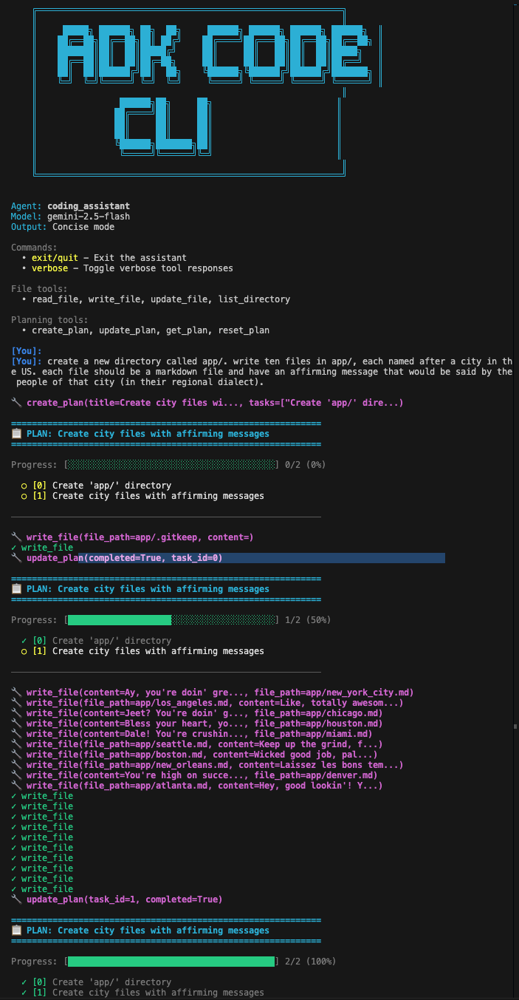

# ADK CLI Coding Agent

An AI coding assistant built with Google ADK featuring file system operations, task planning, and colorful interactive CLI output.

**This is a toy example! It is not meant to be a replacement for fully featured products like the Gemini CLI or Claude Code.**




## Features


**File System Tools**
- `read_file` - Read file contents with metadata
- `write_file` - Create or overwrite files
- `update_file` - Replace text within files
- `list_directory` - List files/directories with glob patterns

**Task Planning**
- `create_plan` - Break down complex tasks into steps
- `update_plan` - Mark tasks as completed
- `get_plan` - View current plan and progress
- `reset_plan` - Clear completed plan

**Colorful Terminal UI**
- Interactive CLI with color-coded output
- Progress tracking with visual task lists
- Concise/verbose output modes

## Setup

1. **Navigate to this sample directory:**
   ```bash
   cd contributing/samples/cli_coding_agent
   ```

2. **Install dependencies:**
   ```bash
   uv pip install -r requirements.txt
   ```

3. **Authenticate with Google Cloud:**
   ```bash
   gcloud auth application-default login
   ```

4. **Run the agent:**
   ```bash
   uv run python -m agent
   ```

   Or use ADK's built-in web interface:
   ```bash
   adk web agent
   ```

## Usage

The agent automatically creates plans for multi-step tasks (3+ steps) and tracks progress:

```
[You]: Help me refactor this codebase

📋 PLAN: Refactor Codebase
Progress: [████████░░░░] 2/3 (67%)
  ✓ [0] Analyze current structure
  ✓ [1] Extract common utilities
  ○ [2] Update imports and tests

🔧 update_file(file_path=utils.py, old_text=...)
✓ update_file
```

**Commands:**
- `exit/quit` - Exit the assistant
- `verbose` - Toggle verbose tool output
