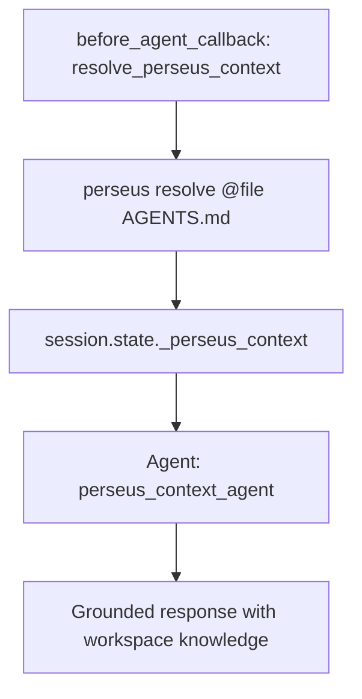

# Perseus Live Context Agent

## Overview

This sample demonstrates using [Perseus](https://github.com/Perseus-Computing-LLC/perseus) — an open-source (MIT) live context engine — to give ADK agents real-time awareness of their workspace.  Instead of baking static instructions into prompts, agents use Perseus directives (`@file`, `@search`, `@memory`, etc.) to resolve exactly what they need at inference time.

### Key Features

- **Dynamic Workspace Context**: Agent "knows" about project files, git state, and config without hardcoded prompts.
- **before_agent_callback Integration**: Context is resolved before each agent run and injected into the instruction template.
- **Configurable Directives**: Change what context is resolved via session state — no code changes needed.
- **Air-gap Ready**: Perseus runs locally with no cloud dependencies.

## How It Works

1. The `before_agent_callback` calls `perseus resolve <directives>` as a subprocess.
2. Resolved context is stored in session state (`_perseus_context`).
3. The agent's instruction template includes `{_perseus_context}`, which ADK replaces with the resolved value at runtime.

## Graph



## Setup

Install Perseus:

```bash
pip install perseus-ctx
```

The `perseus` CLI must be on `$PATH`, or set `PERSEUS_BINARY` to the absolute path.

## Usage

```bash
# Run the demo
python main.py

# Or with ADK CLI
adk run contributing/samples/context_management/perseus_context/agent.py
```

### Customizing Directives

Change what Perseus resolves by setting session state:

```python
session = await runner.session_service.create_session(
    app_name=app_name,
    user_id=user_id,
    state={
        "_perseus_workspace": "/path/to/project",
        "_perseus_directives": "@file README.md @search security @memory project=my-agent",
    },
)
```

## Expected Output

```
** User: What project is this? What's in the AGENTS.md file?
** perseus_context_agent: This is the ADK Python project. The AGENTS.md file
contains AI coding assistant context including architecture patterns, coding
style conventions, and instructions for using skills like adk-git, adk-review...
```

## Troubleshooting

### "Perseus CLI not installed"

Install with `pip install perseus-ctx` or set `PERSEUS_BINARY` to the binary path.

### Context is empty

- Verify the directives reference files that exist in the workspace.
- Check that `_perseus_workspace` points to the right directory.
- Run `perseus resolve "@file AGENTS.md"` directly to test.
