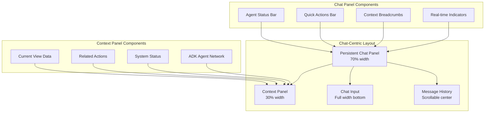
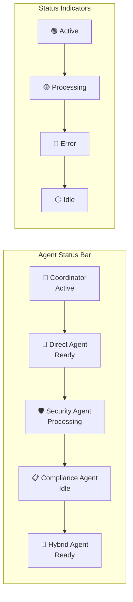
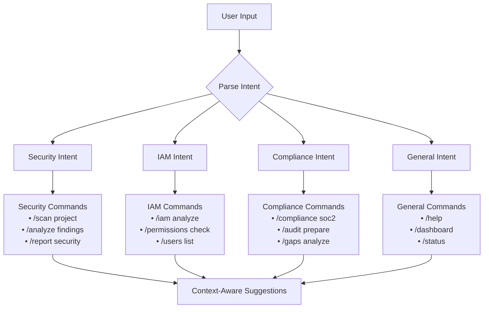
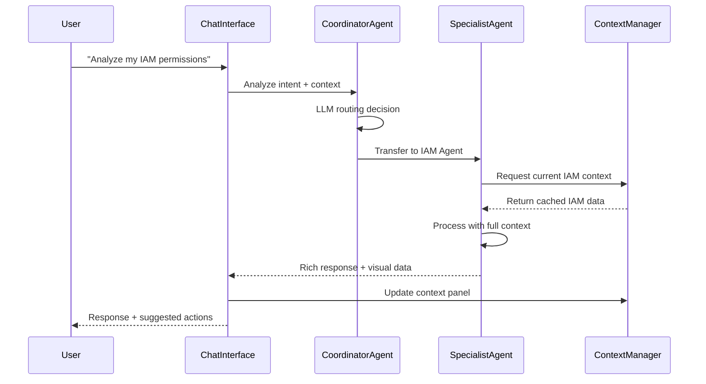
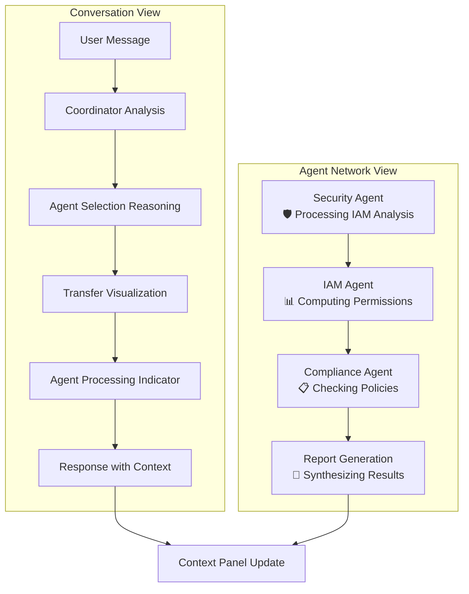
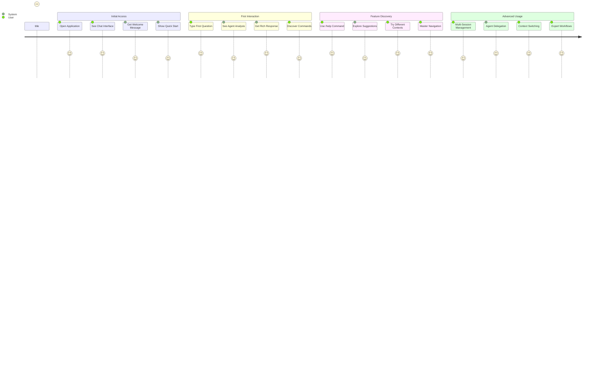
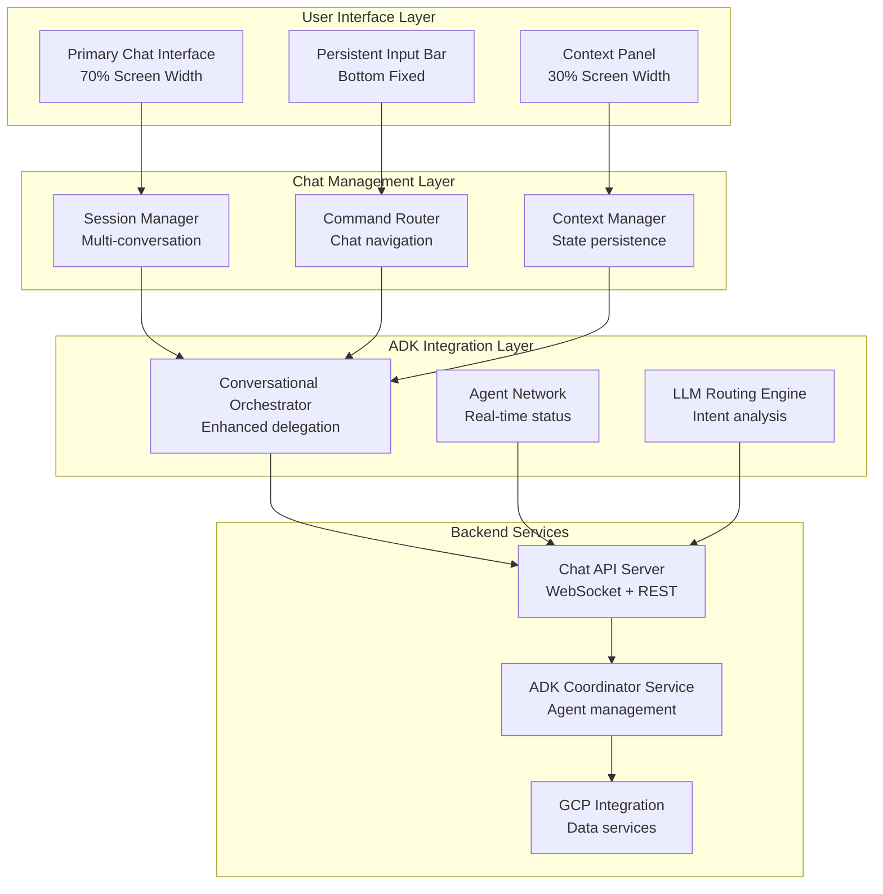
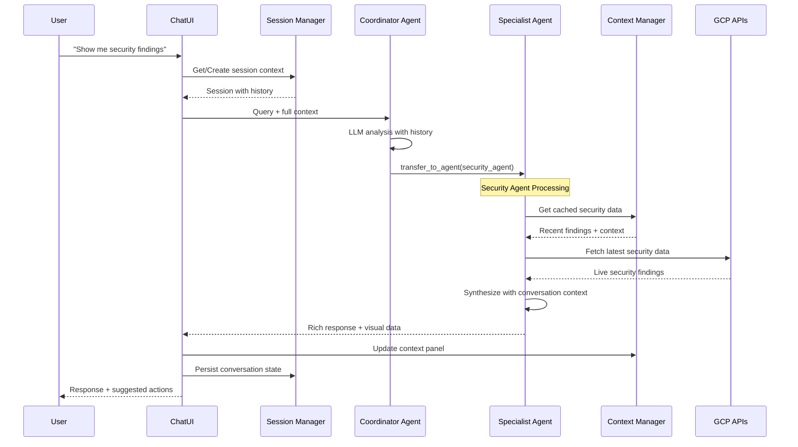
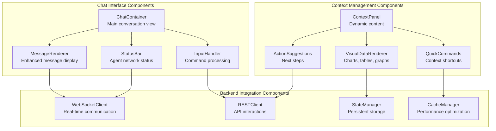
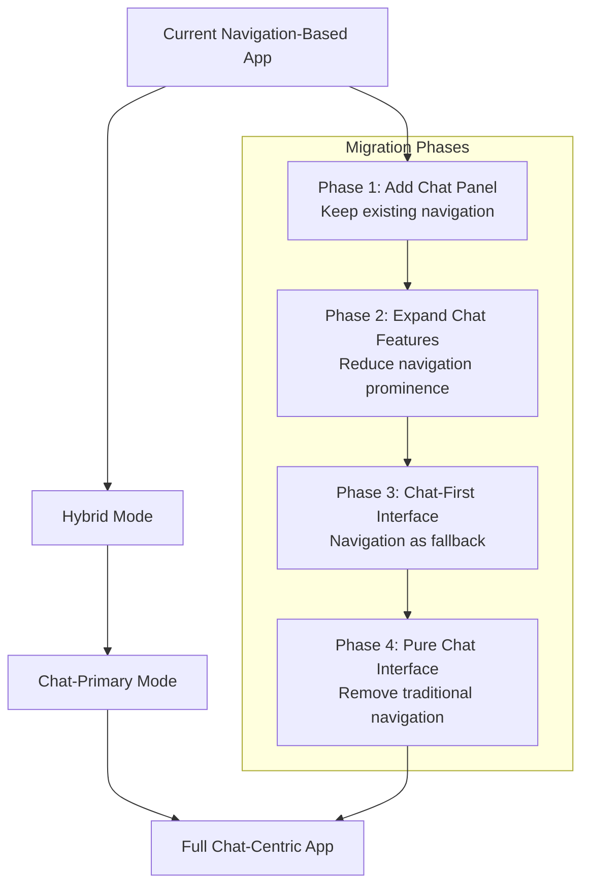

# Chat-Centric Architecture Design for ADK Security Agent

## 🎯 Executive Summary

This document outlines a comprehensive architectural transformation of the ADK Security Agent from a traditional navigation-based interface to a **chat-centric design** where conversational interaction becomes the primary interface paradigm. This architecture leverages the existing ADK delegation pattern while fundamentally reimagining the user experience around continuous, context-aware conversation.

## 📚 Table of Contents

1. [Current State Analysis](#current-state-analysis)
2. [Central Chat Interface Design](#central-chat-interface-design)
3. [Navigation Redesign](#navigation-redesign)
4. [Enhanced ADK Integration Architecture](#enhanced-adk-integration-architecture)
5. [Technical Architecture](#technical-architecture)
6. [User Experience Flow](#user-experience-flow)
7. [Architectural Diagrams](#architectural-diagrams)
8. [Implementation Roadmap](#implementation-roadmap)
9. [Migration Strategy](#migration-strategy)

## 🔍 Current State Analysis

### Existing Architecture Strengths
- **Solid ADK Delegation**: Strong LLM-driven agent routing (`coordinator_agent.py`)
- **Component-Based UI**: Reusable Streamlit components (`frontend/components/`)
- **Comprehensive Backend**: Well-structured FastAPI endpoints (`backend/api/`)
- **Multi-Modal Interfaces**: Security, IAM, Compliance views already implemented

### Current Chat Implementation
```python
# Current: Chat as one feature among many
def render_chat_view():
    """Render the intelligent ADK chat interface with automatic agent delegation."""
    st.header("💬 ADK Security Agent - AI Assistant")
    # Basic chat with sidebar navigation still required
```

### Architecture Gaps for Chat-Centric Design
1. **Chat is Secondary**: Currently just another tab in sidebar navigation
2. **Context Fragmentation**: Chat history doesn't persist across page changes
3. **Feature Silos**: Security features exist separately from chat interface
4. **Limited Chat Commands**: No structured command system for feature access
5. **Static Layout**: Chat confined to single page rather than persistent overlay

## 🎛️ Central Chat Interface Design

### 1. Persistent Chat Architecture



### 2. Multi-Conversation Management

```python
class ChatSessionManager:
    """Manages multiple concurrent chat sessions with context isolation."""
    
    def __init__(self):
        self.active_sessions: Dict[str, ChatSession] = {}
        self.current_session_id: str = None
        self.session_persistence = True
        
    class ChatSession:
        def __init__(self, session_id: str, context_type: str):
            self.session_id = session_id
            self.context_type = context_type  # 'security', 'iam', 'compliance', 'general'
            self.message_history: List[ChatMessage] = []
            self.adk_context: Dict[str, Any] = {}
            self.active_agents: Set[str] = set()
            self.last_activity: datetime = datetime.now()
            
        def add_message(self, message: ChatMessage):
            """Add message with automatic context linking."""
            
        def get_context_summary(self) -> Dict[str, Any]:
            """Generate context summary for agent delegation."""
```

### 3. Real-time ADK Agent Status Display



## 🧭 Navigation Redesign

### 1. Chat Command System

```python
class ChatCommandRegistry:
    """Registry for chat-driven navigation and feature access."""
    
    commands = {
        # Navigation Commands
        "/security": "Switch to security analysis context",
        "/iam": "Switch to IAM analysis context", 
        "/compliance": "Switch to compliance context",
        "/dashboard": "Show dashboard overview",
        
        # Action Commands
        "/scan": "Run security scan",
        "/analyze [resource]": "Analyze specific resource",
        "/report [type]": "Generate report",
        "/help": "Show available commands",
        
        # Agent Commands
        "/agent [name]": "Direct message to specific agent",
        "/agents": "Show all available agents",
        "/transfer [agent]": "Transfer conversation to agent",
        
        # System Commands
        "/history": "Show conversation history",
        "/clear": "Clear current session",
        "/export": "Export conversation",
        "/settings": "Chat preferences"
    }
```

### 2. Context-Aware Suggestions



### 3. Seamless View Transitions

```python
class ChatNavigationController:
    """Handles smooth transitions between chat and visual components."""
    
    def handle_command(self, command: str, context: ChatContext):
        """Process chat command and update UI context."""
        if command.startswith("/security"):
            # Transition to security context while maintaining chat
            self.transition_to_security_context(context)
            return SecurityChatResponse()
            
        elif command.startswith("/dashboard"):
            # Show dashboard in context panel while keeping chat active
            self.show_dashboard_overlay(context)
            return DashboardChatResponse()
            
    def transition_to_security_context(self, context: ChatContext):
        """Smooth transition maintaining conversation continuity."""
        # Update context panel with security data
        # Load security agents
        # Provide security-specific suggestions
        # Maintain chat history
```

## 🤖 Enhanced ADK Integration Architecture

### 1. Conversational Delegation Patterns



### 2. Enhanced Agent Communication Architecture

```python
class ConversationalADKOrchestrator:
    """Enhanced ADK orchestration for chat-centric interactions."""
    
    def __init__(self):
        self.conversation_context = ConversationContextManager()
        self.agent_network = ADKAgentNetwork()
        self.delegation_engine = LLMDelegationEngine()
        
    async def process_conversational_query(
        self, 
        query: str,
        session_context: ChatSession,
        user_intent: UserIntent
    ) -> ConversationalResponse:
        """Process query with full conversational awareness."""
        
        # Step 1: Analyze query with conversation history
        intent_analysis = await self.delegation_engine.analyze_with_history(
            query=query,
            conversation_history=session_context.message_history,
            current_context=session_context.adk_context
        )
        
        # Step 2: Select optimal agent with conversation awareness
        target_agent = await self.agent_network.select_agent(
            intent=intent_analysis,
            conversation_context=session_context,
            performance_requirements=user_intent.performance_preference
        )
        
        # Step 3: Execute with enhanced context
        response = await target_agent.process_conversational_query(
            query=query,
            full_context=session_context.get_full_context(),
            expected_format=ConversationalFormat.RICH_RESPONSE
        )
        
        # Step 4: Generate conversational response with actions
        return ConversationalResponse(
            text_response=response.natural_language,
            visual_data=response.structured_data,
            suggested_actions=response.next_actions,
            context_updates=response.context_changes,
            agent_reasoning=response.delegation_trace
        )
```

### 3. Agent-to-Agent Communication Visibility



## 💻 Technical Architecture

### 1. Streamlit Layout Modifications

```python
class ChatCentricLayoutManager:
    """Manages the chat-first Streamlit layout architecture."""
    
    def render_chat_centric_layout(self):
        """Render the primary chat-centric interface."""
        
        # Hide default sidebar - chat is primary
        st.set_page_config(initial_sidebar_state="collapsed")
        
        # Main layout: Chat focus with context panel
        col_chat, col_context = st.columns([7, 3])
        
        with col_chat:
            self.render_primary_chat_interface()
            
        with col_context:
            self.render_dynamic_context_panel()
            
        # Bottom input bar (full width)
        self.render_persistent_chat_input()
        
    def render_primary_chat_interface(self):
        """Primary chat interface with full conversation management."""
        
        # Top bar: Agent status + session management
        self.render_agent_status_bar()
        
        # Main chat area: Message history with rich content
        chat_container = st.container()
        with chat_container:
            for message in self.session_manager.get_current_messages():
                self.render_enhanced_message(message)
                
        # Quick actions: Context-aware command suggestions
        self.render_contextual_quick_actions()
        
    def render_dynamic_context_panel(self):
        """Context panel that updates based on conversation."""
        
        current_context = self.session_manager.get_current_context()
        
        if current_context.type == "security":
            self.render_security_context_panel(current_context)
        elif current_context.type == "iam":
            self.render_iam_context_panel(current_context)
        elif current_context.type == "compliance":
            self.render_compliance_context_panel(current_context)
        else:
            self.render_general_context_panel(current_context)
```

### 2. Backend API Enhancements

```python
# Enhanced API structure for chat-centric operations
class ChatCentricAPIServer:
    """FastAPI server optimized for conversational interactions."""
    
    def __init__(self):
        self.app = FastAPI(title="ADK Security Agent - Chat-Centric API")
        self.session_manager = ChatSessionManager()
        self.adk_orchestrator = ConversationalADKOrchestrator()
        
    @app.post("/api/v1/chat/conversational")
    async def chat_conversational(self, request: ConversationalChatRequest):
        """Enhanced chat endpoint with full conversational awareness."""
        
        session = await self.session_manager.get_or_create_session(
            session_id=request.session_id,
            user_id=request.user_id
        )
        
        response = await self.adk_orchestrator.process_conversational_query(
            query=request.message,
            session_context=session,
            user_intent=request.user_intent
        )
        
        # Update session with new context
        await session.update_context(response.context_updates)
        
        return ConversationalChatResponse(
            message=response.text_response,
            visual_data=response.visual_data,
            context_updates=response.context_updates,
            suggested_actions=response.suggested_actions,
            agent_trace=response.agent_reasoning,
            session_metadata=session.get_metadata()
        )
    
    @app.get("/api/v1/chat/sessions/{session_id}/context")
    async def get_session_context(self, session_id: str):
        """Get current session context for UI updates."""
        
    @app.post("/api/v1/chat/commands")
    async def execute_chat_command(self, request: ChatCommandRequest):
        """Execute chat commands (/security, /iam, etc.)."""
```

### 3. WebSocket/Real-time Communication

```python
class RealTimeChatManager:
    """Manages real-time chat communication and ADK agent status."""
    
    def __init__(self):
        self.websocket_manager = WebSocketManager()
        self.agent_status_monitor = ADKAgentStatusMonitor()
        
    @app.websocket("/ws/chat/{session_id}")
    async def websocket_chat_endpoint(self, websocket: WebSocket, session_id: str):
        """Real-time chat communication with live agent status."""
        
        await self.websocket_manager.connect(websocket, session_id)
        
        try:
            while True:
                # Listen for user messages
                message = await websocket.receive_text()
                
                # Process with ADK orchestrator
                response = await self.process_with_live_updates(
                    message=message,
                    session_id=session_id,
                    websocket=websocket
                )
                
                # Send response with live agent status
                await websocket.send_json({
                    "type": "response",
                    "data": response,
                    "agent_status": self.agent_status_monitor.get_status(),
                    "timestamp": datetime.now().isoformat()
                })
                
        except WebSocketDisconnect:
            await self.websocket_manager.disconnect(websocket, session_id)
            
    async def process_with_live_updates(
        self, 
        message: str, 
        session_id: str, 
        websocket: WebSocket
    ):
        """Process message with real-time status updates."""
        
        # Send processing status
        await websocket.send_json({
            "type": "status",
            "message": "🎯 Coordinator analyzing query...",
            "agent_activity": "coordinator_processing"
        })
        
        # Continue with enhanced processing...
```

### 4. State Management for Persistent Chat

```python
class PersistentChatStateManager:
    """Manages persistent chat state across sessions and page refreshes."""
    
    def __init__(self):
        self.storage_backend = ChatStorageBackend()
        self.session_cache = LRUCache(maxsize=100)
        
    async def persist_chat_session(self, session: ChatSession):
        """Persist chat session with full context."""
        
        session_data = {
            "session_id": session.session_id,
            "message_history": [msg.to_dict() for msg in session.message_history],
            "adk_context": session.adk_context,
            "active_agents": list(session.active_agents),
            "context_type": session.context_type,
            "last_activity": session.last_activity.isoformat(),
            "user_preferences": session.user_preferences
        }
        
        await self.storage_backend.save_session(session_data)
        self.session_cache[session.session_id] = session_data
        
    async def restore_chat_session(self, session_id: str) -> ChatSession:
        """Restore chat session with full context."""
        
        # Try cache first
        if session_id in self.session_cache:
            session_data = self.session_cache[session_id]
        else:
            session_data = await self.storage_backend.load_session(session_id)
            
        return ChatSession.from_dict(session_data)
```

## 🎨 User Experience Flow

### 1. Chat-First Onboarding



### 2. Contextual Help and Command Discovery

```python
class ChatHelpSystem:
    """Intelligent help system that provides contextual assistance."""
    
    def get_contextual_help(self, current_context: str, user_history: List[str]) -> Dict:
        """Generate contextual help based on current state and user expertise."""
        
        help_content = {
            "quick_commands": self.get_relevant_commands(current_context),
            "suggested_questions": self.get_suggested_questions(current_context),
            "advanced_features": self.get_advanced_features(user_history),
            "learning_path": self.get_learning_recommendations(user_history)
        }
        
        return help_content
    
    def get_relevant_commands(self, context: str) -> List[Dict]:
        """Get commands relevant to current context."""
        
        context_commands = {
            "security": [
                {"command": "/scan", "description": "Run security analysis"},
                {"command": "/findings", "description": "Show security findings"},
                {"command": "/recommendations", "description": "Get security recommendations"}
            ],
            "iam": [
                {"command": "/iam analyze", "description": "Analyze IAM permissions"},
                {"command": "/users", "description": "List users and permissions"},
                {"command": "/policies", "description": "Review IAM policies"}
            ],
            "compliance": [
                {"command": "/compliance soc2", "description": "Check SOC2 compliance"},
                {"command": "/audit", "description": "Prepare audit documentation"},
                {"command": "/gaps", "description": "Identify compliance gaps"}
            ]
        }
        
        return context_commands.get(context, [])
```

### 3. Mobile-First Chat Experience

```python
class MobileChatOptimization:
    """Optimizations for mobile chat experience."""
    
    def render_mobile_optimized_chat(self):
        """Render chat interface optimized for mobile devices."""
        
        # Detect mobile viewport
        if self.is_mobile_viewport():
            # Single column layout
            self.render_mobile_chat_layout()
        else:
            # Standard desktop layout
            self.render_desktop_chat_layout()
            
    def render_mobile_chat_layout(self):
        """Mobile-optimized single column chat layout."""
        
        # Collapsible context panel
        with st.expander("📊 Context & Data", expanded=False):
            self.render_context_panel()
            
        # Main chat interface (full width)
        self.render_chat_messages()
        
        # Mobile-optimized input
        self.render_mobile_chat_input()
        
        # Swipe actions for quick commands
        self.render_swipe_actions()
```

## 📊 Architectural Diagrams

### 1. Chat-Centric System Overview



### 2. Enhanced ADK Delegation Flow



### 3. Component Architecture



## 🚀 Implementation Roadmap

### Phase 1: Foundation (Weeks 1-2)
**Goal: Establish chat-centric layout and basic conversation management**

#### Week 1: Layout Transformation
- [ ] **Streamlit Layout Redesign**
  - Implement 70/30 chat/context split layout
  - Hide traditional sidebar navigation
  - Create persistent chat input bar
  - Add agent status indicator bar

- [ ] **Basic Session Management**
  - Implement `ChatSessionManager` class
  - Add session persistence in Streamlit session state
  - Create conversation history management
  - Add session metadata tracking

#### Week 2: Enhanced Message System
- [ ] **Rich Message Rendering**
  - Upgrade message display with visual data support
  - Add agent delegation information display
  - Implement expandable content sections
  - Create message threading support

- [ ] **Command System Foundation**
  - Implement basic chat command parser (`/help`, `/clear`)
  - Add command auto-completion
  - Create contextual command suggestions
  - Add command validation and error handling

### Phase 2: ADK Integration Enhancement (Weeks 3-4)
**Goal: Deep integration with existing ADK delegation patterns**

#### Week 3: Conversational ADK Orchestration
- [ ] **Enhanced Coordinator Integration**
  - Extend existing `coordinator_agent.py` for conversation awareness
  - Add conversation history to delegation decision making
  - Implement context-aware agent selection
  - Add agent-to-agent communication visibility

- [ ] **Real-time Agent Status**
  - Create `ADKAgentStatusMonitor` component
  - Add WebSocket endpoints for live agent status
  - Implement agent health monitoring
  - Add processing state visualization

#### Week 4: Context Management
- [ ] **Intelligent Context Switching**
  - Implement automatic context detection from conversation
  - Add seamless switching between security/IAM/compliance contexts
  - Create context-aware data loading
  - Add context persistence across sessions

- [ ] **Enhanced Backend APIs**
  - Create `/api/v1/chat/conversational` endpoint
  - Add session management APIs
  - Implement WebSocket chat endpoint
  - Add context synchronization endpoints

### Phase 3: Advanced Features (Weeks 5-6)
**Goal: Advanced conversational features and mobile optimization**

#### Week 5: Advanced Conversation Features
- [ ] **Multi-Session Management**
  - Implement session switching in UI
  - Add session organization (folders, tags)
  - Create session export/import functionality
  - Add conversation search and filtering

- [ ] **Smart Suggestions and Learning**
  - Implement contextual help system
  - Add intelligent follow-up suggestions
  - Create user preference learning
  - Add conversation pattern recognition

#### Week 6: Mobile and Performance Optimization
- [ ] **Mobile-First Design**
  - Implement responsive chat layout
  - Add mobile-optimized input methods
  - Create swipe gestures for quick actions
  - Add offline conversation caching

- [ ] **Performance Enhancements**
  - Implement message virtualization for large conversations
  - Add intelligent preloading of context data
  - Create response streaming for long operations
  - Add conversation compression for storage

### Phase 4: Integration and Polish (Weeks 7-8)
**Goal: Full integration with existing features and production readiness**

#### Week 7: Feature Integration
- [ ] **Seamless Feature Access**
  - Integrate all existing views (security, IAM, compliance) as chat contexts
  - Add chart and graph rendering in chat
  - Create downloadable reports from conversations
  - Add data export functionality

- [ ] **Advanced Navigation**
  - Implement breadcrumb navigation in chat
  - Add quick context switching
  - Create conversation bookmarking
  - Add conversation sharing capabilities

#### Week 8: Production Readiness
- [ ] **Security and Compliance**
  - Add conversation encryption
  - Implement conversation audit logging
  - Add data retention policies
  - Create privacy controls

- [ ] **Monitoring and Analytics**
  - Add chat usage analytics
  - Implement conversation quality metrics
  - Create ADK delegation performance monitoring
  - Add user satisfaction tracking

## 🔄 Migration Strategy

### 1. Gradual Migration Approach



### 2. Feature Compatibility Matrix

| Feature | Current Implementation | Chat-Centric Implementation | Migration Strategy |
|---------|----------------------|-----------------------------|--------------------|
| Security Analysis | Dedicated page view | Chat command `/security` + context panel | Gradual: Add chat interface, keep page |
| IAM Analysis | Dedicated page view | Chat command `/iam` + interactive analysis | Parallel: Both interfaces during transition |
| Compliance Checks | Dedicated page view | Conversational compliance queries | Progressive: Chat becomes primary |
| Dashboard | Overview page | Chat command `/dashboard` + summary cards | Integration: Dashboard data in context panel |
| API Explorer | Separate tool page | Chat-based API interaction | Enhancement: Chat-driven API testing |

### 3. User Adoption Strategy

```python
class MigrationUserExperience:
    """Manages user adoption during migration to chat-centric interface."""
    
    def __init__(self):
        self.user_preferences = UserPreferenceManager()
        self.feature_flags = FeatureFlagManager()
        
    def get_interface_mode(self, user_id: str) -> str:
        """Determine interface mode based on user preferences and rollout."""
        
        # Check user preference
        user_pref = self.user_preferences.get_interface_preference(user_id)
        if user_pref:
            return user_pref
            
        # Check feature flag rollout
        if self.feature_flags.is_enabled("chat_centric_interface", user_id):
            return "chat_centric"
        else:
            return "traditional"
            
    def provide_migration_guidance(self, user_id: str) -> Dict[str, Any]:
        """Provide contextual guidance for new chat interface."""
        
        return {
            "welcome_message": "Welcome to the new chat-centric interface!",
            "quick_tutorial": [
                "Type '/help' to see available commands",
                "Ask 'What's my security score?' to get started",
                "Use '/security' to focus on security analysis",
                "The context panel shows relevant data automatically"
            ],
            "migration_tips": [
                "All your favorite features are now accessible via chat",
                "Use commands like '/dashboard' for quick navigation", 
                "The ADK agent will help route your questions automatically"
            ],
            "feedback_collection": True
        }
```

### 4. Rollback Strategy

```python
class InterfaceRollbackManager:
    """Manages rollback to traditional interface if needed."""
    
    def emergency_rollback(self):
        """Emergency rollback to traditional navigation."""
        
        # Switch feature flags
        self.feature_flags.disable_globally("chat_centric_interface")
        
        # Preserve chat data
        self.preserve_chat_sessions()
        
        # Update user preferences
        self.update_rollback_preferences()
        
        # Log rollback event
        self.log_rollback_event()
```

## 📈 Success Metrics

### 1. User Engagement Metrics
- **Chat Adoption Rate**: Percentage of users primarily using chat interface
- **Session Duration**: Average time spent in chat sessions
- **Command Usage**: Frequency of different chat commands
- **Context Switching**: How often users switch between contexts via chat

### 2. ADK Performance Metrics
- **Delegation Accuracy**: Percentage of queries routed to optimal agent
- **Response Time**: Average time from query to response
- **Agent Utilization**: Distribution of workload across agents
- **Context Relevance**: Quality of context-aware responses

### 3. User Satisfaction Metrics
- **Interface Preference**: User choice between chat and traditional navigation
- **Task Completion Rate**: Percentage of tasks completed via chat interface
- **Error Rate**: Frequency of chat command errors or misunderstandings
- **Feature Discovery**: Rate of new feature discovery through chat

## 🎯 Conclusion

This chat-centric architecture represents a fundamental paradigm shift from traditional navigation-based interfaces to a conversational, AI-driven user experience. By leveraging the existing ADK delegation pattern and enhancing it with persistent conversation management, context awareness, and intelligent routing, we create a more intuitive and efficient interface for complex security operations.

The phased implementation approach ensures minimal disruption to existing users while progressively introducing advanced conversational capabilities. The architecture is designed to be extensible, performant, and maintainable, setting the foundation for future AI-driven interface innovations in enterprise security tools.

---

**Next Steps:**
1. Review and approve architectural design
2. Begin Phase 1 implementation
3. Set up monitoring and analytics infrastructure
4. Prepare user training and documentation
5. Plan beta testing with select users

**Document Version:** 1.0  
**Last Updated:** January 2025  
**Architects:** ADK Security Team