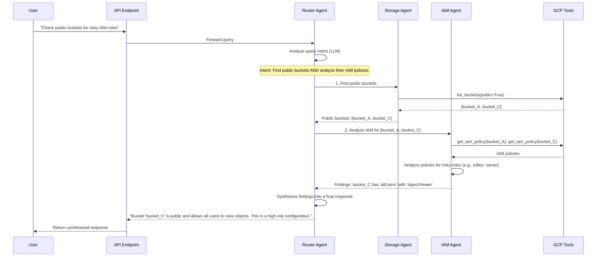
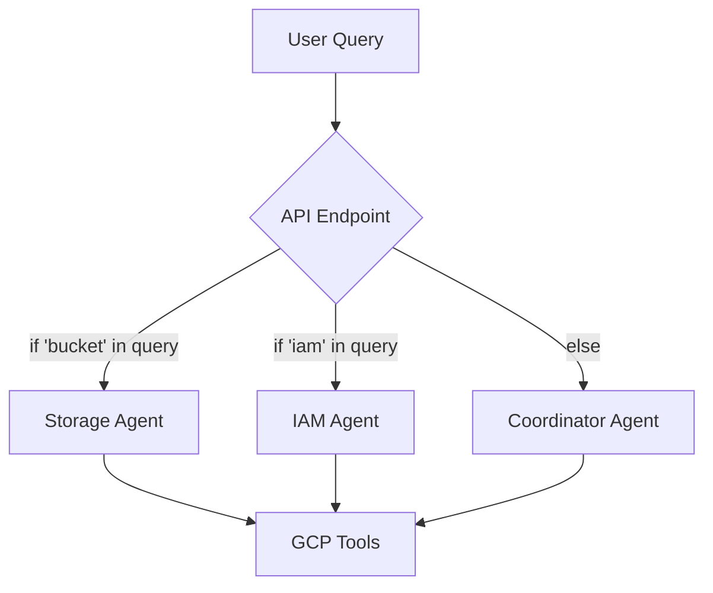
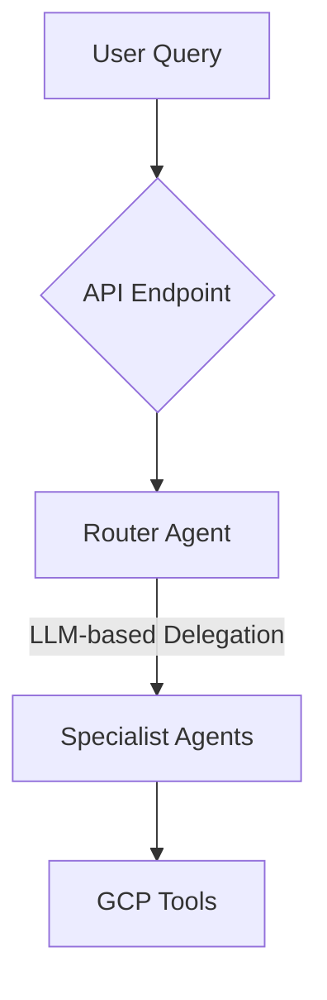

# Improved Architecture Diagrams

This document provides visual diagrams for the proposed ADK-aligned security agent architecture. The new design emphasizes a clear separation of concerns, with an intelligent Router Agent at the core of the system.

## 1. High-Level System Architecture

This diagram illustrates the overall structure, showing how the new Router Agent becomes the central hub for processing user queries and delegating to specialist agents.

```mermaid
graph TD
    subgraph Frontend
        A[Streamlit UI]
    end

    subgraph Backend (ADK Platform)
        B(API Endpoint)
        C{Router Agent}
        D[Storage Agent]
        E[IAM Agent]
        F[Network Agent]
        G[Compliance Agent]
        H[GCP Tools]
    end

    subgraph Google Cloud
        I[GCP APIs]
    end

    A -- HTTP/WebSocket --> B;
    B -- Forwards Query --> C;
    C -- Analyzes Intent & Routes --> D;
    C -- Analyzes Intent & Routes --> E;
    C -- Analyzes Intent & Routes --> F;
    C -- Analyzes Intent & Routes --> G;
    D -- Uses --> H;
    E -- Uses --> H;
    F -- Uses --> H;
    G -- Uses --> H;
    H -- Calls --> I;
```

## 2. Agent Interaction Flow (Sequence Diagram)

This sequence diagram details the step-by-step interaction for a complex query that requires orchestration between multiple specialist agents.

**Query**: "Do any of my public storage buckets have IAM users with excessive permissions?"



## 3. Comparison: Old vs. New Architecture

### Old Architecture (Keyword-Based Routing)


**Problem**: Brittle, not intelligent, and bypasses the coordinator.

### New Architecture (LLM-Powered Routing)


**Improvement**: Flexible, intelligent, and centralized routing logic that aligns with ADK best practices.