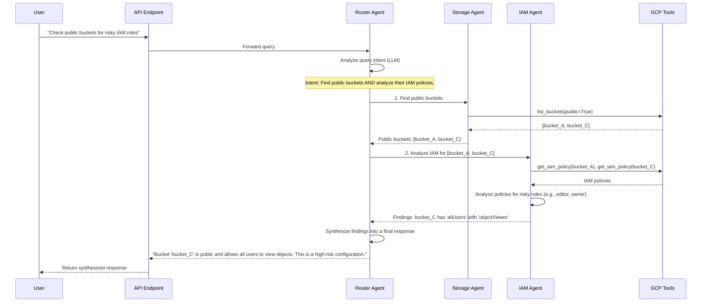

# ADK Security Agent: Overall Architecture

## 🏗️ System Architecture Overview

The ADK Security Agent implements a **multi-agent system** centered around an intelligent **Router Agent**. This agent uses an LLM to understand user intent and delegate tasks to the appropriate specialist agents, aligning with ADK best practices for semantic routing and orchestration.

```mermaid
graph TD
    subgraph Frontend
        A[Streamlit UI]
    end

    subgraph Backend (ADK Platform)
        B(API Endpoint)
        C{Router Agent}
        D[Storage Agent]
        E[IAM Agent]
        F[Network Agent]
        G[Compliance Agent]
        H[GCP Tools]
    end

    subgraph Google Cloud
        I[GCP APIs]
    end

    A -- HTTP/WebSocket --> B;
    B -- Forwards Query --> C;
    C -- Analyzes Intent & Routes --> D;
    C -- Analyzes Intent & Routes --> E;
    C -- Analyzes Intent & Routes --> F;
    C -- Analyzes Intent & Routes --> G;
    D -- Uses --> H;
    E -- Uses --> H;
    F -- Uses --> H;
    G -- Uses --> H;
    H -- Calls --> I;
```

## 🤖 AGENTS vs 🔧 TOOLS: Key Differences

### **🤖 AGENTS** (Intelligent Coordinators)
**Purpose**: High-level reasoning, decision-making, and orchestration

| Characteristic | Description | Example |
|---------------|-------------|---------|
| **Intelligence** | Use LLMs for reasoning and decision-making | Router Agent uses Gemini to analyze queries and decide which specialist to delegate to |
| **State Management** | Maintain conversation context and session state | Remember that user asked about storage, then follow up with specific bucket recommendations |
| **Orchestration** | Coordinate multiple tools and other agents | Coordinate between storage analysis and IAM review for comprehensive security assessment |
| **Natural Language** | Process and generate human-readable responses | Convert technical findings into actionable business recommendations |
| **Delegation** | Route tasks to appropriate specialists | Route "bucket security" query to StorageSecurityAgent |
| **Context Awareness** | Understand conversational flow and history | Provide contextual suggestions based on previous interactions |

### **🔧 TOOLS** (Specialized Functions)
**Purpose**: Specific, focused functionality with clear inputs/outputs

| Characteristic | Description | Example |
|---------------|-------------|---------|
| **Deterministic** | Predictable, rule-based operations | `analyze_gcs_bucket_security()` always returns bucket configuration analysis |
| **Single Purpose** | One specific function per tool | Check GCS bucket versioning settings |
| **Direct API Access** | Interface directly with external services | Call Google Cloud Storage API to list buckets |
| **Structured Output** | Return data in consistent formats | Return JSON with bucket names, settings, and recommendations |
| **No State** | Stateless operations | Each tool call is independent |
| **Composable** | Can be combined by agents | Storage tools + IAM tools = comprehensive analysis |

## 🏢 Current Implementation

### **Agent Architecture**

#### **1. Router Agent** (`agents/router_agent.py`)
The **Router Agent** is the core of the system. It is the single entry point for all user queries and is responsible for delegating tasks to the appropriate specialist agent based on semantic intent.

**Responsibilities**:
- 🧠 **Query Analysis**: Understanding user intent from natural language using an LLM.
- 🎯 **Smart Routing**: Deciding which specialist agents to engage based on the query's meaning.
- 🔄 **Response Synthesis**: Combining results from multiple specialists for complex queries.
- 💬 **Orchestration**: Managing the flow of information between specialist agents and tools.

#### **2. Specialist Agents**
Specialist agents (`StorageAgent`, `IAMAgent`, etc.) remain focused on their domain and are invoked by the `RouterAgent`. They execute specific tasks using their assigned tools.

**Current Specialists**:
- **StorageSecurityAgent**: GCS bucket security analysis
- **IAMSecurityAgent**: Identity and access management review
- **NetworkSecurityAgent**: Firewall and network security
- **ComplianceAgent**: SOC2, GDPR, ISO compliance checks
- **CostOptimizationAgent**: Security-focused cost analysis

### **Tool Architecture**

Tools are deterministic functions that interact with GCP APIs or other services. They are called by agents to perform specific actions.

#### **1. GCP Tools** (`tools/gcp_tools/`)
- `storage_tools.py`: Bucket analysis, IAM policies, encryption
- `project_tools.py`: Project metadata, service enablement

#### **2. Security Tools** (`tools/security_tools/`)
- `knowledge_base.py`: Queries for security best practices.

#### **3. Analysis Tools** (`tools/analysis_tools/`)
- `dependency_graph.py`: Builds resource dependency graphs to identify security impacts.

## 🔄 Agent-Tool Interaction Flow

### **Example: "Do any of my public storage buckets have IAM users with excessive permissions?"**

This sequence diagram details the step-by-step interaction for a complex query that requires orchestration between multiple specialist agents.



## 📊 Comparison Matrix

| Aspect | 🤖 **Agents** | 🔧 **Tools** |
|--------|--------------|--------------|
| **Primary Role** | Reasoning, coordination, conversation | Execution, data retrieval, computation |
| **Technology** | LLM-powered (Gemini, Vertex AI) | Traditional code (Python functions) |
| **Input/Output** | Natural language ↔ Natural language | Structured data ↔ Structured data |
| **State** | Maintains conversation context | Stateless operations |
| **Complexity** | High-level strategic decisions | Low-level specific tasks |
| **User Interaction** | Direct conversation partners | Never interact with users directly |
| **Error Handling** | Explain problems in context | Return error codes/exceptions |
| **Extensibility** | Add new reasoning capabilities | Add new specific functions |
| **Examples** | "Analyze my security posture" | `get_bucket_list(project_id)` |

## 🎯 ADK Best Practices Implementation

### **1. Separation of Concerns**
- **Agents**: Focus on intelligence and user experience
- **Tools**: Focus on reliable, specific functionality
- **Clear Boundaries**: Agents never directly access APIs; Tools never make decisions

### **2. Composability**
- **Tool Reuse**: Multiple agents can use the same tools
- **Agent Delegation**: Router Agent can orchestrate multiple specialists
- **Layered Architecture**: Clean separation enables independent scaling

### **3. Testability**
- **Tool Testing**: Unit tests for deterministic functions
- **Agent Testing**: Integration tests for conversation flows
- **Isolation**: Components can be tested independently

### **4. Maintainability**
- **Single Responsibility**: Each component has one clear purpose
- **Interface Contracts**: Clear APIs between layers
- **Centralized Routing**: Logic is centralized in the Router Agent, not scattered in API endpoints.

---

**🎯 Key Takeaway**: Agents provide the "brain" (intelligence, reasoning, conversation), while Tools provide the "hands" (execution, data access, computation). This separation enables the system to be both intelligent and reliable, conversational and precise.