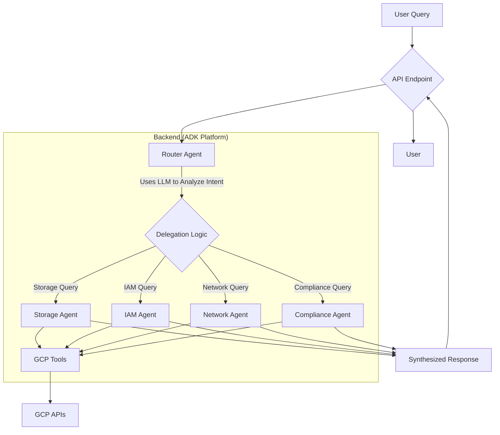

# Proposed Architecture: ADK-Aligned Security Agent

## 1. Executive Summary

The current security agent implementation deviates from ADK best practices by using a rigid, keyword-based routing system in the API layer. This document proposes a revised architecture that introduces an **LLM-powered Router Agent** to replace the hardcoded logic, enabling true semantic understanding and intelligent delegation.

This change will align the system with the documented architecture, improve scalability, and make the agent more adaptable and easier for other AI agents to interact with.

## 2. Problem Analysis

Our review of the existing system revealed critical architectural issues:

1.  **Hardcoded Routing Logic**: The `process_with_llm_agent` function in `backend/api/agent_llm.py` uses a long `if/elif/else` chain based on keywords. This is brittle, hard to maintain, and does not scale.
2.  **Bypassed Coordinator Agent**: The `SecurityCoordinatorAgent` is not used for routing between specialist agents as intended. The API layer handles routing, making the coordinator's primary purpose redundant.
3.  **Lack of Semantic Understanding**: Keyword-based matching cannot understand user intent. A query like "Who can see my buckets?" might fail if it doesn't contain the exact keywords "IAM" or "storage."

## 3. Proposed Architecture: LLM-Powered Routing

We will refactor the system to introduce a dedicated **Router Agent** that replaces the hardcoded routing logic. This agent will be the single entry point for all user queries and will be responsible for delegating tasks to the appropriate specialist agent based on semantic intent.

### New System Flow Diagram

### Key Changes

1.  **Introduce a Router Agent**: A new `RouterAgent` will be created. Its sole responsibility is to analyze the user's query using an LLM and select the correct specialist agent.
2.  **Remove Hardcoded Logic**: The `if/elif/else` block in `agent_llm.py` will be completely removed and replaced with a single call to the `RouterAgent`.
3.  **Centralize Routing**: The `RouterAgent` becomes the central point of delegation, ensuring a clean separation of concerns. The API layer will only be responsible for receiving requests and forwarding them to the router.
4.  **Empower Specialist Agents**: Specialist agents (`StorageAgent`, `IAMAgent`, etc.) will remain focused on their domain and will be invoked by the `RouterAgent`.

### Example Interaction Flow

**Query**: "Show me who has access to my public storage buckets."

1.  **User** sends the query to the backend API.
2.  The **API Endpoint** receives the query and passes it to the `RouterAgent`.
3.  The **RouterAgent** uses an LLM to analyze the query. It understands that the query involves both "storage" and "access control (IAM)."
4.  The `RouterAgent` decides on a plan:
    a.  First, delegate to the `StorageAgent` to identify public buckets.
    b.  Then, delegate to the `IAMAgent` to analyze IAM policies for those buckets.
5.  The `RouterAgent` orchestrates the calls, synthesizes the findings, and returns a comprehensive answer to the user.

## 4. Benefits of the New Architecture

*   **Scalability**: Adding a new specialist agent only requires updating the `RouterAgent`'s instructions, not changing hardcoded API logic.
*   **Maintainability**: Routing logic is centralized in one place, making it easier to manage and debug.
*   **Intelligence**: The system can understand complex, multi-faceted queries and orchestrate multiple agents to answer them.
*   **ADK Alignment**: This model perfectly aligns with the ADK best practice of using intelligent agents for orchestration and delegation.
*   **AI-Friendly**: The clear, semantic interface makes it easier for other AI systems to interact with and leverage the security agent's capabilities.

## 5. Implementation Plan

1.  **Create `RouterAgent`**: Implement a new agent class responsible for semantic routing.
2.  **Refactor `agent_llm.py`**: Remove the keyword-based routing and replace it with a call to the `RouterAgent`.
3.  **Update Specialist Agents**: Ensure specialist agents have clear instructions and capabilities that the `RouterAgent` can understand.
4.  **Test**: Create unit and integration tests for the new routing logic.
5.  **Update Documentation**: Update the overall architecture document to reflect the new design.