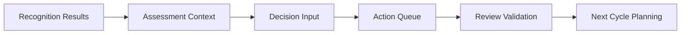

# RADAR Frontend Architecture Documentation

## Overview

This document describes the comprehensive RADAR-based frontend architecture for the ADK Security Agent application. The RADAR pattern (Recognize, Assess, Decide, Act, Review) provides a structured approach to security analysis and remediation.

## Architecture Summary

The RADAR frontend architecture consists of:

1. **Modular Phase-Based Design**: Each RADAR phase has its own dedicated chat interface
2. **Real-time Streaming**: All phases support real-time streaming capabilities
3. **Shared State Management**: Context and state flow seamlessly between phases
4. **Flexible Navigation**: Both sequential flow and direct access to any phase
5. **WebSocket Integration**: Real-time updates and coordination
6. **ADK Integration**: Built on top of the existing unified API client

## Component Structure

```
frontend/components/radar/
├── radar_coordinator_view.py       # Main RADAR interface
├── radar_state_manager.py          # Central state management
├── recognition_chat_view.py        # Phase 1: Discovery
├── assessment_chat_view.py         # Phase 2: Security evaluation
├── decision_chat_view.py           # Phase 3: Recommendation planning
├── action_chat_view.py             # Phase 4: Remediation execution
├── review_chat_view.py             # Phase 5: Validation & reporting
├── radar_websocket_client.py       # Real-time coordination
└── __init__.py                     # Package initialization
```

## Phase-Specific Interfaces

### 1. Recognition Phase (🔍)
- **Purpose**: Discover and inventory cloud resources
- **Capabilities**:
  - Complete GCP resource discovery
  - Asset type classification
  - Resource relationship mapping
  - Anomaly detection
  - Infrastructure cataloging

### 2. Assessment Phase (🛡️)
- **Purpose**: Evaluate security posture and compliance
- **Capabilities**:
  - Security vulnerability scanning
  - Compliance framework evaluation
  - Risk assessment and scoring
  - IAM permission analysis
  - Configuration security review

### 3. Decision Phase (🎯)
- **Purpose**: Prioritize issues and generate recommendations
- **Capabilities**:
  - Risk-based prioritization
  - Actionable recommendation generation
  - Impact vs effort analysis
  - Remediation timeline planning
  - Resource allocation optimization

### 4. Action Phase (⚡)
- **Purpose**: Execute approved remediation actions
- **Capabilities**:
  - Safe remediation execution
  - Pre-flight validation checks
  - Action approval workflows
  - Progress tracking and monitoring
  - Rollback and recovery procedures

### 5. Review Phase (📊)
- **Purpose**: Validate effectiveness and generate reports
- **Capabilities**:
  - Post-remediation validation
  - Improvement tracking and metrics
  - Executive and technical reporting
  - Continuous monitoring setup
  - Next cycle planning

## State Management Architecture

### Central State Manager

The `RADARStateManager` provides:
- **Session Isolation**: Each RADAR cycle has its own context
- **Phase Dependencies**: Ensures proper phase execution order
- **Shared Context**: Data flows between phases seamlessly
- **Progress Tracking**: Real-time phase completion status
- **Error Handling**: Graceful error recovery and rollback

### State Flow Between Phases



## Real-time Features

### WebSocket Integration
- **Live Progress Updates**: Real-time phase execution status
- **Streaming Responses**: Token-by-token response rendering
- **Cross-phase Coordination**: Live coordination between phases
- **Connection Recovery**: Automatic reconnection on failures

### Streaming Chat Interface
Each phase chat interface provides:
- **Asynchronous Processing**: Non-blocking UI operations
- **Real-time Streaming**: Live response generation
- **Context Awareness**: Access to all previous phase results
- **Phase-specific Actions**: Customized quick actions per phase

## Integration with Backend

### API Integration
- **Unified API Client**: Single source of truth for backend communication
- **RADAR Endpoints**: Dedicated RADAR API endpoints
- **Project Context**: Automatic project ID injection
- **Error Handling**: Comprehensive error recovery

### Backend RADAR Agents
The frontend integrates with backend RADAR agents:
- **SequentialAgent Pipeline**: ADK-based agent orchestration
- **LlmAgent Sub-agents**: Specialized agents for each phase
- **State Sharing**: Context flows through agent output_keys
- **Tool Integration**: Each phase has access to appropriate tools

## User Experience Design

### Navigation Modes

1. **Coordinator View**: Visual overview of all phases
   - Interactive workflow diagram
   - Phase status indicators
   - Progress tracking
   - Context overview

2. **Phase View**: Individual phase chat interfaces
   - Dedicated chat for each phase
   - Phase-specific context panels
   - Quick action buttons
   - Real-time status updates

### User Journey

1. **Start New Cycle**: User initiates RADAR analysis
2. **Sequential Execution**: Follow phases in order
3. **Direct Access**: Jump to specific phases as needed
4. **Real-time Feedback**: Live updates and progress
5. **Report Generation**: Comprehensive analysis reports

## Configuration and Customization

### Phase Configuration
Each phase can be customized:
- **Quick Actions**: Phase-specific action buttons
- **Context Display**: Relevant information panels
- **Dependencies**: Required predecessor phases
- **Validation Rules**: Phase completion criteria

### State Persistence
- **Session Management**: Persistent RADAR sessions
- **Context Export**: Shareable session data
- **Progress Tracking**: Detailed execution history
- **Error Recovery**: Automatic state restoration

## Performance Considerations

### Optimization Strategies
- **Connection Pooling**: Efficient API communication
- **Caching**: Intelligent result caching with TTL
- **Lazy Loading**: On-demand component loading
- **Streaming**: Real-time response rendering

### Scalability Features
- **Modular Design**: Independent phase components
- **Stateless Components**: Easy horizontal scaling
- **WebSocket Management**: Efficient real-time communication
- **Error Boundaries**: Isolated error handling

## Security Considerations

### Access Control
- **Phase Authorization**: Controlled access to sensitive phases
- **Action Approval**: Explicit approval for remediation actions
- **Audit Logging**: Comprehensive action tracking
- **Safe Mode**: Protected execution environment

### Data Security
- **Context Isolation**: Secure session boundaries
- **Encrypted Communication**: Secure WebSocket connections
- **Sensitive Data Handling**: Protected credential management
- **Audit Trail**: Complete operation history

## Extension Points

### Adding New Phases
1. Create new phase chat view component
2. Extend RADARPhase enumeration
3. Add phase dependencies
4. Update coordinator workflow
5. Add phase-specific backend agent

### Custom Actions
1. Extend phase-specific quick actions
2. Add custom context panels
3. Implement custom validation rules
4. Add specialized streaming handlers

## Deployment and Operations

### Frontend Deployment
- **Streamlit Application**: Standard Streamlit deployment
- **Component Registration**: Automatic phase discovery
- **Configuration Management**: Environment-based settings
- **Health Monitoring**: Built-in status checks

### Backend Integration
- **API Compatibility**: Maintains existing API contracts
- **WebSocket Services**: Additional real-time endpoints
- **RADAR Agents**: ADK-based agent deployment
- **Monitoring**: Comprehensive observability

## Future Enhancements

### Planned Features
- **Multi-project RADAR**: Parallel analysis across projects
- **Workflow Templates**: Pre-configured RADAR workflows
- **Advanced Reporting**: Enhanced visualization and reports
- **Machine Learning**: Predictive analysis capabilities

### Integration Opportunities
- **CI/CD Integration**: Automated RADAR in pipelines
- **Alerting Systems**: Real-time security notifications
- **Compliance Frameworks**: Extended compliance support
- **Third-party Tools**: Integration with security platforms

---

This RADAR frontend architecture provides a comprehensive, scalable, and user-friendly approach to cloud security analysis and remediation, built on the solid foundation of the ADK framework.