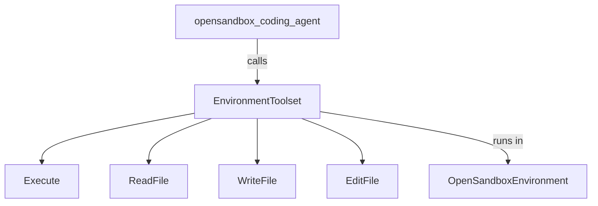

# OpenSandbox Environment Sample

## Overview

This sample uses `OpenSandboxEnvironment` with `EnvironmentToolset` so an ADK
agent can execute commands and edit files in an isolated, persistent remote
workspace. The default environment creates a `python:3.11` sandbox, keeps its
five-minute lifetime active while the agent uses it, and destroys it when the
toolset closes.

OpenSandbox can run locally on Docker or behind a remote lifecycle service. See
the [OpenSandbox documentation](https://open-sandbox.ai) for server setup.

## Prerequisites

1. Install the OpenSandbox extra:

   ```bash
   pip install google-adk[opensandbox]
   ```

1. Start an OpenSandbox server. A local server uses `localhost:8080` by
   default. For a remote service, configure its domain and API key:

   ```bash
   export OPEN_SANDBOX_DOMAIN="https://sandbox.example.com"
   export OPEN_SANDBOX_API_KEY="your-api-key"
   ```

1. Configure the model credentials required by your ADK setup.

## Sample Inputs

- `Write a Python script that prints the first 20 Fibonacci numbers, run it, and report the output.`
- `Create a binary file containing bytes 0 through 255, then verify its size and SHA-256 digest.`
- `Create a small CSV of five products and write a Python script that reports the most expensive one.`

## Graph



## How To

The agent is connected to a normal `EnvironmentToolset`:

```python
from google.adk.integrations.opensandbox import OpenSandboxEnvironment
from google.adk.tools.environment import EnvironmentToolset

toolset = EnvironmentToolset(
    environment=OpenSandboxEnvironment(
        image="python:3.11",
        timeout=300,
    )
)
```

The environment maps ADK's lifecycle, command, and byte-oriented file APIs to
the OpenSandbox async SDK. Relative paths resolve below `/workspace`.

To reuse an existing sandbox, pass `sandbox_id`. The environment treats an
attached sandbox as caller-owned, so closing the toolset releases the SDK client
without destroying the remote sandbox:

```python
environment = OpenSandboxEnvironment(sandbox_id="existing-sandbox-id")
```

## Related Guides

- [OpenSandboxEnvironment guide](../../../../docs/guides/integrations/opensandbox/opensandbox_environment/index.md) - Configure lifecycle, execution, file operations, and remote connections.
