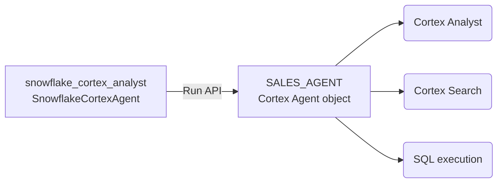

# Snowflake Cortex Analyst Agent

## Overview

This sample runs an existing [Snowflake Cortex Agent](https://docs.snowflake.com/en/user-guide/snowflake-cortex/cortex-agents)
as a native ADK root agent using `SnowflakeCortexAgent`. Snowflake runs the
agent loop and its server-side tools (Cortex Analyst, Cortex Search, SQL
execution); each ADK turn is sent to the Cortex Agents Run API and the run comes
back as standard ADK events: streamed text, the tool calls Snowflake made, and
one final answer whose citations, warnings, tables and charts are recorded as
event metadata. The Snowflake thread continues across turns through ADK session
state.

`SnowflakeCortexAgent` is experimental and lives under `google.adk.labs`. See
the
[SnowflakeCortexAgent guide](../../../../docs/guides/labs/snowflake/snowflake_cortex_agent/index.md)
for the full setup, limitations, and API details.

## Prerequisites

- A Cortex Agent object in Snowflake that the token below may run.
- A Snowflake token for the REST API: a programmatic access token, an OAuth
  access token, or a key-pair JWT.
- Environment variables, in the shell or in a `.env` file next to `agent.py`
  (`adk web` and `adk run` load it):

```text
SNOWFLAKE_ACCOUNT_URL=https://<account>.snowflakecomputing.com
SNOWFLAKE_DATABASE=SALES_DB
SNOWFLAKE_SCHEMA=ANALYTICS
SNOWFLAKE_CORTEX_AGENT=SALES_AGENT
SNOWFLAKE_TOKEN=<token>
SNOWFLAKE_TOKEN_TYPE=PROGRAMMATIC_ACCESS_TOKEN
```

`SNOWFLAKE_TOKEN_TYPE` is `PROGRAMMATIC_ACCESS_TOKEN`, `OAUTH`, `KEYPAIR_JWT` or
`WORKLOAD_IDENTITY_FEDERATION`, matching the token you supply.

No extra package is needed: the integration uses the `httpx` client ADK already
depends on.

## Sample Inputs

- `What were total sales by region last quarter?`

  The Cortex Agent picks a semantic view, generates and runs SQL, and answers
  from the result. The SQL tool call and its result appear as tool events, the
  answer as the final event.

- `Show only the mobile channel.`

  A follow-up in the same session continues the Snowflake thread, so the Cortex
  Agent has the previous question and answer as context.

- `Which product categories exist in the data?`

  A question the Cortex Agent can answer from the semantic model alone.

## Graph

The ADK agent fronts one Cortex Agent object, which owns its own tools:



## How To

Point the agent at the Snowflake object and supply credentials through a header
provider:

```python
root_agent = SnowflakeCortexAgent(
    name="snowflake_cortex_analyst",
    description="Answers data questions by running a Snowflake Cortex Agent.",
    account_url=_env("SNOWFLAKE_ACCOUNT_URL"),
    database=_env("SNOWFLAKE_DATABASE"),
    schema_name=_env("SNOWFLAKE_SCHEMA"),
    cortex_agent_name=_env("SNOWFLAKE_CORTEX_AGENT"),
    header_provider=snowflake_headers,
)
```

The header provider is a plain function that receives the invocation's
`ReadonlyContext` and returns the HTTP headers for one Snowflake request. This
sample reads one service token from the environment on every call, so a rotated
token is picked up without a restart. Missing settings are reported on the first
request rather than at import, so the sample can be listed by `adk web` before
it is configured:

```python
def snowflake_headers(ctx: ReadonlyContext) -> dict[str, str]:
  _check_configured()  # fails the first request, not the import
  return {
      "Authorization": f"Bearer {_env('SNOWFLAKE_TOKEN')}",
      "X-Snowflake-Authorization-Token-Type": os.environ.get(
          "SNOWFLAKE_TOKEN_TYPE", "PROGRAMMATIC_ACCESS_TOKEN"
      ),
  }
```

Run it with `adk web contributing/samples/integrations` and pick
`snowflake_cortex_agent`, or with `adk run`. Use SSE streaming to see the text
and reasoning deltas as they arrive; without it only the tool events and the
final answer are yielded.

## Related Guides

- [SnowflakeCortexAgent](../../../../docs/guides/labs/snowflake/snowflake_cortex_agent/index.md) - Setup, event mapping, thread continuity, security and limitations of the Snowflake Cortex Agent integration.
