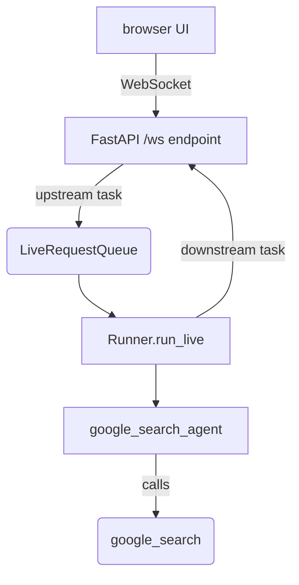

# Live Bidi-Streaming Demo App

## Overview

A standalone FastAPI application demonstrating the full ADK bidirectional
streaming lifecycle over a WebSocket, with a browser UI for text, voice, and
camera input.

Unlike the other samples under `contributing/samples/live/`, this one does not
run under `adk web`. It is a self-contained server that owns its own
`Runner`, `LiveRequestQueue`, and `run_live()` loop, so it shows what an
application built on ADK's streaming primitives actually looks like end to end:

1. **Application initialization** (once at startup) — create `Agent`,
   `SessionService`, and `Runner`.
1. **Session initialization** (per connection) — get or create the `Session`,
   build the `RunConfig` and `LiveRequestQueue`, and start `run_live()`.
1. **Bidi-streaming** — concurrent upstream (client → queue) and downstream
   (events → client) tasks.
1. **Termination** — close the `LiveRequestQueue` in a `finally` block.

The bundled web UI includes an event console that renders every raw ADK `Event`
as it arrives, which makes it useful for inspecting Live API behavior.

This app is the reference implementation for the
[Gemini Live API Toolkit development guide](https://adk.dev/streaming/dev-guide/part1/),
which walks through its source line by line.

## Sample Inputs

- `What is the tallest mountain in Japan? Answer in one short sentence.`

  *A plain text turn. The model replies with audio; the transcript appears in
  the chat bubble via output transcription.*

- `What are the top 3 news stories in tech today?`

  *Triggers the `google_search` tool. The event console shows the search
  invocation and the grounding metadata.*

- Click **Start Audio** and say `What is the capital of France?`

  *A voice turn. Input transcription echoes what you said; the reply is spoken
  back and transcribed.*

- Click **📷 Camera**, capture a frame, then ask `What do you see?`

  *An image turn. The frame is sent as a realtime blob before the text turn
  opens.*

## Graph



## How To

### Requirements

- Python 3.10 or higher
- A native audio Live model. This demo always requests the `AUDIO` response
  modality, so a half-cascade model will fail with
  `Text output is not supported for native audio output model`.
  - Vertex AI: `gemini-live-2.5-flash-native-audio` (served from `us-east1`)
  - Gemini API: `gemini-2.5-flash-native-audio-preview-12-2025`

### Setup

```bash
cd contributing/samples/live/live_bidi_streaming_demo_app
pip install -r requirements.txt
cp .env.example app/.env
```

Edit `app/.env` with your credentials. For Vertex AI, authenticate first:

```bash
gcloud auth application-default login
```

> **Note:** `load_dotenv()` does not override variables that are already
> exported in your shell. If your shell exports `GOOGLE_CLOUD_LOCATION` (or any
> other key that also appears in `app/.env`), the shell value wins and the model
> lookup fails with `1008 policy violation: Publisher model ... was not found`.

### Run

The server must be started from inside the `app` directory so that Python can
import the `google_search_agent` package:

```bash
cd app
uvicorn main:app --reload --host 0.0.0.0 --port 8000
```

Then open <http://localhost:8000>.

### WebSocket API

```text
ws://localhost:8000/ws/{user_id}/{session_id}?proactivity=false&affective_dialog=false
```

| Parameter          | Kind  | Description                                                      |
| ------------------ | ----- | ---------------------------------------------------------------- |
| `user_id`          | path  | Identifies the user                                              |
| `session_id`       | path  | Identifies the session; reconnecting with the same id resumes it |
| `proactivity`      | query | Enable proactive audio (native audio only), default `false`      |
| `affective_dialog` | query | Enable affective dialog (native audio only), default `false`     |

Client → server messages:

```json
{"type": "text", "text": "Your message here"}
```

```json
{"type": "image", "data": "<base64>", "mimeType": "image/jpeg"}
```

Raw binary frames are treated as PCM audio (16 kHz, 16-bit, mono).

Server → client messages are JSON-serialized ADK `Event` objects.

### Key techniques

**Concurrent upstream and downstream tasks.** `asyncio.gather()` runs both
directions at once so the client can keep speaking while the model is
responding. An exception in either task cancels the other, and the `finally`
block always closes the queue:

```python
try:
  await asyncio.gather(upstream_task(), downstream_task())
except WebSocketDisconnect:
  logger.debug("Client disconnected normally")
finally:
  live_request_queue.close()
```

**Detecting disconnects from the low-level receive loop.** The app calls
Starlette's `websocket.receive()` directly so it can accept both text and binary
frames on one loop. That API reports a client disconnect by *returning* a
message rather than raising, so the loop has to check for it — calling
`receive()` again afterwards raises `RuntimeError`:

```python
message = await websocket.receive()
if message["type"] == "websocket.disconnect":
  raise WebSocketDisconnect(message.get("code", 1000))
```

**Turn-scoped versus realtime input.** Text goes through `send_content()`, which
opens a turn. Audio and image frames go through `send_realtime()`, which streams
continuously and is not turn-scoped — so a captured frame needs to land before
the follow-up text turn opens.

**Transcription for a native audio model.** Because the response modality is
`AUDIO`, the app enables transcription in both directions to keep a readable
chat transcript:

```python
run_config = RunConfig(
    streaming_mode=StreamingMode.BIDI,
    response_modalities=["AUDIO"],
    input_audio_transcription=types.AudioTranscriptionConfig(),
    output_audio_transcription=types.AudioTranscriptionConfig(),
    session_resumption=types.SessionResumptionConfig(),
)
```

Transcription arrives as partial events (`finished=false`) followed by one final
event (`finished=true`) carrying the **complete** text. The client replaces the
accumulated text on the final event rather than appending to it — see the
`outputTranscription` handling in `app/static/js/app.js`.

**Base64url event payloads.** `Event.model_dump_json()` encodes `bytes` as
base64url **without padding**, so the browser normalizes `-`/`_` and re-pads
before decoding audio (`base64ToArray()` in `app/static/js/app.js`).

## Related Guides

- [Part 1. Intro to streaming](https://adk.dev/streaming/dev-guide/part1/) — bidirectional streaming fundamentals and the four-phase application lifecycle this app implements.
- [Part 2. Sending messages](https://adk.dev/streaming/dev-guide/part2/) — the `LiveRequestQueue` interface used by the upstream task.
- [Part 3. Event handling](https://adk.dev/streaming/dev-guide/part3/) — the `run_live()` event types the downstream task forwards.
- [Part 4. Run configuration](https://adk.dev/streaming/dev-guide/part4/) — the `RunConfig` options used here, including transcription and session resumption.
- [Part 5. Audio, Images, and Video](https://adk.dev/streaming/dev-guide/part5/) — the audio and video pipelines behind the browser client.
