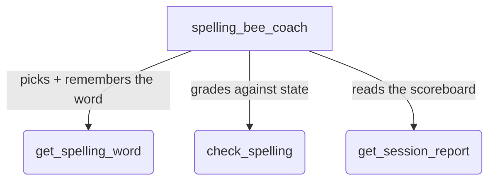

# Spelling Bee Coach (Live)

## Overview

A voice spelling bee pronouncer and judge for ADK Live mode (`adk web` /
`run_live`).

A spelling bee is the rare exercise that is impossible in text chat — showing
the word on screen gives the answer away — which makes it a natural
demonstration of why live bidirectional audio matters. The agent pronounces a
word drawn from a leveled word bank, answers real-bee protocol questions
(definition, part of speech, example sentence, language of origin, "say it
again"), listens to the learner spell aloud letter by letter, and announces the
verdict.

The tools, not the model, run the bee:

- **`get_spelling_word`** picks the next word — missed words waiting in the
  review queue resurface (after a short cooldown) before new words — and stores
  the answer in session state.
- **`check_spelling`** grades the relayed attempt against the word held in
  state, so the verdict is deterministic and never left to the model's own
  judgment. It also advances the adaptive ladder: three correct in a row
  levels up, two misses at a level moves down.
- **`get_session_report`** reads back the scoreboard — accuracy, level path,
  best streak, and the words still owed to the review pile — from the same
  state the grader wrote, so the numbers always match the session.

## Sample Inputs

Speak these after starting a live session (microphone on):

- `I'm ready for my first word.`

- `Definition, please. ... Use it in a sentence. ... Say it again?`

  *Pronouncer-protocol questions are answered from the payload
  `get_spelling_word` already returned — no extra tool calls.*

- `F-R-I-E-N-D.`

  *The agent reads back the letters it heard, asks for confirmation, then
  grades with `check_spelling`.*

- `How am I doing?`

  *Mid-session report from `get_session_report`; no state changes.*

- `I'm done for today.`

  *Final report card: accuracy, level path, and each review word spelled out.*

## Graph



## How To

1. Run the sample via `adk web`:

   ```bash
   adk web contributing/samples/live
   ```

1. Open the ADK web interface, select `spelling_bee_coach`, and start a live
   session with the microphone button.

1. Say *"I'm ready for my first word"* and spell the word aloud, letter by
   letter. Ask for the definition or an example sentence first, like a real
   bee.

1. Miss a word on purpose: the agent reads the correct spelling from the
   tool's response (never from its own knowledge), and the word re-enters the
   rotation a few attempts later, marked as a review word.

1. Watch the Events tab while you play: every round is a
   `get_spelling_word` → `check_spelling` pair, and the session state carries
   the secret `current_word`, the adaptive `level`/`streak`, and the
   `review_queue`.

### Key techniques

- **Secret-in-state**: the target word is written to `session.state` by one
  tool and consumed by another, so the verdict is always computed against the
  tool-recorded word — never against the model's own judgment of correctness.
  (The model does receive the word's text in the tool response — it must, to
  pronounce it — so not saying the letters before the verdict is a hard rule
  in the instruction, not an architectural guarantee.)
- **Deterministic grading**: `check_spelling` normalizes the spoken attempt
  ("B-E-A-U", "b e a u", and "beau" all read as "beau") and compares exactly,
  returning a verdict, the correct spelling as letters, and the first wrong
  letter position, which the agent must announce as-is.
- **Adaptive difficulty as a pure function of state**: the level ladder and
  review queue are updated atomically inside the grader, so the model cannot
  drift the score across dozens of rapid voice turns.
- **ASR-safe protocol**: the instruction requires a read-back confirmation
  before grading ("was that N as in nest, or M as in mango?"), turning
  letter-transcription ambiguity into part of the bee ritual instead of a
  failure mode.

### Caveat

Native-audio live models do not support typed text chat: use the microphone in
`adk web`. To test over text, temporarily switch the agent to a half-cascade
live model (pick one from the supported-model links in the comments in
`agent.py`).

`adk web` also prints input and output audio transcriptions in the Events pane
as you play — a debugging feature of the dev UI. For a spelling bee, the
transcript of the pronounced word necessarily shows its written form, so don't
peek mid-round. An end-user deployment would use an audio-only client; the
transcript on screen is, in effect, the sample's own thesis demonstrated — any
text view of the session gives the word away.
