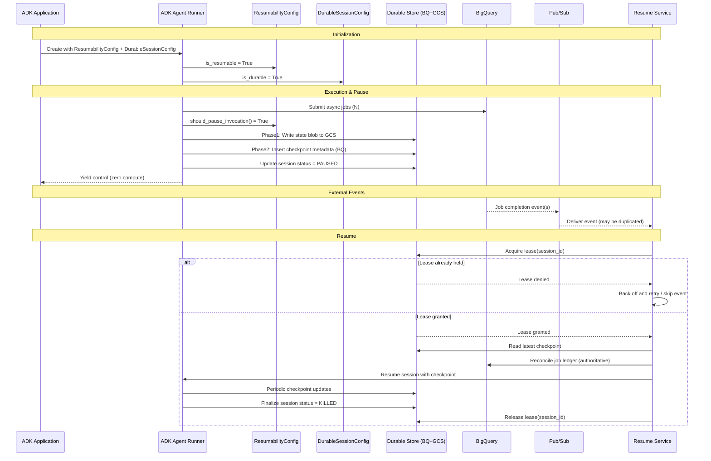

# Durable Session Persistence for Long-Horizon ADK Agents (BigQuery-first, Generalizable Framework Capability)

**Author:** Haiyuan Cao
**Status:** Implemented (v1 core functionality)
**Target audience:** ADK engineering leads, BigQuery Agent Analytics stakeholders, SRE/Security reviewers
**Last updated:** 2026-02-02
**Revision:** 3.0 (implementation complete, demo deployed)

---

## Implementation Status

| Component | Status | Location |
|-----------|--------|----------|
| `DurableSessionConfig` | Implemented | `src/google/adk/durable/config.py` |
| `CheckpointableAgentState` | Implemented | `src/google/adk/durable/checkpointable_state.py` |
| `DurableSessionStore` (ABC) | Implemented | `src/google/adk/durable/stores/base_checkpoint_store.py` |
| `BigQueryCheckpointStore` | Implemented | `src/google/adk/durable/stores/bigquery_checkpoint_store.py` |
| `WorkspaceSnapshotter` | Implemented | `src/google/adk/durable/workspace_snapshotter.py` |
| App integration | Implemented | `src/google/adk/apps/app.py` |
| Demo agent | Implemented | `contributing/samples/long_running_task/` |
| Demo UI (Cloud Run) | Deployed | `https://durable-demo-201486563047.us-central1.run.app` |

### Live Demo

A fully functional demo is deployed on Cloud Run showcasing:
- Real-time checkpoint visualization
- Task failure simulation
- Checkpoint-based recovery
- BigQuery metadata queries
- Final task output display

**URL:** https://durable-demo-201486563047.us-central1.run.app

**Infrastructure:**
- BigQuery Dataset: `test-project-0728-467323.adk_metadata`
- GCS Bucket: `gs://test-project-0728-467323-adk-checkpoints`
- SHA-256 checkpoint integrity verification

---

## 0. Executive One-Pager (for PM/Director skim)

### Problem

ADK agents struggle with BigQuery's **async, long-running workloads**. While ADK has experimental in-process resumability (`ResumabilityConfig`), it lacks:
- **Cross-process durability**: state lost if the process dies
- **External event triggers**: no Pub/Sub integration for job completion
- **Enterprise auditability**: no SQL-queryable checkpoint history
- **Cloud job reconciliation**: no authoritative state sync with BigQuery jobs

Sandboxes time out (the "12-minute barrier" in typical cloud deployments), causing repeated cold starts, redundant metadata scans, and risk of duplicate job submissions.

### Solution

**Extend** ADK's existing resumability with a **Durable Session Persistence Layer**:

* Extend lifecycle with durable **PAUSED** state (cross-process, not just in-memory)
* Persist **logical checkpoints** (plan + job ledger + tool ledger) and optionally workspace artifacts
* Store control-plane metadata + audit trail in **BigQuery**
* Store large blobs (checkpoint/workspace) in **GCS**
* Resume on external events (BigQuery job completion → Pub/Sub) with **authoritative reconciliation**

### Key benefits

* **Reliability:** deterministic "warm start"; prevents duplicate job fleets
* **Cost:** no idle compute while waiting; typical storage **< $0.01/session-day paused** (see [Section 21: Cost Estimation](#21-cost-estimation))
* **Enterprise:** SQL auditability (inspect what the agent did at hour 4 of 12)
* **Strategic:** differentiates ADK by enabling **cloud job execution continuity + enterprise audit**, not just "reasoning continuity"

### Ask / decisions

1. Review `CheckpointableAgentState` + integration with existing `ResumabilityConfig`
2. Confirm reference infra (BQ + GCS) and leasing approach
3. Select pilot (recommended: PII scanner)
   **Decision:** Durable PAUSED as extension to existing resumability vs separate plugin

### Proposed timeline (8 weeks to pilot)

* Weeks 1–2: API + storage/lease decisions, integration design with existing resumability
* Weeks 3–4: reference store + resume skeleton
* Weeks 5–8: pilot + metrics
* Week 9+: iterate and choose rollout path

---

## 1. Background & Motivation

### 1.1 The "12-minute barrier" in cloud data workflows

BigQuery workloads are inherently asynchronous and may run from minutes to hours. In typical cloud sandbox deployments (Cloud Run, Cloud Functions, GKE with autoscaling), agents face timeout constraints:

* **Cloud Run:** default 5-minute timeout, max 60 minutes
* **Cloud Functions:** default 1-minute timeout, max 9 minutes (1st gen) or 60 minutes (2nd gen)
* **Vertex AI Agent Builder:** session timeouts vary by deployment mode

When these timeouts occur during long-running BigQuery jobs, agents:

* lose job IDs and progress state (unless using existing resumability)
* repeat metadata scans and tool calls
* risk re-submitting already-running jobs

### 1.2 Existing ADK Resumability (Current State)

ADK already has an **experimental resumability feature** (`src/google/adk/apps/app.py`):

```python
@experimental
class ResumabilityConfig(BaseModel):
  """The "resumability" in ADK refers to the ability to:
  1. pause an invocation upon a long-running function call.
  2. resume an invocation from the last event, if it's paused or failed midway
  through.

  Note: ADK resumes the invocation in a best-effort manner:
  1. Tool call to resume needs to be idempotent because we only guarantee
  an at-least-once behavior once resumed.
  2. Any temporary / in-memory state will be lost upon resumption.
  """
  is_resumable: bool = False
```

**Current capabilities:**
| Feature | Status | Location |
|---------|--------|----------|
| `ResumabilityConfig.is_resumable` | Experimental | `src/google/adk/apps/app.py:42-58` |
| `InvocationContext.should_pause_invocation()` | Implemented | `src/google/adk/agents/invocation_context.py:355-389` |
| `long_running_tool_ids` tracking | Implemented | `src/google/adk/events/event.py` |
| Resume from last event | Implemented | `src/google/adk/runners.py:1294+` |

**Current limitations (gaps this design addresses):**
| Limitation | Impact |
|------------|--------|
| In-memory only | State lost on process death/restart |
| No external event triggers | Cannot wake on Pub/Sub, webhooks |
| No cross-process persistence | Cannot resume in different runner instance |
| No enterprise audit trail | No SQL-queryable checkpoint history |
| No cloud job reconciliation | No authoritative sync with BQ job states |

### 1.3 Dogfooding BigQuery Agent Analytics

Using BigQuery as a durable control plane is strategically aligned with the BigQuery Agent Analytics direction:

* **Dogfooding:** demonstrates BQ-based agent observability capabilities
* **Auditability:** admins can query checkpoints directly ("what was the agent doing at hour 4?")
* **SQL robustness:** BigQuery idioms (e.g., ARRAY_AGG latest-per-session) make operational queries easy and efficient

---

## 2. Problem Statement

**This design extends ADK's existing resumability** to address gaps in cross-process durability and enterprise scenarios.

Current ADK resumability is optimized for **in-process pause/resume**:
* Works within a single runner process lifecycle
* State persisted to session service (SQLite, Postgres, etc.)
* No external event-driven wake-up mechanism
* No BigQuery-native audit trail

**Gaps this design addresses:**

| Gap | Current State | Proposed Solution |
|-----|---------------|-------------------|
| Cross-process durability | State in session DB, but no checkpoint snapshots | BQ metadata + GCS blobs |
| External event triggers | Manual resume via API call | Pub/Sub → Resumer service |
| Cloud job reconciliation | App must track job IDs manually | Authoritative ledger reconciliation |
| Enterprise audit | Logs only | SQL-queryable BQ tables |
| Fleet observability | Per-session queries | Cross-agent BQ analytics |

**Net effect:** ADK's existing resumability handles the "pause on long tool call" case well, but is not sufficient for BigQuery job fleets, multi-hour compliance scans, or any agentic workflow that needs **durable, cross-process, event-driven** "pause/wake/resume" loops.

---

## 3. Goals & Non-Goals

### 3.1 Goals

1. **Extend** existing `ResumabilityConfig` to support durable, cross-process checkpoints
2. Support **hours-to-days** workflows via durable lifecycle state **PAUSED**
3. Enable **event-driven resume** (Pub/Sub/job events) with safe retries
4. Persist a deterministic **logical checkpoint**, not runtime heap snapshots
5. Provide **enterprise-grade auditability**, retention, and security posture
6. Ensure correctness via **two-phase commit**, **authoritative reconciliation**, and **lease-based resuming**
7. **Backward compatible** with existing ADK session services

### 3.2 Non-Goals (v1)

* Interpreter heap snapshot/restore (pickle/dill) — brittle across deployments and library changes
* Full microVM/container checkpointing — future work
* Replacing existing `ResumabilityConfig` — this design extends it
* Modifying existing session service implementations — new service alongside existing

---

## 4. Proposed Lifecycle Model

### 4.1 States

Building on ADK's existing pause concept, we formalize durable states:

* **RUNNING:** executing agent logic + tool calls
* **PAUSED:** no active compute; durable checkpoint exists in BQ+GCS; resumable via event or API
* **KILLED:** finalized; resources released; retention applies
  (Optional operational outcomes: `FAILED`, `EXPIRED`.)

### 4.2 Integration with Existing Resumability

```
Existing ADK Resumability          Durable Session Extension
─────────────────────────────      ──────────────────────────────
InvocationContext.is_resumable  →  DurableSessionConfig.is_durable
should_pause_invocation()       →  triggers checkpoint write
long_running_tool_ids           →  included in checkpoint ledger
Session events                  →  replayed on resume
                                   + BQ audit trail
                                   + GCS checkpoint blobs
                                   + Pub/Sub event triggers
```

### 4.3 "Serving → Rollout" framing

This design shifts ADK from a request/response mindset to an **agentic rollout** model:

* do work
* wait for environment events
* resume deterministically
* avoid compute idling

---

## 5. Architecture Overview

### 5.1 Layered checkpointing: logical → workspace → execution (future)

**v1** explicitly adopts **Logical Checkpointing**:

1. **Logical checkpoint (required):** plan/task graph state, job ledger, tool ledger, progress cursors
2. **Workspace snapshot (optional):** `/workspace` bundle (draft reports, code, small caches)
3. **Execution snapshot (future):** microVM/container restore

**Rationale:** heap snapshots are notoriously fragile under code/library/version drift. Logical checkpoints remain deterministic across restarts and upgrades.

### 5.2 Control plane vs data plane (Google-scale reliability pattern)

* **Control plane: BigQuery**

  * sessions/checkpoints/events as structured tables
  * queryable summaries for auditing and fleet observability
* **Data plane: GCS**

  * checkpoint state blobs
  * workspace bundles
  * large artifacts (reports, samples, exports)

### 5.3 Integration with Existing ADK Services

```
┌─────────────────────────────────────────────────────────────────┐
│                         ADK Application                          │
├─────────────────────────────────────────────────────────────────┤
│  App(                                                            │
│    resumability_config=ResumabilityConfig(is_resumable=True),   │
│    durable_session_config=DurableSessionConfig(  # NEW          │
│      is_durable=True,                                           │
│      checkpoint_store=BigQueryCheckpointStore(...),             │
│      event_source=PubSubEventSource(...),                       │
│    ),                                                            │
│  )                                                               │
├─────────────────────────────────────────────────────────────────┤
│                    Existing ADK Services                         │
│  ┌──────────────┐  ┌──────────────┐  ┌──────────────────────┐  │
│  │SessionService│  │ArtifactService│ │MemoryService         │  │
│  │(SQLite/PG/...)│ │(GCS/local)   │  │(in-memory/vertex)    │  │
│  └──────────────┘  └──────────────┘  └──────────────────────┘  │
├─────────────────────────────────────────────────────────────────┤
│                    NEW: Durable Session Layer                    │
│  ┌──────────────────┐  ┌─────────────────┐  ┌───────────────┐  │
│  │DurableSessionStore│ │CheckpointStore  │  │ResumeService  │  │
│  │(orchestration)    │ │(BQ meta+GCS blob)│ │(Pub/Sub listen)│ │
│  └──────────────────┘  └─────────────────┘  └───────────────┘  │
└─────────────────────────────────────────────────────────────────┘
```

---

## 6. Why BigQuery as the Control Plane

Using BigQuery as the metadata store is strategic:

* **Auditability:** SQL query of checkpoints at any time without parsing logs
* **Fleet visibility:** query state of thousands of agents concurrently
* **Robust ops patterns:** latest-per-session via idiomatic BigQuery view is simple and performant
* **Dogfooding:** demonstrates BigQuery Agent Analytics and cross-agent observability
* **Existing infrastructure:** many ADK users already have BQ datasets for analytics

---

## 7. Correctness & Failure Safety

### 7.1 Two-phase checkpoint commit (atomic visibility)

A checkpoint is "live" only once the **BigQuery metadata row** exists.

```python
def write_checkpoint(
    session_id: str,
    seq: int,
    state_json: bytes,
    workspace_path: str | None
) -> None:
    """Two-phase checkpoint commit with error handling."""
    try:
        # Phase 1: blobs to GCS (retry-safe, idempotent)
        state_uri = gcs.upload(
            f"checkpoints/{session_id}/{seq}/state.json",
            state_json,
            if_generation_match=0,  # Fail if already exists
        )
        workspace_uri = None
        if workspace_path:
            workspace_uri = gcs.upload(
                f"checkpoints/{session_id}/{seq}/workspace.tar.gz",
                compress_tar_gz(workspace_path),
                if_generation_match=0,
            )

        # Phase 2: commit metadata in BigQuery (checkpoint becomes visible here)
        bq.insert("checkpoints", {
            "session_id": session_id,
            "checkpoint_seq": seq,
            "gcs_state_uri": state_uri,
            "gcs_workspace_uri": workspace_uri,
            "sha256": sha256(state_json),
            "size_bytes": len(state_json),
            "created_at": now(),
            "trigger": "async_boundary",
            "agent_state_json": extract_small_summary(state_json),
            "checkpoint_fingerprint": fingerprint_checkpoint(state_json),
        })

        # Update pointer only after checkpoint metadata exists
        bq.update("sessions", session_id, {
            "current_checkpoint_seq": seq,
            "updated_at": now(),
        })

    except GCSUploadError as e:
        # Phase 1 failed - no cleanup needed, checkpoint not visible
        logger.error(f"Checkpoint {seq} GCS upload failed: {e}")
        raise CheckpointWriteError(f"GCS upload failed: {e}") from e

    except BigQueryInsertError as e:
        # Phase 2 failed - orphan GCS blobs will be cleaned by GC
        logger.error(f"Checkpoint {seq} BQ insert failed: {e}")
        raise CheckpointWriteError(f"BQ insert failed: {e}") from e
```

**Garbage collection:** orphan GCS objects without a corresponding BQ metadata row are deleted after a grace window (default: 24 hours).

---

### 7.2 Authoritative reconciliation (the core idempotency mechanism)

On resume, do not trust events alone. Reconcile the ledger against authoritative cloud state.

```python
def reconcile_on_resume(state: dict) -> dict:
    """Reconcile job ledger against authoritative BigQuery state.

    This is the core idempotency mechanism - ensures we never
    re-submit completed jobs or miss failed ones.
    """
    ledger = state["job_ledger"]
    reconciliation_results = {
        "jobs_completed": 0,
        "jobs_failed": 0,
        "jobs_cancelled": 0,
        "jobs_still_running": 0,
    }

    for job_id, meta in ledger.items():
        try:
            job = bq.get_job(job_id)
        except NotFoundError:
            # Job was deleted or never existed
            logger.warning(f"Job {job_id} not found, marking as lost")
            meta["status"] = "LOST"
            meta["reconciled_at"] = now()
            continue

        if job.state == "DONE" and not meta.get("consumed"):
            state["results"][job_id] = fetch_results(job, meta)
            meta["consumed"] = True
            meta["reconciled_at"] = now()
            reconciliation_results["jobs_completed"] += 1

        elif job.state == "FAILED":
            handle_failed_job(job_id, job.error_result, meta, state)
            reconciliation_results["jobs_failed"] += 1

        elif job.state == "CANCELLED":
            handle_cancelled_job(job_id, meta, state)
            reconciliation_results["jobs_cancelled"] += 1

        elif job.state in ("RUNNING", "PENDING"):
            register_completion_callback(job_id)
            reconciliation_results["jobs_still_running"] += 1

    state["_reconciliation_results"] = reconciliation_results
    return state
```

This is the enterprise-grade version of "remember where you left off":

* prevents re-submitting 2-hour scans
* handles partial failures/cancellations deterministically
* turns resume into a repeatable state machine
* provides audit trail of reconciliation results

---

### 7.3 Leasing & optimistic concurrency

We must ensure only one runner resumes a session at a time.

**BigQuery constraint:** lacks true row-level locking. BQ-based leasing is **optimistic lease acquisition (best-effort without external lock)**. If high-burst concurrency demands stronger guarantees, the pluggable lease manager can be backed by Firestore/Spanner or external single-delivery orchestration (e.g., Cloud Tasks).

**When to use each backend:**

| Backend | Use Case | Guarantees |
|---------|----------|------------|
| BigQuery (default) | Low-medium concurrency, cost-sensitive | Best-effort, ~100ms latency |
| Firestore | High concurrency, strong consistency needed | Strong, ~10ms latency |
| Cloud Tasks | Exactly-once delivery required | Exactly-once with dedup window |
| Spanner | Global distribution, strong consistency | Strong, multi-region |

BQ lease acquire template:

```sql
UPDATE `your_project.adk_metadata.sessions`
SET active_lease_id = @lease_id,
    lease_expiry = TIMESTAMP_ADD(CURRENT_TIMESTAMP(), INTERVAL @ttl_seconds SECOND),
    updated_at = CURRENT_TIMESTAMP()
WHERE session_id = @session_id
  AND status = 'PAUSED'
  AND (active_lease_id IS NULL OR lease_expiry < CURRENT_TIMESTAMP());
```

**Note:** BigQuery time travel (`FOR SYSTEM_TIME AS OF`) is useful for debugging historical state, but does not replace strong mutual exclusion. The "pluggable SessionLeaseManager" is the safety valve.

---

## 8. ADK API Extensions (v1 contract)

### 8.1 Core Interfaces

```python
from abc import ABC, abstractmethod
from typing import Optional
from pydantic import BaseModel

class CheckpointableAgentState(ABC):
    """Interface for agents that support durable checkpointing.

    Extends the existing BaseAgentState pattern from
    src/google/adk/agents/base_agent.py
    """

    @abstractmethod
    def export_state(self) -> dict:
        """Export agent state to a serializable dictionary.

        Returns:
            Dictionary containing all state needed to resume.
            Must be JSON-serializable.
        """
        ...

    @abstractmethod
    def import_state(self, state: dict) -> None:
        """Import agent state from a previously exported dictionary.

        Args:
            state: Dictionary from a previous export_state() call.
        """
        ...

    def get_state_schema_version(self) -> int:
        """Return the schema version for this state format.

        Override to implement versioned state migrations.
        Default: 1
        """
        return 1


class WorkspaceSnapshotter:
    """Handles workspace directory snapshots to/from GCS."""

    def snapshot_to_gcs(
        self,
        session_id: str,
        checkpoint_seq: int,
        workspace_path: str = "/workspace",
        max_size_bytes: int = 1 * 1024 * 1024 * 1024,  # 1GB default
    ) -> str:
        """Snapshot workspace to GCS.

        Returns:
            GCS URI of the uploaded snapshot.

        Raises:
            WorkspaceTooLargeError: If workspace exceeds max_size_bytes.
        """
        ...

    def restore_from_gcs(self, gcs_uri: str, workspace_path: str = "/workspace") -> None:
        """Restore workspace from GCS snapshot."""
        ...


class DurableSessionStore(ABC):
    """Abstract interface for durable checkpoint storage."""

    @abstractmethod
    def write_checkpoint(
        self,
        session_id: str,
        checkpoint_seq: int,
        state: dict,
        workspace_gcs_uri: Optional[str] = None,
        trigger: str = "async_boundary",
    ) -> None:
        """Write a checkpoint with two-phase commit."""
        ...

    @abstractmethod
    def read_latest_checkpoint(
        self,
        session_id: str,
    ) -> tuple[int, dict, Optional[str]]:
        """Read the latest checkpoint for a session.

        Returns:
            Tuple of (checkpoint_seq, state_dict, workspace_gcs_uri).

        Raises:
            CheckpointNotFoundError: If no checkpoint exists.
        """
        ...

    @abstractmethod
    def list_checkpoints(
        self,
        session_id: str,
        limit: int = 100,
    ) -> list[dict]:
        """List checkpoint metadata for a session."""
        ...
```

### 8.2 Configuration

```python
from pydantic import BaseModel, Field
from typing import Literal, Optional

class DurableSessionConfig(BaseModel):
    """Configuration for durable session persistence.

    Works alongside existing ResumabilityConfig.
    """

    is_durable: bool = False
    """Enable durable cross-process checkpointing."""

    checkpoint_policy: Literal[
        "async_boundary",  # Checkpoint when pausing for async tool (default)
        "tool_call_boundary",  # Checkpoint after every tool call
        "superstep",  # Checkpoint at agent-defined superstep boundaries
        "manual",  # Only checkpoint when explicitly requested
    ] = "async_boundary"
    """When to create checkpoints."""

    workspace_snapshot_enabled: bool = False
    """Whether to include workspace directory in checkpoints."""

    workspace_max_size_bytes: int = Field(
        default=100 * 1024 * 1024,  # 100MB
        description="Maximum workspace snapshot size",
    )

    checkpoint_store: Optional[DurableSessionStore] = None
    """The checkpoint store implementation. If None, uses BigQueryCheckpointStore."""

    lease_backend: Literal["bigquery", "firestore", "cloud_tasks"] = "bigquery"
    """Backend for lease management."""

    lease_ttl_seconds: int = Field(
        default=300,  # 5 minutes
        description="Lease TTL before auto-release",
    )

    retry_policy: Optional[dict] = None
    """Per-tool-type retry policies for failed jobs."""
```

### 8.3 Checkpoint Policy Details

| Policy | Trigger | Use Case |
|--------|---------|----------|
| `async_boundary` | `should_pause_invocation()` returns True | BigQuery jobs, external APIs (default) |
| `tool_call_boundary` | After every tool call completes | Maximum durability, higher cost |
| `superstep` | Agent calls `checkpoint_now()` | Agent controls checkpoint granularity |
| `manual` | Only via explicit API call | Testing, debugging |

---

## 9. Current vs Proposed Capability Comparison

| Feature | Current ADK (ResumabilityConfig) | Durable Session Extension |
|---------|----------------------------------|---------------------------|
| Pause on long tool call | Yes (experimental) | Yes |
| Resume from last event | Yes (in-process) | Yes (cross-process) |
| State persistence | Session service (SQLite/PG) | Session service + BQ/GCS checkpoints |
| Cross-process resume | No | Yes |
| External event triggers | No | Yes (Pub/Sub, webhooks) |
| Max job duration | Process lifetime | Practically unlimited (days/weeks) |
| Compute cost while waiting | Idle if process alive | Zero compute while PAUSED |
| Job knowledge (IDs, state) | In-memory or session state | Persisted in ledger + BQ tables |
| Recovery | Resume API call | Automatic via event + idempotent resume |
| Auditability | Logs, session events | SQL-queryable BQ control plane |
| Fleet visibility | Per-session queries | Cross-agent BQ analytics |

---

## 10. Demo Scenario: Multi-Day PII Audit

Assume discovery finds ~50 tables; agent submits **1 BigQuery job per table**.

1. **RUNNING:** enumerate schema, prioritize, build ledger
2. **RUNNING → PAUSED:** submit job fleet, checkpoint (two-phase), mark PAUSED, release compute
3. **PAUSED (hours/days):** jobs run in BigQuery; agent consumes zero compute
4. **Resume:** Pub/Sub event → resumer acquires lease → reads checkpoint → reconciles ledger
5. **RUNNING:** process completed jobs, handle failures, submit retries if needed
6. **KILLED:** compile compliance report, write final audit rows, cleanup

---

## 11. "Plumbing vs Logic": Why Framework-Level Support Matters

### 11.1 Framework-level ADK support > agent-specific hacks

This capability should live at the ADK level, not be reinvented per agent team:

| Dimension | Specific Agent Approach | ADK Framework Approach |
|-----------|-------------------------|------------------------|
| Engineering effort | each team reimplements persistence/resume | toggled via config; solved once |
| Security/compliance | inconsistent VPC-SC/CMEK/IAM | governance baked into store/resumer |
| Observability | fragmented logs | unified BQ schema across agents |
| Skill portability | skills tied to bespoke persistence | state-aware skills via standard interface |

### 11.2 The "plumbing" components (solve once)

* two-phase commit
* workspace snapshotting
* durable store + GC
* resume service + idempotent event handling
* leasing/concurrency strategy
* observability/audit tables

### 11.3 The "logic" components (agent-owned)

* what to persist in checkpoint (`job_ledger`, `audit_cursor`, partial findings)
* retry policy decisions by job/tool type
* domain-specific analysis and reporting logic

---

## 12. Generalization Beyond BigQuery (Universal Long-Horizon Primitive)

Although the motivating example is BigQuery, the primitives are general:

* **Ledger-based reconciliation:** any external handle can be tracked (job ID, build ID, ticket ID)
* **Workspace snapshots:** preserve files for coding/refactoring/report assembly tasks
* **Event-driven resume:** Pub/Sub triggers can represent almost any service completion webhook

### 12.1 Non-BigQuery long-horizon scenarios

| Task Type | Resume trigger | Ledger contents |
|-----------|----------------|-----------------|
| Cloud infra provisioning | resource-ready events | resource manifests + status |
| Software refactoring | CI completion | build IDs, test results, patch plan |
| Deep research | scheduled polling/new index event | search caches + draft outline |
| Human-in-the-loop | Slack/Chat message | approval flags + pending actions |
| ML training | training job completion | model artifacts, metrics, hyperparams |

---

## 13. Alignment with Moltbot (formerly ClawBot) Architecture

This proposal aligns strongly with the long-running daemon style popularized by Moltbot/ClawBot, especially in lifecycle/state management:

| Feature | Moltbot/ClawBot Design | Durable ADK Design | Alignment |
|---------|------------------------|--------------------| ----------|
| Orchestration | Gateway/Coordinator routes persistent sessions | ADK Agent Runner + Resumer | High |
| Persistence | Local FS "diary files" | BQ (metadata) + GCS (blobs) | High (enterprise-grade) |
| Lifecycle | Running / Paused / Killed | RUNNING / PAUSED / KILLED | Identical |
| Execution model | "Rollout" async loops | Background agent hibernates + resumes | High |

**Enterprise advantage vs local-first bots**

* BQ control plane enables fleet-scale SQL audit ("1,000 agents state now")
* VPC-SC, CMEK, IAM boundaries can be standardized at framework level

---

## 14. Competitive Landscape (LangGraph + Claude)

### 14.1 TL;DR

LangGraph offers durable workflow checkpointing; Claude SDK offers session continuity/harness patterns. Neither makes **cloud job reconciliation** plus **SQL-audit control plane** a first-class target.

### 14.2 Feature comparison

| Feature | ADK (current) | ADK (proposed) | LangGraph | Claude SDK |
|---------|---------------|----------------|-----------|------------|
| In-process pause/resume | Yes (experimental) | Yes | Yes | Yes |
| Cross-process durability | No | Yes (BQ+GCS) | Yes (checkpointers) | Via harness |
| External event triggers | No | Yes (Pub/Sub) | Via external code | Via harness |
| Cloud job reconciliation | No | Yes (authoritative) | No | No |
| SQL audit trail | No | Yes (BQ) | No (requires custom) | No |
| Fleet observability | No | Yes (BQ analytics) | Via LangSmith | No |

### 14.3 Why not "just use LangGraph checkpointers with BigQuery storage"

LangGraph checkpointers serialize and restore workflow state at step boundaries, but BigQuery long-horizon requires:

* authoritative job status reconciliation (DONE/FAILED/CANCELLED/RUNNING)
* result retrieval from destination tables
* partial failure handling and enterprise audit semantics

This is not a drop-in "graph replay" problem; it's **cloud job continuity**.

### 14.4 Borrow vs differentiate (prioritized)

**v1 essential**

1. checkpoint policy ergonomics (inspired by LangGraph)
2. coordinator/worker harness pattern (inspired by Anthropic article)

**v2**
3. hybrid filesystem backends
4. skills/plugins packaging for BigQuery playbooks

---

## 15. Alternatives Considered

| Alternative | Why not (v1) |
|-------------|--------------|
| Extend existing SessionService | Different consistency model; BQ provides SQL audit |
| Firestore metadata | less SQL-auditable for analytics; can be lease backend later |
| Spanner leasing | heavy for v1; keep pluggable |
| Redis/Memorystore | ephemeral-first; lacks audit/query semantics |
| VM checkpointing | complex; brittle with environment drift |
| Cloud Workflows | static DAGs; agents need dynamic replanning |

---

## 16. Size Limits, Spill Strategy, Compatibility

### 16.1 Size limits

* Keep `agent_state_json` summary small (< 1MB) and queryable
* Store full checkpoint in GCS (recommended < 100MB, hard limit 5GB)
* Workspace snapshot recommended ≤ 1 GB; large artifacts should be explicit GCS objects, not tarballed

### 16.2 Compatibility & schema evolution

* `agent_version`: code version (e.g., "1.2.3" or git SHA)
* `state_schema_version`: **monotonic INT64** (1,2,3…)
* optional `state_schema_version_label`: semver string for readability

**v1 stance:** version mismatches hard-fail (safe). This prevents subtle bugs from incompatible state.

**Migration strategy (v2):**

```python
class CheckpointableAgentState(ABC):
    def get_state_schema_version(self) -> int:
        return 1

    def migrate_state(self, old_state: dict, old_version: int) -> dict:
        """Override to implement state migrations.

        Called when loading a checkpoint with older schema version.
        Default: raise error (v1 behavior).
        """
        raise StateSchemaMismatchError(
            f"Cannot migrate from version {old_version} to {self.get_state_schema_version()}"
        )
```

### 16.3 checkpoint_fingerprint definition

`checkpoint_fingerprint` = SHA256 of canonical checkpoint state excluding timestamps and non-deterministic fields. Useful for dedupe/debugging.

```python
def fingerprint_checkpoint(state: dict) -> str:
    """Compute deterministic fingerprint for checkpoint state."""
    # Remove non-deterministic fields
    canonical = {k: v for k, v in state.items()
                 if k not in ("_timestamp", "_reconciliation_results")}
    # Sort keys for determinism
    canonical_json = json.dumps(canonical, sort_keys=True, separators=(',', ':'))
    return hashlib.sha256(canonical_json.encode()).hexdigest()
```

---

## 17. Security, Governance, Enterprise Readiness

### 17.1 Data sensitivity

* **Sensitive by default:** checkpoints may include PII findings, credentials, business data
* **Classification:** treat checkpoint data with same sensitivity as source data

### 17.2 Encryption

| Layer | Mechanism |
|-------|-----------|
| GCS blobs | CMEK (Customer-Managed Encryption Keys) |
| BQ tables | BQ encryption policies (default or CMEK) |
| In-transit | TLS 1.3 |

### 17.3 Access control

* **IAM:** least privilege, separate identities for runner vs store
* **Runner identity:** needs BQ read/write, GCS read/write
* **Resumer identity:** needs BQ read/write, GCS read, Pub/Sub subscribe
* **Audit identity:** needs BQ read only

### 17.4 Retention & compliance

* **TTL:** configurable per session/agent type
* **GC:** automatic cleanup of expired sessions and orphan blobs
* **Legal hold:** support for compliance holds if needed
* **Audit log:** all checkpoint operations logged to Cloud Audit Logs

### 17.5 VPC-SC

* **Day-1 requirement** for many enterprise customers
* Ensure checkpoint bucket is in same VPC-SC perimeter
* Use restricted.googleapis.com endpoints
* Document perimeter configuration in deployment guide

---

## 18. Open Questions & Risks (Senior review)

| Question | Risk Level | Notes |
|----------|------------|-------|
| Lease contention & latency under high event bursts | Medium | May need Firestore/Tasks for >100 concurrent resumes |
| Workspace growth management | Low | Differential sync/manifest snapshots for v2 |
| Checkpoint frequency tuning | Low | Define "smart boundaries" to balance cost and safety |
| VPC-SC compliance validation | High | Day-1 requirement; needs security review |
| Multi-region/DR support | Medium | Cross-region resume: supported or out of scope? |
| Integration with existing ResumabilityConfig | Low | Design is additive, not replacing |
| State migration complexity | Medium | Hard-fail v1 is safe but limits upgrades |

---

## 19. Milestones / Rollout Plan

| Week | Milestone | Deliverables |
|------|-----------|--------------|
| 1–2 | API design & integration planning | `DurableSessionConfig` API, integration with `ResumabilityConfig`, storage/lease strategy doc |
| 3–4 | Core implementation | `BigQueryCheckpointStore`, `WorkspaceSnapshotter`, two-phase commit |
| 5–6 | Resume service | `ResumeService`, Pub/Sub integration, lease management |
| 7–8 | Pilot integration | PII scanner pilot, metrics collection |
| 9+ | Iterate & decide | Performance tuning, decide first-class vs plugin path |

---

## 20. Immediate Ask / Decisions

1. **Review** `CheckpointableAgentState` contract and integration with existing `ResumabilityConfig`
2. **Confirm** BQ+GCS as reference infra and lease backend strategy
3. **Select** pilot use case (PII scanner recommended)
4. **Decide:** Durable PAUSED as extension to existing resumability vs separate plugin/extension

---

## 21. Cost Estimation

### 21.1 Storage costs

| Component | Typical Size | Monthly Cost (US) |
|-----------|--------------|-------------------|
| BQ session row | ~2 KB | ~$0.00004/row |
| BQ checkpoint row | ~5 KB | ~$0.0001/row |
| GCS checkpoint blob | ~100 KB | ~$0.0026/GB = ~$0.00000026 |
| GCS workspace snapshot | ~50 MB | ~$0.0026/GB = ~$0.00013 |

**Example: 1,000 sessions, 10 checkpoints each, 24-hour retention**

| Item | Quantity | Cost |
|------|----------|------|
| BQ session rows | 1,000 | $0.04 |
| BQ checkpoint rows | 10,000 | $1.00 |
| GCS checkpoint blobs | 10,000 × 100KB = 1GB | $0.026 |
| GCS workspace snapshots | 1,000 × 50MB = 50GB | $1.30 |
| **Total daily** | | **~$2.37** |

**Cost per session-day paused:** ~$0.002 (well under $0.01 estimate)

### 21.2 Compute costs

| Component | Cost |
|-----------|------|
| PAUSED session | $0 (no compute) |
| Resume service (Cloud Run) | ~$0.001 per resume |
| Pub/Sub events | ~$0.04 per million messages |

### 21.3 BigQuery query costs

| Query Type | Estimated Data Scanned | Cost |
|------------|------------------------|------|
| Get latest checkpoint | ~10 KB | ~$0.00000005 |
| List session checkpoints | ~100 KB | ~$0.0000005 |
| Fleet analytics query | ~10 MB | ~$0.00005 |

---

## 22. Monitoring & Observability

### 22.1 Key metrics

| Metric | Description | Alert Threshold |
|--------|-------------|-----------------|
| `checkpoint_write_latency_ms` | Time to write checkpoint (P50, P99) | P99 > 5000ms |
| `checkpoint_write_errors` | Failed checkpoint writes | > 1% error rate |
| `resume_latency_ms` | Time from event to resumed | P99 > 10000ms |
| `lease_contention_rate` | Failed lease acquisitions | > 5% |
| `orphan_blob_count` | GCS blobs without BQ metadata | > 1000 |
| `paused_session_count` | Currently paused sessions | Informational |
| `sessions_near_ttl` | Sessions expiring within 24h | > 100 |

### 22.2 Dashboards

**Operational dashboard:**
- Active sessions by state (RUNNING/PAUSED/KILLED)
- Checkpoint write success rate
- Resume latency distribution
- Lease acquisition success rate

**Cost dashboard:**
- Storage usage (BQ + GCS)
- Query costs by type
- Compute costs (resume service)

### 22.3 Alerting

| Alert | Condition | Severity |
|-------|-----------|----------|
| High checkpoint failure rate | > 1% errors in 5 min | P1 |
| Resume service unhealthy | > 50% error rate | P1 |
| Lease contention spike | > 10% contention in 5 min | P2 |
| Orphan blob accumulation | > 10,000 orphans | P3 |
| Sessions nearing TTL | > 100 sessions within 1h of TTL | P3 |

### 22.4 Logging

All operations emit structured logs with:
- `session_id`, `checkpoint_seq`, `operation`
- `latency_ms`, `success`, `error_code`
- Correlation IDs for tracing

---

## 23. Rollback & Recovery Procedures

### 23.1 Checkpoint rollback

```python
def rollback_to_checkpoint(session_id: str, target_seq: int) -> None:
    """Rollback session to a previous checkpoint.

    Use cases:
    - Agent made incorrect decisions
    - Corrupted state detected
    - Testing/debugging
    """
    # 1. Verify target checkpoint exists
    checkpoint = store.read_checkpoint(session_id, target_seq)

    # 2. Update session to point to target checkpoint
    bq.update("sessions", session_id, {
        "current_checkpoint_seq": target_seq,
        "updated_at": now(),
    })

    # 3. Log rollback for audit
    bq.insert("events", {
        "session_id": session_id,
        "event_type": "ROLLBACK",
        "event_payload": {"from_seq": current_seq, "to_seq": target_seq},
        "event_time": now(),
    })
```

### 23.2 Session recovery

| Scenario | Recovery Procedure |
|----------|-------------------|
| Resume service crash | Automatic retry via Pub/Sub redelivery |
| Checkpoint corruption | Rollback to previous checkpoint |
| BQ metadata loss | Rebuild from GCS blob inventory |
| GCS blob loss | Mark checkpoint invalid, resume from earlier |
| Lease stuck | Auto-expire after TTL, manual release available |

### 23.3 Disaster recovery

**Same-region:**
- BQ point-in-time recovery (7 days default)
- GCS object versioning

**Cross-region (v2):**
- BQ dataset replication
- GCS dual-region or multi-region buckets

---

## 24. Implementation Details (v1)

### 24.1 Module Structure

```
src/google/adk/durable/
├── __init__.py                    # Public exports
├── config.py                      # DurableSessionConfig
├── checkpointable_state.py        # CheckpointableAgentState ABC
├── workspace_snapshotter.py       # GCS workspace snapshot handling
└── stores/
    ├── __init__.py                # Store exports
    ├── base_checkpoint_store.py   # DurableSessionStore ABC
    └── bigquery_checkpoint_store.py  # BQ + GCS implementation
```

### 24.2 Key Implementation Decisions

| Decision | Rationale |
|----------|-----------|
| DML INSERT over streaming inserts | BigQuery streaming buffer limitations prevent immediate UPDATE after streaming insert |
| JSON column type checking | BigQuery returns JSON columns as dicts, not strings - added runtime type detection |
| SHA-256 verification | Checkpoint integrity verification on read |
| Async-first API | All store methods are async for non-blocking I/O |
| Experimental decorators | All public classes marked `@experimental` for API stability signals |

### 24.3 BigQuery Table Schema (Simplified for v1)

```sql
-- Sessions table
CREATE TABLE `project.adk_metadata.sessions` (
  session_id STRING NOT NULL,
  status STRING NOT NULL,
  agent_name STRING NOT NULL,
  created_at TIMESTAMP NOT NULL,
  updated_at TIMESTAMP NOT NULL,
  current_checkpoint_seq INT64 NOT NULL,
  active_lease_id STRING,
  lease_expiry TIMESTAMP,
  ttl_expiry TIMESTAMP,
  metadata JSON,
  PRIMARY KEY (session_id) NOT ENFORCED
);

-- Checkpoints table
CREATE TABLE `project.adk_metadata.checkpoints` (
  session_id STRING NOT NULL,
  checkpoint_seq INT64 NOT NULL,
  created_at TIMESTAMP NOT NULL,
  gcs_state_uri STRING NOT NULL,
  sha256 STRING NOT NULL,
  size_bytes INT64 NOT NULL,
  agent_state JSON,
  trigger STRING NOT NULL,
  PRIMARY KEY (session_id, checkpoint_seq) NOT ENFORCED
);
```

### 24.4 Demo Architecture

```
┌─────────────────────────────────────────────────────────────────┐
│                    Cloud Run: durable-demo                       │
│  ┌───────────────────────────────────────────────────────────┐  │
│  │                    FastAPI Server                          │  │
│  │  - demo_server.py: Task management + checkpoint APIs       │  │
│  │  - demo_ui.html: Real-time visualization UI                │  │
│  └───────────────────────────────────────────────────────────┘  │
│                              │                                    │
│                              ▼                                    │
│  ┌───────────────────────────────────────────────────────────┐  │
│  │               BigQueryCheckpointStore                      │  │
│  │  - Two-phase commit (GCS blob → BQ metadata)              │  │
│  │  - Lease management for concurrency                        │  │
│  │  - SHA-256 integrity verification                          │  │
│  └───────────────────────────────────────────────────────────┘  │
└─────────────────────────────────────────────────────────────────┘
                    │                           │
                    ▼                           ▼
        ┌──────────────────┐        ┌──────────────────┐
        │    BigQuery      │        │      GCS         │
        │  adk_metadata    │        │  checkpoints/    │
        │  - sessions      │        │  {session_id}/   │
        │  - checkpoints   │        │  {seq}/state.json│
        └──────────────────┘        └──────────────────┘
```

### 24.5 Demo Features

| Feature | Implementation |
|---------|----------------|
| Task types | Sentiment, Anomaly, Trend, Clustering analysis |
| Checkpoint interval | Every 10 seconds |
| Failure simulation | Manual trigger via UI |
| Resume from checkpoint | Automatic state restoration |
| Final output | Task-specific analysis reports |
| Real-time UI | Polling-based status updates |
| Checkpoint timeline | Visual checkpoint history |

---

# Appendix A: Feature-to-Requirement Mapping (Demo Coverage)

| Feature | Functional Purpose | Long-horizon benefit |
|---------|--------------------|-----------------------|
| Two-phase checkpoint commit | atomic visibility of state | prevents half-saved resumes |
| BigQuery job ledger | track async job IDs & states | hibernate during hours-long jobs |
| Workspace snapshotting | preserve files and drafts | warm start for coding/report tasks |
| Lease-based resuming | prevent concurrent resume | avoids corruption in parallel runs |
| Durable lifecycle model | add persistent PAUSED | releases compute, supports indefinite horizon |
| Authoritative reconciliation | sync with cloud job state | prevents duplicate submissions |
| Integration with ResumabilityConfig | backward compatibility | incremental adoption |

---

# Appendix B: BigQuery SQL (Copy/Paste)

## B0) Dataset

```sql
CREATE SCHEMA IF NOT EXISTS `your_project.adk_metadata`
OPTIONS (
  location = "US",
  description = "ADK Durable Session control-plane metadata (sessions, checkpoints, events)."
);
```

## B1) sessions

```sql
CREATE TABLE IF NOT EXISTS `your_project.adk_metadata.sessions` (
  session_id STRING NOT NULL,
  parent_session_id STRING,
  owner_principal STRING NOT NULL,

  status STRING NOT NULL,
  agent_name STRING NOT NULL,
  agent_version STRING NOT NULL,
  persistence_mode STRING NOT NULL,

  created_at TIMESTAMP NOT NULL,
  updated_at TIMESTAMP NOT NULL,

  current_checkpoint_seq INT64 NOT NULL,
  active_lease_id STRING,
  lease_expiry TIMESTAMP,

  ttl_expiry TIMESTAMP NOT NULL,

  labels JSON,
  metadata JSON,

  state_schema_version INT64 NOT NULL,
  state_schema_version_label STRING,

  -- Primary key constraint (BigQuery syntax)
  PRIMARY KEY (session_id) NOT ENFORCED
)
PARTITION BY DATE(updated_at)
CLUSTER BY status, owner_principal
OPTIONS (description = "Durable agent session control-plane table.");
```

## B2) checkpoints

```sql
CREATE TABLE IF NOT EXISTS `your_project.adk_metadata.checkpoints` (
  session_id STRING NOT NULL,
  checkpoint_seq INT64 NOT NULL,

  agent_version STRING NOT NULL,
  state_schema_version INT64 NOT NULL,
  state_schema_version_label STRING,

  created_at TIMESTAMP NOT NULL,

  gcs_state_uri STRING NOT NULL,
  gcs_workspace_uri STRING,

  sha256 STRING NOT NULL,
  size_bytes INT64 NOT NULL,

  agent_state_json JSON,
  trigger STRING NOT NULL,

  num_jobs INT64,
  num_tables_scanned INT64,
  num_findings INT64,

  checkpoint_fingerprint STRING,

  -- Composite primary key
  PRIMARY KEY (session_id, checkpoint_seq) NOT ENFORCED
)
PARTITION BY DATE(created_at)
CLUSTER BY session_id
OPTIONS (description = "Checkpoint metadata; full blobs stored in GCS.");
```

## B3) events

```sql
CREATE TABLE IF NOT EXISTS `your_project.adk_metadata.events` (
  event_id STRING NOT NULL,
  session_id STRING NOT NULL,

  event_time TIMESTAMP NOT NULL,
  event_type STRING NOT NULL,
  event_payload JSON,

  processed BOOL NOT NULL,
  processed_at TIMESTAMP,
  processing_lease_id STRING,

  source STRING,
  severity STRING,

  -- Primary key
  PRIMARY KEY (event_id) NOT ENFORCED
)
PARTITION BY DATE(event_time)
CLUSTER BY session_id, processed
OPTIONS (description = "Resume trigger events and processing audit trail.");
```

## B4) Views

Latest checkpoint per session (with NULL handling):

```sql
CREATE OR REPLACE VIEW `your_project.adk_metadata.v_latest_checkpoint` AS
SELECT
  session_id,
  ARRAY_AGG(c ORDER BY checkpoint_seq DESC LIMIT 1)[SAFE_OFFSET(0)] AS latest_checkpoint
FROM `your_project.adk_metadata.checkpoints` c
GROUP BY session_id;
```

Paused sessions nearing TTL:

```sql
CREATE OR REPLACE VIEW `your_project.adk_metadata.v_paused_near_ttl` AS
SELECT
  session_id, owner_principal, agent_name, agent_version,
  ttl_expiry, updated_at, current_checkpoint_seq,
  TIMESTAMP_DIFF(ttl_expiry, CURRENT_TIMESTAMP(), HOUR) AS hours_until_expiry
FROM `your_project.adk_metadata.sessions`
WHERE status = 'PAUSED'
  AND ttl_expiry < TIMESTAMP_ADD(CURRENT_TIMESTAMP(), INTERVAL 24 HOUR);
```

Fleet status summary:

```sql
CREATE OR REPLACE VIEW `your_project.adk_metadata.v_fleet_status` AS
SELECT
  agent_name,
  status,
  COUNT(*) AS session_count,
  AVG(current_checkpoint_seq) AS avg_checkpoints,
  MIN(created_at) AS oldest_session,
  MAX(updated_at) AS most_recent_activity
FROM `your_project.adk_metadata.sessions`
WHERE ttl_expiry > CURRENT_TIMESTAMP()
GROUP BY agent_name, status;
```

Lease acquire template:

```sql
UPDATE `your_project.adk_metadata.sessions`
SET active_lease_id = @lease_id,
    lease_expiry = TIMESTAMP_ADD(CURRENT_TIMESTAMP(), INTERVAL @ttl_seconds SECOND),
    updated_at = CURRENT_TIMESTAMP()
WHERE session_id = @session_id
  AND status = 'PAUSED'
  AND (active_lease_id IS NULL OR lease_expiry < CURRENT_TIMESTAMP());
```

---

# Appendix C: Sequence Diagram (Mermaid)



---

# Appendix D: Failure Modes (Operational)

| Failure Mode | Detection | Recovery |
|--------------|-----------|----------|
| Duplicate Pub/Sub event | Lease acquisition fails | Skip, idempotent |
| Partial checkpoint write (Phase 1) | GCS upload error | Retry, no cleanup needed |
| Partial checkpoint write (Phase 2) | BQ insert error | Orphan blob GC |
| Resume crash mid-execution | Lease expires, no heartbeat | Re-acquire lease, resume from checkpoint |
| Jobs still running on resume | Reconciliation detects RUNNING | Re-register completion callback |
| Jobs failed/cancelled | Reconciliation detects state | Agent retry policy, audit decision |
| Permission revoked | API error | Fail with explicit error + audit row |
| TTL expiry | Scheduled job | GC + mark expired |
| Checkpoint corruption | SHA256 mismatch | Rollback to previous checkpoint |
| State schema mismatch | Version check on load | Hard-fail (v1), migrate (v2) |

---

# Appendix E: Integration Example

```python
from google.adk.apps import App, ResumabilityConfig
from google.adk.agents import LlmAgent
from google.adk.durable import (
    DurableSessionConfig,
    BigQueryCheckpointStore,
    PubSubEventSource,
)

# Create durable-enabled application
app = App(
    name="pii_scanner",
    root_agent=LlmAgent(
        name="scanner",
        model="gemini-2.0-flash",
        instructions="Scan BigQuery tables for PII...",
        tools=[bq_query_tool, bq_job_tool],
    ),
    # Existing resumability (in-process)
    resumability_config=ResumabilityConfig(
        is_resumable=True,
    ),
    # NEW: Durable cross-process persistence
    durable_session_config=DurableSessionConfig(
        is_durable=True,
        checkpoint_policy="async_boundary",
        workspace_snapshot_enabled=False,
        checkpoint_store=BigQueryCheckpointStore(
            project="my-project",
            dataset="adk_metadata",
            gcs_bucket="my-checkpoints-bucket",
        ),
        lease_backend="bigquery",
        lease_ttl_seconds=300,
    ),
)

# Run with runner (checkpoint happens automatically on pause)
runner = Runner(
    app=app,
    session_service=DatabaseSessionService(...),
)

# Events from Pub/Sub automatically trigger resume
async for event in runner.run_async(
    user_id="user-123",
    session_id="session-456",
    new_message=Content(parts=[Part(text="Scan all tables for PII")]),
):
    print(event)
```

---

# References (URLs)

1. LangGraph durable execution: [https://docs.langchain.com/oss/python/langgraph/durable-execution/](https://docs.langchain.com/oss/python/langgraph/durable-execution/)
2. LangGraph persistence/checkpointers: [https://docs.langchain.com/oss/python/langgraph/persistence/](https://docs.langchain.com/oss/python/langgraph/persistence/)
3. LangGraph overview: [https://docs.langchain.com/oss/python/langgraph/](https://docs.langchain.com/oss/python/langgraph/)
4. LangGraph checkpoints reference: [https://reference.langchain.com/python/langgraph/checkpoints/](https://reference.langchain.com/python/langgraph/checkpoints/)
5. Deep Agents overview: [https://docs.langchain.com/oss/python/deepagents/overview/](https://docs.langchain.com/oss/python/deepagents/overview/)
6. Deep Agents long-term memory: [https://docs.langchain.com/oss/python/deepagents/long-term-memory/](https://docs.langchain.com/oss/python/deepagents/long-term-memory/)
7. Anthropic long-running harnesses: [https://www.anthropic.com/engineering/effective-harnesses-for-long-running-agents](https://www.anthropic.com/engineering/effective-harnesses-for-long-running-agents)
8. ADK ResumabilityConfig: `src/google/adk/apps/app.py:42-58`
9. ADK InvocationContext pause: `src/google/adk/agents/invocation_context.py:355-389`
