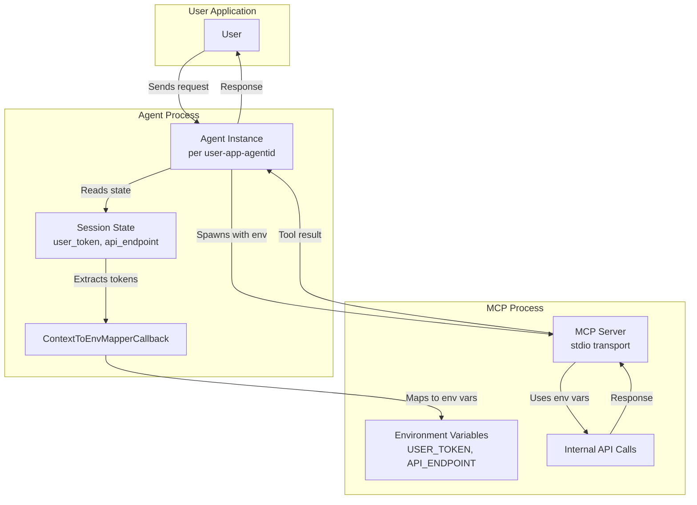

# Sample: Passing User Token from Agent State to MCP via ContextToEnvMapperCallback

This sample demonstrates how to use the `context_to_env_mapper_callback` feature in ADK to pass a user token from the agent's session state to an MCP process (using stdio transport). This is useful when your MCP server (built by your organization) requires the same user token for internal API calls.

## How it works
- The agent is initialized with a `MCPToolset` using `StdioServerParameters`.
- The `context_to_env_mapper_callback` is set to a function that extracts the `user_token` from the agent's state and maps it to the `USER_TOKEN` environment variable.
- When the agent calls the MCP, the token is injected into the MCP process environment, allowing the MCP to use it for internal authentication.

## Directory Structure
```
contributing/samples/stdio_mcp_user_auth_passing_sample/
├── agent.py       # Basic agent setup
├── main.py        # Complete runnable example
└── README.md
```

## How to Run

### Option 1: Run the complete example
```bash
cd /home/sanjay-dev/Workspace/adk-python
python -m contributing.samples.stdio_mcp_user_auth_passing_sample.main
```

### Option 2: Use the agent in your own code
```python
from contributing.samples.stdio_mcp_user_auth_passing_sample.agent import create_agent
from google.adk.sessions import Session

agent = create_agent()
session = Session(
    id="your_session_id",
    app_name="your_app_name", 
    user_id="your_user_id"
)

# Set user token in session state
session.state['user_token'] = 'YOUR_ACTUAL_TOKEN_HERE'
session.state['api_endpoint'] = 'https://your-internal-api.com'

# Then use the agent in your workflow...
```

## Flow Diagram



## Context
- Each agent instance is initiated per user-app-agentid.
- The agent receives a user context (with token) and calls the MCP using stdio transport.
- The MCP, built by the same organization, uses the token for internal API calls.
- The ADK's context-to-env mapping feature makes this seamless.
