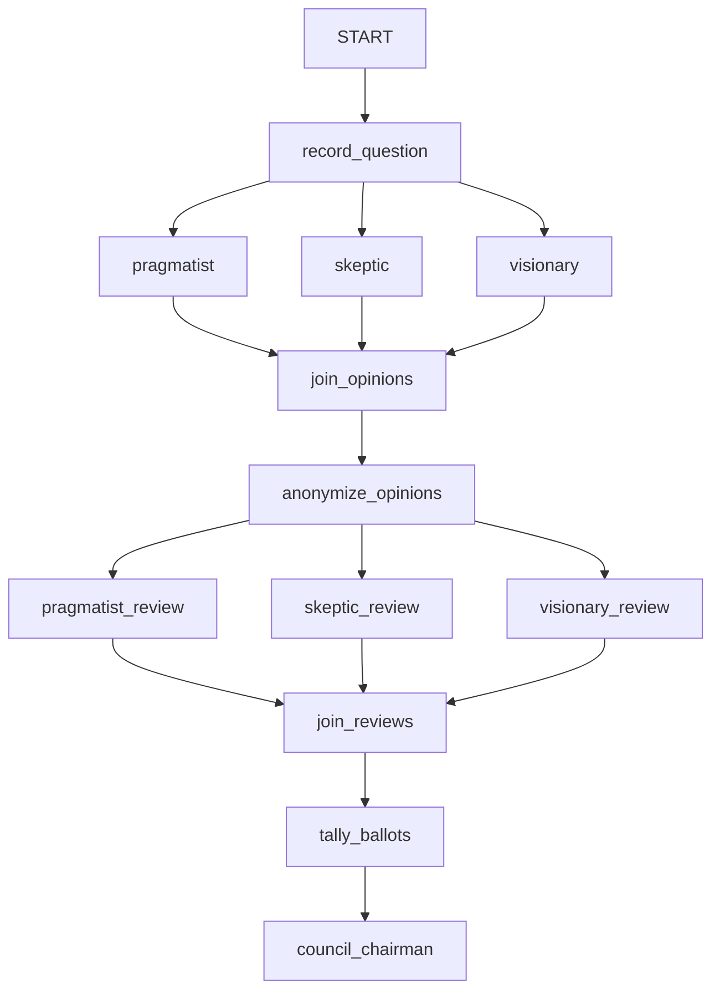

# ADK LLM Council Sample

## Overview

This sample implements an **LLM council** (popularized by Andrej Karpathy's
[llm-council](https://github.com/karpathy/llm-council)): instead of one agent
answering a question, a panel of council members with different personas
deliberates in three stages, all inside a single `Workflow`:

1. **First opinions** — three council members (`pragmatist`, `skeptic`,
   `visionary`) answer the question independently and in parallel.
1. **Anonymized peer review** — the opinions are relabeled as
   "Response A/B/C" and fanned out again; each member critiques all
   responses without knowing who wrote what (including their own), ending
   with a machine-parseable ballot line: `FINAL RANKING: B > A > C`.
1. **Tally and synthesis** — a plain function node (`tally_ballots`) parses
   the ballots and computes the average-rank leaderboard *in code*, so the
   math can never be hallucinated. The `council_chairman` agent then
   receives the leaderboard and reviews, plus the identity roster from
   state, and produces one final answer with a de-anonymized verdict.

The council members run in-process as parallel workflow branches, so no
network hops (e.g., A2A) are needed between members, and all seats share one
`static_instruction` so every LLM call keeps a cache-aligned system
instruction. In Karpathy's original, each seat is a *different frontier
model*; to reproduce that, pass an explicit `model=` per member in
`_make_opinion_agent` / `_make_review_agent` (members here share the default
model and differ by persona instead).

## Sample Inputs

- `I have a critical business deadline in 3 days. Should I put all HTML, CSS, JavaScript, database queries, and credentials in a single 5000-line index.html so we can deploy immediately?`

  *The pragmatist weighs the deadline, the skeptic flags the credential leak,
  the visionary argues for minimal structure — the chairman reconciles them.*

- `Should a 10-person startup use a monorepo or one repo per service?`

- `Is it worth rewriting our working Python service in Rust for performance?`

## Graph



## How To

1. **Two chained fan-out / fan-in rounds.** Each round is a tuple of nodes
   followed by a `JoinNode`. The rounds are chained by naming the same node
   (`anonymize_opinions`) at the end of one edge tuple and the start of the
   next:

   ```python
   edges=[
       ("START", record_question, opinion_agents, join_opinions,
        anonymize_opinions),
       (anonymize_opinions, review_agents, join_reviews, tally_ballots,
        chairman),
   ]
   ```

   Because the graph *is* the protocol, the stages cannot be skipped or
   reordered — a tool-calling chairman agent would need prompt rules and
   callback guards to enforce the same thing.

1. **One `static_instruction`, per-seat dynamic `instruction`.** All seven
   agents share the same `_COUNCIL_PROTOCOL` as `static_instruction`, so
   the system instruction is byte-identical for every LLM call in the
   session — keeping the cacheable prefix stable (`adk web` flags a cache
   miss whenever consecutive calls change the system instruction). Each
   seat's persona, stage task, and templated state ride in the dynamic
   `instruction`, which ADK sends as user content when
   `static_instruction` is set. See the
   [static_instruction sample](../../context_management/static_instruction)
   for the underlying mechanism.

1. **State templating controls who sees what.** `record_question` and
   `anonymize_opinions` return `Event(state={...})` instead of a message.
   Reviewers pull in the anonymized `{transcript}`, and only the chairman
   sees `{roster}` — which is what keeps the peer review blind.

1. **`JoinNode` output keys drive anonymization.** A `JoinNode` hands the
   next node a `dict` keyed by upstream node name. `anonymize_opinions`
   relabels those keys as "Response A/B/C" (and keeps the mapping in state
   as `roster`), so reviewers judge responses on merit rather than
   authorship.

1. **Deterministic work belongs in function nodes.** Reviewers must end
   with an exact `FINAL RANKING: B > A > C` line; `tally_ballots` parses
   those lines with a regex and computes the average-rank leaderboard in
   Python. The chairman is explicitly told to reproduce the table, not
   recompute it — LLMs synthesize, code does arithmetic. Expect persona
   affinity in individual ballots (each member tends to favor the response
   closest to its own values); averaging across personas is what debiases
   the aggregate.

1. **Agent factories keep the council DRY.** `_make_opinion_agent` and
   `_make_review_agent` build the six member agents from a single
   `_PERSONAS` dict — add a persona there and the council grows without
   touching the graph definition.

## Related Guides

- [Graph](../../../../docs/guides/workflow/graph/index.md) - How workflow
  edges, fan-out tuples, and node chaining work.
- [JoinNode](../../../../docs/guides/workflow/join_node/index.md) - How
  parallel branches synchronize and how the joined `dict` is shaped.
- [Function Node](../../../../docs/guides/workflow/function_node/index.md) -
  How plain functions become nodes and set state via `Event`.
