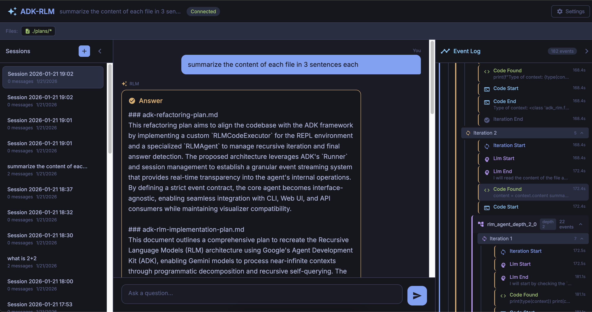

# ADK-RLM

A Python implementation of Recursive Language Models (RLM) using Google's Agent Development Kit (ADK) and Gemini models.

RLM enables LLMs to handle near-infinite length contexts by programmatically examining, decomposing, and recursively calling themselves through a REPL environment.



## Features

- **Recursive LLM Calls**: LLMs can call sub-LLMs to analyze context chunks
- **Sandboxed Python REPL**: Safe code execution with restricted builtins
- **Streaming Events**: Real-time event streaming for UI integration
- **Multi-Turn Persistence**: Maintain state across conversation turns
- **JSONL Logging**: Compatible with the original RLM visualizer
- **Rich Console Output**: Terminal output with Tokyo Night theme
- **Usage Tracking**: Track token usage per model
- **File System Integration**: Extend the concept behind RLM to file system and drives (e.g., Sharepoint, etc.), with a lazy-loading approach. 

## Installation

```bash
# Navigate to this sample directory
cd contributing/samples/rlm

# Create virtual environment
uv venv
source .venv/bin/activate

# Install dependencies
uv pip install -e .

# Or install with all optional features
uv pip install -e ".[all]"
```

## UI Quickstart

```bash
# Copy environment file
cp .env.example .env

# Authenticate with Google Cloud (AI Platform API must be enabled)
gcloud auth application-default login
gcloud auth application-default set-quota-project YOUR_PROJECT_ID

# Run the UI
python -m adk_rlm.web
```

## Quick Start

```bash
# Copy environment file
cp .env.example .env

# Authenticate with Google Cloud (AI Platform API must be enabled)
gcloud auth application-default login
gcloud auth application-default set-quota-project YOUR_PROJECT_ID
```

```python
from adk_rlm import completion

result = completion(
    context="Alice is 30 years old. Bob is 25 years old.",
    prompt="Who is older and by how much?",
)

print(result.response)  # Alice is older by 5 years
```

## Usage

### Basic Usage

```python
from adk_rlm import completion

# Simple completion with options
result = completion(
    context="Your document or data here...",
    prompt="What patterns do you see in the data?",
    model="gemini-3-flash-preview",
    sub_model="gemini-3-flash-preview",
    max_iterations=10,
    verbose=True,  # Show Rich console output
)

print(result.response)
print(f"Execution time: {result.execution_time:.2f}s")
```

### Streaming Events

For real-time UI updates, use the `RLM` class with `run_streaming()`:

```python
import asyncio
from adk_rlm import RLM, RLMEventType

async def main():
    rlm = RLM(model="gemini-3-flash-preview")

    async for event in rlm.run_streaming(context, prompt):
        event_type = event.custom_metadata.get("event_type")

        if event_type == RLMEventType.ITERATION_START.value:
            print(f"Starting iteration {event.custom_metadata['iteration']}")

        elif event_type == RLMEventType.FINAL_ANSWER.value:
            print(f"Answer: {event.custom_metadata['answer']}")

    rlm.close()

asyncio.run(main())
```

### Multi-Turn Sessions

For persistent sessions where context accumulates:

```python
import asyncio
from adk_rlm import RLM, RLMEventType

async def run_query(rlm, context, prompt):
    """Helper to run a query and return the answer."""
    async for event in rlm.run_streaming(context, prompt):
        if event.custom_metadata:
            if event.custom_metadata.get("event_type") == RLMEventType.FINAL_ANSWER.value:
                return event.custom_metadata.get("answer")
    return ""

async def main():
    rlm = RLM(
        model="gemini-3-flash-preview",
        persistent=True,  # Enable multi-turn persistence
    )

    try:
        # First turn
        result1 = await run_query(rlm, "Alice is 30 years old.", "How old is Alice?")

        # Second turn - has access to previous context
        result2 = await run_query(rlm, "Bob is 25 years old.", "Who is older?")
        print(result2)  # Alice

    finally:
        rlm.close()

asyncio.run(main())
```

### File Loading

```python
from adk_rlm import completion

# Load files using glob patterns
result = completion(
    files=["./docs/**/*.md", "./data/*.csv"],
    prompt="Summarize the key findings across all documents.",
)

print(result.response)
```

### Google Cloud Storage

Load files directly from GCS buckets:

```python
from adk_rlm.files.sources import GCSFileSource
from adk_rlm.files.loader import FileLoader

# Initialize GCS source (uses Application Default Credentials)
gcs = GCSFileSource(bucket="my-bucket")

# Or with service account
gcs = GCSFileSource(
    bucket="my-bucket",
    credentials_path="/path/to/service-account.json"
)

loader = FileLoader(sources={"gcs": gcs})

# Load files using gs:// URIs with glob patterns
files = loader.create_lazy_files([
    "gs://my-bucket/reports/*.pdf",
    "gs://my-bucket/data/**/*.csv"
])

# Files load lazily - no download until content accessed
for f in files:
    print(f.name)       # No I/O
    print(f.size_kb)    # Metadata fetch only
    print(f.content)    # Full download + parse
```

Install the GCS dependency:
```bash
uv pip install -e ".[gcs]"
```

### JSONL Logging

```python
from adk_rlm import completion

result = completion(
    context="Your data...",
    prompt="Analyze this data.",
    log_dir="./logs",  # Enable JSONL logging
)

# Logs are saved to ./logs/<timestamp>.jsonl
# Compatible with the RLM visualizer
```

## How It Works

RLM provides the LLM with a Python REPL environment that includes:

1. **`context`**: The input data/document to analyze
2. **`llm_query(prompt, model=None)`**: Function to make sub-LLM calls
3. **`llm_query_batched(prompts, model=None)`**: Batch sub-LLM calls
4. **`FINAL_VAR(var)`**: Mark a variable as the final answer

The LLM iteratively writes and executes Python code to:
- Break down large contexts into manageable chunks
- Make recursive LLM calls to analyze each chunk
- Aggregate results and produce a final answer

### Example LLM Code Execution

```python
# The LLM might generate code like:
chunks = [context[i:i+1000] for i in range(0, len(context), 1000)]
summaries = []
for chunk in chunks:
    summary = llm_query(f"Summarize: {chunk}")
    summaries.append(summary)
final_summary = llm_query(f"Combine summaries: {summaries}")
FINAL_VAR(final_summary)
```

## Project Structure

```
adk_rlm/
    __init__.py          # Package exports
    main.py              # RLM class and completion() function
    types.py             # Data classes
    prompts.py           # System/user prompts
    usage.py             # UsageTracker
    agents/
        rlm_agent.py     # Core RLMAgent implementation
    repl/
        local_repl.py    # Sandboxed REPL environment
        safe_builtins.py # Restricted Python builtins
    callbacks/
        code_execution.py # Code parsing utilities
    logging/
        rlm_logger.py    # JSONL logger
        verbose.py       # Rich console output
```

## Running Tests

```bash
# Run unit tests
python -m pytest tests/ --ignore=tests/test_e2e.py --ignore=tests/test_gcs_integration.py

# Run E2E tests (requires Gemini API access)
RLM_E2E_TESTS=true python -m pytest tests/test_e2e.py -v

# Run GCS integration tests (requires GCS bucket)
RLM_GCS_TEST_BUCKET="your-test-bucket" \
RLM_GCS_TEST_FILE="test/sample.txt" \
python -m pytest tests/test_gcs_integration.py -v
```

### Setting Up GCS Test Bucket

```bash
# Create bucket
BUCKET_NAME="adk-rlm-test-$(date +%s)"
gcloud storage buckets create "gs://${BUCKET_NAME}" --location=us-central1

# Create test files
echo "Test content" | gcloud storage cp - "gs://${BUCKET_NAME}/test/sample.txt"
echo "Report Q1" | gcloud storage cp - "gs://${BUCKET_NAME}/test/report_q1.txt"

# Run tests
RLM_GCS_TEST_BUCKET="${BUCKET_NAME}" python -m pytest tests/test_gcs_integration.py -v

# Clean up when done
gcloud storage rm -r "gs://${BUCKET_NAME}"
```

## Requirements

- Python 3.10+
- Google Cloud authentication (application default credentials)
- Access to Gemini models (gemini-3-flash-preview, gemini-3-pro-preview)

