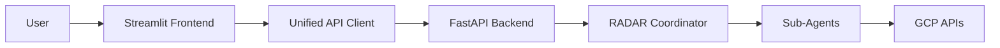

# 🎯 ADK Agent Interface Guide

## Quick Start

The ADK Security Agent provides a Streamlit-based web interface for interacting with intelligent security agents using Google's ADK (Agent Development Kit).

### 1. Start the Backend (Required)
```bash
cd deploy
python run_backend.py
```
The backend provides the agent orchestration and API endpoints.

### 2. Start the Frontend
```bash
cd deploy  
python run_frontend.py
```
This will automatically:
- Detect and use `simple_agent_app.py` if available (cleaner interface)
- Fall back to `main_app.py` if simple app doesn't exist
- Open at http://localhost:8501

## Available Interfaces

### Simple Agent Interface (`simple_agent_app.py`)
A clean, focused chat interface for direct agent interaction:
- **Direct Chat**: Talk directly to the RADAR coordinator agent
- **Quick Actions**: Pre-configured security analysis commands
- **Real-time Results**: See agent responses with recommendations
- **Session Management**: Maintains conversation context

### Full Dashboard (`main_app.py`)  
Complete security dashboard with multiple views:
- **RADAR Coordinator**: Primary structured security analysis
- **Legacy Chat**: Traditional chat interface
- **Asset Dashboard**: Visual asset inventory
- **Security Analysis**: Deep security scanning
- **IAM Analysis**: Permission reviews

## How It Works



1. **Frontend Layer**: Streamlit provides the web UI
2. **API Client**: `unified_api_client.py` handles all backend communication
3. **Backend Layer**: FastAPI orchestrates ADK agents
4. **Agent Layer**: RADAR coordinator manages security analysis phases
5. **GCP Layer**: Agents interact with Google Cloud APIs

## Key Components

### Frontend Components
- `frontend/simple_agent_app.py` - Clean agent chat interface
- `frontend/main_app.py` - Full-featured dashboard
- `frontend/unified_api_client.py` - Single API client for all communication
- `frontend/components/chat/` - Chat-related components
- `frontend/components/radar/` - RADAR agent components

### Backend Components
- `backend/main.py` - FastAPI application
- `backend/agents/radar_coordinator.py` - RADAR orchestration
- `backend/agents/recognition_agent.py` - Resource discovery
- `backend/agents/assessment_agent.py` - Security evaluation
- `backend/api/` - API endpoints for various services

## Using the Agent Interface

### Basic Chat
1. Type your security question in the chat input
2. The agent will analyze your GCP project
3. View real-time responses and recommendations

### Quick Actions
Use the sidebar buttons for common tasks:
- 🔍 **Analyze Security Posture** - Full security assessment
- 🛡️ **Check Vulnerabilities** - Scan for security issues
- 🔐 **Review IAM** - Analyze permissions
- 📋 **Compliance Check** - Verify compliance status

### RADAR Phases
The RADAR methodology executes in 5 phases:
1. **Recognition** - Discover all resources
2. **Assessment** - Evaluate security posture
3. **Decision** - Prioritize issues
4. **Action** - Generate remediation plans
5. **Review** - Validate improvements

## Configuration

### Environment Variables
Create a `.env` file in the project root:
```env
# GCP Configuration
GOOGLE_CLOUD_PROJECT=your-project-id

# Backend Configuration  
BACKEND_HOST=localhost
BACKEND_PORT=8000

# Frontend Configuration
FRONTEND_HOST=localhost
FRONTEND_PORT=8501

# Cache Settings
CACHE_TTL=300
```

### Project Selection
The interface will automatically:
1. Load available GCP projects
2. Allow selection via the sidebar
3. Cache project context for queries

## Troubleshooting

### Backend Not Running
```
❌ Backend Disconnected
```
Solution: Start the backend first with `python deploy/run_backend.py`

### No Projects Available
```
No GCP projects were found
```
Solution: Ensure GCP credentials are configured properly

### Import Errors
```
ModuleNotFoundError: No module named 'google.adk'
```
Solution: Install ADK dependencies:
```bash
pip install -r backend/requirements.txt
```

## Development

### Adding New Agents
1. Create agent in `backend/agents/`
2. Register in `radar_coordinator.py`
3. Add API endpoint in `backend/api/`
4. Update `unified_api_client.py` with new methods

### Customizing the Interface
1. Edit `frontend/simple_agent_app.py` for simple changes
2. Modify `frontend/main_app.py` for dashboard changes
3. Add new components in `frontend/components/`

## Best Practices

1. **Always start the backend first** - Frontend needs API endpoints
2. **Use the unified API client** - Single source of truth for API calls
3. **Check agent status** - Ensure agents are ready before queries
4. **Monitor logs** - Both frontend and backend provide detailed logging
5. **Cache appropriately** - Use caching for expensive operations

## Support

For issues or questions:
1. Check the logs in `frontend/logs/` and backend console
2. Verify GCP credentials and permissions
3. Ensure all dependencies are installed
4. Review the ADK documentation