# ADK Security Agent - Architecture Documentation

## 📚 Table of Contents
1. [System Overview](#system-overview)
2. [Architecture Diagrams](#architecture-diagrams)
3. [Core Components](#core-components)
4. [Service Architecture](#service-architecture)
5. [Data Flow](#data-flow)
6. [API Design](#api-design)
7. [Security Model](#security-model)
8. [Deployment Architecture](#deployment-architecture)

## 🎯 System Overview

The ADK Security Agent is an enterprise-ready security evaluation platform for Google Cloud Platform (GCP) built with a revolutionary modular service architecture. It provides comprehensive security analysis, AI-powered recommendations, and real-time monitoring capabilities.

### Key Architectural Principles
- **Modular Service Architecture**: 16 independently manageable services
- **Fault Isolation**: Services fail independently without affecting others
- **Dynamic Configuration**: Enable/disable services at runtime
- **Dependency Management**: Automatic service dependency resolution
- **Asynchronous Operations**: Built on FastAPI with async/await patterns
- **Cloud-Native Design**: Ready for containerization and cloud deployment

## 🏗️ Architecture Diagrams

### High-Level System Architecture

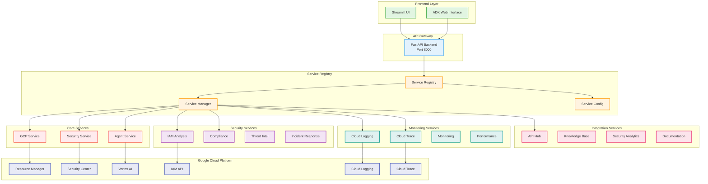

### Service Lifecycle Management

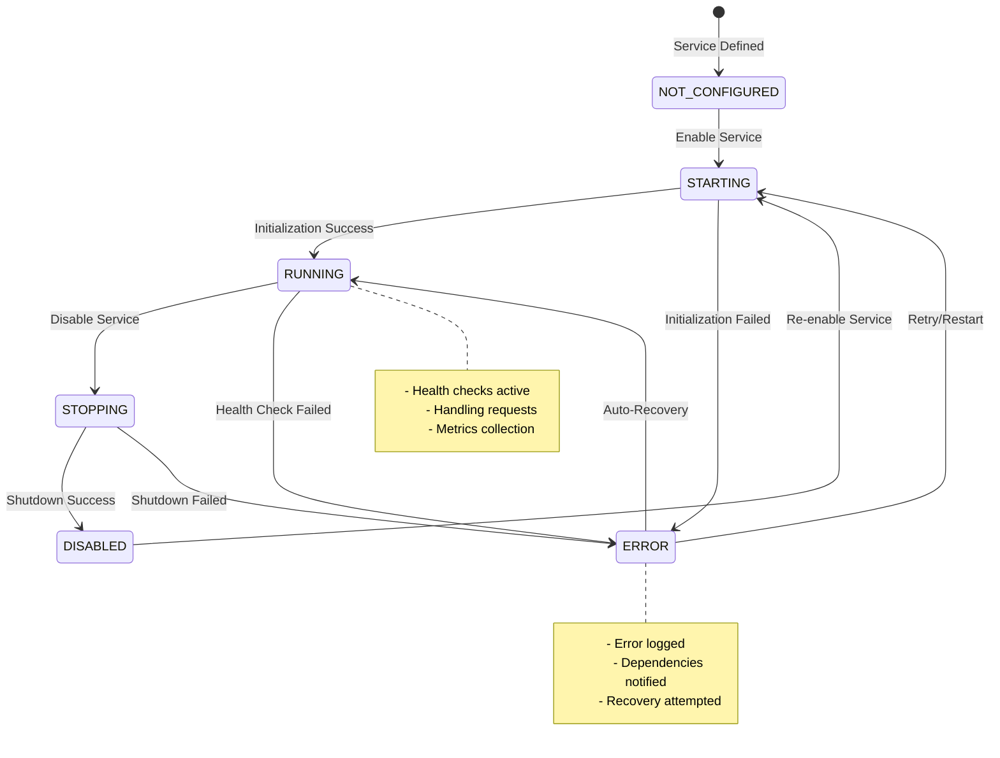

### Service Dependency Graph

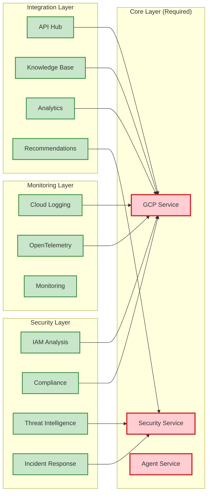

## 🔧 Core Components

### Service Registry
The heart of the modular architecture, managing service lifecycle and dependencies.

```python
class ServiceRegistry:
    """Central registry for all services."""
    
    def __init__(self, config: ServiceConfig, credentials=None, project_id=None):
        self.config = config
        self.credentials = credentials
        self.project_id = project_id
        self.services: Dict[str, BaseService] = {}
        self.routers: Dict[str, Any] = {}
```

**Key Responsibilities:**
- Service instantiation and lifecycle management
- Dependency resolution and topological sorting
- Health check coordination
- Dynamic router registration
- Service status tracking

### Base Service Architecture

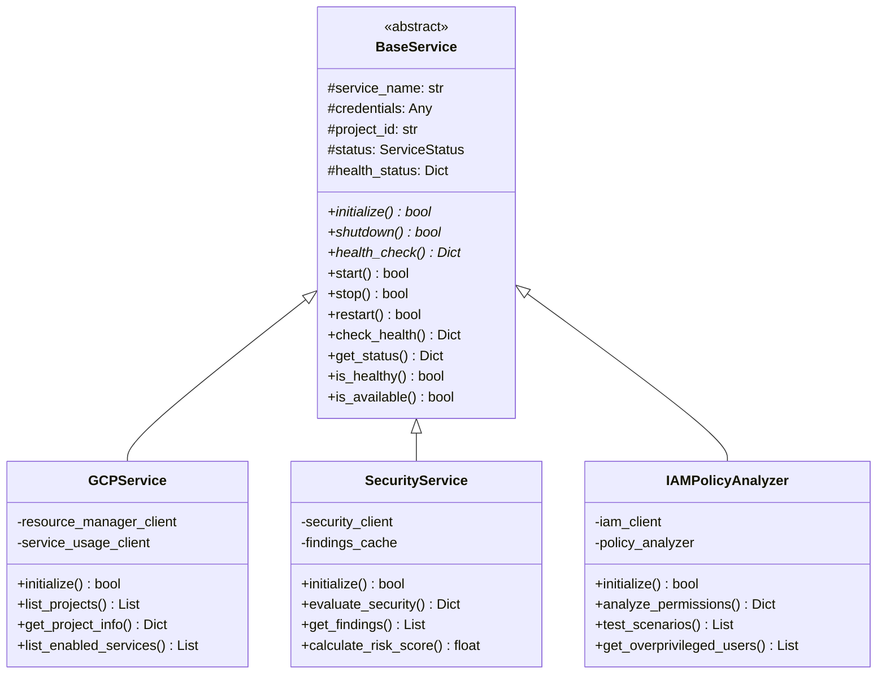

### Service Configuration Management

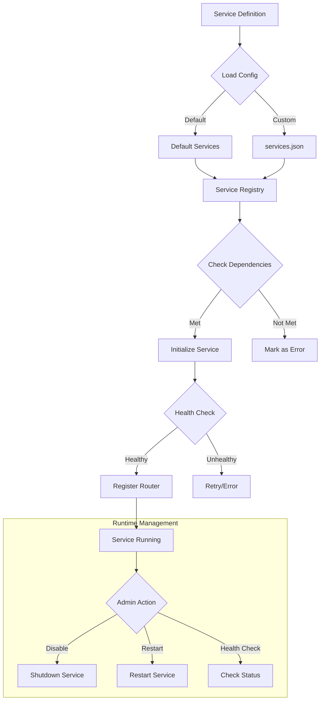

## 📦 Service Architecture

### Service Categories

1. **Core Services (Required)**
   - Cannot be disabled
   - Foundation for other services
   - Examples: GCP, Security, Agent

2. **Security Services**
   - IAM Analysis
   - Compliance Checking
   - Threat Intelligence
   - Incident Response

3. **Monitoring Services**
   - Cloud Logging
   - OpenTelemetry Tracing
   - Performance Monitoring

4. **Integration Services**
   - API Hub
   - Security Knowledge Base
   - Analytics
   - Documentation

### Service Communication Pattern

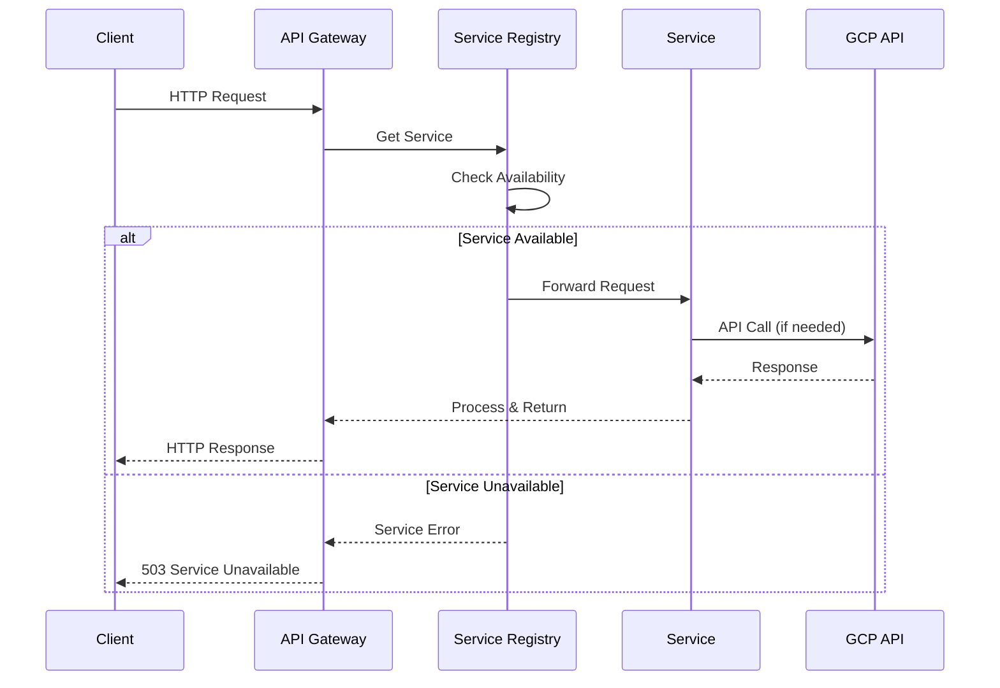

## 🔄 Data Flow

### Request Processing Flow

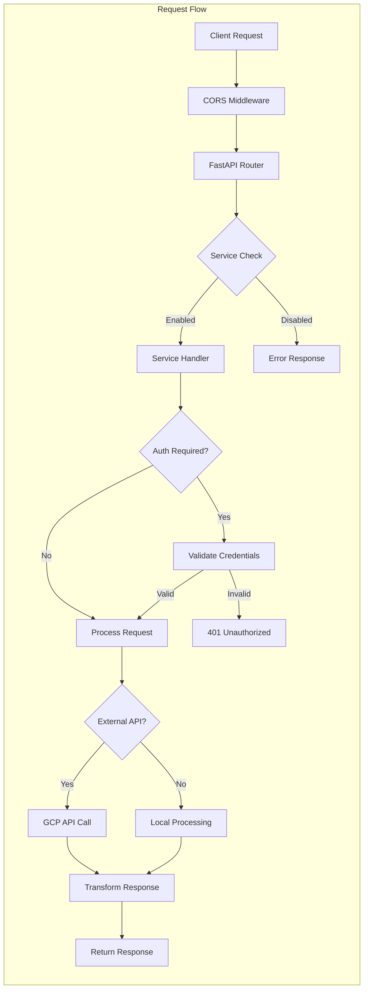

### Security Evaluation Flow

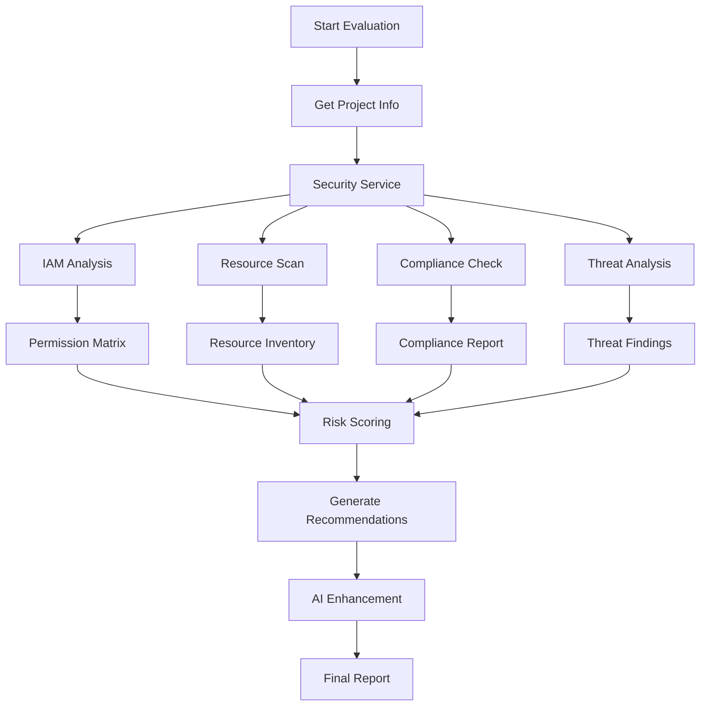

## 🔌 API Design

### RESTful API Structure

```mermaid
graph TD
    subgraph "API Endpoints"
        A[/api/v1] --> B[/services]
        A --> C[/gcp]
        A --> D[/security]
        A --> E[/iam]
        A --> F[/compliance]
        A --> G[/agent]
        
        B --> B1[GET /status]
        B --> B2[POST /{name}/enable]
        B --> B3[POST /{name}/disable]
        B --> B4[GET /{name}/health]
        
        C --> C1[GET /projects]
        C --> C2[GET /project/{id}/info]
        C --> C3[GET /project/{id}/services]
        
        D --> D1[POST /evaluate]
        D --> D2[GET /score]
        D --> D3[GET /recommendations]
        
        E --> E1[GET /analyze-user/{email}]
        E --> E2[GET /testing/scenarios]
        E --> E3[POST /testing/run-scenario]
    end
```

### API Response Structure

```json
{
  "success": true,
  "data": {
    // Response data
  },
  "metadata": {
    "timestamp": "2025-01-08T10:30:00Z",
    "service": "security",
    "version": "1.0.0"
  },
  "error": null
}
```

## 🔒 Security Model

### Authentication & Authorization Flow

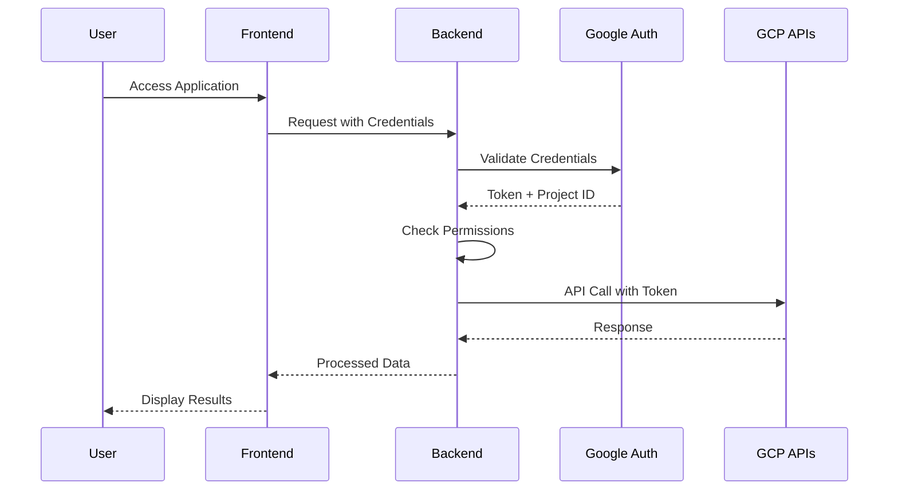

### Security Layers

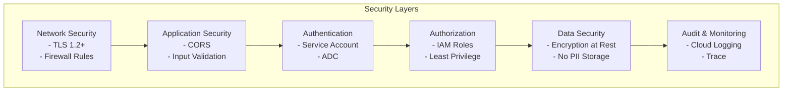

## 🚀 Deployment Architecture

### Container Architecture

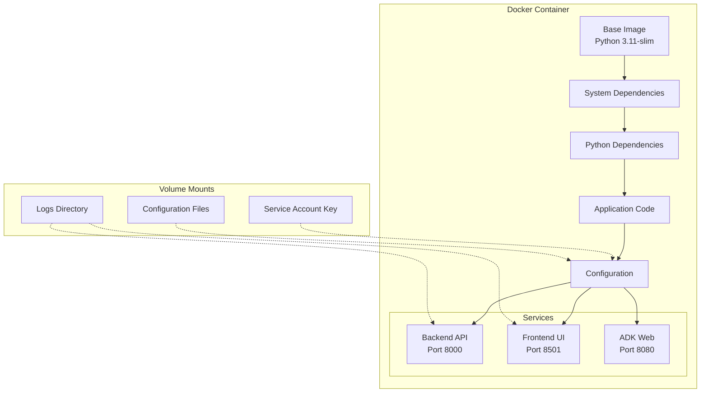

### Cloud Run Deployment

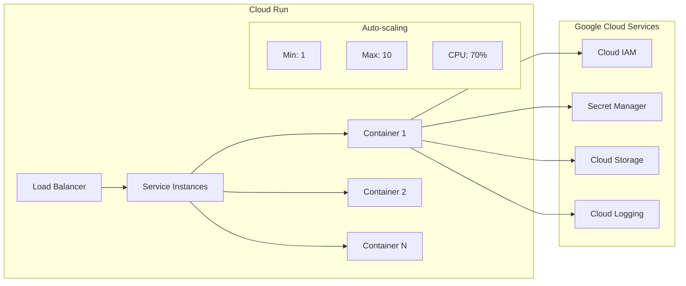

### Kubernetes Architecture

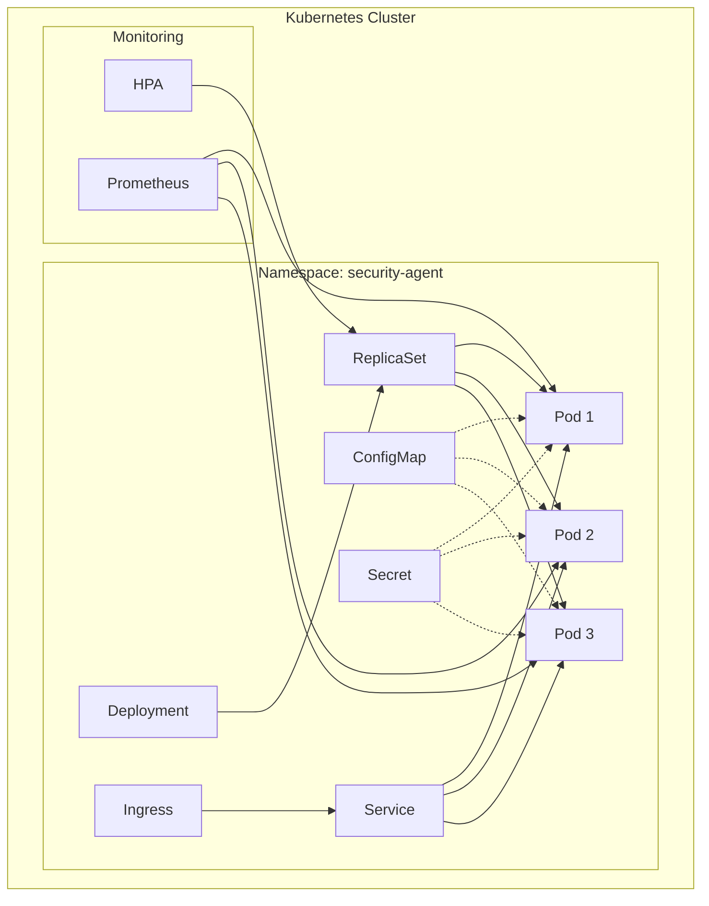

## 📊 Performance Architecture

### Caching Strategy

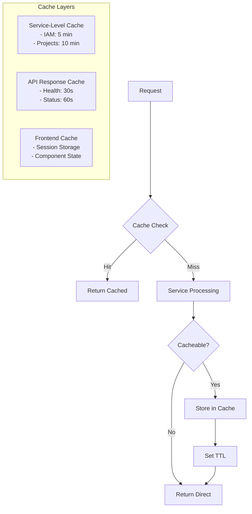

### Monitoring & Observability

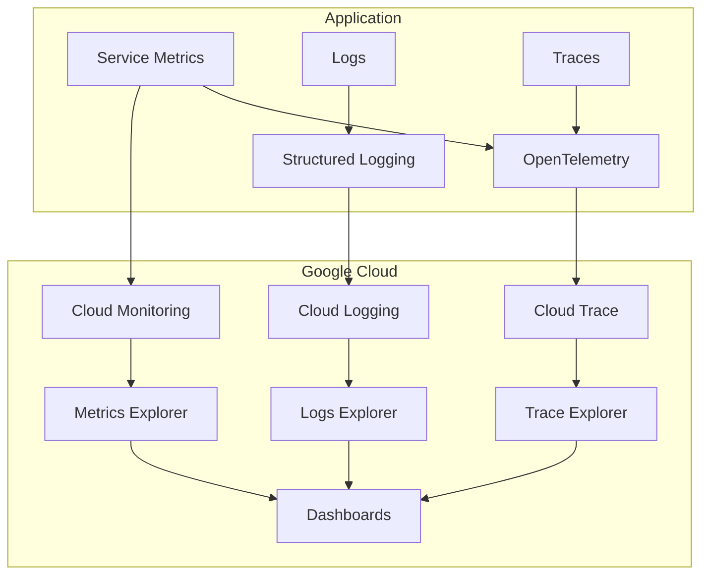

## 🔧 Development Architecture

### Local Development Setup

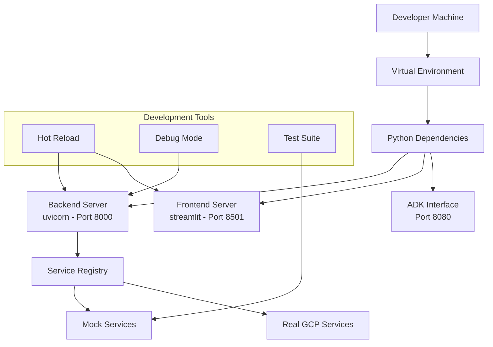

### CI/CD Pipeline

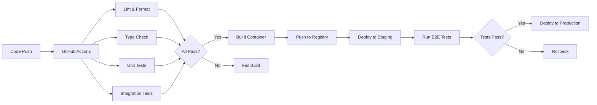

## 📚 Additional Resources

- [API Documentation](http://localhost:8000/docs)
- [Service Management Guide](./SERVICE_MANAGEMENT.md)
- [Security Best Practices](./SECURITY.md)
- [Deployment Guide](./DEPLOYMENT.md)
- [Contributing Guidelines](./CONTRIBUTING.md)

---

**Last Updated:** January 2025  
**Version:** 4.0.0  
**Maintainers:** ADK Security Team