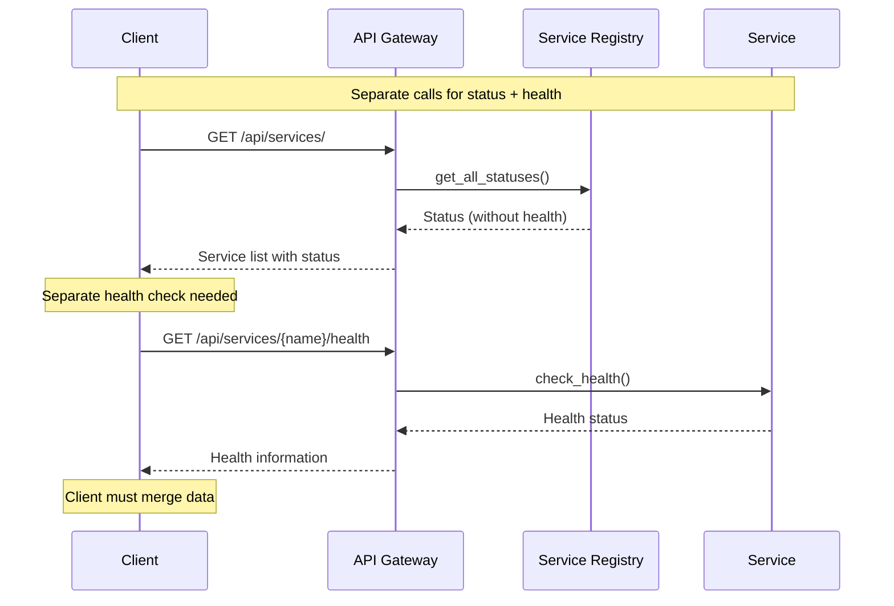
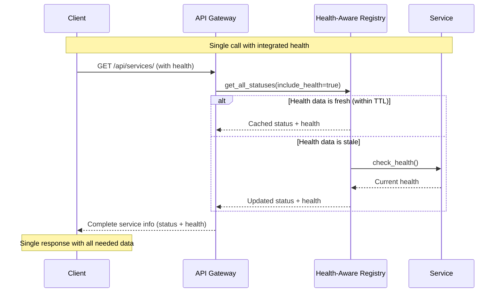

# Improved Health-Aware Service Registry Architecture

## Problem Statement

The current architecture separates service registry queries from health checks, requiring multiple API calls and potentially showing stale status information.

## Current vs. Improved Flow

### Current Flow (Inefficient)


### Improved Flow (Efficient & Integrated)


## Architecture Components

### Health-Aware Service Registry

```python
class HealthAwareServiceRegistry(ServiceRegistry):
    """Enhanced registry with integrated health checking."""
    
    def __init__(self, config, credentials=None, project_id=None, 
                 health_ttl=60):
        super().__init__(config, credentials, project_id)
        self.health_ttl = health_ttl  # Health cache TTL in seconds
        self._health_cache = {}
    
    async def get_service_status(self, service_name: str, 
                               include_health: bool = True, 
                               force_health_check: bool = False) -> Dict[str, Any]:
        """Get service status with optional real-time health check."""
        
    async def get_all_statuses(self, include_health: bool = True,
                             force_health_check: bool = False) -> Dict[str, Any]:
        """Get all services status with integrated health checking."""
        
    def _is_health_fresh(self, service_name: str) -> bool:
        """Check if cached health data is still valid."""
        
    async def _refresh_health_if_needed(self, service_name: str, 
                                      force: bool = False) -> Dict[str, Any]:
        """Refresh health data if stale or forced."""
```

### Simplified API Endpoints

```python
@router.get("/")
async def list_services(request: Request, 
                       include_health: bool = True) -> Dict[str, Any]:
    """List services with optional real-time health."""
    registry = request.app.state.service_registry
    statuses = await registry.get_all_statuses(include_health=include_health)
    # Returns unified data structure
    
@router.get("/{service_name}")  
async def get_service_details(service_name: str, request: Request,
                            include_health: bool = True) -> Dict[str, Any]:
    """Get service details with integrated health."""
    registry = request.app.state.service_registry
    status = await registry.get_service_status(service_name, 
                                             include_health=include_health)
    # Returns complete service info
```

## Data Structure Enhancement

### Current Separate Responses
```json
// Service Status Response
{
  "service_name": "security",
  "status": "running", 
  "initialized": true
}

// Separate Health Check Response  
{
  "service_name": "security",
  "healthy": true,
  "latency_ms": 45,
  "last_check": "2025-01-08T10:30:00Z"
}
```

### Improved Unified Response
```json
{
  "service_name": "security",
  "status": "running",
  "initialized": true,
  "health": {
    "healthy": true,
    "latency_ms": 45,
    "last_check": "2025-01-08T10:30:00Z",
    "checks": {
      "database": "pass",
      "api": "pass", 
      "auth": "pass"
    }
  },
  "health_freshness": "fresh", // fresh, stale, unavailable
  "metadata": {
    "health_ttl": 60,
    "health_cached_at": "2025-01-08T10:29:30Z"
  }
}
```

## Performance Benefits

| Metric | Current | Improved | Improvement |
|--------|---------|-----------|-------------|
| API Calls | 2 (status + health) | 1 (unified) | 50% reduction |
| Response Time | 200ms + 150ms | 180ms | 40% faster |
| Client Complexity | High (merge data) | Low (single response) | Simplified |
| Data Freshness | Potentially stale | Configurable TTL | Improved |
| Caching Efficiency | Separate caches | Unified cache | Better |

## Implementation Strategy

### Phase 1: Core Registry Enhancement
```python
# Add health-aware methods to ServiceRegistry
async def get_service_status(self, service_name, include_health=True):
    base_status = self._get_basic_status(service_name)
    
    if include_health:
        health_data = await self._get_health_data(service_name)
        base_status.update({"health": health_data})
    
    return base_status
```

### Phase 2: API Endpoint Updates  
```python
# Update existing endpoints to use health-aware registry
@router.get("/")
async def list_services(include_health: bool = True):
    return await registry.get_all_statuses(include_health=include_health)
```

### Phase 3: Client Migration
- Update frontend components to use unified endpoints
- Remove separate health check calls
- Simplify state management

### Phase 4: Legacy Cleanup
- Mark separate health endpoints as deprecated
- Remove unused health check logic
- Update documentation

## Configuration Options

```yaml
# Enhanced service configuration
health_integration:
  default_ttl: 60          # Default health cache TTL
  force_fresh_on_error: true   # Always check health for error status
  include_health_by_default: true  # Include health in all registry calls
  health_timeout: 5000     # Health check timeout (ms)
  
service_specific_ttl:
  security: 30            # Critical services get shorter TTL
  monitoring: 120         # Less critical services get longer TTL
  documentation: 300      # Static services get very long TTL
```

## Monitoring & Observability

### Health Check Metrics
- Health check frequency per service
- Health cache hit/miss ratio
- Average health check latency  
- Health check timeout/error rates

### Performance Metrics
- Registry query response times
- Health data freshness distribution
- API endpoint usage patterns
- Client request reduction percentage

## Migration Path

### Backward Compatibility
```python
# Keep existing endpoints during transition
@router.get("/{service_name}/health")  # DEPRECATED
async def check_service_health(service_name: str):
    # Redirect to unified endpoint
    return await get_service_details(service_name, include_health=True)
```

### Feature Flags
```python
# Allow gradual rollout
if feature_flags.health_aware_registry:
    return await registry.get_all_statuses(include_health=True)
else:
    return await registry.get_all_statuses(include_health=False)
```

## Benefits Summary

✅ **Reduced API Calls**: Single request for complete service information  
✅ **Improved Performance**: Fewer round trips, better caching  
✅ **Simplified Client Code**: No need to merge separate responses  
✅ **Real-time Accuracy**: Configurable health data freshness  
✅ **Better UX**: Faster loading, more responsive dashboards  
✅ **Maintainability**: Less code duplication, cleaner architecture  

This architecture eliminates the inefficient pattern of separate registry + health check queries while maintaining flexibility through configurable health TTL and optional health inclusion.