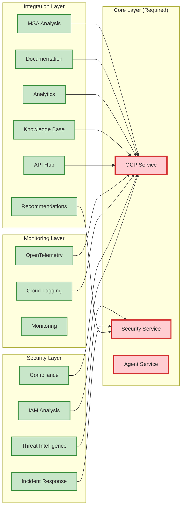
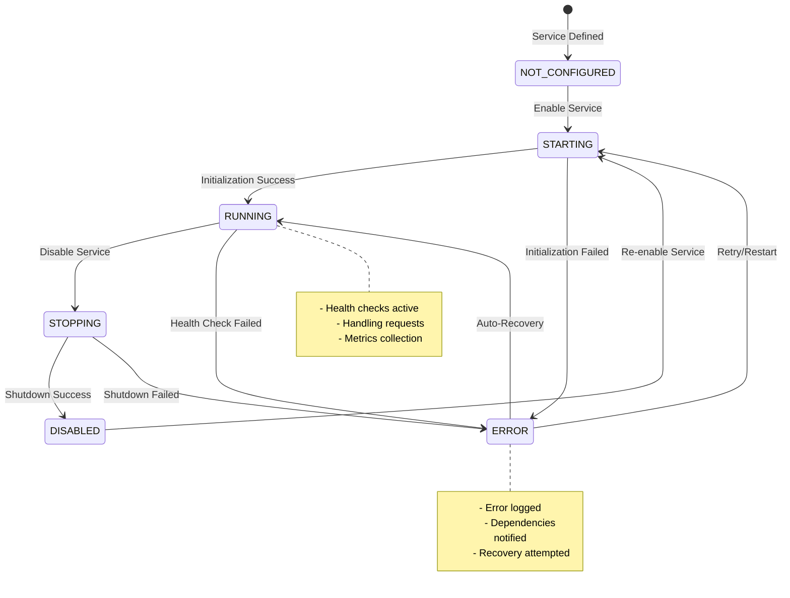

# Modular Security Agent Architecture

## Overview

The Security Agent has been refactored into a modular architecture that allows users to enable/disable individual services as needed. This prevents service failures from breaking the entire agent and provides granular control over functionality during initial setup.

## Key Features

- **Service Independence**: Each service is isolated and can fail without affecting others
- **Dynamic Enable/Disable**: Services can be enabled or disabled at runtime
- **Health Monitoring**: Built-in health checks for all services
- **Dependency Management**: Automatic handling of service dependencies
- **Configuration Persistence**: Service states are saved and restored
- **Frontend Integration**: Web UI for managing services

## Architecture Components

### Modular Service Architecture Overview

```mermaid
graph TB
    subgraph "Service Management Layer"
        SR[📋 Service Registry]
        SC[⚙️ Service Config]
        SM[🔧 Service Manager]
        
        SR -->|manages| SC
        SR -->|controls| SM
    end
    
    subgraph "Required Core Services"
        GCP[☁️ GCP Service]
        SEC[🛡️ Security Service]
        AGENT[🤖 Agent Service]
        
        SR -->|manages| GCP
        SR -->|manages| SEC
        SR -->|manages| AGENT
    end
    
    subgraph "Optional Services"
        IAM[🔐 IAM Analysis]
        COMP[📋 Compliance]
        LOG[📊 Cloud Logging]
        TRACE[🔍 Tracing]
        MON[📈 Monitoring]
        THREAT[⚠️ Threat Intel]
        API_HUB[🌐 API Hub]
        DOCS[📚 Documentation]
        ANALYTICS[📊 Analytics]
        KB[🧠 Knowledge Base]
        MSA[📄 MSA Analysis]
        INC[🚨 Incident Response]
        REC[💡 Recommendations]
        
        SR -->|optionally manages| IAM
        SR -->|optionally manages| COMP
        SR -->|optionally manages| LOG
        SR -->|optionally manages| TRACE
        SR -->|optionally manages| MON
        SR -->|optionally manages| THREAT
        SR -->|optionally manages| API_HUB
        SR -->|optionally manages| DOCS
        SR -->|optionally manages| ANALYTICS
        SR -->|optionally manages| KB
        SR -->|optionally manages| MSA
        SR -->|optionally manages| INC
        SR -->|optionally manages| REC
    end
    
    classDef required fill:#ffcdd2,stroke:#d32f2f,stroke-width:3px
    classDef optional fill:#c8e6c9,stroke:#388e3c,stroke-width:2px
    classDef management fill:#fff3e0,stroke:#ff9800,stroke-width:2px
    
    class GCP,SEC,AGENT required
    class IAM,COMP,LOG,TRACE,MON,THREAT,API_HUB,DOCS,ANALYTICS,KB,MSA,INC,REC optional
    class SR,SC,SM management
```



### Service Dependency Graph



### Core Components

#### 1. Service Registry (`core/service_registry.py`)
Central registry that manages all services, handles initialization, shutdown, and health monitoring.

#### 2. Service Configuration (`core/service_config.py`)
Configuration management system with service definitions, dependency tracking, and persistent state storage.

#### 3. Base Service (`core/base_service.py`)
Abstract base class that all services must extend, providing standard lifecycle methods and health checks.

### Service Lifecycle

Each service follows a standard lifecycle:

1. **Definition**: Service is defined in configuration with metadata
2. **Registration**: Service is registered with the service registry
3. **Initialization**: Service dependencies are checked and service is started
4. **Running**: Service is available and performing health checks
5. **Shutdown**: Service is gracefully stopped when disabled

### Service State Management



### Service States

- `NOT_CONFIGURED`: Service defined but needs configuration
- `STARTING`: Service is initializing
- `RUNNING`: Service is active and healthy
- `STOPPING`: Service is shutting down
- `DISABLED`: Service is turned off
- `ERROR`: Service has encountered an error

## Available Services

### Core Services (Always Required)

- **Security Service**: Core security evaluation functionality
- **GCP Service**: Google Cloud Platform integration
- **Agent Service**: AI conversation agent

### Optional Services

- **IAM Analysis**: Identity and Access Management policy analysis
- **Compliance**: Multi-framework compliance checking (SOC2, ISO27001, etc.)
- **Cloud Logging**: Google Cloud Logging integration
- **Documentation**: API documentation scraping
- **Threat Intelligence**: Vulnerability and threat analysis
- **Monitoring**: Performance monitoring and metrics
- **Security Analytics**: BigQuery-based security analytics
- **Security Knowledge**: Vertex AI Search integration
- **MSA Analysis**: Microsoft Service Agreement parsing
- **Tracing**: OpenTelemetry distributed tracing
- **Incident Response**: Security incident management
- **API Hub**: Google API Hub integration
- **Recommendations**: AI-powered security recommendations

## Configuration

### Service Configuration File

Services are configured in `config/services.json`:

```json
{
  "services": {
    "iam": {
      "enabled_by_default": true,
      "config": {
        "cache_ttl": 300,
        "max_users_per_scan": 100
      }
    }
  },
  "runtime_status": {
    "iam": "not_configured"
  }
}
```

### Environment Variables

- `SERVICE_CONFIG_PATH`: Path to service configuration file
- `GOOGLE_CLOUD_PROJECT`: GCP project ID
- `GOOGLE_APPLICATION_CREDENTIALS`: Service account key file

## Running the Modular Backend

### Using the Modular Backend

```bash
# Run the new modular backend
python backend/main_modular.py

# Or use uvicorn directly
uvicorn main_modular:app --host 0.0.0.0 --port 8000 --reload
```

### Service Management API

The modular backend exposes service management endpoints:

- `GET /api/v1/services/` - List all services
- `GET /api/v1/services/{service_name}` - Get service details
- `POST /api/v1/services/{service_name}/enable` - Enable a service
- `POST /api/v1/services/{service_name}/disable` - Disable a service
- `POST /api/v1/services/{service_name}/restart` - Restart a service
- `GET /api/v1/services/{service_name}/health` - Check service health
- `GET /api/v1/services/status/summary` - Get overall status summary

## Frontend Integration

### Service Management UI

Access the service management interface at `/services` in the web UI:

- **Services Overview**: View all services and their status
- **Service Control**: Enable/disable services with toggle buttons
- **Health Status**: Monitor service health in real-time
- **Service Details**: View detailed configuration and dependencies

### Usage Example

1. Start the backend: `python backend/main_modular.py`
2. Start the frontend: `streamlit run frontend/main_app.py`
3. Navigate to "⚙️ Service Management" in the sidebar
4. Enable/disable services as needed
5. Monitor health status for troubleshooting

## Creating New Services

### Step 1: Extend BaseService

```python
from core.base_service import BaseService

class MyService(BaseService):
    async def initialize(self) -> bool:
        # Initialize your service
        return True
    
    async def shutdown(self) -> bool:
        # Clean up resources
        return True
    
    async def health_check(self) -> Dict[str, Any]:
        # Check service health
        return {"healthy": True}
```

### Step 2: Add Service Definition

Add to `core/service_config.py` in `_load_default_services()`:

```python
ServiceDefinition(
    name="my_service",
    display_name="My Service",
    description="Description of my service",
    api_prefix="/api/v1/my-service",
    router_module="my_service.api",
    service_module="my_service.service.MyService",
    tags=["custom"]
)
```

### Step 3: Create API Router

```python
# my_service/api.py
from fastapi import APIRouter

router = APIRouter()

@router.get("/status")
async def get_status():
    return {"status": "running"}
```

## Benefits

### For Developers
- **Easier Debugging**: Isolate issues to specific services
- **Faster Development**: Work on individual components
- **Better Testing**: Test services independently

### For Users
- **Gradual Rollout**: Enable services one at a time during setup
- **Resource Control**: Disable unused services to save resources
- **Fault Tolerance**: System remains functional even if some services fail
- **Customization**: Enable only needed functionality

## Migration from Legacy

The modular architecture coexists with the legacy `main.py`. To migrate:

1. **Test Modular Backend**: Run `main_modular.py` to test functionality
2. **Configure Services**: Adjust `config/services.json` as needed
3. **Switch Backends**: Update startup scripts to use modular backend
4. **Monitor**: Use service management UI to monitor health

## Best Practices

### Service Design
- Keep services small and focused
- Implement proper error handling
- Include comprehensive health checks
- Document dependencies clearly

### Configuration
- Use environment variables for sensitive data
- Provide sensible defaults
- Document configuration options
- Validate configuration on startup

### Monitoring
- Monitor service health regularly
- Set up alerts for critical services
- Log service state changes
- Track performance metrics

## Troubleshooting

### Common Issues

**Service Won't Start**
- Check dependencies are enabled
- Verify configuration
- Check logs for error details
- Ensure required credentials are available

**Service Shows as Unhealthy**
- Check health check implementation
- Verify external dependencies (GCP, APIs)
- Check network connectivity
- Review service logs

**Frontend Not Showing Service Controls**
- Ensure modular backend is running
- Check API connectivity
- Verify service management endpoints

### Debug Commands

```bash
# Check service status
curl http://localhost:8000/api/v1/services/status/summary

# Enable a service
curl -X POST http://localhost:8000/api/v1/services/iam/enable

# Check specific service health
curl http://localhost:8000/api/v1/services/iam/health
```

## Future Enhancements

- **Auto-discovery**: Automatically detect new services
- **Load Balancing**: Multiple instances of the same service
- **Circuit Breakers**: Automatic service isolation on failure
- **Metrics Collection**: Detailed service performance metrics
- **Configuration UI**: Web-based configuration editor