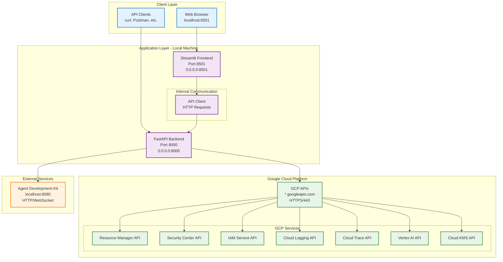

# 🛡️ GCP Security Agent

<div align="center">

[]()
[]()
[](https://python.org)
[](../../../LICENSE)

**Comprehensive security evaluation platform for Google Cloud Platform**

[🚀 Quick Start](#-quick-start) • [📖 Documentation](#-documentation) • [🏗️ Architecture](#-architecture) • [⚙️ API Endpoints](#-api-endpoints)

</div>

---

## 📋 Table of Contents

- [🎯 Overview](#-overview)
- [📋 Prerequisites](#-prerequisites)  
- [🚀 Quick Start](#-quick-start)
- [🚀 Local Deployment Guide](#-local-deployment-guide)
- [☁️ Cloud Run Deployment Guide](#-cloud-run-deployment-guide)
- [🏗️ Architecture Overview](#-architecture-overview)
- [🔧 Environment Variables Reference](#-environment-variables-reference)
- [⚡ Installation](#-installation)
- [🛠️ Configuration](#-configuration)
- [⚙️ API Endpoints](#-api-endpoints)
- [📡 API & Networking](#-api--networking)
- [🔐 GCP APIs & Service Account Permissions](#-gcp-apis--service-account-permissions)
- [🎭 Mock vs Real Data Implementation Status](#-mock-vs-real-data-implementation-status)
- [🆘 Troubleshooting Guide](#-troubleshooting-guide)
- [🔧 How to Extend the Application](#-how-to-extend-the-application)
- [🛠️ Development](#-development)

## 🎯 Overview

A comprehensive, modular security evaluation platform that provides advanced security analysis capabilities for Google Cloud Platform (GCP) environments. Built with modern, domain-driven architecture and featuring AI-powered security insights through ADK integration.

### ✨ Key Features

- **🛡️ Multi-layered Security Analysis** - Real-time risk assessment & vulnerability scanning
- **🤖 AI-Powered Assistant** - Intelligent security recommendations with ADK integration  
- **🔐 Advanced IAM Analysis** - Deep permissions analysis & policy compliance
- **📊 Live Monitoring** - Performance dashboards with health monitoring
- **🏗️ Clean Architecture** - Well-organized codebase with clear separation of concerns
- **📋 Compliance Frameworks** - SOC2, ISO27001, GDPR evaluation

## 📋 Prerequisites

### System Requirements

| Component | Minimum | Recommended |
|-----------|---------|-------------|
| **RAM** | 4GB | 8GB+ |
| **Storage** | 2GB free space | 5GB+ free space |
| **OS** | Windows 10/11, macOS 10.15+, Ubuntu 18.04+ | Latest versions |
| **Internet** | Required for installation and GCP APIs | Stable broadband |

### Required Software

#### Core Requirements
1. **Python 3.8+**
   ```bash
   # Check Python version
   python --version  # Should show 3.8 or higher
   ```

2. **Google Cloud SDK (gcloud)**
   ```bash
   # Install gcloud CLI
   # macOS: brew install google-cloud-sdk
   # Windows: Download from https://cloud.google.com/sdk/docs/install
   # Linux: curl https://sdk.cloud.google.com | bash
   
   # Verify installation
   gcloud version
   ```

3. **Docker** (for containerized deployment)
   ```bash
   # Download from https://www.docker.com/get-started
   # Verify installation
   docker --version
   ```

#### Optional but Recommended
- **Git** (for cloning repository)
- **VS Code** or preferred IDE
- **Google Cloud Console** access

### Google Cloud Project Setup

#### 1. Create or Select a GCP Project
```bash
# List existing projects
gcloud projects list

# Create new project (optional)
gcloud projects create YOUR_PROJECT_ID --name="Security Agent"

# Set active project
gcloud config set project YOUR_PROJECT_ID
```

#### 2. Authentication Setup
```bash
# Authenticate with Google Cloud
gcloud auth login
gcloud auth application-default login

# Verify authentication
gcloud auth list
```

#### 3. Enable Required APIs
The security agent requires **27 Google Cloud APIs**. Enable them with this one-liner:

```bash
# Enable all required APIs at once
gcloud services enable \
  cloudresourcemanager.googleapis.com \
  serviceusage.googleapis.com \
  iam.googleapis.com \
  iamcredentials.googleapis.com \
  securitycenter.googleapis.com \
  cloudkms.googleapis.com \
  secretmanager.googleapis.com \
  monitoring.googleapis.com \
  logging.googleapis.com \
  cloudtrace.googleapis.com \
  clouderrorreporting.googleapis.com \
  compute.googleapis.com \
  container.googleapis.com \
  run.googleapis.com \
  appengine.googleapis.com \
  storage.googleapis.com \
  bigquery.googleapis.com \
  sql.googleapis.com \
  firestore.googleapis.com \
  aiplatform.googleapis.com \
  ml.googleapis.com \
  dns.googleapis.com \
  servicenetworking.googleapis.com \
  cloudbuild.googleapis.com \
  sourcerepo.googleapis.com \
  artifactregistry.googleapis.com \
  recommender.googleapis.com
```

#### 4. Service Account & Permissions
Create a service account with required permissions:

```bash
# Quick setup using the provided script
python setup_gcp_permissions.py --project-id YOUR_PROJECT_ID

# Manual setup (alternative)
gcloud iam service-accounts create security-agent \
    --display-name="GCP Security Agent" \
    --description="Service account for GCP Security Agent"

# Download service account key
gcloud iam service-accounts keys create service-account-key.json \
    --iam-account=security-agent@YOUR_PROJECT_ID.iam.gserviceaccount.com
```

**Required IAM Roles:**
- `roles/viewer` - Basic project access
- `roles/resourcemanager.projectViewer` - Project metadata
- `roles/serviceusage.serviceUsageViewer` - API usage data
- `roles/securitycenter.findingsViewer` - Security findings
- `roles/iam.securityReviewer` - IAM analysis
- `roles/logging.viewer` - Cloud logging access
- `roles/monitoring.viewer` - Monitoring data
- `roles/recommender.viewer` - Security recommendations

### Environment Configuration

Create a `.env` file with your project configuration:

```bash
# Copy example configuration
cp .env.example .env

# Edit with your values
cat > .env << EOF
GOOGLE_CLOUD_PROJECT=your-project-id
GOOGLE_APPLICATION_CREDENTIALS=./service-account-key.json
ADK_EVALUATION_ENABLED=true
VERTEX_AI_PROJECT_ID=your-project-id
VERTEX_AI_LOCATION=us-central1
EOF
```

## 🚀 Quick Start

**Deploy the entire security agent with a single command:**

```bash
# Clone and navigate
git clone https://github.com/google/adk-python.git
cd adk-python/contributing/samples/security_agent

# One-command deployment
python run.py
```

**Access Points:**
- 🌐 **Frontend**: http://localhost:8501
- 🔧 **Backend API**: http://localhost:8000/docs
- ⚙️ **Service Management**: http://localhost:8501 → Service Management

## 🚀 Local Deployment Guide

### Method 1: Automated Setup (Recommended)

The fastest way to get started locally:

```bash
# 1. Clone repository
git clone https://github.com/google/adk-python.git
cd adk-python/contributing/samples/security_agent

# 2. Setup environment (creates .env file, installs dependencies)
python setup_gcp_permissions.py --project-id YOUR_PROJECT_ID

# 3. One-command deployment
python run.py
```

### Method 2: Manual Setup

For full control over the installation process:

#### Step 1: Environment Setup
```bash
# Create and activate virtual environment
python -m venv venv
source venv/bin/activate  # Windows: venv\Scripts\activate

# Install dependencies
pip install -r requirements.txt

# Setup environment variables
cp .env.example .env
# Edit .env with your project settings
```

#### Step 2: Configure GCP Integration
```bash
# Authenticate with Google Cloud
gcloud auth application-default login

# Set project
gcloud config set project YOUR_PROJECT_ID

# Place service account key (if using one)
cp /path/to/your/service-account-key.json ./service-account-key.json
```

#### Step 3: Launch Services

**Option A: Integrated Launcher**
```bash
python run.py
```

**Option B: Manual Service Startup**
```bash
# Terminal 1: Backend
cd backend
uvicorn main:app --host 0.0.0.0 --port 8000 --reload

# Terminal 2: Frontend
cd frontend  
streamlit run main_app.py --server.port 8501 --server.address 0.0.0.0
```

### Method 3: Docker Deployment

For containerized local deployment:

```bash
# Build and run with Docker
docker build -t security-agent .
docker run -p 8000:8000 -p 8501:8501 \
  -e GOOGLE_CLOUD_PROJECT=your-project-id \
  -v ~/.config/gcloud:/root/.config/gcloud \
  security-agent
```

### Verification Steps

After deployment, verify everything is working:

1. **Check Service Health**
   ```bash
   curl http://localhost:8000/health
   # Should return: {"status": "healthy"}
   ```

2. **Test Frontend Access**
   - Navigate to http://localhost:8501
   - You should see the Security Agent dashboard

3. **Verify GCP Integration**
   - Click on "Service Management" in sidebar  
   - Enable a few services (IAM, GCP)
   - Go to "GCP Projects" and confirm your project appears

4. **Test API Documentation**
   - Visit http://localhost:8000/docs
   - Try the "List Projects" endpoint

## ☁️ Cloud Run Deployment Guide

Deploy the security agent to Google Cloud Run for production use.

### Prerequisites for Cloud Run

1. **Billing Account**: Ensure your GCP project has billing enabled
2. **Cloud Run API**: Enable the Cloud Run API
   ```bash
   gcloud services enable run.googleapis.com
   ```
3. **Artifact Registry**: Create a repository for your container
   ```bash
   gcloud artifacts repositories create security-agent \
     --repository-format=docker \
     --location=us-central1 \
     --description="Security Agent container repository"
   ```

### Method 1: Automated Cloud Deployment

Use the provided Cloud Build configuration:

```bash
# Deploy using Cloud Build
python run_backend.py --cloud
# or
python run_frontend.py --cloud
```

### Method 2: Manual Cloud Run Deployment

#### Step 1: Build and Push Container
```bash
# Set variables
PROJECT_ID=your-project-id
SERVICE_NAME=security-agent
REGION=us-central1

# Configure Docker for Artifact Registry
gcloud auth configure-docker us-central1-docker.pkg.dev

# Build container
docker build -t us-central1-docker.pkg.dev/$PROJECT_ID/security-agent/$SERVICE_NAME .

# Push to Artifact Registry  
docker push us-central1-docker.pkg.dev/$PROJECT_ID/security-agent/$SERVICE_NAME
```

#### Step 2: Deploy to Cloud Run
```bash
# Deploy backend service
gcloud run deploy security-agent-backend \
  --image=us-central1-docker.pkg.dev/$PROJECT_ID/security-agent/$SERVICE_NAME \
  --platform=managed \
  --region=$REGION \
  --port=8000 \
  --memory=2Gi \
  --cpu=1 \
  --min-instances=0 \
  --max-instances=10 \
  --timeout=3600 \
  --set-env-vars="GOOGLE_CLOUD_PROJECT=$PROJECT_ID,PRODUCTION=true" \
  --service-account=security-agent@$PROJECT_ID.iam.gserviceaccount.com \
  --allow-unauthenticated

# Deploy frontend service  
gcloud run deploy security-agent-frontend \
  --image=us-central1-docker.pkg.dev/$PROJECT_ID/security-agent/$SERVICE_NAME \
  --platform=managed \
  --region=$REGION \
  --port=8501 \
  --memory=1Gi \
  --cpu=1 \
  --min-instances=0 \
  --max-instances=5 \
  --set-env-vars="GOOGLE_CLOUD_PROJECT=$PROJECT_ID,PRODUCTION=true,BACKEND_URL=https://security-agent-backend-[HASH]-uc.a.run.app" \
  --service-account=security-agent@$PROJECT_ID.iam.gserviceaccount.com \
  --allow-unauthenticated
```

#### Step 3: Configure Custom Domain (Optional)
```bash
# Map custom domain
gcloud run domain-mappings create \
  --service=security-agent-frontend \
  --domain=security-agent.yourdomain.com \
  --region=$REGION
```

### Method 3: Docker Compose for Production

For multi-service deployment with Docker Compose:

```yaml
# docker-compose.prod.yml
version: '3.8'
services:
  backend:
    build: .
    ports:
      - "8000:8000"
    environment:
      - GOOGLE_CLOUD_PROJECT=${GOOGLE_CLOUD_PROJECT}
      - PRODUCTION=true
    volumes:
      - ./service-account-key.json:/app/service-account-key.json
    command: uvicorn main:app --host 0.0.0.0 --port 8000 --workers 4

  frontend:
    build: .
    ports:
      - "8501:8501"
    environment:
      - GOOGLE_CLOUD_PROJECT=${GOOGLE_CLOUD_PROJECT}
      - BACKEND_URL=http://backend:8000
    depends_on:
      - backend
    command: streamlit run main_app.py --server.port 8501 --server.address 0.0.0.0

  nginx:
    image: nginx:alpine
    ports:
      - "80:80"
      - "443:443"
    volumes:
      - ./nginx.conf:/etc/nginx/nginx.conf
      - ./ssl:/etc/ssl
    depends_on:
      - frontend
      - backend
```

### Cloud Run Configuration Options

| Setting | Development | Production |
|---------|------------|------------|
| **Memory** | 1Gi | 2-4Gi |
| **CPU** | 1 | 1-2 |
| **Min Instances** | 0 | 1 |
| **Max Instances** | 5 | 10-50 |
| **Timeout** | 300s | 3600s |
| **Concurrency** | 80 | 1000 |

### Environment Variables for Cloud Run

```bash
# Required environment variables
GOOGLE_CLOUD_PROJECT=your-project-id
PRODUCTION=true
PORT=8000  # or 8501 for frontend

# Optional optimizations
WORKERS=4
TIMEOUT=3600
LOG_LEVEL=info
CACHE_ENABLED=true
```

### Cloud Run Monitoring & Scaling

#### Setup Monitoring
```bash
# Enable monitoring
gcloud services enable monitoring.googleapis.com

# Create alerting policy
gcloud alpha monitoring policies create \
  --policy-from-file=monitoring-policy.yaml
```

#### Configure Autoscaling
```bash
# Update service with scaling configuration
gcloud run services update security-agent-backend \
  --region=$REGION \
  --cpu-throttling \
  --concurrency=100 \
  --min-instances=1 \
  --max-instances=20
```

### Production Security Considerations

1. **VPC Connector**: Use VPC connector for private resource access
   ```bash
   gcloud compute networks vpc-access connectors create security-agent-connector \
     --network=default \
     --region=$REGION \
     --range=10.8.0.0/28
   ```

2. **IAM Authentication**: Enable IAM authentication for production
   ```bash
   gcloud run services update security-agent-backend \
     --region=$REGION \
     --clear-env-vars \
     --no-allow-unauthenticated
   ```

3. **Custom Service Account**: Use least-privilege service account
   ```bash
   gcloud run services update security-agent-backend \
     --region=$REGION \
     --service-account=security-agent@$PROJECT_ID.iam.gserviceaccount.com
   ```

## 🏗️ Architecture Overview

```mermaid
graph TB
    subgraph "Frontend Layer"
        UI[Streamlit Frontend<br/>main_app.py]
        
        subgraph "Components"
            Dashboard[🏠 Dashboard]
            Security[🛡️ Security Evaluation]
            Recommendations[🎯 Recommendations]
            IAM[🔐 IAM Analysis]
            Compliance[📋 Compliance]
            Chat[💬 AI Assistant]
            MSA[📄 MSA Analysis]
            Performance[📊 Performance Monitoring]
            SRE[🔧 Day Two SRE]
            APIExplorer[🔍 API Explorer]
            OIDC[🔐 OIDC Demo]
            Incidents[🚨 Incident Response]
        end
        
        APIClient[API Client<br/>Centralized Communication]
    end
    
    subgraph "Backend Layer"
        FastAPI[FastAPI Server<br/>main.py]
        
        subgraph "Feature Modules"
            subgraph "Security Features"
                SecurityAPI[security.py<br/>Security analysis endpoints]
                IAMAPI[iam.py<br/>IAM analysis endpoints]
                AgentAPI[agent.py<br/>ADK integration endpoints]
                MonitoringAPI[monitoring.py<br/>Performance monitoring]
            end
            
            subgraph "Platform Features"
                GCPAPI[gcp.py<br/>GCP integration endpoints]
                IncidentsAPI[incidents.py<br/>Incident management]
            end
            
            subgraph "Operations Features"
            end
        end
    end
    
    subgraph "External Services"
        GCP[Google Cloud Platform<br/>APIs & Services]
        ADK[Agent Development Kit<br/>AI/ML Processing]
        VertexAI[Vertex AI<br/>Enterprise AI Features]
    end
    
    %% Frontend connections
    UI --> Dashboard
    UI --> Security
    UI --> Recommendations
    UI --> IAM
    UI --> Compliance
    UI --> Chat
    UI --> MSA
    UI --> Performance
    UI --> SRE
    UI --> APIExplorer
    UI --> OIDC
    UI --> Incidents
    
    UI --> APIClient
    APIClient --> FastAPI
    
    %% Backend connections
    FastAPI --> SecurityAPI
    FastAPI --> IAMAPI
    FastAPI --> AgentAPI
    FastAPI --> MonitoringAPI
    FastAPI --> GCPAPI
    FastAPI --> IncidentsAPI
    
    %% External service connections
    SecurityAPI --> GCP
    IAMAPI --> GCP
    GCPAPI --> GCP
    MonitoringAPI --> GCP
    
    Chat --> ADK
    AgentAPI --> ADK
    
    %% Styling
    classDef frontend fill:#e1f5fe,stroke:#01579b,stroke-width:2px
    classDef backend fill:#f3e5f5,stroke:#4a148c,stroke-width:2px
    classDef external fill:#e8f5e8,stroke:#1b5e20,stroke-width:2px
    classDef feature fill:#fff3e0,stroke:#e65100,stroke-width:1px
    
    class UI,Dashboard,Security,IAM,Compliance,Chat,Performance,SRE,APIExplorer,OIDC,Incidents,APIClient frontend
    class FastAPI,SecurityAPI,IAMAPI,AgentAPI,MonitoringAPI,GCPAPI,IncidentsAPI backend
    class GCP,ADK external
```



**Deployment Options:**

<details>
<summary><strong>🚀 Deployment Options</strong></summary>

```bash
python run.py                    # Modular architecture (default)
python run.py --legacy           # Legacy monolithic backend  
python run.py --docker           # Docker container deployment
python run.py --backend-only     # Backend server only
python run.py --frontend-only    # Frontend only
```

The script automatically:
- ✅ Checks dependencies and sets up environment
- ✅ Starts modular backend with service management
- ✅ Launches frontend with service control UI
- ✅ Opens browser tabs automatically
- ✅ Enables gradual service activation

</details>

## ⚡ Installation

### Option 1: Quick Start (Recommended)

```bash
# Clone and run
git clone https://github.com/google/adk-python.git
cd adk-python/contributing/samples/security_agent
python run.py
```

### Option 2: Manual Setup

<details>
<summary><strong>📝 Step-by-Step Manual Installation</strong></summary>

1. **Prerequisites**
   ```bash
   # Install Python 3.8+, Docker, and Google Cloud SDK (optional)
   python --version  # Should be 3.8+
   docker --version
   ```

2. **Environment Setup**
   ```bash
   python -m venv venv
   source venv/bin/activate  # Windows: venv\Scripts\activate
   pip install -r requirements.txt
   ```

3. **Configuration**
   ```bash
   # Create .env file
   cp .env.example .env
   # Edit .env with your settings
   ```

4. **Launch Services**
   ```bash
   # Terminal 1: Backend
   cd backend && uvicorn main:app --host 0.0.0.0 --port 8000

   # Terminal 2: Frontend  
   cd frontend && streamlit run main_app.py --server.port 8501
   ```

</details>

### Option 3: Docker Deployment

```bash
# Build and run with Docker
docker build -t gcp-security-agent .
docker run -p 8000:8000 -p 8501:8501 gcp-security-agent
```

## 🔧 Environment Variables Reference

### Core Configuration

Create a `.env` file with the following variables:

#### Required Variables

| Variable | Description | Example | Required |
|----------|-------------|---------|----------|
| `GOOGLE_CLOUD_PROJECT` | GCP Project ID | `my-security-project` | ✅ Yes |
| `GOOGLE_APPLICATION_CREDENTIALS` | Service account key path | `./service-account-key.json` | ⚠️ If not using ADC |

#### Authentication Options

**Option 1: Service Account Key (Recommended for local)**
```bash
GOOGLE_APPLICATION_CREDENTIALS=./service-account-key.json
```

**Option 2: Application Default Credentials (Cloud deployment)**
```bash
# No explicit credentials needed when running on:
# - Google Cloud Run
# - Google Compute Engine  
# - Google Kubernetes Engine
# Just ensure service account is attached to the resource
```

#### Feature Configuration

| Variable | Description | Default | Options |
|----------|-------------|---------|---------|
| `ADK_EVALUATION_ENABLED` | Enable ADK agent features | `false` | `true`, `false` |
| `VERTEX_AI_PROJECT_ID` | Vertex AI project ID | Same as `GOOGLE_CLOUD_PROJECT` | Any GCP project |
| `VERTEX_AI_LOCATION` | Vertex AI region | `us-central1` | `us-central1`, `us-east1`, etc. |
| `USE_LEGACY` | Use legacy backend | `true` | `true`, `false` |

#### Server Configuration

| Variable | Description | Default | Notes |
|----------|-------------|---------|-------|
| `PORT` | Backend port | `8000` | API server port |
| `HOST` | Backend host | `0.0.0.0` | Bind address |
| `FRONTEND_PORT` | Frontend port | `8501` | Streamlit port |
| `FRONTEND_HOST` | Frontend host | `0.0.0.0` | Streamlit bind address |
| `LOG_LEVEL` | Logging verbosity | `info` | `debug`, `info`, `warning`, `error` |
| `RELOAD` | Auto-reload on changes | `true` | `true`, `false` |

#### Production Settings

| Variable | Description | Default | Production Value |
|----------|-------------|---------|------------------|
| `PRODUCTION` | Production mode flag | `false` | `true` |
| `DEBUG` | Debug mode | `true` | `false` |
| `WORKERS` | Number of worker processes | `1` | `4-8` |
| `TIMEOUT` | Request timeout (seconds) | `300` | `3600` |
| `SECRET_KEY` | Security key for sessions | `your-secret-key-here` | Generate secure key |

#### Service Features

| Variable | Description | Default |
|----------|-------------|---------|
| `IAM_ANALYSIS_ENABLED` | Enable IAM analysis | `true` |
| `COMPLIANCE_ENABLED` | Enable compliance checking | `true` |
| `THREAT_INTELLIGENCE_ENABLED` | Enable threat intel | `false` |
| `SECURITY_ANALYTICS_ENABLED` | Enable security analytics | `false` |
| `ENABLE_TRACING` | Enable distributed tracing | `false` |
| `ENABLE_METRICS` | Enable metrics collection | `false` |

#### Cache & Performance

| Variable | Description | Default | Notes |
|----------|-------------|---------|-------|
| `CACHE_ENABLED` | Enable response caching | `true` | Improves performance |
| `CACHE_TTL` | Cache time-to-live (seconds) | `3600` | 1 hour default |
| `RATE_LIMIT_ENABLED` | Enable API rate limiting | `false` | For production |
| `RATE_LIMIT_PER_MINUTE` | Requests per minute limit | `60` | Adjust as needed |

#### Complete .env Example

```bash
# ====================================
# GCP Security Agent Configuration
# ====================================

# === REQUIRED SETTINGS ===
GOOGLE_CLOUD_PROJECT=my-security-project
GOOGLE_APPLICATION_CREDENTIALS=./service-account-key.json

# === SERVER CONFIGURATION ===
PORT=8000
HOST=0.0.0.0
FRONTEND_PORT=8501
FRONTEND_HOST=0.0.0.0
LOG_LEVEL=info
RELOAD=true

# === PRODUCTION SETTINGS ===
PRODUCTION=false
DEBUG=true
WORKERS=1
SECRET_KEY=your-secure-secret-key-here
ALLOWED_HOSTS=localhost,127.0.0.1,0.0.0.0

# === FEATURE FLAGS ===
ADK_EVALUATION_ENABLED=true
USE_LEGACY=true
IAM_ANALYSIS_ENABLED=true
COMPLIANCE_ENABLED=true
THREAT_INTELLIGENCE_ENABLED=false
SECURITY_ANALYTICS_ENABLED=false

# === AI/ML CONFIGURATION ===
VERTEX_AI_PROJECT_ID=my-security-project
VERTEX_AI_LOCATION=us-central1
OPENAI_API_KEY=
ANTHROPIC_API_KEY=

# === PERFORMANCE & CACHING ===
CACHE_ENABLED=true
CACHE_TTL=3600
RATE_LIMIT_ENABLED=false
RATE_LIMIT_PER_MINUTE=60

# === MONITORING & OBSERVABILITY ===
ENABLE_TRACING=false
ENABLE_METRICS=false
ENABLE_PROFILING=false
SENTRY_DSN=
DATADOG_API_KEY=
PROMETHEUS_ENABLED=false

# === LOGGING ===
LOG_TO_FILE=true
LOG_FILE_PATH=logs/app.log
LOG_MAX_SIZE=10485760
LOG_BACKUP_COUNT=5

# === CLOUD RUN (Auto-detected) ===
K_SERVICE=
K_REVISION=
K_CONFIGURATION=

# === DATABASE (Optional) ===
DATABASE_URL=
```

### Environment-Specific Configurations

#### Development Environment
```bash
# .env.development
PRODUCTION=false
DEBUG=true
LOG_LEVEL=debug
RELOAD=true
CACHE_ENABLED=false
ENABLE_TRACING=true
```

#### Production Environment  
```bash
# .env.production
PRODUCTION=true
DEBUG=false
LOG_LEVEL=info
RELOAD=false
WORKERS=4
CACHE_ENABLED=true
RATE_LIMIT_ENABLED=true
SECRET_KEY=your-production-secret-key
```

#### Docker Environment
```bash
# .env.docker
HOST=0.0.0.0
PORT=8000
FRONTEND_HOST=0.0.0.0  
FRONTEND_PORT=8501
GOOGLE_APPLICATION_CREDENTIALS=/app/service-account-key.json
```

### Security Best Practices

1. **Never commit .env files to version control**
   ```bash
   # Add to .gitignore
   echo ".env*" >> .gitignore
   echo "service-account-key.json" >> .gitignore
   ```

2. **Use different configurations per environment**
   - `.env.local` for local development
   - `.env.staging` for staging environment  
   - `.env.production` for production

3. **Rotate secrets regularly**
   - Service account keys (every 90 days)
   - API keys and tokens
   - Secret keys for sessions

4. **Use Google Secret Manager for production**
   ```bash
   # Store secrets in Secret Manager
   gcloud secrets create security-agent-config --data-file=.env.production
   ```

<details>
<summary><strong>🔧 Advanced Configuration Options</strong></summary>

### API Configuration

The application uses `backend/config/timeout_config.py` for endpoint timeouts:

```python
# API timeout configurations
DEFAULT_TIMEOUT = 300  # 5 minutes
SECURITY_SCAN_TIMEOUT = 600  # 10 minutes for intensive scans
IAM_ANALYSIS_TIMEOUT = 180  # 3 minutes for IAM operations
```

### API Management

Access all endpoints through the FastAPI interface:

```bash
# View all available endpoints
curl http://localhost:8000/docs

# Health check
curl http://localhost:8000/health

# Security analysis
curl -X POST http://localhost:8000/api/security/analyze
```

</details>

## 🏗️ Application Architecture

The security agent follows a clean, organized architecture with clear separation of concerns:

### 🔑 Core Components
- **🎯 FastAPI Backend** - RESTful API with automatic documentation
- **🌐 Streamlit Frontend** - Interactive web interface with real-time updates
- **🤖 ADK Integration** - AI-powered agent capabilities
- **☁️ GCP Integration** - Native Google Cloud Platform APIs

### 📁 Project Structure

<table>
<tr>
<th>Component</th>
<th>Location</th>
<th>Purpose</th>
</tr>
<tr>
<td><strong>🔧 Backend APIs</strong></td>
<td><code>backend/api/</code></td>
<td>FastAPI endpoints for all features</td>
</tr>
<tr>
<td><strong>🌐 Frontend UI</strong></td>
<td><code>frontend/components/</code></td>
<td>Streamlit components organized by feature</td>
</tr>
<tr>
<td><strong>🤖 Agent Logic</strong></td>
<td><code>agents/</code></td>
<td>AI agents and tools</td>
</tr>
<tr>
<td><strong>⚙️ Configuration</strong></td>
<td><code>backend/config/</code></td>
<td>Application configuration and timeouts</td>
</tr>
</table>

### 🎯 Key Features

- **🛡️ Security Analysis** - IAM analysis, vulnerability scanning, compliance checking
- **🤖 AI Assistant** - Interactive chat with security recommendations  
- **📊 Monitoring** - Performance dashboards and health monitoring
- **🔍 API Explorer** - GCP API discovery and testing tools

### Backend Structure (Simplified Architecture)
```
backend/
├── api/                     # 🔧 FastAPI Endpoint Modules
│   ├── security.py         # Security analysis endpoints
│   ├── agent.py            # ADK agent integration
│   ├── gcp.py              # GCP API endpoints
│   ├── iam.py              # IAM analysis endpoints
│   ├── monitoring.py       # Performance monitoring endpoints
│   └── incidents.py        # Security incident endpoints
├── main.py                 # 🚀 FastAPI application entry point
├── models/                 # 📊 Data models
│   └── api_models.py       # Pydantic models
└── config/
    └── timeout_config.py   # 📋 API timeout configuration
```

### Frontend Structure (Component-Based)
```
frontend/
├── components/                      # 🧩 Reusable UI Components
│   ├── dashboard/
│   │   └── dashboard_view.py       # 🏠 Main dashboard
│   ├── security/
│   │   ├── security_evaluation_view.py # 🛡️ Security analysis UI
│   │   ├── iam_analyzer_view.py    # 🔐 IAM analysis UI
│   │   └── incident_response_view.py # 🚨 Incident response UI
│   ├── compliance/
│   │   └── compliance_view.py      # 📋 Compliance dashboard
│   ├── chat/
│   │   └── chat_view.py            # 💬 AI chat interface
│   └── monitoring/
│       └── performance_monitor.py  # 📊 Performance monitoring
├── api_client_consolidated.py      # 🌐 Backend communication
└── main_app.py                     # 🚀 Streamlit main application
```

### 🎯 API Endpoints

The FastAPI backend provides direct endpoints for all functionality:

- **🛡️ Security Analysis**: `/api/security/` - Security evaluation and vulnerability scanning
- **🔐 IAM Analysis**: `/api/iam/` - Identity and access management analysis  
- **🤖 Agent Integration**: `/api/agent/` - ADK agent communication and chat
- **☁️ GCP Integration**: `/api/gcp/` - Google Cloud Platform API access
- **📊 Monitoring**: `/api/monitoring/` - Performance and health monitoring
- **🚨 Incidents**: `/api/incidents/` - Security incident management

### Key Improvements
- **🎯 Simplified Architecture**: Direct FastAPI endpoints without service layer complexity
- **🔄 Reusable Components**: Frontend organized by feature domains
- **🌐 Consolidated API Client**: Single point for all backend communication
- **🤖 Direct ADK Integration**: Seamless AI agent integration without middleware
- **🚀 Easy Extension**: Adding new endpoints and UI components is straightforward

## 🔧 Manual Installation (Alternative)

If you prefer manual installation or the automated script fails:

**📖 For detailed platform-specific instructions, see [INSTALL.md](INSTALL.md)**

### Step 1: Install Docker
Please install Docker from https://www.docker.com/get-started

### Step 2: Build and Run the Docker Container
```bash
docker build -t security-agent .
docker run -p 8000:8000 -p 8501:8501 -d --name security-agent security-agent
```

## 📋 Quick Reference

### One-Line Deployment
```bash
./run.sh
```

### Service Management
```bash
./status.sh  # Check service status
./stop.sh    # Stop all services
./run.sh     # Start all services
```

### Access URLs
- **Frontend**: http://localhost:8501
- **Backend**: http://localhost:8000
- **API Docs**: http://localhost:8000/docs
- **Interactive API**: http://localhost:8000/docs → FastAPI documentation

### Stop Services
```bash
docker stop security-agent
```

## 🛠️ Configuration

### Environment Variables
Create a `.env` file and add the following variables:
```bash
# Google Cloud Configuration
GOOGLE_CLOUD_PROJECT="your-project-id"
GOOGLE_APPLICATION_CREDENTIALS="path/to/service-account.json"

# Service Configuration (Modular Architecture)
SERVICE_CONFIG_PATH="backend/config/services.json"

# ADK Configuration
ADK_EVALUATION_ENABLED="true"

# Vertex AI Configuration (for enterprise features)
VERTEX_AI_PROJECT_ID="your-project-id"
VERTEX_AI_LOCATION="us-central1"
```

### Service Configuration
The modular architecture uses a service configuration file to manage which services are enabled:

```json
{
  "services": {
    "iam": {
      "enabled_by_default": true,
      "config": {
        "cache_ttl": 300,
        "max_users_per_scan": 100
      }
    },
    "compliance": {
      "enabled_by_default": true,
      "config": {
        "frameworks": ["SOC2", "ISO27001", "GDPR"]
      }
    }
  },
  "runtime_status": {
    "iam": "not_configured",
    "compliance": "not_configured"
  }
}
```

### Service Management API
Control services programmatically:

```bash
# List all services
curl http://localhost:8000/api/v1/services/

# Get service details  
curl http://localhost:8000/api/v1/services/iam

# Enable a service
curl -X POST http://localhost:8000/api/v1/services/iam/enable

# Disable a service
curl -X POST http://localhost:8000/api/v1/services/threat_intelligence/disable

# Check service health
curl http://localhost:8000/api/v1/services/iam/health

# Get status summary
curl http://localhost:8000/api/v1/services/status/summary
```

## 🚀 Getting Started

Choose your preferred deployment method based on your use case:

### Option 1: One-Command Deployment (Recommended)
Perfect for quick evaluation and testing:

```bash
git clone https://github.com/google/adk-python.git
cd adk-python/contributing/samples/security_agent
python run.py
```

The script automatically:
- ✅ Detects your environment and sets up dependencies
- ✅ Starts modular backend with service management
- ✅ Launches frontend with service control UI
- ✅ Opens browser tabs to key interfaces
- ✅ Enables gradual service activation

### Option 2: Local Development
Best for development, customization, and debugging:

#### Prerequisites
- **Python 3.8+**
- **Google Cloud SDK** (optional, for GCP integration)

#### Step-by-Step Setup

1. **Clone and Navigate**
   ```bash
   git clone https://github.com/google/adk-python.git
   cd adk-python/contributing/samples/security_agent
   ```

2. **Configure Environment**
   Create a `.env` file with your settings:
   ```bash
   # Essential Configuration
   GOOGLE_CLOUD_PROJECT="your-project-id"
   
   # Optional: Service Account (if not using default credentials)
   GOOGLE_APPLICATION_CREDENTIALS="/path/to/service-account.json"
   
   # ADK Features
   ADK_EVALUATION_ENABLED="true"
   
   # Enterprise Features (optional)
   VERTEX_AI_PROJECT_ID="your-project-id"
   VERTEX_AI_LOCATION="us-central1"
   ```

3. **Launch the Application**
   ```bash
   # Create virtual environment and install dependencies
   python -m venv venv
   source venv/bin/activate  # On Windows: venv\Scripts\activate
   pip install -r requirements.txt
   
   # Option A: Use the integrated launcher
   python run.py
   
   # Option B: Start services manually
   # Terminal 1: Start modular backend
   cd backend && uvicorn main_modular:app --host 0.0.0.0 --port 8000 --reload
   
   # Terminal 2: Start frontend
   cd frontend && streamlit run main_app.py --server.port 8501
   ```

4. **Access the Application**
   - 🌐 **Main Interface**: http://localhost:8501
   - ⚙️ **Service Management**: http://localhost:8501 → Service Management
   - 🔧 **API Documentation**: http://localhost:8000/docs
   - 📊 **Service Status**: http://localhost:8000/api/v1/services/status/summary

### Option 3: Docker Deployment
Ideal for production-like environments and containerized deployments:

#### Prerequisites
- **Docker Desktop** or **Docker Engine**

#### Quick Docker Setup
```bash
# Clone repository
git clone https://github.com/google/adk-python.git
cd adk-python/contributing/samples/security_agent

# Option A: Use integrated Docker launcher
python run.py --docker

# Option B: Build and run manually
docker build -t gcp-security-agent .
docker run -p 8000:8000 -p 8501:8501 gcp-security-agent
```

#### Docker Compose (Alternative)
```bash
# If docker-compose.yml exists
docker-compose up --build
```

## 🎯 First Steps After Installation

Once the application is running, follow these steps to get started:

### 1. **Verify Installation**
   - Navigate to http://localhost:8501
   - Check that the dashboard loads without errors
   - Verify backend connectivity (green status indicator)

### 2. **Configure GCP Integration** (Optional)
   ```bash
   # Authenticate with Google Cloud
   gcloud auth login
   gcloud auth application-default login
   
   # Set default project
   gcloud config set project YOUR_PROJECT_ID
   ```

### 3. **Explore Key Features**
   - 🏠 **Dashboard**: Overview of security posture and system status
   - ⚙️ **Service Management**: Enable/disable services as needed
   - 🛡️ **Security Evaluation**: Run comprehensive security scans
   - 🎯 **Recommendations**: Get AI-powered security advice
   - 🔐 **IAM Analysis**: Review user permissions and policies
   - 💬 **AI Assistant**: Chat with the security agent

### 4. **Configure Services** (New!)
   - Navigate to **Service Management** in the sidebar
   - Review available services and their status
   - Enable services gradually based on your needs
   - Monitor service health in real-time
   - Use service control toggles to manage functionality

### 5. **Test Core Functionality**
   - Select a GCP project from the sidebar
   - Run a security evaluation
   - Explore the API documentation at http://localhost:8000/docs
   - Try the service management APIs

## 🔧 Configuration Options

### Environment Variables
| Variable | Description | Required | Default |
|----------|-------------|----------|---------|
| `GOOGLE_CLOUD_PROJECT` | GCP Project ID | ✅ | None |
| `GOOGLE_APPLICATION_CREDENTIALS` | Service Account JSON path | ❌ | Default credentials |
| `ADK_EVALUATION_ENABLED` | Enable ADK agent features | ❌ | `false` |
| `VERTEX_AI_PROJECT_ID` | Vertex AI project | ❌ | Same as `GOOGLE_CLOUD_PROJECT` |
| `VERTEX_AI_LOCATION` | Vertex AI region | ❌ | `us-central1` |

### Application Settings
- **Backend Port**: `8000` (configurable via `--port`)
- **Frontend Port**: `8501` (configurable via `--server.port`)
- **Log Level**: `INFO` (configurable via environment)

## 🆘 Quick Troubleshooting

| Issue | Solution |
|-------|----------|
| Port 8000/8501 in use | Kill existing processes: `lsof -ti:8000 \| xargs kill -9` |
| Service won't start | Check Service Management UI for dependencies and health status |
| Import errors | Ensure virtual environment is activated |
| GCP authentication errors | Run `gcloud auth application-default login` |
| Docker container issues | Check Docker daemon is running |
| Feature not available | Check if corresponding service is enabled in Service Management |

Need more help? See the [Troubleshooting](#troubleshooting) section below.

## 📚 Additional Documentation

- **[Architecture Overview](ARCHITECTURE.md)**: Complete system architecture documentation
- **[Modular Architecture Guide](MODULAR_ARCHITECTURE.md)**: Comprehensive guide to the service-based architecture
- **[Agent Tools Architecture](AGENT_TOOLS_ARCHITECTURE.md)**: Agent and tools organization guide
- **[API Reference](API_REFERENCE.md)**: Complete API documentation
- **[Service Documentation](SERVICE_DOCUMENTATION.md)**: Detailed service specifications

## 🔐 GCP APIs & Service Account Permissions

This section details all Google Cloud APIs that need to be enabled and the specific IAM permissions required for the service account used by each module.

### 📋 Required GCP APIs

The following APIs must be enabled in your GCP project for full functionality:

#### Core Platform APIs
```bash
# Resource Management
gcloud services enable cloudresourcemanager.googleapis.com
gcloud services enable serviceusage.googleapis.com

# Identity & Access Management
gcloud services enable iam.googleapis.com
gcloud services enable iamcredentials.googleapis.com

# Security & Compliance
gcloud services enable securitycenter.googleapis.com
gcloud services enable cloudkms.googleapis.com
gcloud services enable secretmanager.googleapis.com

# Monitoring & Observability
gcloud services enable monitoring.googleapis.com
gcloud services enable logging.googleapis.com
gcloud services enable cloudtrace.googleapis.com
gcloud services enable clouderrorreporting.googleapis.com
```

#### Feature-Specific APIs
```bash
# Compute & Infrastructure
gcloud services enable compute.googleapis.com
gcloud services enable container.googleapis.com
gcloud services enable run.googleapis.com
gcloud services enable appengine.googleapis.com

# Storage & Databases
gcloud services enable storage.googleapis.com
gcloud services enable bigquery.googleapis.com
gcloud services enable sql.googleapis.com
gcloud services enable firestore.googleapis.com

# AI & Machine Learning
gcloud services enable aiplatform.googleapis.com
gcloud services enable ml.googleapis.com
gcloud services enable translate.googleapis.com
gcloud services enable vision.googleapis.com
gcloud services enable language.googleapis.com

# Networking
gcloud services enable dns.googleapis.com
gcloud services enable servicenetworking.googleapis.com

# DevOps & CI/CD
gcloud services enable cloudbuild.googleapis.com
gcloud services enable sourcerepo.googleapis.com
gcloud services enable artifactregistry.googleapis.com

# Recommendations
gcloud services enable recommender.googleapis.com
```

### 🛡️ Service Account IAM Roles & Permissions

Create a service account with the following roles, organized by module functionality:

#### Minimum Required Roles
```bash
# Create service account
gcloud iam service-accounts create security-agent \
    --display-name="GCP Security Agent" \
    --description="Service account for GCP Security Agent"

# Basic project access
gcloud projects add-iam-policy-binding YOUR_PROJECT_ID \
    --member="serviceAccount:security-agent@YOUR_PROJECT_ID.iam.gserviceaccount.com" \
    --role="roles/viewer"
```

### 📊 Module-Specific Permissions

#### **GCP Module** (`backend/gcp/`)
**APIs Used:**
- `cloudresourcemanager.googleapis.com` - Project discovery and metadata
- `serviceusage.googleapis.com` - API enablement status
- `recommender.googleapis.com` - Security recommendations

**Required Roles:**
```bash
# Resource Manager permissions
gcloud projects add-iam-policy-binding YOUR_PROJECT_ID \
    --member="serviceAccount:security-agent@YOUR_PROJECT_ID.iam.gserviceaccount.com" \
    --role="roles/resourcemanager.projectViewer"

# Service usage permissions  
gcloud projects add-iam-policy-binding YOUR_PROJECT_ID \
    --member="serviceAccount:security-agent@YOUR_PROJECT_ID.iam.gserviceaccount.com" \
    --role="roles/serviceusage.serviceUsageViewer"

# Recommender access
gcloud projects add-iam-policy-binding YOUR_PROJECT_ID \
    --member="serviceAccount:security-agent@YOUR_PROJECT_ID.iam.gserviceaccount.com" \
    --role="roles/recommender.viewer"
```

**Granular Permissions:**
- `resourcemanager.projects.get`
- `resourcemanager.projects.list`
- `serviceusage.services.list`
- `serviceusage.services.get`
- `recommender.recommendations.get`
- `recommender.recommendations.list`

#### **Security Module** (`backend/security/`)
**APIs Used:**
- `securitycenter.googleapis.com` - Security findings and assets
- `compute.googleapis.com` - Infrastructure security scanning
- `cloudkms.googleapis.com` - Encryption key analysis

**Required Roles:**
```bash
# Security Center access
gcloud projects add-iam-policy-binding YOUR_PROJECT_ID \
    --member="serviceAccount:security-agent@YOUR_PROJECT_ID.iam.gserviceaccount.com" \
    --role="roles/securitycenter.findingsViewer"

# Compute security scanning
gcloud projects add-iam-policy-binding YOUR_PROJECT_ID \
    --member="serviceAccount:security-agent@YOUR_PROJECT_ID.iam.gserviceaccount.com" \
    --role="roles/compute.securityAdmin"

# KMS key analysis
gcloud projects add-iam-policy-binding YOUR_PROJECT_ID \
    --member="serviceAccount:security-agent@YOUR_PROJECT_ID.iam.gserviceaccount.com" \
    --role="roles/cloudkms.viewer"
```

**Granular Permissions:**
- `securitycenter.findings.list`
- `securitycenter.assets.list`
- `compute.instances.list`
- `compute.networks.list`
- `cloudkms.keyRings.list`
- `cloudkms.cryptoKeys.list`

#### **IAM Module** (`backend/iam/`)
**APIs Used:**
- `iam.googleapis.com` - IAM policy analysis
- `cloudresourcemanager.googleapis.com` - Project IAM policies

**Required Roles:**
```bash
# IAM policy analysis
gcloud projects add-iam-policy-binding YOUR_PROJECT_ID \
    --member="serviceAccount:security-agent@YOUR_PROJECT_ID.iam.gserviceaccount.com" \
    --role="roles/iam.securityReviewer"

# Resource Manager IAM access
gcloud projects add-iam-policy-binding YOUR_PROJECT_ID \
    --member="serviceAccount:security-agent@YOUR_PROJECT_ID.iam.gserviceaccount.com" \
    --role="roles/resourcemanager.projectIamAdmin"
```

**Granular Permissions:**
- `resourcemanager.projects.getIamPolicy`
- `iam.serviceAccounts.list`
- `iam.roles.list`
- `iam.roles.get`

#### **Compliance Module** (`backend/compliance/`)
**APIs Used:**
- `securitycenter.googleapis.com` - Compliance posture
- `cloudkms.googleapis.com` - Encryption compliance
- `logging.googleapis.com` - Audit log compliance

**Required Roles:**
```bash
# Security compliance monitoring
gcloud projects add-iam-policy-binding YOUR_PROJECT_ID \
    --member="serviceAccount:security-agent@YOUR_PROJECT_ID.iam.gserviceaccount.com" \
    --role="roles/securitycenter.complianceViewer"

# Audit log access
gcloud projects add-iam-policy-binding YOUR_PROJECT_ID \
    --member="serviceAccount:security-agent@YOUR_PROJECT_ID.iam.gserviceaccount.com" \
    --role="roles/logging.viewer"
```

**Granular Permissions:**
- `securitycenter.muteconfigs.list`
- `logging.logEntries.list`
- `cloudkms.keyRings.getIamPolicy`

#### **Cloud Logging Module** (`backend/cloud_logging/`)
**APIs Used:**
- `logging.googleapis.com` - Log querying and analysis
- `monitoring.googleapis.com` - Log-based metrics

**Required Roles:**
```bash
# Cloud Logging access
gcloud projects add-iam-policy-binding YOUR_PROJECT_ID \
    --member="serviceAccount:security-agent@YOUR_PROJECT_ID.iam.gserviceaccount.com" \
    --role="roles/logging.viewer"

# Monitoring for log metrics
gcloud projects add-iam-policy-binding YOUR_PROJECT_ID \
    --member="serviceAccount:security-agent@YOUR_PROJECT_ID.iam.gserviceaccount.com" \
    --role="roles/monitoring.viewer"
```

**Granular Permissions:**
- `logging.logEntries.list`
- `logging.logs.list`
- `monitoring.metricDescriptors.list`
- `monitoring.timeSeries.list`

#### **Tracing Module** (`backend/tracing/`)
**APIs Used:**
- `cloudtrace.googleapis.com` - Distributed tracing data
- `monitoring.googleapis.com` - Trace metrics

**Required Roles:**
```bash
# Cloud Trace access
gcloud projects add-iam-policy-binding YOUR_PROJECT_ID \
    --member="serviceAccount:security-agent@YOUR_PROJECT_ID.iam.gserviceaccount.com" \
    --role="roles/cloudtrace.user"
```

**Granular Permissions:**
- `cloudtrace.traces.list`
- `cloudtrace.traces.get`

#### **Recommendations Module** (`backend/recommendations/`)
**APIs Used:**
- `recommender.googleapis.com` - Security recommendations
- `aiplatform.googleapis.com` - AI-powered insights

**Required Roles:**
```bash
# Recommender access
gcloud projects add-iam-policy-binding YOUR_PROJECT_ID \
    --member="serviceAccount:security-agent@YOUR_PROJECT_ID.iam.gserviceaccount.com" \
    --role="roles/recommender.viewer"

# Vertex AI for enhanced recommendations
gcloud projects add-iam-policy-binding YOUR_PROJECT_ID \
    --member="serviceAccount:security-agent@YOUR_PROJECT_ID.iam.gserviceaccount.com" \
    --role="roles/aiplatform.user"
```

**Granular Permissions:**
- `recommender.recommendations.list`
- `recommender.recommendations.get`
- `aiplatform.models.predict`

### 🚀 Quick Setup Script

Use this Python script to enable all required APIs and set up the service account:

```python
#!/usr/bin/env python3
"""
setup_gcp_permissions.py - GCP Security Agent Setup Script

This script automates the setup of required GCP APIs and service account permissions
for the GCP Security Agent application.

Usage:
    python setup_gcp_permissions.py --project-id YOUR_PROJECT_ID

Requirements:
    pip install google-cloud-resource-manager google-cloud-iam google-cloud-service-usage
"""

import argparse
import json
import os
import subprocess
import sys
from pathlib import Path
from typing import Dict, List

try:
    from google.cloud import resourcemanager_v3
    from google.cloud import iam
    from google.cloud import service_usage_v1
    from google.auth import default
    from google.auth.exceptions import DefaultCredentialsError
except ImportError as e:
    print(f"❌ Missing required dependencies: {e}")
    print("📦 Install with: pip install google-cloud-resource-manager google-cloud-iam google-cloud-service-usage")
    sys.exit(1)


class GCPSecurityAgentSetup:
    """Setup class for GCP Security Agent permissions and APIs."""
    
    def __init__(self, project_id: str):
        self.project_id = project_id
        self.service_account_name = "security-agent"
        self.service_account_email = f"{self.service_account_name}@{project_id}.iam.gserviceaccount.com"
        
        # Required APIs for the Security Agent
        self.required_apis = [
            "cloudresourcemanager.googleapis.com",
            "serviceusage.googleapis.com", 
            "iam.googleapis.com",
            "iamcredentials.googleapis.com",
            "securitycenter.googleapis.com",
            "cloudkms.googleapis.com",
            "secretmanager.googleapis.com",
            "monitoring.googleapis.com",
            "logging.googleapis.com",
            "cloudtrace.googleapis.com",
            "clouderrorreporting.googleapis.com",
            "compute.googleapis.com",
            "container.googleapis.com",
            "run.googleapis.com",
            "appengine.googleapis.com",
            "storage.googleapis.com",
            "bigquery.googleapis.com",
            "sql.googleapis.com",
            "firestore.googleapis.com",
            "aiplatform.googleapis.com",
            "ml.googleapis.com",
            "dns.googleapis.com",
            "servicenetworking.googleapis.com",
            "cloudbuild.googleapis.com",
            "sourcerepo.googleapis.com",
            "artifactregistry.googleapis.com",
            "recommender.googleapis.com"
        ]
        
        # Required IAM roles for the service account
        self.required_roles = [
            "roles/viewer",
            "roles/resourcemanager.projectViewer",
            "roles/serviceusage.serviceUsageViewer",
            "roles/recommender.viewer",
            "roles/securitycenter.findingsViewer",
            "roles/compute.securityAdmin",
            "roles/cloudkms.viewer",
            "roles/iam.securityReviewer",
            "roles/resourcemanager.projectIamAdmin",
            "roles/securitycenter.complianceViewer",
            "roles/logging.viewer",
            "roles/monitoring.viewer",
            "roles/cloudtrace.user",
            "roles/aiplatform.user"
        ]
    
    def check_authentication(self) -> bool:
        """Check if user is authenticated with GCP."""
        try:
            credentials, project = default()
            print(f"✅ Authenticated with GCP (default project: {project})")
            return True
        except DefaultCredentialsError:
            print("❌ Not authenticated with GCP")
            print("🔧 Run: gcloud auth application-default login")
            return False
    
    def enable_apis(self) -> bool:
        """Enable required GCP APIs."""
        print("📡 Enabling required APIs...")
        
        try:
            # Use gcloud command for API enablement (most reliable method)
            cmd = ["gcloud", "services", "enable"] + self.required_apis + [f"--project={self.project_id}"]
            result = subprocess.run(cmd, capture_output=True, text=True, check=True)
            
            print(f"✅ Successfully enabled {len(self.required_apis)} APIs")
            return True
            
        except subprocess.CalledProcessError as e:
            print(f"❌ Failed to enable APIs: {e.stderr}")
            return False
        except FileNotFoundError:
            print("❌ gcloud CLI not found. Please install Google Cloud SDK")
            return False
    
    def create_service_account(self) -> bool:
        """Create the security agent service account."""
        print("👤 Creating service account...")
        
        try:
            cmd = [
                "gcloud", "iam", "service-accounts", "create", self.service_account_name,
                "--display-name=GCP Security Agent",
                "--description=Service account for GCP Security Agent",
                f"--project={self.project_id}"
            ]
            
            result = subprocess.run(cmd, capture_output=True, text=True, check=True)
            print(f"✅ Created service account: {self.service_account_email}")
            return True
            
        except subprocess.CalledProcessError as e:
            if "already exists" in e.stderr:
                print(f"ℹ️  Service account already exists: {self.service_account_email}")
                return True
            else:
                print(f"❌ Failed to create service account: {e.stderr}")
                return False
    
    def assign_roles(self) -> bool:
        """Assign required IAM roles to the service account."""
        print("🔐 Assigning IAM roles...")
        
        success_count = 0
        for role in self.required_roles:
            try:
                cmd = [
                    "gcloud", "projects", "add-iam-policy-binding", self.project_id,
                    f"--member=serviceAccount:{self.service_account_email}",
                    f"--role={role}"
                ]
                
                result = subprocess.run(cmd, capture_output=True, text=True, check=True)
                print(f"  ✅ Assigned role: {role}")
                success_count += 1
                
            except subprocess.CalledProcessError as e:
                print(f"  ❌ Failed to assign role {role}: {e.stderr}")
        
        print(f"🎯 Successfully assigned {success_count}/{len(self.required_roles)} roles")
        return success_count == len(self.required_roles)
    
    def create_service_account_key(self) -> bool:
        """Create and download service account key."""
        print("🔑 Creating service account key...")
        
        key_file = "service-account-key.json"
        
        try:
            cmd = [
                "gcloud", "iam", "service-accounts", "keys", "create", key_file,
                f"--iam-account={self.service_account_email}",
                f"--project={self.project_id}"
            ]
            
            result = subprocess.run(cmd, capture_output=True, text=True, check=True)
            
            if Path(key_file).exists():
                print(f"✅ Service account key saved as '{key_file}'")
                return True
            else:
                print("❌ Service account key file not found after creation")
                return False
                
        except subprocess.CalledProcessError as e:
            print(f"❌ Failed to create service account key: {e.stderr}")
            return False
    
    def generate_env_config(self) -> None:
        """Generate .env configuration instructions."""
        key_path = Path("service-account-key.json").absolute()
        
        print("\n📝 Add the following to your .env file:")
        print("=" * 50)
        print(f'GOOGLE_APPLICATION_CREDENTIALS="{key_path}"')
        print(f'GOOGLE_CLOUD_PROJECT="{self.project_id}"')
        print("ADK_EVALUATION_ENABLED=true")
        print(f'VERTEX_AI_PROJECT_ID="{self.project_id}"')
        print('VERTEX_AI_LOCATION="us-central1"')
        print("=" * 50)
        
        # Optionally create .env file
        create_env = input("\n❓ Create .env file automatically? (y/N): ").lower().strip()
        if create_env == 'y':
            try:
                with open('.env', 'w') as f:
                    f.write(f'GOOGLE_APPLICATION_CREDENTIALS="{key_path}"\n')
                    f.write(f'GOOGLE_CLOUD_PROJECT="{self.project_id}"\n')
                    f.write('ADK_EVALUATION_ENABLED=true\n')
                    f.write(f'VERTEX_AI_PROJECT_ID="{self.project_id}"\n')
                    f.write('VERTEX_AI_LOCATION="us-central1"\n')
                
                print("✅ .env file created successfully!")
            except Exception as e:
                print(f"❌ Failed to create .env file: {e}")
    
    def run_setup(self) -> bool:
        """Run the complete setup process."""
        print(f"🔧 Setting up GCP Security Agent permissions for project: {self.project_id}\n")
        
        # Check authentication
        if not self.check_authentication():
            return False
        
        # Enable APIs
        if not self.enable_apis():
            return False
        
        # Create service account
        if not self.create_service_account():
            return False
        
        # Assign roles
        if not self.assign_roles():
            print("⚠️  Some roles failed to assign. The application may have limited functionality.")
        
        # Create service account key
        if not self.create_service_account_key():
            return False
        
        # Generate .env configuration
        self.generate_env_config()
        
        print("\n🎉 Setup completed successfully!")
        print("🚀 You can now run the GCP Security Agent with: ./run.py")
        
        return True


def main():
    """Main entry point."""
    parser = argparse.ArgumentParser(
        description="Set up GCP APIs and service account permissions for the Security Agent"
    )
    parser.add_argument(
        "--project-id", 
        required=True,
        help="GCP Project ID to set up permissions for"
    )
    parser.add_argument(
        "--dry-run",
        action="store_true",
        help="Show what would be done without making changes"
    )
    
    args = parser.parse_args()
    
    if args.dry_run:
        print("🔍 DRY RUN MODE - No changes will be made")
        setup = GCPSecurityAgentSetup(args.project_id)
        print(f"📡 Would enable {len(setup.required_apis)} APIs")
        print(f"🔐 Would assign {len(setup.required_roles)} IAM roles")
        print(f"👤 Would create service account: {setup.service_account_email}")
        return
    
    setup = GCPSecurityAgentSetup(args.project_id)
    success = setup.run_setup()
    
    sys.exit(0 if success else 1)


if __name__ == "__main__":
    main()
```

**Usage:**
```bash
# Install dependencies
pip install google-cloud-resource-manager google-cloud-iam google-cloud-service-usage

# Run setup
python setup_gcp_permissions.py --project-id your-project-id

# Dry run to see what would be done
python setup_gcp_permissions.py --project-id your-project-id --dry-run
```

### ⚠️ Security Best Practices

1. **Principle of Least Privilege**: The permissions listed above are the minimum required. Review and adjust based on your specific needs.

2. **Service Account Key Management**: 
   - Store service account keys securely
   - Rotate keys regularly (recommended: every 90 days)
   - Never commit keys to version control

3. **API Quotas**: Monitor API usage to avoid quota limits, especially for:
   - Cloud Resource Manager API: 300 requests/minute
   - Security Center API: 100 requests/minute  
   - Recommender API: 100 requests/minute

4. **Network Security**: Consider using VPC Service Controls for additional security in production environments.

## 🌐 Networking Architecture

The GCP Security Agent uses a modern microservices architecture with clear separation between frontend and backend components. Here's how networking is implemented:

### 📊 Network Architecture Overview



### 🔌 Network Components

#### **1. Frontend (Streamlit) - Port 8501**
- **Binding**: `0.0.0.0:8501` (accepts connections from any interface)
- **Protocol**: HTTP 
- **Purpose**: Web-based user interface
- **Access**: `http://localhost:8501`

**Key Features:**
- **Server Configuration**: 
  ```python
  streamlit run main_app.py --server.port 8501 --server.address 0.0.0.0
  ```
- **CORS**: Managed by Streamlit automatically
- **Static Assets**: Served directly by Streamlit
- **WebSocket**: Used for real-time UI updates

#### **2. Backend (FastAPI) - Port 8000**  
- **Binding**: `0.0.0.0:8000` (accepts connections from any interface)
- **Protocol**: HTTP with automatic OpenAPI documentation
- **Purpose**: REST API server and business logic
- **Access**: `http://localhost:8000`

**Key Features:**
- **CORS Configuration**:
  ```python
  app.add_middleware(
      CORSMiddleware,
      allow_origins=["http://localhost:8501", "http://127.0.0.1:8501"],
      allow_credentials=True,
      allow_methods=["*"],
      allow_headers=["*"],
  )
  ```
- **API Documentation**: `http://localhost:8000/docs` (Swagger UI)
- **OpenAPI Schema**: `http://localhost:8000/openapi.json`

#### **3. Internal Communication (Frontend ↔ Backend)**
- **Protocol**: HTTP/1.1 over TCP
- **Authentication**: None (local development)
- **Request Format**: JSON REST API
- **Client**: Custom `SecurityAgentAPIClient` class

**Communication Flow:**
```python
# Frontend API Client
class SecurityAgentAPIClient:
    def __init__(self, backend_url: str = "http://localhost:8000"):
        self.backend_url = backend_url
    
    def _make_request(self, endpoint: str, method: str = "GET", data: Dict = None):
        # Makes HTTP requests to backend
        response = requests.post(f"{self.backend_url}{endpoint}", json=data)
```

### 🌍 External Network Connections

#### **1. Google Cloud Platform APIs**
- **Endpoints**: `*.googleapis.com` (HTTPS/443)
- **Authentication**: Service Account with OAuth2 
- **Protocol**: HTTPS with TLS 1.2+
- **Libraries**: Google Cloud Client Libraries

**Primary API Endpoints:**
```python
GCP_API_ENDPOINTS = {
    "Resource Manager": "https://cloudresourcemanager.googleapis.com/v3/",
    "Security Center": "https://securitycenter.googleapis.com/v1/",
    "IAM": "https://iam.googleapis.com/v1/",
    "Cloud Logging": "https://logging.googleapis.com/v2/",
    "Cloud Trace": "https://cloudtrace.googleapis.com/v2/",
    "Vertex AI": "https://aiplatform.googleapis.com/v1/",
    "Service Usage": "https://serviceusage.googleapis.com/v1/"
}
```

#### **2. Agent Development Kit (ADK)**
- **Endpoint**: `http://localhost:8080` (when running locally)
- **Protocol**: HTTP/WebSocket for streaming responses
- **Purpose**: AI/ML model inference and agent orchestration
- **Integration**: Used by chat and recommendation features

### 🔒 Security & Network Configuration

#### **Network Security Features:**

1. **CORS Protection**:
   ```python
   # Restricts frontend origins
   allow_origins=["http://localhost:8501", "http://127.0.0.1:8501"]
   ```

2. **TLS/SSL**:
   - **Local Development**: HTTP (acceptable for localhost)
   - **Production**: HTTPS recommended with reverse proxy
   - **GCP APIs**: Always HTTPS with certificate validation

3. **Authentication Flow**:
   ```mermaid
   sequenceDiagram
       participant F as Frontend
       participant B as Backend  
       participant G as GCP APIs
       
       F->>B: API Request (localhost:8000)
       B->>B: Load Service Account Credentials
       B->>G: Authenticated API Call (HTTPS)
       G->>B: API Response
       B->>F: JSON Response
   ```

4. **Network Isolation**:
   - **Development**: All services on localhost
   - **Production**: Consider VPC, private subnets, and firewall rules

#### **Firewall & Port Configuration:**

**Required Open Ports:**
- **8501**: Streamlit frontend (inbound)
- **8000**: FastAPI backend (inbound) 
- **443**: HTTPS to GCP APIs (outbound)
- **80**: HTTP for package downloads (outbound)
- **8080**: ADK service (localhost, optional)

**Firewall Rules (Production):**
```bash
# Allow frontend access
ufw allow 8501/tcp

# Allow API access  
ufw allow 8000/tcp

# Allow HTTPS outbound (GCP APIs)
ufw allow out 443/tcp

# Block other inbound traffic
ufw deny in
```

### 📡 Request Flow Examples

#### **1. Security Evaluation Request Flow:**
```
1. User clicks "Run Security Scan" (Frontend:8501)
2. Frontend → POST /api/v1/security/evaluate (Backend:8000)
3. Backend → Security Center API (securitycenter.googleapis.com:443)
4. Backend → Service Usage API (serviceusage.googleapis.com:443)
5. Backend ← Aggregated security data
6. Frontend ← JSON response with security findings
```

#### **2. Chat Request Flow:**
```
1. User types message (Frontend:8501)
2. Frontend → POST /api/v1/agent/chat (Backend:8000)
3. Backend → ADK Service (localhost:8080)
4. Backend → GCP APIs for context data (*.googleapis.com:443)
5. Backend ← AI-generated response
6. Frontend ← Streamed chat response
```

### 🚀 Production Networking Considerations

#### **Deployment Options:**

1. **Docker Deployment**:
   ```yaml
   services:
     frontend:
       ports:
         - "8501:8501"
     backend:
       ports:
         - "8000:8000"
   ```

2. **Reverse Proxy (nginx)**:
   ```nginx
   server {
       listen 80;
       location / {
           proxy_pass http://localhost:8501;
       }
       location /api/ {
           proxy_pass http://localhost:8000;
       }
   }
   ```

3. **Cloud Deployment**:
   - **Google Cloud Run**: Automatic HTTPS and scaling
   - **Kubernetes**: Service mesh and ingress controllers
   - **Compute Engine**: Manual configuration with Load Balancer

#### **Network Performance:**
- **Local Development**: ~1-5ms latency between components
- **GCP API Calls**: ~50-200ms depending on region and API
- **Concurrent Connections**: FastAPI supports async for high throughput
- **Request Rate Limits**: Managed per GCP API quotas

#### **Monitoring & Observability:**
- **OpenTelemetry**: Traces network requests to GCP APIs
- **Cloud Trace**: Distributed tracing for request flows
- **Cloud Logging**: Network request/response logging
- **Health Checks**: `/health` endpoint for load balancer probes

### 🛠️ Network Troubleshooting

**Common Issues:**

1. **Connection Refused (localhost:8000)**:
   ```bash
   # Check if backend is running
   lsof -i :8000
   
   # Start backend manually
   cd backend && uvicorn main:app --host 0.0.0.0 --port 8000
   ```

2. **CORS Errors**:
   ```python
   # Update CORS origins in backend/main.py
   allow_origins=["http://localhost:8501", "https://your-domain.com"]
   ```

3. **GCP API Connectivity**:
   ```bash
   # Test API access
   curl -H "Authorization: Bearer $(gcloud auth print-access-token)" \
        https://cloudresourcemanager.googleapis.com/v3/projects
   ```

4. **Network Latency**:
   ```bash
   # Test API response times
   curl -w "@curl-format.txt" -o /dev/null -s http://localhost:8000/api/v1/gcp/projects
   ```

This networking architecture provides a robust, scalable foundation for the GCP Security Agent while maintaining security best practices and ease of development.

## 🎭 Mock vs Real Data Implementation Status

The GCP Security Agent implements a hybrid approach, combining real GCP API integrations with mock data for features that require additional setup or are demonstration-focused. Here's the complete breakdown:

### ✅ **Real GCP API Integration** (Production Ready)

#### **Core GCP Operations** (`backend/gcp/`)
- ✅ **Project Discovery**: Live GCP Resource Manager API calls
- ✅ **Service Listing**: Real Service Usage API integration  
- ✅ **Project Information**: Actual project metadata from GCP
- ✅ **API Enablement Status**: Real-time API status checking

```python
# Real API calls in gcp/service.py
def get_projects(self):
    client = ProjectsClient(credentials=self.credentials)
    request = ListProjectsRequest()
    projects = client.list_projects(request=request)
```

#### **Identity & Access Management** (`backend/iam/`)
- ✅ **IAM Policy Analysis**: Live policy retrieval from GCP
- ✅ **Role Analysis**: Real IAM role and permission checking
- ✅ **Service Account Enumeration**: Actual service account discovery
- ✅ **Permission Evaluation**: Real-time IAM policy evaluation

#### **Cloud Logging** (`backend/cloud_logging/`)
- ✅ **Log Querying**: Direct Cloud Logging API integration
- ✅ **Log Search**: Real log entry retrieval and filtering
- ✅ **Log Analytics**: Actual log-based metrics and insights

```python
# Real Cloud Logging integration
def get_recent_logs(self, project_id: str, hours: int = 24):
    entries = self.client.list_entries(
        resource_names=[f"projects/{project_id}"],
        filter_=f"timestamp >= \"{start_time.isoformat()}Z\""
    )
```

#### **Security Center Integration** (Partial)
- ✅ **Security Findings**: Basic Security Center API calls
- ✅ **Asset Discovery**: Real asset enumeration
- ⚠️ **Advanced Scanning**: Requires Security Center API setup

#### **Authentication & Authorization**
- ✅ **Service Account Authentication**: Real Google Cloud authentication
- ✅ **OAuth2 Token Management**: Live token refresh and validation
- ✅ **GCP Credentials**: Production credential handling

### 🎭 **Mock/Simulated Data** (Demo/Development)

#### **Incident Response** (`frontend/components/incident_response_view.py`)
- 🎭 **Incident Data**: Mock incident records with realistic scenarios
- 🎭 **Analytics**: Simulated incident metrics and trends
- 🎭 **Timeline**: Generated incident history and responses

```python
def get_mock_incidents():
    """Generate mock incident data."""
    return [
        {
            "id": "INC-001",
            "title": "Suspicious login attempts from unknown IP",
            "severity": "High",
            # ... realistic but simulated data
        }
    ]
```

#### **Performance Monitoring** (`frontend/components/performance_monitoring_view.py`)
- 🎭 **System Metrics**: Generated performance data
- 🎭 **SRE Dashboards**: Simulated monitoring charts
- 🎭 **Error Analytics**: Mock error distribution data

```python
# Generate mock time series data
dates = pd.date_range(start=datetime.now() - timedelta(days=30), end=datetime.now(), freq='D')
metrics = [random.randint(80, 100) for _ in range(len(dates))]
```

#### **OIDC Authentication Flow** (`frontend/components/oidc_flow_view.py`)
- 🎭 **Token Exchange**: Simulated OIDC token flow
- 🎭 **User Profile**: Mock user information display  
- 🎭 **Authorization**: Demo authentication workflow

```python
# Mock token response
mock_tokens = {
    "access_token": "mock_access_token_12345",
    "id_token": "mock_id_token_67890",
    "refresh_token": "mock_refresh_token_abcde"
}
```

#### **API Explorer Analytics** (`frontend/components/api_explorer_view.py`)
- 🎭 **Usage Statistics**: Simulated API usage metrics
- 🎭 **Response Times**: Generated performance data
- 🎭 **Error Analytics**: Mock error distribution charts

#### **Distributed Tracing** (`backend/tracing/`)
- ⚠️ **Trace Data**: Partial Cloud Trace integration (requires setup)
- 🎭 **Trace Analytics**: Simulated trace statistics
- 🎭 **Performance Metrics**: Mock tracing dashboards

### ⚠️ **Partial Integration** (Requires Additional Setup)

#### **Security Center** (`backend/security/`)
- ⚠️ **Advanced Security Scanning**: Requires Security Center API activation
- ⚠️ **Vulnerability Assessment**: Needs Security Command Center setup
- ✅ **Basic Security Evaluation**: Functional with limited data

#### **Vertex AI Integration** (`agents/agent.py`)
- ⚠️ **AI Recommendations**: Requires Vertex AI setup and billing
- ⚠️ **Enhanced Chat**: Needs Vertex AI model configuration
- ✅ **Basic Agent**: Functional with ADK local setup

#### **API Hub Integration** (`backend/services/apihub_service.py`)
- 🎭 **API Discovery**: Placeholder implementation
- ⚠️ **Real API Hub**: Requires API Hub service activation

```python
# Placeholder implementation
async def get_api_deployments(self):
    # This is a placeholder for actual API Hub API call
    return {"deployments": []}
```

#### **Documentation Service** (`backend/documentation/`)
- 🎭 **API Documentation**: Mock documentation retrieval
- ⚠️ **Real Doc Scraping**: Placeholder for actual API doc integration

### 🚀 **How to Enable Full Integration**

#### **1. Enable Missing GCP APIs**
```bash
# Enable additional APIs for full functionality
gcloud services enable securitycenter.googleapis.com
gcloud services enable cloudsecurityscanner.googleapis.com
gcloud services enable apihub.googleapis.com
```

#### **2. Configure Security Center**
```bash
# Set up Security Center (requires organization-level permissions)
gcloud alpha security-center findings list --organization=YOUR_ORG_ID
```

#### **3. Set Up Vertex AI**
```bash
# Initialize Vertex AI
gcloud ai models list --region=us-central1
```

#### **4. Replace Mock Functions with Real Implementations**

**Example: Replace Mock Incidents with Real Security Findings**
```python
# In incident_response_view.py - Replace mock function
def get_real_security_incidents(project_id: str):
    """Get real security incidents from Security Center."""
    response = api_client.get_security_findings(project_id)
    return response.get('findings', [])

# Usage in component
incidents = get_real_security_incidents(st.session_state.selected_project)
```

**Example: Enable Real Tracing Data**
```python
# In tracing/service.py - Enable real trace retrieval
def get_traces(self, project_id: str, time_range: str = "1h"):
    """Get real distributed traces from Cloud Trace."""
    trace_client = trace_v1.TraceServiceClient(credentials=self.credentials)
    traces = trace_client.list_traces(
        project_id=project_id,
        view=trace_v1.ListTracesRequest.ViewType.COMPLETE
    )
    return [trace for trace in traces]
```

### 📊 **Integration Status Summary**

| Feature | Status | Notes |
|---------|--------|-------|
| 🏗️ **GCP Projects** | ✅ Real | Full Resource Manager integration |
| 🔐 **IAM Analysis** | ✅ Real | Complete IAM policy analysis |
| 📊 **Cloud Logging** | ✅ Real | Direct Cloud Logging API |
| 🛡️ **Basic Security** | ✅ Real | Service usage and basic scanning |
| 🔍 **Advanced Security** | ⚠️ Partial | Requires Security Center setup |
| 🚨 **Incident Response** | 🎭 Mock | Demo data for incident workflows |
| 📈 **Performance Monitoring** | 🎭 Mock | Simulated metrics and dashboards |
| 🔐 **OIDC Demo** | 🎭 Mock | Educational authentication flow |
| 🎯 **AI Recommendations** | ⚠️ Partial | Requires Vertex AI configuration |
| 📡 **Distributed Tracing** | ⚠️ Partial | Basic Cloud Trace integration |
| 🔍 **API Explorer** | 🎭 Mock | Demo analytics and usage stats |

### 🎯 **Recommended Next Steps**

1. **For Production Use**: Focus on enabling Security Center and Vertex AI APIs
2. **For Development**: Mock data provides full UI/UX testing capabilities  
3. **For Demos**: Current mix provides realistic experience without complex setup
4. **For Enterprise**: Replace all mock functions with real data integrations

The current implementation provides immediate value while allowing progressive enhancement toward full production deployment.

## 🔧 How to Extend the Application

The modular architecture makes it easy to add new features. Follow these steps:

### Adding a New Backend Feature

1. **Create Feature Directory Structure**:
   ```bash
   mkdir backend/my_feature
   touch backend/my_feature/__init__.py
   touch backend/my_feature/api.py
   touch backend/my_feature/service.py
   touch backend/my_feature/models.py
   ```

2. **Define Data Models** (`backend/my_feature/models.py`):
   ```python
   from pydantic import BaseModel
   from typing import List, Optional

   class MyFeatureRequest(BaseModel):
       project_id: str
       parameter: str

   class MyFeatureResponse(BaseModel):
       success: bool
       data: dict
       error: Optional[str] = None
   ```

3. **Implement Business Logic** (`backend/my_feature/service.py`):
   ```python
   class MyFeatureService:
       def __init__(self, credentials=None, project_id=None):
           self.credentials = credentials
           self.project_id = project_id
       
       def process_request(self, request_data: dict):
           # Implement your feature logic here
           return {"result": "success"}
   ```

4. **Create API Endpoints** (`backend/my_feature/api.py`):
   ```python
   from fastapi import APIRouter, Request
   from .models import MyFeatureRequest, MyFeatureResponse
   
   router = APIRouter()
   
   @router.post("/process")
   async def process_my_feature(request: Request, req: MyFeatureRequest):
       service = request.app.state.my_feature_service
       result = service.process_request(req.dict())
       return MyFeatureResponse(success=True, data=result)
   ```

5. **Register in Main App** (`backend/main.py`):
   ```python
   # Import your feature
   from my_feature.api import router as my_feature_router
   from my_feature.service import MyFeatureService
   
   # Initialize service in lifespan function
   app.state.my_feature_service = MyFeatureService(credentials, project_id)
   
   # Include router
   app.include_router(my_feature_router, prefix="/api/v1/my-feature", tags=["My Feature"])
   ```

### Adding a New Frontend Component

1. **Create Component File** (`frontend/components/my_feature_view.py`):
   ```python
   import streamlit as st
   from api_client import api_client
   
   def render_my_feature_view():
       st.header("🆕 My New Feature")
       
       if st.button("Process My Feature"):
           response = api_client._make_request(
               "/api/v1/my-feature/process", 
               "POST", 
               {"parameter": "value"}
           )
           
           if response.get("success"):
               st.success("Feature processed successfully!")
               st.json(response.get("data"))
           else:
               st.error(f"Error: {response.get('error')}")
   ```

2. **Add API Client Methods** (`frontend/api_client.py`):
   ```python
   def process_my_feature(self, parameter: str) -> Dict[str, Any]:
       """Process my feature request."""
       return self._make_request("/api/v1/my-feature/process", "POST", {
           "parameter": parameter
       })
   ```

3. **Register Component** (`frontend/components/__init__.py`):
   ```python
   from .my_feature_view import render_my_feature_view
   
   __all__ = [
       # ... existing exports ...
       'render_my_feature_view'
   ]
   ```

4. **Add Navigation** (`frontend/main_app.py`):
   ```python
   # Add to pages dict in render_navigation()
   pages = {
       # ... existing pages ...
       "my_feature": "🆕 My Feature"
   }
   
   # Add to render_main_content()
   elif page == "my_feature":
       render_my_feature_view()
   ```

### Best Practices

- **Follow the established patterns**: Each feature should have consistent `api.py`, `service.py`, and `models.py` files
- **Use type hints**: All functions should have proper type annotations
- **Add error handling**: Always handle potential errors gracefully
- **Write tests**: Add unit tests for your services and integration tests for APIs
- **Update documentation**: Document your new feature's API endpoints and usage

## 🆘 Troubleshooting Guide

### Quick Diagnostics

Run this diagnostic script to check your environment:

```bash
# Quick system check
echo "=== GCP Security Agent Diagnostics ==="

# Check Python version
echo "Python version:"
python --version

# Check required tools
echo -e "\nTool availability:"
which gcloud && echo "✅ gcloud CLI found" || echo "❌ gcloud CLI missing"
which docker && echo "✅ Docker found" || echo "❌ Docker missing"  
which python && echo "✅ Python found" || echo "❌ Python missing"

# Check authentication
echo -e "\nGCP Authentication:"
gcloud auth list --filter=status:ACTIVE --format="value(account)" 2>/dev/null | head -1 | \
  { read account; [ "$account" ] && echo "✅ Authenticated as: $account" || echo "❌ Not authenticated"; }

# Check project setting
echo -e "\nGCP Project:"
project=$(gcloud config get-value project 2>/dev/null)
[ "$project" ] && echo "✅ Active project: $project" || echo "❌ No project set"

# Check ports
echo -e "\nPort availability:"
lsof -i :8000 >/dev/null 2>&1 && echo "⚠️  Port 8000 in use" || echo "✅ Port 8000 available"
lsof -i :8501 >/dev/null 2>&1 && echo "⚠️  Port 8501 in use" || echo "✅ Port 8501 available"

echo "=== Diagnostics Complete ==="
```

### Common Issues & Solutions

#### 1. Connection Refused Errors

**Problem**: `Connection refused` when accessing localhost:8000 or localhost:8501

**Solutions**:

```bash
# Check if processes are running
lsof -i :8000  # Backend port
lsof -i :8501  # Frontend port

# Kill existing processes (if needed)
pkill -f "uvicorn.*main:app"
pkill -f "streamlit.*main_app.py"

# Alternative: Kill by port
lsof -ti:8000 | xargs kill -9  # Backend
lsof -ti:8501 | xargs kill -9  # Frontend

# Restart services
python run.py
```

**Windows PowerShell**:
```powershell
# Check ports
netstat -ano | findstr :8000
netstat -ano | findstr :8501

# Kill process by PID
taskkill /PID <PID> /F
```

#### 2. GCP Authentication Errors

**Problem**: `DefaultCredentialsError` or `invalid parent name` errors

**Solutions**:

```bash
# Re-authenticate
gcloud auth login
gcloud auth application-default login

# Verify authentication
gcloud auth list
gcloud auth print-access-token

# Set correct project
gcloud config set project YOUR_PROJECT_ID

# For service account issues
export GOOGLE_APPLICATION_CREDENTIALS="/path/to/your/service-account-key.json"
```

**Check credentials file**:
```bash
# Verify service account key exists and is readable
ls -la ./service-account-key.json
python -c "import json; print(json.load(open('./service-account-key.json'))['project_id'])"
```

#### 3. Docker Issues

**Problem**: Docker-related errors during build or run

**Solutions**:

```bash
# Check Docker daemon
docker info

# Restart Docker daemon (Linux)
sudo systemctl restart docker

# Clear Docker cache
docker system prune -a

# Check Docker permissions (Linux)
sudo usermod -aG docker $USER
# Then logout and login again

# Build with verbose output
docker build --progress=plain --no-cache -t security-agent .
```

#### 4. Python Dependency Issues

**Problem**: Import errors or package conflicts

**Solutions**:

```bash
# Create fresh virtual environment
rm -rf venv
python -m venv venv
source venv/bin/activate  # Windows: venv\Scripts\activate

# Upgrade pip and install requirements
pip install --upgrade pip
pip install -r requirements.txt

# For specific import errors
pip list | grep google-cloud
pip install --upgrade google-cloud-resource-manager

# Clear pip cache
pip cache purge
```

#### 5. API Enablement Issues

**Problem**: `API not enabled` or `quota exceeded` errors

**Solutions**:

```bash
# Check API status
gcloud services list --enabled --filter="name:cloudresourcemanager.googleapis.com"

# Enable specific APIs
gcloud services enable cloudresourcemanager.googleapis.com
gcloud services enable iam.googleapis.com
gcloud services enable securitycenter.googleapis.com

# Check quotas
gcloud compute project-info describe --format="value(quotas[].limit, quotas[].metric)"

# Check billing account
gcloud billing accounts list
gcloud billing projects describe $PROJECT_ID
```

#### 6. Service Account Permission Issues

**Problem**: `Forbidden` or `Access Denied` errors

**Solutions**:

```bash
# List current roles
gcloud projects get-iam-policy $PROJECT_ID \
  --flatten="bindings[].members" \
  --filter="bindings.members:security-agent@$PROJECT_ID.iam.gserviceaccount.com"

# Add missing roles
gcloud projects add-iam-policy-binding $PROJECT_ID \
  --member="serviceAccount:security-agent@$PROJECT_ID.iam.gserviceaccount.com" \
  --role="roles/viewer"

# Test API access
gcloud auth activate-service-account --key-file=service-account-key.json
gcloud projects list  # Should work without errors
```

#### 7. ADK and Agent Issues

**Problem**: `v1/models` error or ADK chat not working

**Solutions**:

```bash
# Check ADK installation
python -c "import google.adk; print('ADK imported successfully')"

# For model API issues, modify backend/services/agent_service.py:
```

```python
# Replace the model initialization with:
from google.adk.models.lite_llm import LiteLlm

llm = LiteLlm(
    model="adk",
    api_base="http://localhost:8080/run/predict",
)
agent_module.root_agent.model = llm
```

#### 8. Streamlit Frontend Issues

**Problem**: Streamlit app not loading or showing errors

**Solutions**:

```bash
# Clear Streamlit cache
streamlit cache clear

# Run with detailed logging
streamlit run frontend/main_app.py --server.port 8501 --logger.level debug

# Check Streamlit config
ls ~/.streamlit/
cat ~/.streamlit/config.toml

# Reset Streamlit config
rm -rf ~/.streamlit/
```

#### 9. Cloud Run Deployment Issues

**Problem**: Deployment failures or service errors

**Solutions**:

```bash
# Check Cloud Run service logs
gcloud logging read "resource.type=cloud_run_revision" --limit=50 --format=json

# Update service with more resources
gcloud run services update security-agent-backend \
  --region=us-central1 \
  --memory=4Gi \
  --cpu=2 \
  --timeout=3600

# Check service status
gcloud run services describe security-agent-backend --region=us-central1

# Test service endpoint
curl -H "Authorization: Bearer $(gcloud auth print-access-token)" \
  https://your-service-url/health
```

#### 10. Network and Firewall Issues

**Problem**: Cannot access services from external networks

**Solutions**:

```bash
# Check if services bind to correct interface
netstat -tlnp | grep :8000
netstat -tlnp | grep :8501

# For Cloud environments, check firewall rules
gcloud compute firewall-rules list
gcloud compute firewall-rules create allow-security-agent \
  --allow tcp:8000,tcp:8501 \
  --source-ranges 0.0.0.0/0 \
  --description "Allow Security Agent access"
```

### Environment-Specific Troubleshooting

#### Local Development
- Ensure virtual environment is activated
- Check `.env` file exists and has correct values
- Verify file permissions on service account key

#### Docker Deployment
- Check Docker daemon is running
- Verify port mapping in docker run command
- Mount service account key correctly

#### Cloud Run Deployment
- Ensure billing is enabled
- Check service account attached to Cloud Run service
- Verify environment variables are set

### Getting Help

#### Debug Commands
```bash
# Enable verbose logging
export LOG_LEVEL=debug
python run.py

# Check application logs
tail -f logs/app.log

# Test individual components
curl http://localhost:8000/health
curl http://localhost:8000/api/v1/gcp/projects
```

#### Log Analysis
```bash
# Backend logs
docker logs <container_name> 2>&1 | grep ERROR

# Streamlit logs
streamlit run main_app.py --server.headless true --logger.level debug

# GCP API logs
gcloud logging read "resource.type=gce_instance" --limit=10 --format=json
```

#### Creating Support Issues

When reporting issues, include:

1. **Environment Information**:
   ```bash
   uname -a  # OS version
   python --version
   gcloud version
   docker --version
   ```

2. **Error Messages**: Complete error messages and stack traces

3. **Configuration**: Sanitized `.env` file (remove secrets)

4. **Logs**: Relevant log excerpts with timestamps

5. **Steps to Reproduce**: Clear steps that led to the issue

#### Common Log Messages

| Message | Meaning | Solution |
|---------|---------|----------|
| `DefaultCredentialsError` | GCP credentials not found | Run `gcloud auth application-default login` |
| `Permission denied` | Service account lacks permissions | Add required IAM roles |
| `API not enabled` | Required API is disabled | Enable API with `gcloud services enable` |
| `Connection refused` | Service not running | Start the service or check ports |
| `ModuleNotFoundError` | Python package missing | Install requirements with `pip install -r requirements.txt` |

This troubleshooting guide should resolve most common issues. If problems persist, check the project's issue tracker or create a new issue with the information above.


