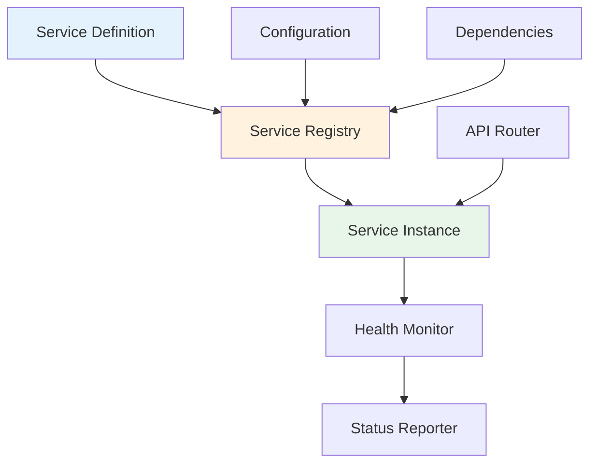
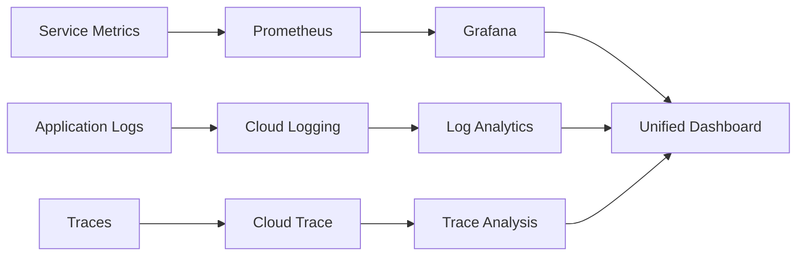
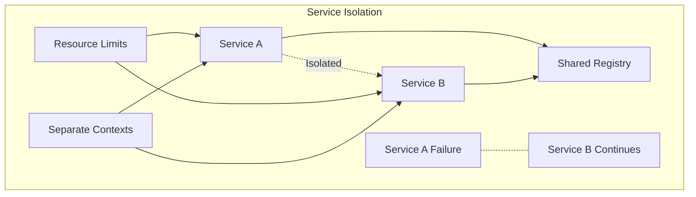
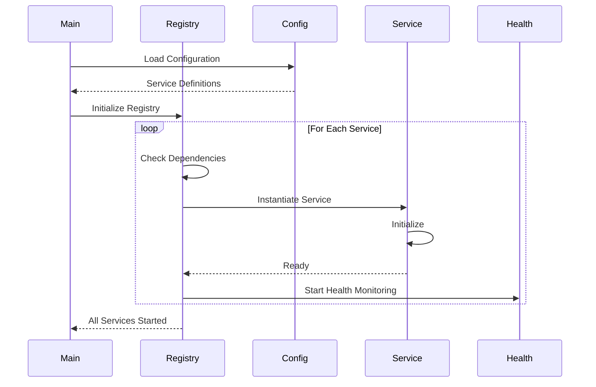

# ADK Security Agent - Service Documentation

## 📚 Table of Contents
1. [Service Overview](#service-overview)
2. [Core Services](#core-services)
3. [Security Services](#security-services)
4. [Monitoring Services](#monitoring-services)
5. [Integration Services](#integration-services)
6. [Service Management API](#service-management-api)
7. [Service Configuration](#service-configuration)
8. [Health Monitoring](#health-monitoring)

## 🎯 Service Overview

The ADK Security Agent implements a modular service architecture with 16 independently manageable services. Each service can be enabled, disabled, and monitored through the Service Management API.

### Service Architecture Principles



### Service States

| State | Description | Transitions |
|-------|-------------|-------------|
| `NOT_CONFIGURED` | Initial state, service defined but not started | → `STARTING` |
| `STARTING` | Service initialization in progress | → `RUNNING` or `ERROR` |
| `RUNNING` | Service operational and healthy | → `STOPPING` or `ERROR` |
| `STOPPING` | Service shutdown in progress | → `DISABLED` |
| `DISABLED` | Service explicitly disabled | → `STARTING` |
| `ERROR` | Service encountered an error | → `STARTING` (retry) |

## 🔧 Core Services

### 1. GCP Service
**Status:** Required (Cannot be disabled)  
**Module:** `gcp.service.GCPService`  
**API Prefix:** `/api/v1/gcp`

```python
class GCPService(BaseService):
    """
    Core Google Cloud Platform integration service.
    
    Provides foundational GCP API access for project management,
    service discovery, and resource enumeration.
    """
```

#### Key Features:
- Project listing and management
- Service usage discovery
- Resource metadata access
- Authentication management

#### API Endpoints:

```yaml
GET /api/v1/gcp/projects:
  description: List all accessible GCP projects
  response:
    - project_id: string
      name: string
      state: string
      create_time: string

GET /api/v1/gcp/project/{project_id}/info:
  description: Get detailed project information
  parameters:
    - project_id: Project identifier
  response:
    project_id: string
    display_name: string
    state: string
    labels: object
    parent: object

GET /api/v1/gcp/project/{project_id}/services:
  description: List enabled services for a project
  parameters:
    - project_id: Project identifier
  response:
    services: array[string]
    total_count: integer
```

### 2. Security Service
**Status:** Required  
**Module:** `security.service.SecurityService`  
**API Prefix:** `/api/v1/security`

```python
class SecurityService(BaseService):
    """
    Core security evaluation and risk assessment service.
    
    Provides comprehensive security scanning, risk scoring,
    and vulnerability identification across GCP resources.
    """
```

#### Key Features:
- Security posture evaluation
- Risk score calculation
- Vulnerability scanning
- Security recommendations

#### API Endpoints:

```yaml
POST /api/v1/security/evaluate:
  description: Run comprehensive security evaluation
  request:
    project_id: string
    scan_types: array[string]  # ["iam", "network", "storage", "compute"]
  response:
    overall_score: number (0-100)
    risk_level: string  # "low", "medium", "high", "critical"
    findings: array[Finding]
    recommendations: array[Recommendation]

GET /api/v1/security/score:
  description: Get current security score
  parameters:
    - project_id: string
  response:
    score: number
    last_evaluated: datetime
    trend: string  # "improving", "stable", "declining"
```

### 3. Agent Service
**Status:** Required  
**Module:** `services.agent_service.AgentService`  
**API Prefix:** `/api/v1/agent`

```python
class AgentService(BaseService):
    """
    AI-powered security agent service using ADK.
    
    Provides interactive chat interface for security guidance,
    analysis, and recommendations using advanced language models.
    """
```

#### Key Features:
- Natural language security queries
- Context-aware recommendations
- Interactive troubleshooting
- ADK integration

#### API Endpoints:

```yaml
POST /api/v1/agent/chat:
  description: Send message to AI agent
  request:
    message: string
    context: object  # Optional context
    session_id: string
  response:
    response: string
    suggestions: array[string]
    actions: array[AgentAction]

GET /api/v1/agent/sessions:
  description: List chat sessions
  response:
    sessions: array[Session]
    total: integer
```

## 🛡️ Security Services

### 4. IAM Analysis Service
**Module:** `iam.service.IAMPolicyAnalyzer`  
**API Prefix:** `/api/v1/iam`

```python
class IAMPolicyAnalyzer(BaseService):
    """
    Identity and Access Management policy analysis service.
    
    Analyzes IAM policies, identifies overprivileged accounts,
    and provides permission testing scenarios.
    """
```

#### Key Features:
- Permission analysis
- Overprivileged user detection
- Policy simulation
- Role recommendations

#### API Endpoints:

```yaml
GET /api/v1/iam/project/{project_id}/analyze-user/{user_email}:
  description: Analyze user permissions
  response:
    user: string
    roles: array[Role]
    effective_permissions: array[string]
    risk_score: number
    recommendations: array[string]

GET /api/v1/iam/testing/scenarios:
  description: Get IAM testing scenarios
  response:
    scenarios: array[TestScenario]
    categories: array[string]

POST /api/v1/iam/testing/run-scenario/{scenario_id}:
  description: Execute IAM test scenario
  request:
    project_id: string
    parameters: object
  response:
    result: string  # "pass", "fail", "warning"
    details: object
    remediation: array[string]
```

### 5. Compliance Service
**Module:** `compliance.service.ComplianceService`  
**API Prefix:** `/api/v1/compliance`

```python
class ComplianceService(BaseService):
    """
    Multi-framework compliance evaluation service.
    
    Evaluates GCP resources against SOC2, ISO27001, GDPR,
    and other compliance frameworks.
    """
```

#### Key Features:
- Multi-framework support
- Automated compliance checks
- Gap analysis
- Remediation guidance

#### API Endpoints:

```yaml
GET /api/v1/compliance/frameworks:
  description: List supported compliance frameworks
  response:
    frameworks: array[Framework]

POST /api/v1/compliance/evaluate:
  description: Run compliance evaluation
  request:
    project_id: string
    frameworks: array[string]
  response:
    results: object
    compliance_score: number
    gaps: array[ComplianceGap]
    recommendations: array[Remediation]
```

### 6. Threat Intelligence Service
**Module:** `services.threat_intelligence_service.ThreatIntelligenceService`  
**API Prefix:** `/api/v1/threat-intelligence`

```python
class ThreatIntelligenceService(BaseService):
    """
    Threat intelligence and vulnerability analysis service.
    
    Monitors security threats, analyzes vulnerabilities,
    and provides threat intelligence feeds.
    """
```

#### Key Features:
- Vulnerability scanning
- Threat feed integration
- CVE monitoring
- Attack pattern detection

### 7. Incident Response Service
**Module:** `services.incident_response_service.IncidentResponseService`  
**API Prefix:** `/api/v1/incidents`

```python
class IncidentResponseService(BaseService):
    """
    Security incident management and response service.
    
    Manages security incidents, automates response workflows,
    and tracks remediation progress.
    """
```

#### Key Features:
- Incident tracking
- Automated response workflows
- Playbook execution
- Post-incident analysis

## 📊 Monitoring Services

### 8. Cloud Logging Service
**Module:** `cloud_logging.service.CloudLoggingService`  
**API Prefix:** `/api/v1/cloud-logging`

```python
class CloudLoggingService(BaseService):
    """
    Google Cloud Logging integration service.
    
    Provides log aggregation, analysis, and security
    event correlation from Cloud Logging.
    """
```

#### Key Features:
- Log aggregation
- Security event detection
- Log analytics
- Alert configuration

#### API Endpoints:

```yaml
GET /api/v1/cloud-logging/events:
  description: Query security events
  parameters:
    - project_id: string
    - severity: string
    - time_range: string
  response:
    events: array[LogEvent]
    total: integer
    next_page_token: string
```

### 9. OpenTelemetry Tracing Service
**Module:** `tracing.service.TracingService`  
**API Prefix:** `/api/v1/tracing`

```python
class TracingService(BaseService):
    """
    Distributed tracing service with Cloud Trace integration.
    
    Provides application performance monitoring and
    distributed trace analysis.
    """
```

#### Key Features:
- Distributed tracing
- Performance metrics
- Latency analysis
- Service dependency mapping

### 10. Monitoring Service
**Module:** `monitoring.service.MonitoringService`  
**API Prefix:** `/api/v1/monitoring`

```python
class MonitoringService(BaseService):
    """
    System performance monitoring and metrics service.
    
    Collects and analyzes system metrics, performance data,
    and resource utilization.
    """
```

## 🔌 Integration Services

### 11. API Hub Service
**Module:** `apihub.service.APIHubService`  
**API Prefix:** `/api/v1/apihub`

```python
class APIHubService(BaseService):
    """
    Google API Hub integration service.
    
    Discovers, catalogs, and manages APIs across
    the organization.
    """
```

#### Key Features:
- API discovery
- API catalog management
- Usage analytics
- Governance policies

### 12. Security Knowledge Base Service
**Module:** `security_knowledge.service.SecurityKnowledgeService`  
**API Prefix:** `/api/v1/security-knowledge`

```python
class SecurityKnowledgeService(BaseService):
    """
    Vertex AI Search integration for security knowledge.
    
    Provides intelligent search and retrieval of security
    best practices, documentation, and guidance.
    """
```

### 13. Security Analytics Service
**Module:** `security_analytics.service.SecurityAnalyticsService`  
**API Prefix:** `/api/v1/security-analytics`

```python
class SecurityAnalyticsService(BaseService):
    """
    BigQuery-based security analytics service.
    
    Performs advanced security analytics using BigQuery
    for large-scale data analysis.
    """
```

### 14. Documentation Service
**Module:** `documentation.service.DocumentationService`  
**API Prefix:** `/api/v1/documentation`

```python
class DocumentationService(BaseService):
    """
    API documentation analysis and generation service.
    
    Scrapes, analyzes, and generates documentation
    for APIs and services.
    """
```

### 15. MSA Analysis Service
**Module:** `msa.service.MSAParsingService`  
**API Prefix:** `/api/v1/msa`

```python
class MSAParsingService(BaseService):
    """
    Microsoft Service Agreement parsing service.
    
    Analyzes service agreements and extracts
    security-relevant information.
    """
```

### 16. Recommendations Service
**Module:** `recommendations.service.RecommendationsService`  
**API Prefix:** `/api/v1/recommendations`

```python
class RecommendationsService(BaseService):
    """
    AI-powered security recommendations service.
    
    Generates intelligent security recommendations
    based on findings and best practices.
    """
```

## 🔧 Service Management API

### Service Control Endpoints

```yaml
GET /api/v1/services/status/summary:
  description: Get summary of all services
  response:
    services: object
    total_enabled: integer
    total_running: integer
    health_summary: object

GET /api/v1/services/{service_name}/status:
  description: Get detailed service status
  response:
    service_name: string
    status: string
    health: object
    last_health_check: datetime
    dependencies: array[string]

POST /api/v1/services/{service_name}/enable:
  description: Enable a service
  response:
    success: boolean
    message: string
    new_status: string

POST /api/v1/services/{service_name}/disable:
  description: Disable a service
  response:
    success: boolean
    message: string
    new_status: string

POST /api/v1/services/{service_name}/restart:
  description: Restart a service
  response:
    success: boolean
    message: string
    downtime_ms: integer

GET /api/v1/services/{service_name}/health:
  description: Get service health details
  response:
    healthy: boolean
    checks: object
    metrics: object
```

## ⚙️ Service Configuration

### Configuration Structure

```json
{
  "services": {
    "security": {
      "enabled_by_default": true,
      "required": true,
      "config": {
        "scan_depth": "comprehensive",
        "risk_threshold": "medium",
        "cache_ttl": 300
      },
      "health_check": {
        "interval_seconds": 30,
        "timeout_seconds": 5,
        "failure_threshold": 3
      }
    },
    "iam": {
      "enabled_by_default": true,
      "dependencies": [
        {
          "service_name": "gcp",
          "required": true
        }
      ],
      "config": {
        "max_users_per_scan": 100,
        "include_service_accounts": true,
        "permission_cache_ttl": 600
      }
    }
  }
}
```

### Environment Variables

```bash
# Service Configuration
SERVICE_CONFIG_PATH=backend/config/services.json
SERVICE_HEALTH_CHECK_INTERVAL=30
SERVICE_STARTUP_TIMEOUT=60

# Individual Service Settings
IAM_SERVICE_CACHE_TTL=300
SECURITY_SERVICE_SCAN_DEPTH=comprehensive
LOGGING_SERVICE_RETENTION_DAYS=30
```

## 🏥 Health Monitoring

### Health Check Response Format

```json
{
  "healthy": true,
  "service": "iam",
  "timestamp": "2025-01-08T10:30:00Z",
  "checks": {
    "api_connectivity": {
      "status": "pass",
      "latency_ms": 45
    },
    "authentication": {
      "status": "pass",
      "details": "Service account valid"
    },
    "dependencies": {
      "status": "pass",
      "details": {
        "gcp": "running"
      }
    }
  },
  "metrics": {
    "requests_per_minute": 145,
    "error_rate": 0.02,
    "average_latency_ms": 120
  }
}
```

### Health Check Implementation

```python
async def health_check(self) -> Dict[str, Any]:
    """
    Perform comprehensive health check.
    
    Returns:
        Health status including connectivity, auth, and performance metrics
    """
    health_status = {
        "healthy": True,
        "service": self.service_name,
        "timestamp": datetime.utcnow().isoformat(),
        "checks": {},
        "metrics": {}
    }
    
    # Check API connectivity
    api_check = await self._check_api_connectivity()
    health_status["checks"]["api_connectivity"] = api_check
    
    # Check authentication
    auth_check = await self._check_authentication()
    health_status["checks"]["authentication"] = auth_check
    
    # Check dependencies
    dep_check = await self._check_dependencies()
    health_status["checks"]["dependencies"] = dep_check
    
    # Collect metrics
    health_status["metrics"] = await self._collect_metrics()
    
    # Determine overall health
    health_status["healthy"] = all(
        check.get("status") == "pass" 
        for check in health_status["checks"].values()
    )
    
    return health_status
```

## 📊 Service Metrics

### Key Performance Indicators

| Metric | Description | Target |
|--------|-------------|--------|
| Uptime | Service availability percentage | > 99.9% |
| Response Time | Average API response latency | < 200ms |
| Error Rate | Percentage of failed requests | < 1% |
| Throughput | Requests processed per second | > 100 RPS |

### Monitoring Dashboard



## 🔒 Service Security

### Authentication Requirements

| Service | Auth Type | Required Permissions |
|---------|-----------|---------------------|
| GCP Service | Service Account | `resourcemanager.projects.get` |
| IAM Analysis | Service Account | `iam.roles.list`, `iam.policies.get` |
| Security Center | Service Account | `securitycenter.findings.list` |
| Cloud Logging | Service Account | `logging.logEntries.list` |
| API Hub | Service Account | `apihub.apis.list` |

### Service Isolation



## 🚀 Service Deployment

### Service Startup Sequence



### Service Scaling

```yaml
# Horizontal Pod Autoscaler Configuration
apiVersion: autoscaling/v2
kind: HorizontalPodAutoscaler
metadata:
  name: security-agent-hpa
spec:
  scaleTargetRef:
    apiVersion: apps/v1
    kind: Deployment
    name: security-agent
  minReplicas: 3
  maxReplicas: 20
  metrics:
  - type: Resource
    resource:
      name: cpu
      target:
        type: Utilization
        averageUtilization: 70
  - type: Resource
    resource:
      name: memory
      target:
        type: Utilization
        averageUtilization: 80
  behavior:
    scaleDown:
      stabilizationWindowSeconds: 300
      policies:
      - type: Percent
        value: 10
        periodSeconds: 60
    scaleUp:
      stabilizationWindowSeconds: 60
      policies:
      - type: Percent
        value: 50
        periodSeconds: 60
```

---

**Last Updated:** January 2025  
**Version:** 4.0.0  
**Service Count:** 16