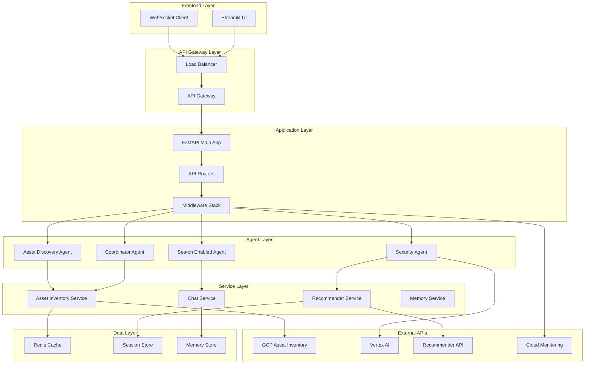
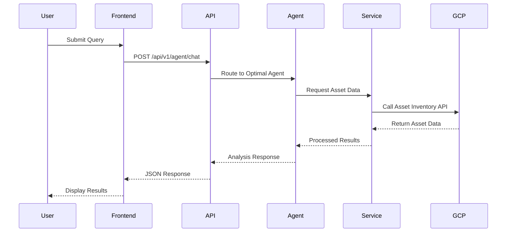
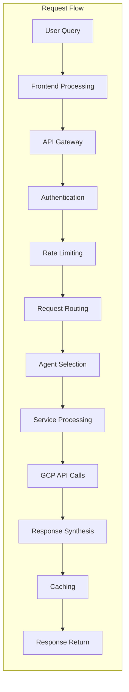
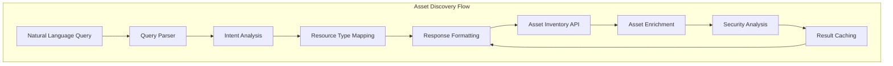
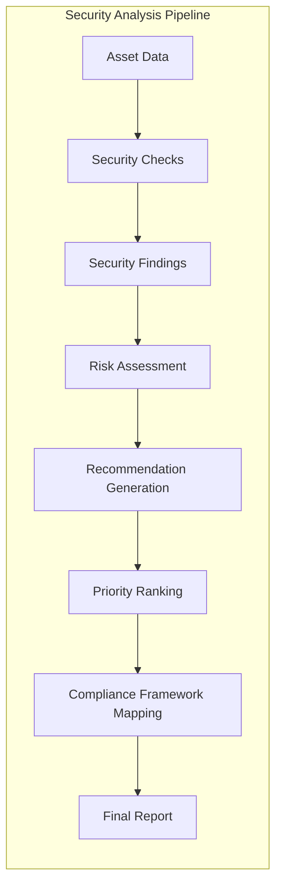
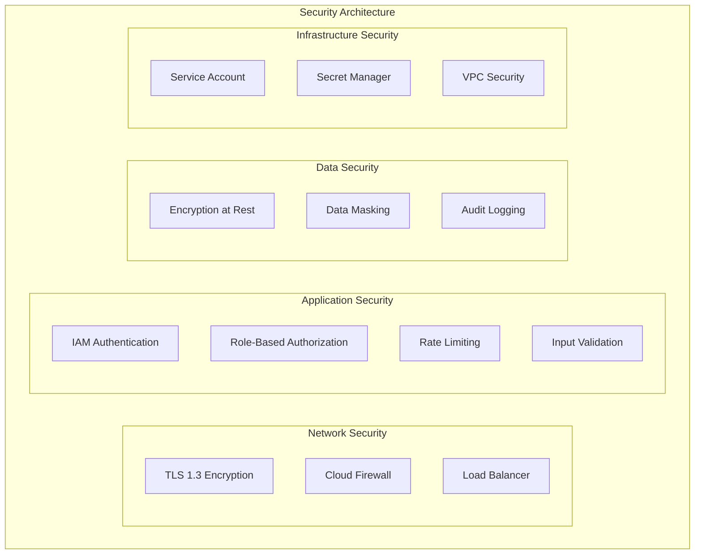

# GCP Security Agent - Architecture Documentation

## 1. System Architecture Overview

### 1.1 Architectural Principles
The GCP Security Agent follows modern cloud-native architectural patterns:

- **Microservices Architecture**: Modular, loosely-coupled components
- **API-First Design**: REST and WebSocket APIs for all interactions
- **Event-Driven Communication**: Asynchronous processing for better performance
- **Scalable and Stateless**: Horizontal scaling with minimal state dependency
- **Security by Design**: Zero-trust security model with comprehensive monitoring

### 1.2 High-Level Architecture Diagram



### 1.3 Component Interaction Flow



## 2. Component Architecture

### 2.1 Frontend Architecture

#### 2.1.1 Streamlit Application Structure
```
frontend/
├── main_app.py              # Main application entry point
├── components/
│   ├── chat/
│   │   ├── chat_view.py     # Chat interface component
│   │   └── chat_commands.py # Command processing
│   ├── dashboard/
│   │   ├── dashboard_view.py      # Main dashboard
│   │   ├── security_posture_widget.py
│   │   └── asset_charts.py
│   └── shared/
│       ├── api_explorer_view.py
│       └── recommendations_view.py
├── api/
│   └── asset_inventory_client.py  # API client
└── config.py                # Configuration management
```

#### 2.1.2 Frontend Technology Stack
- **Framework**: Streamlit 1.28+
- **HTTP Client**: requests library with connection pooling
- **WebSocket**: streamlit-ws-localstorage for real-time communication
- **State Management**: Streamlit session state
- **Visualization**: Plotly, Altair for charts and graphs

#### 2.1.3 Frontend-Backend Communication Pattern
```python
# Thin Client Architecture Pattern
class SecurityAgentClient:
    def __init__(self, base_url: str, project_id: str):
        self.base_url = base_url
        self.project_id = project_id
        self.session = requests.Session()
    
    async def chat(self, query: str, session_id: str) -> ChatResponse:
        """Send chat query to backend with session management"""
        response = await self.session.post(
            f"{self.base_url}/api/v1/agent/chat",
            json={
                "query": query,
                "session_id": session_id,
                "project_id": self.project_id
            }
        )
        return ChatResponse.parse_obj(response.json())
```

### 2.2 Backend API Architecture

#### 2.2.1 FastAPI Application Structure
```
backend/
├── main.py                   # Application entry point
├── api/                      # API routers
│   ├── agent_llm.py         # Chat and agent endpoints
│   ├── asset_inventory.py   # Asset discovery endpoints
│   ├── recommendations.py   # Recommendation endpoints
│   ├── sessions.py          # Session management
│   ├── security.py          # Security analysis
│   ├── monitoring.py        # Performance monitoring
│   └── ...
├── services/                 # Business logic services
│   ├── enhanced_asset_inventory_service.py
│   ├── chat_recommendation_service.py
│   ├── conversation_memory.py
│   └── ...
├── models/                   # Data models
│   ├── api_models.py
│   ├── recommender_models.py
│   └── search_models.py
└── config/
    └── timeout_config.py
```

#### 2.2.2 API Router Architecture Pattern
```python
# Modular Router Pattern with Dependency Injection
from fastapi import APIRouter, Depends
from typing import Optional

router = APIRouter(prefix="/api/v1/asset-inventory", tags=["assets"])

@router.post("/discover")
async def discover_resources(
    request: AssetDiscoveryRequest,
    service: AssetInventoryService = Depends(get_asset_service)
) -> AssetInventoryResponse:
    """Discover resources using natural language queries"""
    result = await service.process_natural_language_query(request.query)
    return AssetInventoryResponse(success=True, data=result)

def get_asset_service(project_id: Optional[str] = None) -> AssetInventoryService:
    """Dependency injection for asset inventory service"""
    return AssetInventoryService(project_id or get_default_project())
```

#### 2.2.3 Middleware Stack Architecture
```python
# Middleware Stack for Cross-Cutting Concerns
from fastapi import FastAPI
from fastapi.middleware.cors import CORSMiddleware
from fastapi.middleware.gzip import GZipMiddleware

app = FastAPI()

# Security Middleware
app.add_middleware(SecurityHeadersMiddleware)

# Performance Middleware
app.add_middleware(GZipMiddleware, minimum_size=1000)
app.add_middleware(CacheMiddleware, cache_ttl=300)

# Monitoring Middleware
app.add_middleware(PrometheusMiddleware)
app.add_middleware(RequestLoggingMiddleware)

# CORS Middleware (last)
app.add_middleware(
    CORSMiddleware,
    allow_origins=["*"],
    allow_credentials=True,
    allow_methods=["*"],
    allow_headers=["*"]
)
```

### 2.3 Agent Architecture

#### 2.3.1 ADK Agent Framework Integration
```python
# Google ADK Agent Pattern
from google.adk import Agent
from google.genai import types

class SecurityAgentFactory:
    @staticmethod
    def create_security_agent() -> Agent:
        """Factory method for creating security agents with tools"""
        return Agent(
            model='gemini-2.5-flash',
            name='security_agent',
            description='Comprehensive security evaluation agent',
            instruction=SecurityAgentInstructions.get_instructions(),
            tools=SecurityAgentTools.get_all_tools(),
            generate_content_config=SecurityConfig.get_safety_settings()
        )

class SecurityAgentTools:
    @staticmethod
    def get_all_tools():
        """Aggregate all security analysis tools"""
        return [
            # Asset Inventory Tools
            asset_inventory_tools.discover_gcp_resources,
            asset_inventory_tools.get_compute_instances,
            asset_inventory_tools.get_storage_buckets,
            
            # Security Analysis Tools
            security_tools.evaluate_api_security,
            security_tools.analyze_iam_policies,
            
            # Recommendation Tools
            recommendation_tools.generate_security_recommendations
        ]
```

#### 2.3.2 Agent Coordination Pattern
```python
# Multi-Agent Coordination Architecture
class CoordinatorAgent:
    def __init__(self):
        self.agent_registry = {
            'security': SecurityAgent(),
            'asset_discovery': AssetDiscoveryAgent(),
            'search': SearchEnabledAgent()
        }
        self.routing_engine = AgentRoutingEngine()
    
    async def coordinate_query(self, query: str, context: dict) -> AgentResponse:
        """Coordinate multi-agent query processing"""
        # 1. Analyze query complexity
        complexity = self.analyze_query_complexity(query)
        
        if complexity == "SIMPLE":
            # Single agent routing
            agent_type = self.routing_engine.select_optimal_agent(query, context)
            agent = self.agent_registry[agent_type]
            return await agent.process_query(query, context)
        else:
            # Multi-agent coordination
            return await self.orchestrate_multi_agent_workflow(query, context)
```

### 2.4 Service Layer Architecture

#### 2.4.1 Enhanced Asset Inventory Service
```python
# Service Layer Pattern with Async Processing
class EnhancedGCPAssetInventoryService:
    def __init__(self, project_id: str):
        self.project_id = project_id
        self.asset_client = asset.AssetServiceAsyncClient()
        self.cache = CacheManager()
        self.asset_type_mappings = AssetTypeMappings()
    
    async def process_natural_language_query(self, query: str) -> dict:
        """Process natural language queries with intelligent routing"""
        # 1. Parse query intent
        intent = self.parse_query_intent(query)
        
        # 2. Route to appropriate method
        if intent.resource_type:
            return await self.get_resources_by_type(intent.resource_type)
        elif intent.security_focus:
            return await self.get_security_assets()
        else:
            return await self.get_comprehensive_overview()
    
    async def get_resources_by_type(self, resource_type: str) -> dict:
        """Get resources filtered by type with caching"""
        cache_key = f"resources:{self.project_id}:{resource_type}"
        
        # Check cache first
        cached_result = await self.cache.get(cache_key)
        if cached_result:
            return cached_result
        
        # Call GCP API
        result = await self._fetch_assets_from_gcp(resource_type)
        
        # Cache result
        await self.cache.set(cache_key, result, ttl=300)
        
        return result
```

#### 2.4.2 Recommendation Service Architecture
```python
# Recommendation Engine with ML Integration
class RecommendationService:
    def __init__(self):
        self.recommender_client = recommender.RecommenderAsyncClient()
        self.ml_models = MLModelRegistry()
        self.priority_engine = RecommendationPriorityEngine()
    
    async def generate_recommendations(
        self, 
        assets: List[Asset], 
        context: SecurityContext
    ) -> List[Recommendation]:
        """Generate prioritized security recommendations"""
        
        # 1. Get GCP Recommender API recommendations
        gcp_recommendations = await self._get_gcp_recommendations()
        
        # 2. Generate ML-based recommendations
        ml_recommendations = await self._generate_ml_recommendations(assets)
        
        # 3. Combine and prioritize
        all_recommendations = gcp_recommendations + ml_recommendations
        prioritized = self.priority_engine.prioritize(all_recommendations, context)
        
        return prioritized
```

## 3. Data Flow Architecture

### 3.1 Request Processing Flow



### 3.2 Asset Discovery Data Flow



### 3.3 Security Analysis Pipeline



## 4. Database and Storage Architecture

### 4.1 Storage Strategy

#### 4.1.1 Data Storage Layers
```yaml
storage_architecture:
  cache_layer:
    technology: Redis
    purpose: "Fast access to frequently requested data"
    ttl_strategy: "Graduated TTL based on data type"
    
  session_storage:
    technology: "In-memory + Redis backup"
    purpose: "User session and conversation state"
    persistence: "Cross-request state management"
    
  configuration_storage:
    technology: "Environment variables + Secret Manager"
    purpose: "Application configuration and secrets"
    security: "Encrypted at rest"
    
  log_storage:
    technology: "Cloud Logging + BigQuery"
    purpose: "Application logs and analytics"
    retention: "30 days operational, 1 year analytics"
```

#### 4.1.2 Cache Architecture Strategy
```python
# Multi-Level Caching Strategy
class CacheManager:
    def __init__(self):
        self.l1_cache = InMemoryCache(max_size=1000)  # Fast local cache
        self.l2_cache = RedisCache(url=redis_url)     # Distributed cache
        self.l3_cache = DatabaseCache(db=database)    # Persistent cache
    
    async def get(self, key: str) -> Optional[Any]:
        """Multi-level cache retrieval with fallback"""
        # L1: In-memory cache
        value = self.l1_cache.get(key)
        if value:
            return value
        
        # L2: Redis cache
        value = await self.l2_cache.get(key)
        if value:
            self.l1_cache.set(key, value, ttl=60)  # Populate L1
            return value
        
        # L3: Database cache
        value = await self.l3_cache.get(key)
        if value:
            await self.l2_cache.set(key, value, ttl=300)  # Populate L2
            self.l1_cache.set(key, value, ttl=60)         # Populate L1
            return value
        
        return None
```

### 4.2 Session Management Architecture

```python
# Session Management with Persistence
class SessionManager:
    def __init__(self):
        self.memory_store = InMemorySessionStore()
        self.persistent_store = RedisSessionStore()
        self.conversation_memory = ConversationMemoryService()
    
    async def create_session(self, user_id: str, project_id: str) -> str:
        """Create new session with distributed storage"""
        session_id = self.generate_session_id()
        
        session_data = {
            "session_id": session_id,
            "user_id": user_id,
            "project_id": project_id,
            "created_at": datetime.utcnow(),
            "status": "active",
            "context": {}
        }
        
        # Store in both memory and persistent storage
        await self.memory_store.create(session_id, session_data)
        await self.persistent_store.create(session_id, session_data, ttl=3600)
        
        # Initialize conversation memory
        await self.conversation_memory.create_session(session_id, user_id)
        
        return session_id
```

## 5. Security Architecture

### 5.1 Security Layers



### 5.2 Authentication and Authorization Flow

```python
# Security Architecture Implementation
class SecurityMiddleware:
    async def __call__(self, request: Request, call_next):
        """Security middleware with comprehensive checks"""
        
        # 1. Rate limiting check
        if not await self.rate_limiter.check_rate_limit(request):
            raise HTTPException(429, "Rate limit exceeded")
        
        # 2. Authentication
        user = await self.authenticate_request(request)
        if not user:
            raise HTTPException(401, "Authentication required")
        
        # 3. Authorization
        if not await self.authorize_request(request, user):
            raise HTTPException(403, "Insufficient permissions")
        
        # 4. Input validation
        await self.validate_request(request)
        
        # 5. Process request
        response = await call_next(request)
        
        # 6. Audit logging
        await self.audit_request(request, response, user)
        
        return response

class GCPAuthenticator:
    def __init__(self):
        self.credentials = service_account.Credentials.from_service_account_file(
            SERVICE_ACCOUNT_FILE,
            scopes=REQUIRED_SCOPES
        )
    
    async def authenticate_request(self, request: Request) -> Optional[User]:
        """Authenticate using Google Cloud IAM"""
        auth_header = request.headers.get("Authorization")
        if not auth_header:
            return None
        
        try:
            # Verify token with Google
            token = auth_header.replace("Bearer ", "")
            user_info = await self.verify_token(token)
            return User.from_token_info(user_info)
        except Exception as e:
            logger.warning(f"Authentication failed: {e}")
            return None
```

## 6. Performance Architecture

### 6.1 Performance Optimization Strategy

```yaml
performance_architecture:
  response_time_targets:
    asset_queries: "< 2 seconds"
    security_analysis: "< 5 seconds"
    chat_responses: "< 3 seconds"
    api_endpoints: "< 1 second"
  
  scalability_patterns:
    horizontal_scaling: "Auto-scaling based on CPU/memory"
    caching_strategy: "Multi-level caching with TTL"
    async_processing: "Non-blocking I/O operations"
    connection_pooling: "Persistent connections to GCP APIs"
  
  optimization_techniques:
    - "Response compression (gzip)"
    - "HTTP/2 multiplexing"
    - "Query result caching"
    - "Batch API requests"
    - "Lazy loading of components"
```

### 6.2 Async Processing Architecture

```python
# Async Processing with Background Tasks
from fastapi import BackgroundTasks
import asyncio

class AsyncProcessingManager:
    def __init__(self):
        self.task_queue = asyncio.Queue()
        self.worker_pool = WorkerPool(size=10)
        self.result_store = ResultStore()
    
    async def process_large_query(self, query: str, session_id: str) -> str:
        """Process large queries asynchronously"""
        task_id = self.generate_task_id()
        
        # Submit task to background processing
        await self.task_queue.put({
            "task_id": task_id,
            "query": query,
            "session_id": session_id,
            "submitted_at": datetime.utcnow()
        })
        
        # Return task ID for status tracking
        return task_id
    
    async def get_task_result(self, task_id: str) -> Optional[dict]:
        """Get result of async task"""
        return await self.result_store.get(task_id)

@app.post("/api/v1/agent/chat-async")
async def chat_async(
    request: ChatRequest,
    background_tasks: BackgroundTasks
):
    """Async chat endpoint for complex queries"""
    if request.complexity == "HIGH":
        task_id = await async_manager.process_large_query(
            request.query, 
            request.session_id
        )
        return {"task_id": task_id, "status": "processing"}
    else:
        # Process synchronously for simple queries
        result = await chat_service.process_query(request)
        return {"result": result, "status": "completed"}
```

## 7. Monitoring and Observability Architecture

### 7.1 Monitoring Stack

```yaml
monitoring_architecture:
  metrics:
    application_metrics:
      - "Request rate and response time"
      - "Error rate and success rate"
      - "Agent routing decisions"
      - "Cache hit/miss ratios"
    
    business_metrics:
      - "Asset discovery count"
      - "Security findings detected"
      - "Recommendations generated"
      - "User engagement metrics"
    
    infrastructure_metrics:
      - "CPU and memory utilization"
      - "Network latency"
      - "Database performance"
      - "External API response times"
  
  logging:
    structured_logging: "JSON format with correlation IDs"
    log_levels: "ERROR, WARN, INFO, DEBUG"
    retention: "30 days operational, 90 days compliance"
    
  tracing:
    distributed_tracing: "OpenTelemetry with Cloud Trace"
    trace_sampling: "10% for production, 100% for development"
```

### 7.2 Health Check Architecture

```python
# Comprehensive Health Check System
class HealthCheckManager:
    def __init__(self):
        self.checks = [
            DatabaseHealthCheck(),
            GCPAPIHealthCheck(),
            CacheHealthCheck(),
            AgentHealthCheck()
        ]
    
    async def perform_health_check(self) -> HealthCheckResult:
        """Perform comprehensive health check"""
        results = {}
        overall_status = "healthy"
        
        for check in self.checks:
            try:
                result = await check.check()
                results[check.name] = result
                
                if result.status != "healthy":
                    overall_status = "degraded"
            except Exception as e:
                results[check.name] = {"status": "unhealthy", "error": str(e)}
                overall_status = "unhealthy"
        
        return HealthCheckResult(
            status=overall_status,
            checks=results,
            timestamp=datetime.utcnow()
        )

class GCPAPIHealthCheck:
    async def check(self) -> dict:
        """Check GCP API connectivity"""
        try:
            # Test Asset Inventory API
            client = asset.AssetServiceAsyncClient()
            request = asset.ListAssetsRequest(
                parent=f"projects/{PROJECT_ID}",
                page_size=1
            )
            response = await client.list_assets(request=request, timeout=5.0)
            
            return {
                "status": "healthy",
                "response_time_ms": response.response_time,
                "last_check": datetime.utcnow().isoformat()
            }
        except Exception as e:
            return {
                "status": "unhealthy",
                "error": str(e),
                "last_check": datetime.utcnow().isoformat()
            }
```

## 8. Deployment Architecture

### 8.1 Cloud Run Deployment Architecture

```yaml
deployment_architecture:
  platform: "Google Cloud Run"
  scaling:
    min_instances: 1
    max_instances: 10
    cpu_threshold: 70%
    memory_threshold: 80%
    concurrency: 100
  
  networking:
    vpc_connector: "security-agent-connector"
    egress: "private-ranges-only"
    ingress: "all"
  
  security:
    service_account: "gcp-security-agent-sa"
    iam_roles:
      - "roles/cloudasset.viewer"
      - "roles/compute.viewer"
      - "roles/storage.objectViewer"
    
  monitoring:
    cloud_monitoring: "enabled"
    cloud_logging: "enabled"
    error_reporting: "enabled"
    cloud_trace: "enabled"
```

### 8.2 Container Architecture

```dockerfile
# Multi-stage container build for optimal security and performance
FROM python:3.11-slim as builder

# Install build dependencies
RUN apt-get update && apt-get install -y \
    gcc g++ \
    && rm -rf /var/lib/apt/lists/*

# Create virtual environment
RUN python -m venv /opt/venv
ENV PATH="/opt/venv/bin:$PATH"

# Install Python dependencies
COPY requirements.txt .
RUN pip install --no-cache-dir -r requirements.txt

# Production stage
FROM python:3.11-slim

# Install runtime dependencies
RUN apt-get update && apt-get install -y \
    curl \
    && rm -rf /var/lib/apt/lists/*

# Copy virtual environment
COPY --from=builder /opt/venv /opt/venv
ENV PATH="/opt/venv/bin:$PATH"

# Create non-root user
RUN useradd --create-home --shell /bin/bash app
USER app
WORKDIR /home/app

# Copy application
COPY --chown=app:app . .

# Set environment
ENV PYTHONPATH=/home/app
ENV PORT=8080

# Health check
HEALTHCHECK --interval=30s --timeout=10s --start-period=5s --retries=3 \
  CMD curl -f http://localhost:$PORT/health || exit 1

# Start application
CMD ["python", "-m", "uvicorn", "backend.main:app", "--host", "0.0.0.0", "--port", "8080"]
```

This architecture documentation provides a comprehensive view of the GCP Security Agent system's design, covering all major architectural components, patterns, and decisions that enable scalable, secure, and performant operation in both development and production environments.