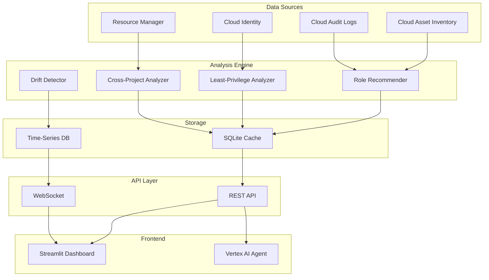

# Product Requirements Document: Advanced IAM Features
## GCP Security Agent - IAM Intelligence Module

**Document Version:** 1.0  
**Date:** December 2024  
**Status:** Draft  
**Author:** Security Agent Team  

---

## 1. Executive Summary

The Advanced IAM Features module enhances the GCP Security Agent with intelligent IAM management capabilities, providing automated recommendations, least-privilege analysis, and cross-project permission insights. This module addresses the critical need for proactive IAM security management in complex GCP environments.

## 2. Problem Statement

### Current Challenges
- **Permission Creep**: Over time, users and service accounts accumulate unnecessary permissions
- **Complexity**: Large organizations struggle to understand effective permissions across projects
- **Manual Review**: IAM audits are time-consuming and error-prone
- **Lack of Visibility**: No clear view of permission inheritance and cross-project access
- **Compliance Risk**: Difficulty maintaining least-privilege principle for regulatory compliance

### Impact
- Security breaches due to overprivileged accounts
- Compliance violations (SOC2, HIPAA, GDPR)
- Increased attack surface
- Operational inefficiency in IAM management

## 3. Solution Overview

An intelligent IAM analysis system that provides:
- Automated role recommendations based on actual usage
- Continuous least-privilege analysis
- Cross-project permission visibility
- IAM drift detection and alerting

## 4. Feature Requirements

### 4.1 Role Recommendation Engine

#### Description
Analyzes actual API usage patterns to recommend optimal IAM roles for users and service accounts.

#### User Stories
- As a Security Admin, I want to see recommended roles based on 30-day usage patterns
- As a DevOps Engineer, I want to right-size my service account permissions
- As a Compliance Officer, I want evidence of least-privilege implementation

#### Functional Requirements
- **FR-1.1**: Analyze Cloud Audit Logs for API usage patterns
- **FR-1.2**: Map API calls to minimum required permissions
- **FR-1.3**: Generate role recommendations (predefined or custom)
- **FR-1.4**: Calculate permission delta (current vs. recommended)
- **FR-1.5**: Provide confidence scores for recommendations
- **FR-1.6**: Support batch analysis for multiple principals

#### Technical Requirements
- Query BigQuery audit logs or Cloud Logging API
- Cache analysis results for performance
- Support incremental analysis updates
- Handle up to 10,000 principals per project

### 4.2 Automated Least-Privilege Analysis

#### Description
Continuously monitors and reports on least-privilege violations and overprivileged accounts.

#### User Stories
- As a Security Admin, I want automated detection of overprivileged accounts
- As an Auditor, I want reports showing least-privilege compliance
- As a Team Lead, I want alerts when team members have excessive permissions

#### Functional Requirements
- **FR-2.1**: Define privilege baselines per role type
- **FR-2.2**: Detect accounts with admin/owner roles
- **FR-2.3**: Identify unused permissions (granted but never used)
- **FR-2.4**: Calculate risk scores for each principal
- **FR-2.5**: Generate least-privilege violation reports
- **FR-2.6**: Provide remediation recommendations

#### Technical Requirements
- Real-time analysis capability
- Historical trend tracking
- Configurable risk thresholds
- Export reports in PDF/CSV formats

### 4.3 Cross-Project Permission Analysis

#### Description
Provides visibility into permissions that span multiple projects, including inherited and delegated access.

#### User Stories
- As an Organization Admin, I want to see all cross-project permissions
- As a Security Analyst, I want to identify external access patterns
- As a Project Owner, I want to know who has access to my resources

#### Functional Requirements
- **FR-3.1**: Map permissions across project boundaries
- **FR-3.2**: Visualize permission inheritance from folders/organization
- **FR-3.3**: Detect service account impersonation chains
- **FR-3.4**: Identify cross-project resource access
- **FR-3.5**: Track delegated permissions (e.g., serviceAccountUser)
- **FR-3.6**: Generate cross-project access matrix

#### Technical Requirements
- Support organization-level analysis
- Handle up to 1000 projects
- Graph-based permission modeling
- Interactive visualization capabilities

### 4.4 IAM Drift Detection

#### Description
Monitors IAM policies for unauthorized changes and configuration drift from baselines.

#### User Stories
- As a Security Admin, I want alerts for unexpected IAM changes
- As a Compliance Officer, I want to track policy deviations
- As an SRE, I want to prevent IAM misconfigurations

#### Functional Requirements
- **FR-4.1**: Define IAM policy baselines
- **FR-4.2**: Monitor real-time IAM changes
- **FR-4.3**: Detect drift from approved configurations
- **FR-4.4**: Alert on high-risk changes (e.g., new admin users)
- **FR-4.5**: Provide rollback recommendations
- **FR-4.6**: Maintain audit trail of all changes

#### Technical Requirements
- Integration with Cloud Asset Inventory
- Webhook/Pub/Sub for real-time events
- Configurable alerting rules
- Policy-as-code support (Terraform/YAML)

## 5. Data Requirements

### Input Data Sources
- **Cloud Asset Inventory**: Current IAM policies and bindings
- **Cloud Audit Logs**: API usage patterns and access history
- **Cloud Identity**: User and group information
- **Resource Manager API**: Project/folder/org hierarchy
- **Service Account API**: Service account metadata and keys
- **Cloud Logging**: Real-time activity logs

### Data Storage
- **SQLite Cache**: Current IAM state and analysis results
- **Time-Series Data**: Historical permission changes
- **Graph Database**: Permission relationships (optional)

### Data Processing
- Batch processing for large-scale analysis
- Stream processing for real-time detection
- Incremental updates for efficiency

## 6. User Interface Requirements

### 6.1 Dashboard Views
- **Executive Summary**: High-level risk metrics and compliance status
- **Role Recommendations**: Sortable list with confidence scores
- **Least-Privilege Report**: Violations with severity ratings
- **Cross-Project Matrix**: Interactive permission visualization
- **Drift Timeline**: Historical view of IAM changes

### 6.2 Interaction Patterns
- Filter by project, user, service account, or time range
- Drill-down from summary to detailed findings
- Bulk actions for applying recommendations
- Export functionality for all reports

### 6.3 Agent Integration
The Vertex AI agent should be able to:
- Answer questions about IAM recommendations
- Explain permission inheritance
- Provide remediation guidance
- Generate custom reports on demand

## 7. Security & Compliance

### Security Requirements
- **SR-1**: No storage of sensitive credentials
- **SR-2**: Audit logging for all analysis activities
- **SR-3**: Encryption of cached analysis data
- **SR-4**: Rate limiting for API calls
- **SR-5**: Service account with minimal required permissions

### Compliance Features
- Pre-built compliance templates (SOC2, HIPAA, PCI-DSS)
- Evidence collection for audits
- Automated compliance scoring
- Policy exception management

## 8. Performance Requirements

### Response Times
- Dashboard load: < 2 seconds
- Role recommendation: < 10 seconds per principal
- Cross-project analysis: < 30 seconds for 100 projects
- Real-time alerts: < 1 minute from change

### Scale
- Support up to 10,000 principals per project
- Handle 1,000 projects per organization
- Process 1 million audit log entries per day
- Maintain 90 days of historical data

## 9. Integration Requirements

### API Endpoints
```
POST /api/v1/iam/recommendations
GET  /api/v1/iam/least-privilege-report
GET  /api/v1/iam/cross-project-matrix
GET  /api/v1/iam/drift-detection
POST /api/v1/iam/analyze-principal/{email}
```

### External Integrations
- **SIEM**: Export findings to Splunk/Datadog
- **Ticketing**: Create Jira/ServiceNow tickets for violations
- **CI/CD**: GitHub Actions for policy validation
- **IaC**: Terraform/Pulumi for remediation

## 10. Success Metrics

### Key Performance Indicators (KPIs)
- **Adoption Rate**: % of projects using recommendations
- **Risk Reduction**: Decrease in overprivileged accounts
- **Compliance Score**: Improvement in least-privilege adherence
- **MTTR**: Time to remediate IAM violations
- **False Positive Rate**: Accuracy of recommendations

### Success Criteria (3 months post-launch)
- 50% reduction in admin/owner role assignments
- 80% of service accounts following least-privilege
- 90% accuracy in role recommendations
- 100% visibility into cross-project permissions

## 11. Implementation Phases

### Phase 1: Foundation (Weeks 1-2)
- [ ] Core data collection from Cloud Asset Inventory
- [ ] Basic least-privilege analysis
- [ ] Simple role recommendations

### Phase 2: Intelligence (Weeks 3-4)
- [ ] Audit log analysis integration
- [ ] Usage-based recommendations
- [ ] Risk scoring algorithm

### Phase 3: Scale (Weeks 5-6)
- [ ] Cross-project analysis
- [ ] IAM drift detection
- [ ] Performance optimization

### Phase 4: Polish (Week 7-8)
- [ ] UI enhancements
- [ ] Export capabilities
- [ ] Documentation and testing

## 12. Technical Architecture



## 13. Risks & Mitigations

| Risk | Impact | Probability | Mitigation |
|------|--------|-------------|------------|
| API Rate Limiting | High | Medium | Implement caching and batch processing |
| Large Data Volume | High | High | Use BigQuery for analysis, cache results |
| False Positives | Medium | Medium | Confidence scoring and manual review |
| Permission to Analyze | High | Low | Document required permissions clearly |
| Performance Issues | Medium | Medium | Incremental processing and optimization |

## 14. Open Questions

1. Should we support custom role creation recommendations?
2. How long should we retain historical IAM data?
3. Should we integrate with Google's Policy Intelligence?
4. Do we need real-time streaming for all features?
5. Should we support break-glass account detection?

## 15. Appendices

### A. Example Role Recommendation Output
```json
{
  "principal": "serviceaccount@project.iam.gserviceaccount.com",
  "current_roles": ["roles/editor"],
  "recommended_roles": ["roles/storage.objectViewer", "roles/logging.viewer"],
  "unused_permissions": 247,
  "confidence_score": 0.92,
  "monthly_cost_savings": "$15.00",
  "risk_reduction": "HIGH"
}
```

### B. Least-Privilege Violation Example
```json
{
  "finding_type": "OVERPRIVILEGED_SERVICE_ACCOUNT",
  "severity": "HIGH",
  "principal": "app-sa@project.iam.gserviceaccount.com",
  "excessive_permissions": [
    "compute.instances.delete",
    "iam.roles.create",
    "resourcemanager.projects.delete"
  ],
  "recommendation": "Replace roles/editor with custom role or specific predefined roles",
  "compliance_impact": ["SOC2", "ISO27001"]
}
```

### C. Glossary
- **Principal**: A user, service account, or group that can be granted IAM roles
- **Binding**: Association between a principal and a role
- **Effective Permissions**: Actual permissions after policy inheritance
- **Drift**: Deviation from approved IAM configuration
- **Least-Privilege**: Minimal permissions required for functionality

---

## Approval

| Role | Name | Date | Signature |
|------|------|------|-----------|
| Product Owner | | | |
| Tech Lead | | | |
| Security Lead | | | |
| Engineering Manager | | | |

---

**Next Steps:**
1. Review and approve PRD
2. Technical design deep dive
3. Sprint planning
4. Implementation kickoff