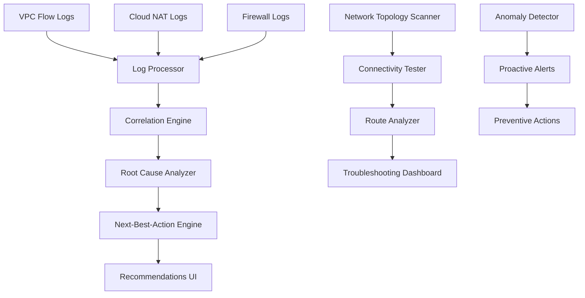
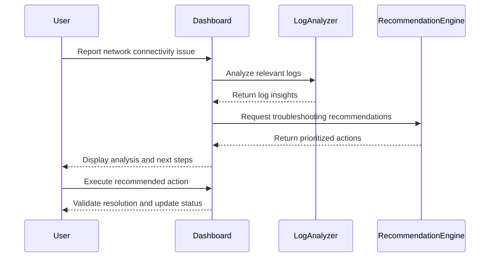
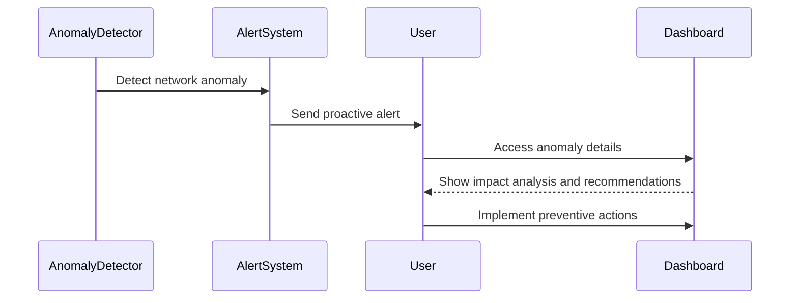

# PRD: Networking Troubleshooting Ninja
## Advanced VPC Log Analysis & Connectivity Intelligence

---

**Document Version**: 1.0  
**Date**: August 27, 2025  
**Status**: Draft  
**Priority**: High  

---

## Executive Summary

The **Networking Troubleshooting Ninja** is an AI-powered network analysis and troubleshooting system that transforms complex GCP networking logs into actionable insights. This feature provides automated root cause analysis, intelligent next-best-action recommendations, and comprehensive VPC connectivity troubleshooting capabilities.

### Key Value Propositions

🔍 **Intelligent Log Analysis** - Automatically parse and correlate VPC Flow Logs, Cloud NAT logs, and firewall logs  
🚀 **Next-Best-Action Engine** - AI-powered recommendations for resolving network issues  
🛠️ **Connectivity Troubleshooting** - Automated diagnosis of routing and connectivity problems  
📊 **Visual Network Topology** - Interactive network maps with real-time health status  
⚡ **Proactive Monitoring** - Detect network anomalies before they impact services  

---

## Business Context & Motivation

### Problem Statement

Network troubleshooting in GCP environments is complex and time-consuming:

- **Log Volume Overload**: VPC Flow Logs generate massive amounts of data that are difficult to analyze manually
- **Complex Root Cause Analysis**: Network issues often involve multiple interconnected components
- **Time-to-Resolution**: Network outages require rapid diagnosis to minimize business impact
- **Knowledge Requirements**: Effective troubleshooting requires deep GCP networking expertise
- **Reactive Approach**: Most teams wait for issues to occur rather than proactively monitoring

### Success Metrics

| Metric | Current State | Target | Timeline |
|--------|--------------|--------|----------|
| Mean Time to Detection (MTTD) | 30+ minutes | <5 minutes | Q1 2025 |
| Mean Time to Resolution (MTTR) | 4+ hours | <1 hour | Q1 2025 |
| Network Issue Prevention | <10% | >70% | Q2 2025 |
| Expert Knowledge Required | High | Low | Q1 2025 |
| False Positive Rate | N/A | <5% | Q2 2025 |

---

## Feature Overview

### Core Components



### Feature Categories

#### 1. **Network Log Intelligence**
- **Multi-Source Log Ingestion**: VPC Flow, Cloud NAT, Firewall, Load Balancer logs
- **Intelligent Correlation**: Link related events across different log sources
- **Pattern Recognition**: Identify common network failure patterns
- **Traffic Flow Analysis**: Detailed analysis of network traffic patterns
- **Log Error Analyzer**: Advanced error pattern recognition and classification
- **Root Cause Analysis (RCA)**: Automated multi-layer problem diagnosis
- **Internal Error Code Knowledge Base**: Comprehensive error code documentation and resolution

#### 2. **Connectivity Troubleshooting**
- **Route Path Analysis**: Trace packet flows through VPC networks
- **Firewall Rule Evaluation**: Analyze rule precedence and conflicts
- **Subnet Connectivity Testing**: Automated connectivity validation
- **Cross-VPC Communication**: Diagnose peering and interconnect issues
- **VPC-SC Dry Run**: Test VPC Service Controls without enforcement
- **Test VPC Mode**: Isolated testing environments for validation

#### 3. **Next-Best-Action Engine**
- **Automated Remediation Suggestions**: Step-by-step resolution guides
- **Priority-Based Recommendations**: Focus on high-impact actions first
- **Context-Aware Solutions**: Tailored recommendations based on environment
- **One-Click Fixes**: Automated resolution for common issues
- **Support Ticket Draft Creation**: Automated support ticket generation
- **Analyze Existing Support Tickets**: Pattern analysis of historical tickets

#### 4. **Proactive Network Monitoring**
- **Anomaly Detection**: Machine learning-based unusual pattern detection
- **Performance Baselines**: Establish normal network behavior patterns
- **Predictive Analytics**: Forecast potential network issues
- **Capacity Planning**: Network resource utilization analysis
- **Outlier Analysis**: Identify unusual configurations (e.g., Image Registries)

#### 5. **Organizational Policy & Compliance**
- **Org Policy Service Integration**: Monitor and validate organization policies
- **VPC-SC Status Dashboard**: Visual dashboard for Service Controls status
- **Impact Analysis**: Assess policy changes before implementation
- **Service Credit Template Creation**: Automated service credit request generation
- **Asset Inventory & Setting Reporter**: Comprehensive resource configuration reporting

---

## Detailed Feature Specifications

### 1. Advanced Log Error Analyzer & Root Cause Analysis

#### 1.1 Internal Error Code Knowledge Base

**Functionality:**
- Comprehensive database of GCP error codes and their meanings
- Historical resolution patterns and success rates
- Context-aware error interpretation based on environment
- Integration with official GCP documentation and community knowledge

**Technical Implementation:**
```python
class InternalErrorKnowledgeBase:
    """Comprehensive error code analysis and resolution system"""
    
    def __init__(self):
        self.error_patterns = self._load_error_patterns()
        self.resolution_history = self._load_resolution_history()
        self.gcp_error_codes = self._load_gcp_error_codes()
    
    def analyze_error(self, error_code: str, context: Dict[str, Any]) -> ErrorAnalysis:
        """Analyze error code with contextual information"""
        pass
    
    def get_resolution_recommendations(self, error: ErrorAnalysis) -> List[Resolution]:
        """Generate prioritized resolution steps"""
        pass
    
    def learn_from_resolution(self, error_code: str, resolution: Resolution, success: bool):
        """Update knowledge base with resolution outcomes"""
        pass
```

**Data Models:**
```python
@dataclass
class ErrorCodeEntry:
    error_code: str
    service: GCPService
    severity: ErrorSeverity
    common_causes: List[str]
    resolution_patterns: List[ResolutionPattern]
    related_documentation: List[DocumentationLink]
    success_rate: float
    average_resolution_time: timedelta

@dataclass
class ErrorAnalysis:
    error_code: str
    probable_causes: List[ProbableCause]
    environmental_factors: List[EnvironmentalFactor]
    impact_assessment: ImpactAssessment
    confidence_score: float
```

#### 1.2 Log Error Pattern Recognition

**Capabilities:**
- Multi-layer error correlation across different log sources
- Time-series anomaly detection in error patterns
- Cascade failure detection and prevention
- Performance degradation pattern identification

### 2. Support Ticket Intelligence System

#### 2.1 Support Ticket Draft Creation

**Functionality:**
- Automated ticket generation based on detected issues
- Context-aware ticket content with relevant logs and screenshots
- Priority assignment based on business impact
- Integration with popular ticketing systems (Jira, ServiceNow, etc.)

**Implementation:**
```python
class SupportTicketGenerator:
    """Automated support ticket creation and management"""
    
    def generate_ticket_draft(self, issue: NetworkIssue) -> SupportTicketDraft:
        """Create comprehensive support ticket with all relevant information"""
        pass
    
    def enrich_ticket_context(self, draft: SupportTicketDraft) -> EnrichedTicket:
        """Add logs, screenshots, and environmental context"""
        pass
    
    def estimate_priority(self, issue: NetworkIssue) -> TicketPriority:
        """Assign priority based on business impact assessment"""
        pass

@dataclass
class SupportTicketDraft:
    title: str
    description: str
    priority: TicketPriority
    affected_services: List[str]
    error_logs: List[LogEntry]
    environmental_info: Dict[str, Any]
    troubleshooting_steps_attempted: List[str]
    proposed_solutions: List[ProposedSolution]
    business_impact: BusinessImpactAssessment
```

#### 2.2 Historical Support Ticket Analysis

**Capabilities:**
- Pattern recognition in historical support tickets
- Common resolution path identification
- Ticket clustering by root cause
- Resolution time prediction based on historical data

### 3. VPC Service Controls (VPC-SC) Management

#### 3.1 VPC-SC Dry Run Capabilities

**Functionality:**
- Simulate VPC Service Controls without enforcement
- Impact analysis of proposed security perimeter changes
- Service disruption prediction and mitigation planning
- Automated rollback scenario planning

**Technical Implementation:**
```python
class VPCServiceControlsDryRun:
    """VPC Service Controls simulation and testing"""
    
    def simulate_perimeter_changes(self, changes: List[PerimeterChange]) -> SimulationResult:
        """Simulate VPC-SC changes without enforcement"""
        pass
    
    def analyze_impact(self, simulation: SimulationResult) -> ImpactAnalysis:
        """Assess potential service disruption"""
        pass
    
    def generate_mitigation_plan(self, impact: ImpactAnalysis) -> MitigationPlan:
        """Create plan to minimize disruption"""
        pass

@dataclass
class VPCServiceControlsStatus:
    perimeter_id: str
    status: PerimeterStatus  # ACTIVE, DRY_RUN, DISABLED
    protected_resources: List[str]
    access_policies: List[AccessPolicy]
    violations: List[PolicyViolation]
    last_updated: datetime
```

#### 3.2 Status Dashboard & Impact Analysis

**Features:**
- Real-time VPC-SC status visualization
- Policy violation tracking and alerting
- Resource access pattern analysis
- Compliance reporting and audit trails

### 4. Organizational Policy Service Integration

#### 4.1 Policy Monitoring & Validation

**Functionality:**
- Real-time organization policy monitoring
- Policy drift detection and alerting
- Compliance validation across projects
- Policy change impact analysis

**Implementation:**
```python
class OrgPolicyAnalyzer:
    """Organization policy monitoring and analysis"""
    
    def scan_org_policies(self, organization_id: str) -> List[OrgPolicy]:
        """Retrieve and analyze all organization policies"""
        pass
    
    def detect_policy_drift(self, baseline: List[OrgPolicy]) -> List[PolicyDrift]:
        """Identify changes from established baseline"""
        pass
    
    def validate_compliance(self, policies: List[OrgPolicy]) -> ComplianceReport:
        """Validate policies against compliance frameworks"""
        pass

@dataclass
class OrgPolicy:
    policy_name: str
    constraint: PolicyConstraint
    enforcement_status: EnforcementStatus
    affected_projects: List[str]
    last_modified: datetime
    compliance_frameworks: List[ComplianceFramework]
```

#### 4.2 Service Credit Template Creation

**Capabilities:**
- Automated service credit request generation
- SLA violation detection and documentation
- Impact quantification and business justification
- Integration with Google Cloud support systems

### 5. Asset Inventory & Configuration Management

#### 5.1 Comprehensive Asset Reporting

**Functionality:**
- Real-time asset inventory across all projects
- Configuration drift detection
- Security posture assessment
- Cost optimization recommendations

**Features:**
- **Resource Discovery**: Automated scanning of all GCP resources
- **Configuration Baseline**: Establish and monitor configuration standards
- **Change Tracking**: Monitor and alert on configuration changes
- **Compliance Mapping**: Map resources to compliance requirements

#### 5.2 Outlier Analysis Engine

**Capabilities:**
- Statistical analysis of resource configurations
- Identification of unusual patterns (e.g., non-standard image registries)
- Security risk assessment for outlier configurations
- Automated remediation recommendations

**Implementation:**
```python
class OutlierAnalysisEngine:
    """Detect unusual configurations and security risks"""
    
    def analyze_image_registries(self, project_id: str) -> List[RegistryOutlier]:
        """Identify non-standard or potentially risky image registries"""
        pass
    
    def detect_configuration_outliers(self, resources: List[GCPResource]) -> List[ConfigurationOutlier]:
        """Find resources with unusual configurations"""
        pass
    
    def assess_security_risk(self, outlier: ConfigurationOutlier) -> SecurityRiskAssessment:
        """Evaluate security implications of outlier configurations"""
        pass

@dataclass
class ConfigurationOutlier:
    resource_id: str
    resource_type: str
    outlier_type: OutlierType
    deviation_score: float
    risk_level: RiskLevel
    recommended_actions: List[str]
    similar_resources: List[str]
```

### 6. Test VPC Mode & Isolated Testing

#### 6.1 Test Environment Management

**Functionality:**
- Create isolated test VPC environments
- Mirror production network configurations
- Safe testing of network changes
- Automated cleanup and resource management

**Technical Implementation:**
```python
class TestVPCManager:
    """Manage isolated testing environments"""
    
    def create_test_vpc(self, production_config: VPCConfig) -> TestVPC:
        """Create isolated test environment mirroring production"""
        pass
    
    def apply_changes(self, test_vpc: TestVPC, changes: List[NetworkChange]) -> TestResult:
        """Apply and test network changes in isolation"""
        pass
    
    def cleanup_test_environment(self, test_vpc: TestVPC):
        """Clean up test resources to avoid costs"""
        pass

@dataclass
class TestVPC:
    test_id: str
    vpc_network: VPCNetwork
    associated_resources: List[GCPResource]
    test_scenarios: List[TestScenario]
    cleanup_schedule: datetime
    cost_tracking: CostTracker
```

### 7. VPC Flow Log Analyzer

#### 1.1 Log Processing Engine

**Functionality:**
- Real-time ingestion of VPC Flow Logs from Cloud Logging
- Structured parsing and normalization of log data
- Enrichment with metadata (instance details, subnet info, firewall rules)
- High-throughput processing for large-scale environments

**Technical Requirements:**
```python
class VPCFlowLogProcessor:
    """Process and analyze VPC Flow Logs"""
    
    def __init__(self, project_id: str):
        self.project_id = project_id
        self.logging_client = logging.Client()
        self.compute_client = compute_v1.InstancesClient()
    
    def process_flow_logs(self, time_range: TimeRange) -> List[FlowLogEntry]:
        """Process VPC flow logs for analysis"""
        pass
    
    def enrich_with_metadata(self, entries: List[FlowLogEntry]) -> List[EnrichedFlowLog]:
        """Add contextual information to log entries"""
        pass
    
    def detect_anomalies(self, entries: List[EnrichedFlowLog]) -> List[NetworkAnomaly]:
        """Identify unusual network patterns"""
        pass
```

#### 1.2 Traffic Pattern Analysis

**Capabilities:**
- **Top Talkers**: Identify instances generating most traffic
- **Protocol Distribution**: Analyze traffic by protocol (TCP, UDP, ICMP)
- **Geographic Distribution**: Traffic patterns by region/zone
- **Bandwidth Utilization**: Peak usage times and sustained loads
- **Security Events**: Identify potential DDoS or scanning attempts

**Data Models:**
```python
@dataclass
class TrafficPattern:
    source_ip: str
    destination_ip: str
    protocol: str
    bytes_transferred: int
    packet_count: int
    duration: timedelta
    security_score: float  # 0-100, lower = more suspicious
```

### 2. Connectivity Troubleshooting Engine

#### 2.1 Route Path Analyzer

**Functionality:**
- Trace complete network paths between source and destination
- Identify routing table entries affecting traffic flow
- Detect routing loops and suboptimal paths
- Analyze custom routes and their priorities

**Implementation:**
```python
class RoutePathAnalyzer:
    """Analyze network routing paths"""
    
    def trace_route_path(self, source: NetworkEndpoint, destination: NetworkEndpoint) -> RoutePath:
        """Trace the complete path between endpoints"""
        pass
    
    def analyze_routing_table(self, vpc_network: str) -> RoutingAnalysis:
        """Analyze routing configuration for potential issues"""
        pass
    
    def detect_routing_loops(self, routes: List[Route]) -> List[RoutingLoop]:
        """Identify circular routing dependencies"""
        pass
    
    def suggest_route_optimizations(self, paths: List[RoutePath]) -> List[RouteOptimization]:
        """Recommend routing improvements"""
        pass
```

#### 2.2 Firewall Rule Analyzer

**Capabilities:**
- **Rule Precedence Analysis**: Identify conflicting or shadowed rules
- **Access Path Validation**: Verify connectivity between specific endpoints
- **Security Gap Detection**: Find unintended open access
- **Rule Optimization**: Suggest consolidation and cleanup

**Data Models:**
```python
@dataclass
class FirewallAnalysis:
    rule_conflicts: List[RuleConflict]
    security_gaps: List[SecurityGap]
    optimization_opportunities: List[RuleOptimization]
    access_validation_results: List[AccessValidation]
```

### 3. Next-Best-Action Recommendation Engine

#### 3.1 Intelligent Problem Diagnosis

**Process Flow:**
1. **Symptom Collection**: Gather network performance metrics and error logs
2. **Pattern Matching**: Compare against known issue signatures
3. **Root Cause Analysis**: Use decision trees to identify probable causes
4. **Solution Ranking**: Prioritize recommendations by impact and effort
5. **Implementation Guidance**: Provide step-by-step resolution instructions

#### 3.2 Recommendation Categories

**Immediate Actions** (0-5 minutes):
- Firewall rule adjustments
- Route table modifications
- Instance restart recommendations
- Service account permission fixes

**Short-term Solutions** (5-60 minutes):
- Network peering configuration
- Load balancer adjustments
- DNS configuration changes
- Subnet expansion recommendations

**Long-term Optimizations** (1+ hours):
- Network architecture improvements
- Performance tuning recommendations
- Security hardening suggestions
- Cost optimization opportunities

**Implementation:**
```python
class NextBestActionEngine:
    """Generate intelligent troubleshooting recommendations"""
    
    def analyze_network_issue(self, symptoms: NetworkSymptoms) -> IssueAnalysis:
        """Diagnose network problems from symptoms"""
        pass
    
    def generate_recommendations(self, analysis: IssueAnalysis) -> List[ActionRecommendation]:
        """Create prioritized list of remediation actions"""
        pass
    
    def create_action_plan(self, recommendations: List[ActionRecommendation]) -> ActionPlan:
        """Generate step-by-step implementation plan"""
        pass

@dataclass
class ActionRecommendation:
    action_id: str
    title: str
    description: str
    category: ActionCategory  # IMMEDIATE, SHORT_TERM, LONG_TERM
    priority: Priority  # CRITICAL, HIGH, MEDIUM, LOW
    estimated_effort: timedelta
    expected_impact: ImpactLevel
    implementation_steps: List[Step]
    validation_criteria: List[ValidationCheck]
    rollback_plan: Optional[RollbackPlan]
```

### 4. Network Topology Visualization

#### 4.1 Interactive Network Maps

**Features:**
- **Real-time Network Topology**: Visual representation of VPC networks, subnets, and instances
- **Health Status Indicators**: Color-coded status for network components
- **Traffic Flow Visualization**: Animated traffic flows with bandwidth indicators
- **Drill-down Capabilities**: Click to explore detailed component information

#### 4.2 Connectivity Testing Dashboard

**Capabilities:**
- **Live Connectivity Tests**: Real-time ping, traceroute, and port connectivity tests
- **Historical Performance Trends**: Latency and packet loss over time
- **Multi-point Testing**: Test connectivity from multiple source locations
- **Automated Test Scheduling**: Regular connectivity validation

---

## Technical Architecture

### System Components

#### Backend Services

```python
# Comprehensive networking and policy analysis services
backend/
├── services/
│   ├── vpc_flow_analyzer.py              # VPC Flow Log processing
│   ├── connectivity_tester.py            # Network connectivity testing
│   ├── route_analyzer.py                 # Routing path analysis
│   ├── firewall_analyzer.py              # Firewall rule analysis
│   ├── next_best_action_engine.py        # Recommendation engine
│   ├── network_topology_scanner.py       # Network discovery
│   ├── anomaly_detector.py               # ML-based anomaly detection
│   ├── error_knowledge_base.py           # Internal error code database
│   ├── support_ticket_analyzer.py        # Support ticket intelligence
│   ├── vpc_sc_manager.py                 # VPC Service Controls management
│   ├── org_policy_analyzer.py            # Organization policy monitoring
│   ├── asset_inventory_service.py        # Asset discovery and reporting
│   ├── outlier_analysis_engine.py        # Configuration outlier detection
│   ├── test_vpc_manager.py               # Test environment management
│   └── service_credit_generator.py       # Service credit template creation
├── api/
│   ├── networking_logs.py                # Log analysis endpoints
│   ├── connectivity.py                   # Connectivity testing endpoints
│   ├── troubleshooting.py                # Troubleshooting endpoints
│   ├── recommendations.py                # Next-best-action endpoints
│   ├── support_tickets.py                # Support ticket management
│   ├── vpc_service_controls.py           # VPC-SC dry run and management
│   ├── org_policies.py                   # Organization policy endpoints
│   ├── asset_inventory.py                # Asset reporting endpoints
│   └── test_environments.py              # Test VPC management endpoints
└── models/
    ├── network_models.py                 # Network data models
    ├── log_models.py                     # Log entry structures
    ├── recommendation_models.py          # Action recommendation models
    ├── error_models.py                   # Error analysis models
    ├── support_ticket_models.py          # Support ticket structures
    ├── policy_models.py                  # Policy and compliance models
    ├── asset_models.py                   # Asset inventory models
    └── test_environment_models.py        # Test VPC models
```

#### Frontend Components

```python
# Comprehensive network troubleshooting and policy UI components
frontend/
├── networking_dashboard.py          # Main networking dashboard
├── connectivity_tester.py           # Interactive connectivity testing
├── log_analyzer_ui.py               # Advanced log analysis interface
├── topology_viewer.py               # Network topology visualization
├── recommendations_ui.py            # Next-best-action interface
├── error_analyzer_ui.py             # Error code analysis and RCA interface
├── support_ticket_ui.py             # Support ticket creation and analysis
├── vpc_sc_dashboard.py              # VPC Service Controls status and dry run
├── org_policy_dashboard.py          # Organization policy monitoring
├── asset_inventory_ui.py            # Asset inventory and reporting
├── outlier_analysis_ui.py           # Configuration outlier visualization
└── test_environment_ui.py           # Test VPC management interface
```

#### Integration Requirements

**GCP Services Integration:**
- **Cloud Logging API**: VPC Flow Logs, firewall logs, Cloud NAT logs
- **Compute Engine API**: Instance metadata, network interface information
- **VPC API**: Network, subnet, and firewall rule information
- **Cloud Monitoring API**: Network performance metrics and alerting
- **Network Management API**: Connectivity testing capabilities
- **Organization Policy API**: Policy monitoring and validation
- **VPC Service Controls API**: Security perimeter management and dry run
- **Cloud Asset Inventory API**: Resource discovery and configuration
- **Cloud Support API**: Support ticket integration and management
- **Resource Manager API**: Project and organization hierarchy
- **Cloud Build API**: Custom image registry analysis
- **Container Registry/Artifact Registry API**: Image security scanning

**Data Storage:**
- **BigQuery**: Long-term log storage and analysis
- **Cloud SQL**: Network topology and configuration cache
- **Memorystore (Redis)**: Real-time data caching
- **SQLite**: Local development and testing

### Performance Requirements

| Component | Requirement | Target |
|-----------|------------|---------|
| Log Processing Rate | 10,000+ logs/second | 50,000+ logs/second |
| Real-time Analysis | <30 seconds | <10 seconds |
| Connectivity Testing | <60 seconds | <30 seconds |
| Recommendation Generation | <5 minutes | <2 minutes |
| Dashboard Load Time | <10 seconds | <5 seconds |

---

## User Experience Design

### Primary User Workflows

#### 1. Network Issue Investigation Workflow



#### 2. Proactive Network Monitoring Workflow



### UI/UX Components

#### 1. Network Troubleshooting Dashboard

**Layout:**
- **Status Overview**: High-level network health indicators
- **Active Issues**: Current network problems requiring attention
- **Recent Activity**: Timeline of network events and changes
- **Quick Actions**: One-click access to common troubleshooting tools

#### 2. Log Analysis Interface

**Features:**
- **Smart Filtering**: Intelligent log filtering based on network components
- **Correlation Views**: Side-by-side comparison of related log entries
- **Pattern Highlighting**: Visual indicators for unusual patterns
- **Export Capabilities**: Download filtered logs for external analysis

#### 3. Connectivity Testing Tools

**Interactive Elements:**
- **Network Endpoint Selector**: Visual picker for source and destination
- **Test Configuration**: Customizable test parameters (protocol, port, timeout)
- **Real-time Results**: Live display of test progress and results
- **Historical Comparison**: Compare current results with historical data

#### 4. Recommendation Action Center

**Components:**
- **Prioritized Action List**: Ranked recommendations with impact indicators
- **Implementation Wizard**: Step-by-step guidance for complex actions
- **Progress Tracking**: Monitor action implementation status
- **Results Validation**: Automatic verification of action effectiveness

---

## Data Models & APIs

### Core Data Models

#### Network Log Entry
```python
@dataclass
class NetworkLogEntry:
    timestamp: datetime
    log_type: LogType  # VPC_FLOW, FIREWALL, NAT, LOAD_BALANCER
    source_ip: str
    destination_ip: str
    source_port: Optional[int]
    destination_port: Optional[int]
    protocol: str
    action: str  # ACCEPT, DENY, DROP
    bytes_sent: int
    packets_sent: int
    instance_id: Optional[str]
    network_name: str
    subnet_name: str
    zone: str
    project_id: str
    
    def to_dict(self) -> Dict[str, Any]:
        """Convert to dictionary for API responses"""
        pass
```

#### Connectivity Test Result
```python
@dataclass
class ConnectivityTestResult:
    test_id: str
    source: NetworkEndpoint
    destination: NetworkEndpoint
    test_type: TestType  # PING, TRACEROUTE, PORT_SCAN, HTTP_CHECK
    status: TestStatus  # SUCCESS, FAILURE, TIMEOUT, PARTIAL
    latency_ms: Optional[float]
    packet_loss_percent: Optional[float]
    hop_details: List[NetworkHop]
    error_message: Optional[str]
    timestamp: datetime
    
    @property
    def is_successful(self) -> bool:
        return self.status == TestStatus.SUCCESS
```

#### Network Recommendation
```python
@dataclass
class NetworkRecommendation:
    recommendation_id: str
    category: RecommendationCategory
    priority: Priority
    title: str
    description: str
    affected_resources: List[str]
    root_cause: str
    implementation_steps: List[ActionStep]
    estimated_time: timedelta
    risk_level: RiskLevel
    validation_checks: List[ValidationCheck]
    
    def generate_gcloud_commands(self) -> List[str]:
        """Generate gcloud CLI commands for implementation"""
        pass
```

### API Endpoints

#### Error Analysis APIs
```python
# POST /api/v1/networking/errors/analyze
{
    "error_code": "NETWORK_UNREACHABLE",
    "context": {
        "source_instance": "instance-web-1",
        "destination_ip": "10.1.0.5",
        "timestamp": "2025-08-27T10:30:00Z",
        "logs": ["error log entries..."]
    }
}

# Response
{
    "error_analysis": {
        "error_code": "NETWORK_UNREACHABLE",
        "probable_causes": [
            {
                "cause": "Firewall rule blocking traffic",
                "confidence": 0.85,
                "evidence": ["No matching firewall rule found"]
            }
        ],
        "resolution_recommendations": [...],
        "estimated_resolution_time": "15 minutes"
    }
}
```

#### Support Ticket APIs
```python
# POST /api/v1/networking/support/create-ticket
{
    "issue_description": "Cannot connect to database from web tier",
    "affected_resources": ["instance-web-1", "db-instance-prod"],
    "priority": "HIGH",
    "include_logs": true,
    "include_screenshots": true
}

# Response
{
    "ticket_draft": {
        "title": "Database Connectivity Issue - Production Web Tier",
        "description": "Detailed description with context...",
        "priority": "HIGH",
        "affected_services": ["web-frontend", "database"],
        "troubleshooting_steps": [...],
        "proposed_solutions": [...],
        "attachments": ["logs.txt", "network_diagram.png"]
    }
}
```

#### VPC Service Controls APIs
```python
# POST /api/v1/networking/vpc-sc/dry-run
{
    "perimeter_changes": [
        {
            "perimeter_id": "accessPolicies/123/servicePerimeters/prod",
            "action": "ADD_RESOURCE",
            "resource": "projects/456"
        }
    ]
}

# Response
{
    "simulation_result": {
        "affected_resources": [...],
        "potential_disruptions": [...],
        "mitigation_plan": [...],
        "estimated_impact": "LOW"
    }
}
```

#### Organization Policy APIs
```python
# GET /api/v1/networking/org-policies/scan
{
    "organization_id": "123456789",
    "include_compliance_check": true
}

# Response
{
    "policies": [...],
    "compliance_status": {
        "sox_compliance": "COMPLIANT",
        "pci_compliance": "NON_COMPLIANT",
        "violations": [...]
    },
    "policy_drift": [...]
}
```

#### Asset Inventory APIs
```python
# GET /api/v1/networking/assets/inventory
{
    "scope": "organization",
    "resource_types": ["compute.googleapis.com/Instance", "container.googleapis.com/Cluster"],
    "include_outliers": true
}

# Response
{
    "assets": [...],
    "outliers": [
        {
            "resource_id": "instance-suspicious-1",
            "outlier_type": "NON_STANDARD_IMAGE",
            "risk_level": "HIGH",
            "details": "Using image from untrusted registry"
        }
    ],
    "summary": {
        "total_assets": 1250,
        "outliers_detected": 15,
        "high_risk_outliers": 3
    }
}
```

#### Log Analysis APIs
```python
# GET /api/v1/networking/logs/analyze
{
    "time_range": {
        "start": "2025-08-27T10:00:00Z",
        "end": "2025-08-27T11:00:00Z"
    },
    "filters": {
        "log_types": ["VPC_FLOW", "FIREWALL"],
        "source_networks": ["vpc-prod", "vpc-staging"],
        "protocols": ["TCP", "UDP"]
    },
    "analysis_type": "TRAFFIC_PATTERNS"
}

# Response
{
    "analysis_summary": {
        "total_logs_processed": 125000,
        "anomalies_detected": 3,
        "top_traffic_sources": [...],
        "protocol_distribution": {...},
        "error_patterns": [...]
    },
    "recommendations": [...],
    "detailed_results": [...]
}
```

#### Connectivity Testing APIs
```python
# POST /api/v1/networking/connectivity/test
{
    "source": {
        "type": "INSTANCE",
        "instance_id": "instance-123",
        "zone": "us-central1-a"
    },
    "destination": {
        "type": "IP_ADDRESS",
        "ip_address": "10.1.0.5",
        "port": 80
    },
    "test_types": ["PING", "PORT_CONNECTIVITY", "TRACEROUTE"]
}

# Response
{
    "test_id": "test-456",
    "status": "IN_PROGRESS",
    "results": [...],
    "estimated_completion": "2025-08-27T11:05:00Z"
}
```

#### Troubleshooting Recommendations APIs
```python
# POST /api/v1/networking/troubleshoot
{
    "symptoms": {
        "connectivity_issues": ["Cannot reach database from web tier"],
        "performance_issues": ["High latency to external APIs"],
        "affected_resources": ["instance-web-1", "instance-web-2"]
    },
    "context": {
        "recent_changes": ["Firewall rule update", "New subnet creation"],
        "environment": "PRODUCTION"
    }
}

# Response
{
    "analysis": {
        "probable_root_causes": [...],
        "confidence_score": 0.85
    },
    "recommendations": [
        {
            "id": "rec-1",
            "priority": "HIGH",
            "title": "Update firewall rule to allow database access",
            "steps": [...],
            "estimated_time": "5 minutes"
        }
    ]
}
```

---

## Implementation Plan

### Phase 1: Core Networking Foundation (Weeks 1-4)
- ✅ **Core Infrastructure**: Set up backend services and data models
- ✅ **VPC Flow Log Processing**: Implement basic log ingestion and parsing
- ✅ **Simple Connectivity Testing**: Basic ping and port connectivity tests
- ✅ **Minimal UI**: Basic dashboard for log viewing and testing
- 📋 **Error Knowledge Base**: Initial error code database setup

### Phase 2: Intelligence & Analysis (Weeks 5-8)
- 🔄 **Pattern Recognition**: Implement anomaly detection algorithms
- 🔄 **Route Analysis**: Build routing path analysis capabilities
- 🔄 **Firewall Analysis**: Implement rule conflict detection
- 🔄 **Basic Recommendations**: Simple next-best-action suggestions
- 📋 **Support Ticket Generator**: Automated ticket creation system
- 📋 **Log Error Analyzer**: Advanced error pattern recognition

### Phase 3: Advanced Features & Policy Management (Weeks 9-12)
- 📋 **ML-based Anomaly Detection**: Advanced machine learning models
- 📋 **Network Topology Visualization**: Interactive network maps
- 📋 **VPC Service Controls**: Dry run and impact analysis
- 📋 **Organization Policy Monitoring**: Policy drift detection and validation
- 📋 **Asset Inventory Service**: Comprehensive resource discovery
- 📋 **Outlier Analysis Engine**: Configuration anomaly detection

### Phase 4: Enterprise Features & Testing (Weeks 13-16)
- 📋 **Test VPC Manager**: Isolated testing environments
- 📋 **Service Credit Templates**: Automated service credit generation
- 📋 **Historical Ticket Analysis**: Support ticket pattern recognition
- 📋 **Proactive Monitoring**: Automated issue detection and alerting

### Phase 5: Integration & Production (Weeks 17-20)
- 📋 **ADK Evaluation Framework**: Comprehensive testing suite for all features
- 📋 **Performance Optimization**: Scale testing and optimization
- 📋 **Security Hardening**: Security review and vulnerability assessment
- 📋 **Documentation**: Complete user guides and API documentation
- 📋 **Production Readiness**: Deployment preparation and monitoring setup

### Development Milestones

| Milestone | Week | Deliverables | Success Criteria |
|-----------|------|--------------|-----------------|
| Core Networking MVP | 4 | Basic log analysis, connectivity testing, error knowledge base | Can analyze VPC logs, test connectivity, and provide error context |
| Intelligence & Analysis | 8 | Anomaly detection, firewall analysis, support ticket generation | Detects 80% of known network issues and generates actionable tickets |
| Advanced Policy Management | 12 | VPC-SC dry run, org policy monitoring, asset inventory | Provides comprehensive policy and configuration oversight |
| Enterprise Features | 16 | Test VPC management, service credit templates, historical analysis | Complete enterprise-grade troubleshooting capabilities |
| Production Ready | 20 | ADK evaluation, security hardening, complete documentation | Ready for large-scale enterprise deployment |

---

## Success Criteria & Metrics

### Technical Success Metrics

#### Performance Metrics
- **Log Processing Throughput**: >10,000 logs/second
- **Real-time Analysis Latency**: <30 seconds for analysis completion
- **Connectivity Test Execution**: <60 seconds for comprehensive tests
- **Recommendation Generation Time**: <5 minutes for complex scenarios
- **System Availability**: 99.9% uptime for critical components

#### Accuracy Metrics
- **Anomaly Detection Accuracy**: >90% true positive rate, <5% false positive rate
- **Root Cause Identification**: >80% accuracy for known issue patterns
- **Recommendation Effectiveness**: >70% of recommendations resolve issues
- **Connectivity Test Reliability**: >99% consistent results across runs
- **Error Code Analysis Accuracy**: >95% correct error interpretation
- **Policy Drift Detection**: >98% accurate policy change detection
- **Outlier Detection Precision**: >85% true positive rate for configuration outliers

### Business Success Metrics

#### Operational Efficiency
- **Mean Time to Detection (MTTD)**: Reduce from 30+ minutes to <5 minutes
- **Mean Time to Resolution (MTTR)**: Reduce from 4+ hours to <1 hour
- **Expert Knowledge Dependency**: 70% reduction in escalations to network experts
- **Proactive Issue Prevention**: Prevent >50% of network outages through early detection
- **Support Ticket Quality**: 80% reduction in back-and-forth communication
- **Policy Compliance**: >95% adherence to organizational policies
- **Test Environment Utilization**: >60% of network changes tested before production

#### User Adoption
- **Daily Active Users**: >80% of target network administrators
- **Feature Utilization**: >60% usage of key features (log analysis, connectivity testing)
- **User Satisfaction**: >4.5/5 rating in user feedback surveys
- **Time Savings**: Average 2+ hours saved per network troubleshooting session

---

## Risk Assessment & Mitigation

### Technical Risks

| Risk | Impact | Probability | Mitigation Strategy |
|------|--------|-------------|-------------------|
| High log volume overwhelms processing | High | Medium | Implement efficient streaming processing with auto-scaling |
| ML model accuracy insufficient | High | Medium | Use ensemble methods and continuous model retraining |
| GCP API rate limits | Medium | High | Implement intelligent request throttling and caching |
| Complex network topologies | High | Medium | Develop scalable graph algorithms and visualization |
| Real-time processing latency | Medium | Medium | Use event-driven architecture with message queues |

### Business Risks

| Risk | Impact | Probability | Mitigation Strategy |
|------|--------|-------------|-------------------|
| Incorrect recommendations cause outages | High | Low | Implement extensive testing and rollback capabilities |
| Low user adoption | High | Medium | Focus on user experience and comprehensive training |
| Competition from GCP native tools | Medium | High | Differentiate through superior AI and user experience |
| Scaling costs | Medium | Medium | Implement efficient resource utilization and monitoring |

### Mitigation Strategies

#### Technical Mitigations
1. **Robust Testing**: Comprehensive unit tests, integration tests, and chaos engineering
2. **Gradual Rollout**: Phased deployment with feature flags and canary releases
3. **Monitoring & Alerting**: Real-time system health monitoring with automated responses
4. **Fallback Mechanisms**: Graceful degradation when external services are unavailable

#### Business Mitigations
1. **User Training**: Comprehensive documentation and hands-on training sessions
2. **Feedback Loops**: Regular user feedback collection and rapid iteration
3. **Partnership Strategy**: Collaborate with GCP team for complementary positioning
4. **Cost Management**: Implement usage-based pricing and resource optimization

---

## Dependencies & Prerequisites

### External Dependencies

#### GCP Services
- **Cloud Logging API**: Access to VPC Flow Logs, firewall logs, Cloud NAT logs
- **Compute Engine API**: Instance and network interface metadata
- **VPC API**: Network topology and firewall rule information
- **Cloud Monitoring API**: Network performance metrics and alerting
- **Network Management API**: Connectivity testing capabilities

#### Third-party Services
- **Machine Learning Platform**: For anomaly detection and pattern recognition
- **Time Series Database**: For storing and analyzing network performance data
- **Graph Database**: For complex network topology analysis
- **Visualization Library**: For interactive network topology maps

### Internal Prerequisites

#### Technical Infrastructure
- **Backend Services**: FastAPI framework with async/await support
- **Database Systems**: PostgreSQL for structured data, Redis for caching
- **Message Queue**: For handling high-volume log processing
- **Container Platform**: Docker containers with Kubernetes orchestration

#### Team Capabilities
- **Network Engineering Expertise**: Deep understanding of GCP networking
- **Machine Learning Skills**: For anomaly detection and recommendation algorithms
- **Frontend Development**: React/Streamlit expertise for user interfaces
- **DevOps Knowledge**: CI/CD pipelines and infrastructure automation

---

## Conclusion

The **Networking Troubleshooting Ninja** represents a significant advancement in network operations capabilities, transforming reactive troubleshooting into proactive network intelligence. By combining comprehensive log analysis, intelligent connectivity testing, and AI-powered recommendations, this feature will dramatically reduce network issue resolution times while improving overall network reliability.

The phased implementation approach ensures steady progress toward the final vision while delivering value at each milestone. Success will be measured not only by technical capabilities but by the tangible improvement in network operations efficiency and user satisfaction.

This PRD provides the foundation for building a world-class network troubleshooting platform that positions the security agent as an indispensable tool for GCP network administrators and DevOps teams.

---

**Next Steps:**
1. Review and approve PRD with stakeholders
2. Finalize technical architecture and design documents
3. Set up development environment and begin Phase 1 implementation
4. Establish user feedback channels and testing protocols

*Document prepared by: Security Agent Development Team*  
*Review Status: Pending Stakeholder Approval*