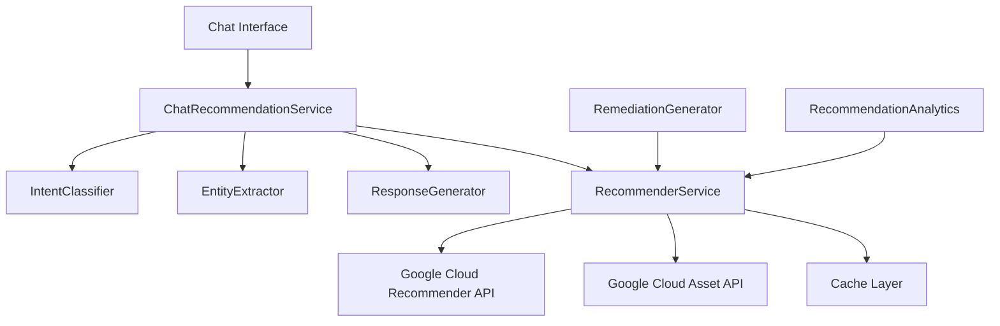

# Google Cloud Recommender API Integration

Comprehensive documentation for the Google Cloud Recommender API integration in the Security Agent.

## Table of Contents

1. [Overview](#overview)
2. [Setup Instructions](#setup-instructions)
3. [Architecture](#architecture)
4. [Usage Examples](#usage-examples)
5. [API Reference](#api-reference)
6. [Chat Integration](#chat-integration)
7. [Performance Optimization](#performance-optimization)
8. [Error Handling](#error-handling)
9. [Testing](#testing)
10. [Troubleshooting](#troubleshooting)
11. [Best Practices](#best-practices)

## Overview

The Google Cloud Recommender API integration provides intelligent, contextual security and cost optimization recommendations through both programmatic APIs and natural language chat interfaces. The system combines Google Cloud's machine learning-powered recommendations with advanced chat capabilities for an enhanced user experience.

### Key Features

- **Multi-Type Recommendation Support**: IAM policies, firewall rules, machine types, service accounts, and more
- **Intelligent Chat Interface**: Natural language processing for recommendation queries
- **Advanced Analytics**: Cost savings, security impact scoring, and compliance analysis
- **Automated Remediation**: Step-by-step implementation guidance with executable commands
- **Performance Optimization**: Caching, rate limiting, and concurrent processing
- **Comprehensive Error Handling**: Graceful degradation and recovery mechanisms

### Supported Recommender Types

| Recommender Type | Description | Focus Area |
|-----------------|-------------|------------|
| `google.iam.policy.Recommender` | IAM policy optimization | Security |
| `google.compute.firewall.Recommender` | Firewall rule optimization | Security |
| `google.iam.serviceAccount.Recommender` | Service account cleanup | Security |
| `google.compute.instance.MachineTypeRecommender` | VM right-sizing | Cost |
| `google.compute.commitment.UsageCommitmentRecommender` | Commitment analysis | Cost |
| `google.compute.disk.IdleResourceRecommender` | Idle disk cleanup | Cost |
| `google.cloudsql.instance.IdleRecommender` | Idle SQL instances | Cost |

## Setup Instructions

### Prerequisites

1. **Google Cloud Project** with Recommender API enabled
2. **Service Account** with appropriate permissions
3. **Python 3.8+** environment
4. **Required dependencies** installed

### 1. Enable APIs

```bash
# Enable required Google Cloud APIs
gcloud services enable recommender.googleapis.com
gcloud services enable cloudasset.googleapis.com
gcloud services enable iam.googleapis.com
```

### 2. Create Service Account

```bash
# Create service account
gcloud iam service-accounts create recommender-service \
    --description="Service account for Recommender API access" \
    --display-name="Recommender Service"

# Download credentials
gcloud iam service-accounts keys create credentials.json \
    --iam-account=recommender-service@YOUR_PROJECT_ID.iam.gserviceaccount.com
```

### 3. Grant Permissions

```bash
# Required IAM roles
gcloud projects add-iam-policy-binding YOUR_PROJECT_ID \
    --member="serviceAccount:recommender-service@YOUR_PROJECT_ID.iam.gserviceaccount.com" \
    --role="roles/recommender.viewer"

gcloud projects add-iam-policy-binding YOUR_PROJECT_ID \
    --member="serviceAccount:recommender-service@YOUR_PROJECT_ID.iam.gserviceaccount.com" \
    --role="roles/recommender.editor"

gcloud projects add-iam-policy-binding YOUR_PROJECT_ID \
    --member="serviceAccount:recommender-service@YOUR_PROJECT_ID.iam.gserviceaccount.com" \
    --role="roles/cloudasset.viewer"
```

### 4. Environment Configuration

```bash
# Set environment variables
export GOOGLE_APPLICATION_CREDENTIALS="path/to/credentials.json"
export GOOGLE_CLOUD_PROJECT="your-project-id"
export RECOMMENDER_CACHE_TTL_MINUTES=30
export RECOMMENDER_RATE_LIMIT_PER_MINUTE=60
```

### 5. Install Dependencies

```bash
# Install required packages
pip install google-cloud-recommender
pip install google-cloud-asset
pip install google-auth
pip install pydantic
pip install asyncio
```

## Architecture

### Core Components



### Service Layers

1. **Chat Layer**: Natural language interface with intent classification
2. **Service Layer**: Core business logic and API orchestration
3. **API Layer**: Google Cloud API integration with retry logic
4. **Cache Layer**: Performance optimization with TTL-based invalidation
5. **Analytics Layer**: Metrics, scoring, and compliance analysis

### Data Flow

1. **User Query** → Chat interface processes natural language
2. **Intent Classification** → Determines user's goal (list, analyze, apply, etc.)
3. **Entity Extraction** → Extracts filters, parameters, and context
4. **Recommendation Retrieval** → Fetches data from Google Cloud APIs
5. **Enhancement** → Adds analytics, scoring, and remediation steps
6. **Response Generation** → Creates natural language response
7. **Session Tracking** → Updates conversation state and metrics

## Usage Examples

### Basic Service Usage

```python
from backend.services.recommender_service import RecommenderService, RecommendationContext

# Initialize service
service = RecommenderService(credentials_path="credentials.json")

# Create context
context = RecommendationContext(
    project_id="my-project",
    resource_name="",
    location="global",
    filters={"state": "ACTIVE"},
    user_preferences={"focus": "security"}
)

# Get all recommendations
recommendations = await service.get_all_recommendations(context)

# Print summary
for rec in recommendations:
    print(f"Priority: {rec.priority.value}")
    print(f"Name: {rec.name}")
    print(f"Cost Savings: ${rec.cost_savings_usd}/month")
    print(f"Security Impact: {rec.security_impact_score:.1%}")
    print("---")
```

### Filtering Recommendations

```python
# Get only high-priority security recommendations
security_recs = await service.get_recommendations_by_priority(
    context, Priority.HIGH
)

# Get IAM-specific recommendations
iam_recs = await service.get_recommendations_by_type(
    context, RecommenderType.IAM_POLICY
)

# Apply custom filters
context.filters = {
    "state": "ACTIVE",
    "category": "SECURITY",
    "min_impact": 0.7
}
filtered_recs = await service.get_all_recommendations(context)
```

### Applying Recommendations

```python
# Dry run first
result = await service.apply_recommendation(
    recommendation_id="rec-123",
    context=context,
    dry_run=True
)
print(f"Dry run result: {result}")

# Apply for real if dry run succeeded
if result["success"]:
    live_result = await service.apply_recommendation(
        recommendation_id="rec-123",
        context=context,
        dry_run=False
    )
    print(f"Applied: {live_result}")
```

### Session-Based Tracking

```python
# Add recommendations to session
session_id = "user-session-123"
for rec in recommendations:
    await service.add_session_recommendation(session_id, rec)

# Get session recommendations
session_recs = await service.get_session_recommendations(session_id)
print(f"Session has {len(session_recs)} recommendations")
```

### Analytics and Reporting

```python
from backend.services.recommender_service import RecommendationAnalytics

analytics = RecommendationAnalytics()
metrics = analytics.calculate_portfolio_metrics(recommendations)

print(f"Total recommendations: {metrics['total_recommendations']}")
print(f"Potential monthly savings: ${metrics['total_cost_savings_usd']}")
print(f"High-impact items: {metrics['high_impact_count']}")
print(f"Implementation hours: {metrics['estimated_implementation_hours']}")
```

## API Reference

### RecommenderService

#### Constructor

```python
RecommenderService(credentials_path: Optional[str] = None)
```

- `credentials_path`: Path to service account JSON file (optional, uses default credentials if not provided)

#### Core Methods

##### `get_all_recommendations(context, include_insights=True)`

Retrieve all recommendations across supported recommender types.

**Parameters:**
- `context`: RecommendationContext object with filters and preferences
- `include_insights`: Whether to include associated insights (default: True)

**Returns:** List[RecommendationInsight]

##### `get_recommendations_by_type(context, recommender_type)`

Get recommendations for a specific recommender type.

**Parameters:**
- `context`: RecommendationContext object
- `recommender_type`: RecommenderType enum value

**Returns:** List[RecommendationInsight]

##### `get_recommendations_by_priority(context, priority)`

Filter recommendations by priority level.

**Parameters:**
- `context`: RecommendationContext object
- `priority`: Priority enum value (CRITICAL, HIGH, MEDIUM, LOW)

**Returns:** List[RecommendationInsight]

##### `apply_recommendation(recommendation_id, context, dry_run=True)`

Apply or simulate applying a recommendation.

**Parameters:**
- `recommendation_id`: Unique recommendation identifier
- `context`: RecommendationContext object
- `dry_run`: If True, simulates changes without applying (default: True)

**Returns:** Dict with success status, messages, and details

#### Session Management

##### `add_session_recommendation(session_id, recommendation)`

Add a recommendation to session tracking.

##### `get_session_recommendations(session_id)`

Retrieve recommendations associated with a session.

### ChatRecommendationService

#### Constructor

```python
ChatRecommendationService(recommender_service, chat_manager)
```

#### Core Methods

##### `process_query(query: ChatRecommendationQuery)`

Process a natural language query about recommendations.

**Parameters:**
- `query`: ChatRecommendationQuery with user query and context

**Returns:** ChatRecommendationResponse with recommendations and actions

### Data Models

#### RecommendationInsight

Complete recommendation with analytics and execution capabilities.

```python
@dataclass
class RecommendationInsight:
    recommendation_id: str
    name: str
    description: str
    recommender_type: RecommenderType
    state: RecommendationState
    priority: Priority
    impact: ImpactData
    content: RecommendationContent
    target_resources: List[str]
    
    # Analytics
    cost_savings_usd: float
    security_impact_score: float
    compliance_impacts: List[ComplianceImpact]
    risk_score: float
    implementation_effort: ImplementationEffort
    estimated_time_hours: float
    
    # Execution
    remediation_steps: List[RemediationStep]
    executable_commands: List[str]
    verification_commands: List[str]
```

#### RecommendationContext

Context for recommendation operations.

```python
@dataclass
class RecommendationContext:
    project_id: str
    resource_name: str
    location: str = "global"
    recommender_type: Optional[RecommenderType] = None
    filters: Dict[str, Any] = field(default_factory=dict)
    user_preferences: Dict[str, Any] = field(default_factory=dict)
```

## Chat Integration

### Natural Language Interface

The chat integration provides a conversational interface for recommendation management:

#### Supported Query Types

1. **List Recommendations**
   - "Show me my recommendations"
   - "What security suggestions do you have?"
   - "List all cost optimization opportunities"

2. **Analyze Specific Recommendation**
   - "Tell me about the IAM recommendation"
   - "Analyze this firewall suggestion"
   - "What would happen if I apply this?"

3. **Apply Recommendations**
   - "Apply this recommendation"
   - "Implement the security fix"
   - "Execute this suggestion"

4. **Prioritize and Filter**
   - "Prioritize my recommendations"
   - "Show only critical items"
   - "Focus on cost savings over $100"

### Chat Query Examples

```python
from backend.models.recommender_models import (
    ChatRecommendationQuery,
    ChatRecommendationContext,
    RecommenderContextRequest
)

# Create chat context
chat_context = ChatRecommendationContext(
    session_id="user-123-session",
    user_id="user-123",
    project_context=RecommenderContextRequest(
        project_id="my-project",
        location="global"
    ),
    user_preferences={"focus": "security"}
)

# Natural language queries
queries = [
    "Show me my security recommendations",
    "What's the highest priority item?",
    "Apply the IAM recommendation",
    "How much money can I save?",
    "Prioritize by risk level"
]

# Process each query
for query_text in queries:
    query = ChatRecommendationQuery(
        query=query_text,
        context=chat_context
    )
    
    response = await chat_service.process_query(query)
    print(f"Query: {query_text}")
    print(f"Response: {response.response_text}")
    print(f"Actions: {response.suggested_actions}")
    print("---")
```

### Intent Classification

The system automatically classifies user intent:

| Intent | Example Queries | Action |
|--------|----------------|--------|
| LIST_RECOMMENDATIONS | "show me", "what are", "list" | Retrieve and display recommendations |
| ANALYZE_RECOMMENDATION | "analyze", "tell me about", "explain" | Provide detailed analysis |
| APPLY_RECOMMENDATION | "apply", "implement", "execute" | Apply recommendation |
| PRIORITIZE_RECOMMENDATIONS | "prioritize", "rank", "order" | Sort by importance |
| GENERAL_SECURITY | "security", "vulnerabilities", "risks" | Focus on security recommendations |
| COST_OPTIMIZATION | "cost", "savings", "optimize" | Focus on cost recommendations |

### Entity Extraction

The system extracts relevant entities from queries:

- **Priority Filters**: "critical", "high", "medium", "low"
- **Type Filters**: "iam", "firewall", "machine type", "service account"
- **Cost Thresholds**: "$100", "$1,000", "above $50"
- **Execution Mode**: "dry run", "test", "for real", "actually"

## Performance Optimization

### Caching Strategy

The system implements intelligent caching to reduce API calls and improve response times:

```python
# Cache configuration
cache_ttl = timedelta(minutes=30)  # 30-minute TTL
cache_stats = {"hits": 0, "misses": 0, "evictions": 0}

# Cache key format
cache_key = f"{project_id}:{recommender_type.value}:{location}"

# Cache validation
def _is_cache_valid(cache_key: str) -> bool:
    if cache_key not in cache:
        return False
    cache_time = cache[cache_key]["timestamp"]
    return datetime.now() - cache_time < cache_ttl
```

### Rate Limiting

Implements smart rate limiting to respect API quotas:

```python
rate_limit_config = {
    "requests_per_minute": 60,
    "burst_limit": 10,
    "current_requests": [],
    "backoff_factor": 1.5
}
```

### Concurrent Processing

Supports concurrent recommendation retrieval:

```python
# Process multiple recommender types concurrently
async def get_all_recommendations(context):
    tasks = []
    for recommender_type in supported_recommenders:
        task = _get_recommendations_by_type(context, recommender_type)
        tasks.append(task)
    
    results = await asyncio.gather(*tasks, return_exceptions=True)
    return process_results(results)
```

### Performance Metrics

Track performance metrics for optimization:

```python
performance_metrics = {
    "total_requests": 0,
    "avg_response_time": 0.0,
    "error_count": 0,
    "cache_hit_rate": 0.0,
    "last_health_check": datetime.now()
}
```

## Error Handling

### Graceful Degradation

The system implements comprehensive error handling:

#### API Error Handling

```python
try:
    recommendations = client.list_recommendations(request)
except Exception as e:
    logger.error(f"API error: {e}")
    # Return cached data if available
    if cache_key in cache:
        return cache[cache_key]["data"]
    # Return empty list with error context
    return []
```

#### Client Initialization Retry

```python
max_retries = 3
for attempt in range(max_retries):
    try:
        client = recommender_v1.RecommenderClient(credentials=credentials)
        return client
    except Exception as e:
        if attempt == max_retries - 1:
            raise
        wait_time = (attempt + 1) * 2
        time.sleep(wait_time)
```

#### Chat Error Recovery

```python
try:
    response = await process_query(query)
except Exception as e:
    return ChatRecommendationResponse(
        success=False,
        response_text=f"I encountered an error: {str(e)}",
        suggested_actions=["Try rephrasing", "Check permissions"],
        follow_up_questions=["Would you like to try again?"]
    )
```

### Common Error Scenarios

| Error Type | Cause | Handling |
|------------|-------|----------|
| Authentication | Invalid credentials | Retry with default credentials |
| Permission Denied | Insufficient IAM roles | Graceful error message |
| Rate Limiting | Too many requests | Exponential backoff |
| Network Timeout | Connectivity issues | Retry with increased timeout |
| Malformed Data | Invalid API response | Skip malformed records |

## Testing

### Running Tests

```bash
# Run all recommender tests
python -m pytest tests/test_recommender_integration.py -v

# Run specific test categories
python -m pytest tests/test_recommender_integration.py::TestRecommenderService -v
python -m pytest tests/test_recommender_integration.py::TestChatRecommendationService -v

# Run with coverage
python -m pytest tests/test_recommender_integration.py --cov=backend.services --cov-report=html
```

### Test Categories

1. **Unit Tests**: Individual component testing
2. **Integration Tests**: API integration testing
3. **Performance Tests**: Load and concurrent testing
4. **Error Handling Tests**: Failure scenario testing
5. **End-to-End Tests**: Complete workflow testing

### Mock Data Setup

```python
# Mock recommendation for testing
@pytest.fixture
def sample_recommendation():
    recommendation = Mock(spec=recommender_v1.Recommendation)
    recommendation.name = "projects/test/locations/global/recommenders/iam/recommendations/123"
    recommendation.display_name = "Remove excessive permissions"
    recommendation.description = "User has overprivileged access"
    # ... configure mock
    return recommendation
```

### Performance Testing

```python
@pytest.mark.asyncio
async def test_concurrent_processing():
    """Test concurrent recommendation processing."""
    tasks = []
    for i in range(10):
        task = service.get_all_recommendations(context)
        tasks.append(task)
    
    start_time = time.time()
    results = await asyncio.gather(*tasks)
    end_time = time.time()
    
    assert len(results) == 10
    assert end_time - start_time < 5.0  # Should complete within 5 seconds
```

## Troubleshooting

### Common Issues

#### 1. Authentication Errors

**Problem**: `google.auth.exceptions.DefaultCredentialsError`

**Solution**:
```bash
# Set credentials environment variable
export GOOGLE_APPLICATION_CREDENTIALS="path/to/credentials.json"

# Or use gcloud auth
gcloud auth application-default login
```

#### 2. Permission Denied

**Problem**: `google.api_core.exceptions.PermissionDenied`

**Solution**:
```bash
# Verify IAM roles
gcloud projects get-iam-policy YOUR_PROJECT_ID

# Add required roles
gcloud projects add-iam-policy-binding YOUR_PROJECT_ID \
    --member="serviceAccount:SERVICE_ACCOUNT@PROJECT.iam.gserviceaccount.com" \
    --role="roles/recommender.viewer"
```

#### 3. Empty Recommendations

**Problem**: No recommendations returned

**Debugging**:
```python
# Check API availability
try:
    client = recommender_v1.RecommenderClient()
    # Test with a simple request
    parent = f"projects/{project_id}/locations/global/recommenders/google.iam.policy.Recommender"
    request = recommender_v1.ListRecommendationsRequest(parent=parent)
    response = client.list_recommendations(request=request)
    print(f"API response: {list(response)}")
except Exception as e:
    print(f"API error: {e}")
```

#### 4. Rate Limiting

**Problem**: `google.api_core.exceptions.TooManyRequests`

**Solution**:
```python
# Implement exponential backoff
import time
import random

def retry_with_backoff(func, max_retries=3):
    for attempt in range(max_retries):
        try:
            return func()
        except TooManyRequests:
            if attempt < max_retries - 1:
                wait_time = (2 ** attempt) + random.uniform(0, 1)
                time.sleep(wait_time)
            else:
                raise
```

#### 5. Cache Issues

**Problem**: Stale or missing cached data

**Debugging**:
```python
# Check cache status
print(f"Cache size: {len(service.cache)}")
print(f"Cache stats: {service.cache_stats}")

# Clear cache if needed
service.cache.clear()
service.cache_stats = {"hits": 0, "misses": 0, "evictions": 0}
```

### Debugging Tips

1. **Enable Debug Logging**:
   ```python
   import logging
   logging.basicConfig(level=logging.DEBUG)
   logger = logging.getLogger(__name__)
   ```

2. **Monitor API Quotas**:
   ```bash
   gcloud monitoring metrics list --filter="recommender"
   ```

3. **Check Service Health**:
   ```python
   metrics = await service.get_service_metrics()
   print(f"Health status: {metrics['health_status']}")
   ```

4. **Validate Permissions**:
   ```bash
   gcloud auth list
   gcloud config get-value project
   gcloud projects get-iam-policy PROJECT_ID
   ```

### Performance Monitoring

Monitor key performance indicators:

- **Response Time**: Average API response time
- **Cache Hit Rate**: Percentage of requests served from cache
- **Error Rate**: Percentage of failed requests
- **Throughput**: Requests per minute
- **Memory Usage**: Service memory consumption

```python
# Get performance metrics
metrics = await chat_service.get_service_metrics()
print(f"Average response time: {metrics['performance']['avg_response_time']}ms")
print(f"Cache hit rate: {metrics['cache_stats']['hits']/metrics['cache_stats']['total']:.1%}")
print(f"Active sessions: {metrics['active_sessions']}")
```

## Best Practices

### Security

1. **Use Service Accounts**: Never use user credentials in production
2. **Principle of Least Privilege**: Grant minimal required permissions
3. **Rotate Credentials**: Regularly rotate service account keys
4. **Audit Access**: Monitor and log all API access

### Performance

1. **Enable Caching**: Use appropriate cache TTL values
2. **Batch Requests**: Process multiple recommendations concurrently
3. **Monitor Rate Limits**: Implement proper backoff strategies
4. **Use Filters**: Apply filters to reduce unnecessary data retrieval

### Error Handling

1. **Graceful Degradation**: Provide fallback responses
2. **Comprehensive Logging**: Log all errors with context
3. **User-Friendly Messages**: Translate technical errors to user language
4. **Retry Logic**: Implement intelligent retry mechanisms

### Code Organization

1. **Separation of Concerns**: Keep business logic separate from API calls
2. **Type Safety**: Use Pydantic models for data validation
3. **Async/Await**: Use asynchronous programming for better performance
4. **Configuration Management**: Externalize configuration settings

### Monitoring

1. **Health Checks**: Implement service health monitoring
2. **Metrics Collection**: Track key performance indicators
3. **Alerting**: Set up alerts for error rates and performance degradation
4. **Logging**: Implement structured logging with correlation IDs

### Documentation

1. **API Documentation**: Keep API documentation up to date
2. **Code Comments**: Document complex business logic
3. **Examples**: Provide comprehensive usage examples
4. **Troubleshooting**: Maintain troubleshooting guides

---

## Additional Resources

- [Google Cloud Recommender API Documentation](https://cloud.google.com/recommender/docs)
- [Google Cloud Asset API Documentation](https://cloud.google.com/asset-inventory/docs)
- [Security Agent Architecture Documentation](./architecture/CHAT_CENTRIC_ARCHITECTURE.md)
- [Chat Integration Flow Documentation](./architecture/RECOMMENDER_CHAT_FLOW.md)

For questions or issues, refer to the troubleshooting section or check the project's issue tracker.