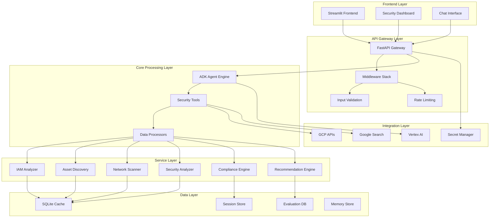
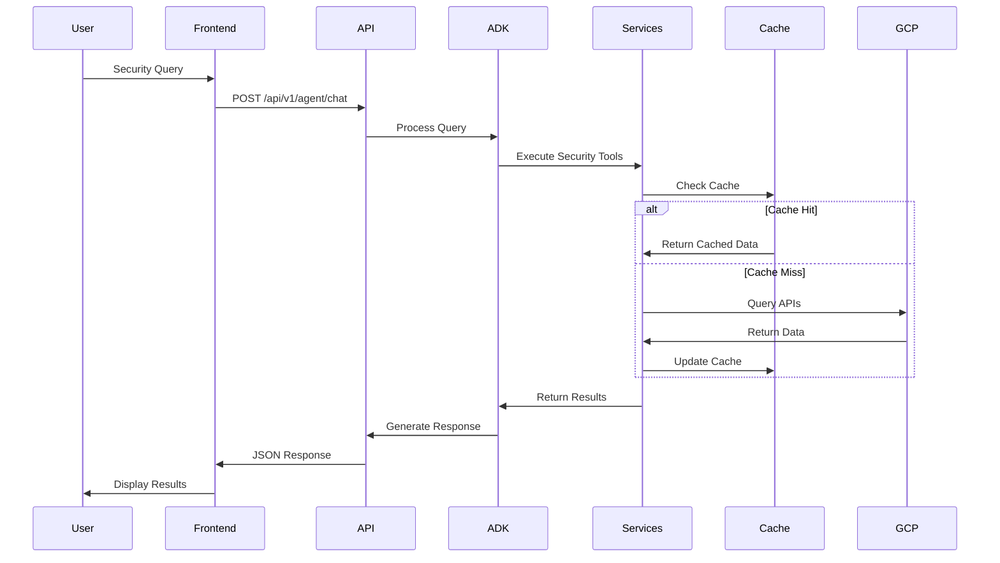
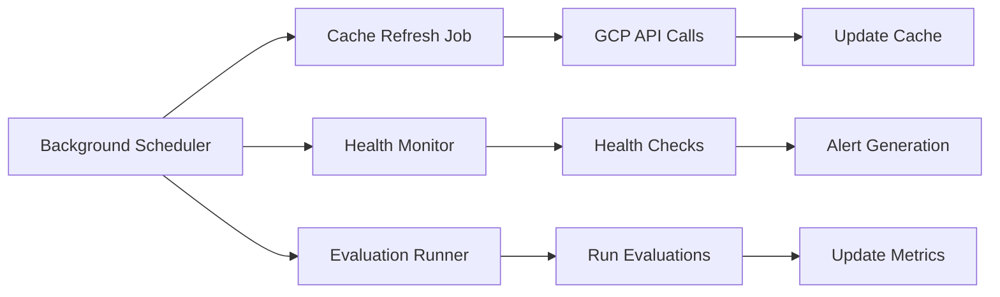

# System Architecture Design - GCP Security Agent

**Architect**: System Architect Agent  
**Date**: September 8, 2025  
**Version**: 1.13.0  
**Status**: Design Complete ✅

## 🏗️ Executive Summary

The GCP Security Agent is a sophisticated multi-tiered security analysis platform built on Google's Agent Development Kit (ADK). This architecture supports comprehensive cloud security assessment, vulnerability detection, compliance monitoring, and automated remediation across Google Cloud Platform environments.

### Key Architecture Principles

1. **Modular Design**: Microservices-based architecture with clear separation of concerns
2. **Scalable Processing**: Event-driven asynchronous processing with caching layers
3. **Security-First**: Zero-trust security model with comprehensive input validation
4. **High Availability**: Resilient design with graceful degradation and fallback mechanisms
5. **Extensible Framework**: Plugin-based architecture supporting new security assessments

## 🎯 System Overview



## 🔧 Component Architecture

### 1. Frontend Layer

#### Streamlit Frontend (`frontend/`)
- **Purpose**: User interface for security analysis and monitoring
- **Technology**: Streamlit with custom components
- **Key Features**:
  - Real-time security dashboard
  - Interactive chat interface
  - Asset inventory visualization
  - Compliance reporting
  - Custom role analysis tools

**Key Files**:
- `unified_streaming_client.py`: Main application controller
- `dashboard.py`: Security metrics dashboard
- `iam_features.py`: IAM analysis interface
- `networking_dashboard.py`: Network security tools

### 2. API Gateway Layer

#### FastAPI Backend (`backend/main.py`)
- **Purpose**: Central API gateway and request orchestration
- **Technology**: FastAPI with async processing
- **Architecture Pattern**: Clean Architecture with dependency injection

**Middleware Stack**:
```python
Request Flow:
├── CORS Middleware (Cross-origin support)
├── Request Sanitization (SQL injection prevention)
├── Rate Limiting (DDoS protection)
├── Input Validation (Schema enforcement)
├── Authentication (Future: OAuth/RBAC)
└── Response Formatting (Consistent API responses)
```

**API Structure** (`backend/api/`):
```
/api/v1/
├── agent/          # Core agent interactions
├── gcp/           # GCP service integrations
├── security/      # Security analysis endpoints
├── iam/           # IAM analysis and recommendations
├── assets/        # Asset inventory and discovery
├── monitoring/    # Logging and monitoring
├── recommendations/ # Automated recommendations
├── knowledge/     # Knowledge base queries
├── sessions/      # Session management
└── health/        # System health monitoring
```

### 3. Core Processing Layer

#### ADK Agent Engine
- **Purpose**: Central intelligence engine for security analysis
- **Technology**: Google Agent Development Kit (ADK)
- **Agent Configuration**: `agents/gcp_security/vertex_sqlite_agent.py`

**Tool Integration**:
```python
Available Security Tools:
├── query_security_data()      # SQLite security queries
├── discover_gcp_assets()      # Asset discovery
├── analyze_iam_policies()     # IAM analysis
├── scan_network_security()    # Network scanning
├── check_compliance()         # Compliance validation
├── get_recommendations()      # Security recommendations
├── search_knowledge_base()    # Enterprise knowledge queries
└── generate_reports()         # Report generation
```

### 4. Service Layer Architecture

#### Core Services (`backend/services/`)

**IAM Security Analyzer**
```python
class IAMSecurityAnalyzer:
    - analyze_service_accounts()
    - check_privilege_escalation()
    - audit_custom_roles()
    - validate_policy_bindings()
    - detect_unused_permissions()
```

**Asset Discovery Engine**
```python
class AssetDiscovery:
    - discover_compute_resources()
    - scan_storage_buckets()
    - inventory_network_resources()
    - catalog_database_instances()
    - track_configuration_drift()
```

**Network Security Scanner**
```python
class NetworkSecurityScanner:
    - analyze_firewall_rules()
    - test_connectivity()
    - scan_vpc_flow_logs()
    - validate_vpc_sc_perimeters()
    - check_load_balancer_security()
```

**Compliance Engine**
```python
class ComplianceEngine:
    - evaluate_soc2_compliance()
    - assess_gdpr_compliance()
    - check_hipaa_controls()
    - validate_org_policies()
    - generate_compliance_reports()
```

### 5. Data Layer Architecture

#### SQLite Cache System (`backend/cache/`)
```sql
Database Schema:
├── assets              # Asset inventory data
├── security_findings   # Vulnerability assessments
├── iam_analysis       # IAM policy analysis
├── compliance_results # Compliance assessments
├── recommendations    # Security recommendations
├── sessions           # User session persistence
├── conversation_history # Chat conversation context
└── evaluation_results # ADK evaluation data
```

**Caching Strategy**:
- **L1 Cache**: In-memory Python dictionaries (5-minute TTL)
- **L2 Cache**: SQLite database (30-minute refresh cycle)
- **L3 Cache**: GCP APIs (real-time fallback)

### 6. Integration Layer

#### Google Cloud Platform APIs
```python
Integrated GCP Services:
├── Cloud Asset Inventory    # Asset discovery
├── Security Command Center  # Security findings
├── Cloud IAM               # Permission analysis
├── Cloud Resource Manager  # Project/folder management
├── Compute Engine          # Instance analysis
├── Cloud Storage           # Bucket security
├── VPC                     # Network analysis
├── Cloud SQL              # Database security
├── Cloud KMS              # Encryption analysis
├── Cloud Logging          # Log analysis
├── Cloud Monitoring       # Metrics collection
├── Vertex AI              # AI-powered analysis
├── Cloud Search           # Knowledge search
└── Secret Manager         # Credential management
```

## 🚀 Advanced Architecture Patterns

### 1. Event-Driven Processing

```python
Event Flow:
User Request → API Gateway → Event Bus → Service Workers → Cache Update → Response
```

**Background Processing**:
- Asynchronous cache refresh (30-minute intervals)
- Real-time security monitoring
- Automated compliance checking
- Continuous asset discovery

### 2. Security-First Design

**Input Validation Pipeline**:
```python
Request → Sanitization → Schema Validation → Rate Limiting → Authentication → Processing
```

**Security Controls**:
- SQL injection prevention
- XSS protection
- CSRF token validation
- API rate limiting
- Input sanitization
- Output encoding

### 3. Resilience Patterns

**Graceful Degradation**:
```python
Primary Service Failed → Fallback Service → Cached Data → Error Response
```

**Circuit Breaker Pattern**:
- GCP API failure handling
- Automatic service recovery
- Health check monitoring
- Fallback data sources

## 📊 Phase 2 Architecture Extensions

Based on `docs/PHASE_2_ARCHITECTURE.md`, the system supports advanced security features:

### Enhanced Components

**1. Organization Policy Tester**
- Policy constraint validation
- Compliance gap analysis
- Automated policy testing

**2. VPC Log Analyzer Enhancement**
- Advanced error pattern recognition
- Cross-VPC correlation analysis
- Predictive alerting

**3. Support Ticket Integration**
- Automated ticket creation
- Intelligent categorization
- Resolution tracking

**4. VPC Service Controls Dashboard**
- Dry run policy testing
- Perimeter configuration analysis
- Impact assessment

**5. Asset Inventory Reporter**
- Configuration drift detection
- Compliance reporting
- Historical audit trails

**6. Service Credit Template Engine**
- Automated credit eligibility
- Template generation
- Cost impact analysis

## 🎯 Data Flow Architecture

### 1. Request Processing Flow



### 2. Background Processing Flow



## 🔧 Configuration Management

### Environment Configuration (`config/environment.py`)

**Configuration Hierarchy**:
1. System environment variables
2. `.env` files (deploy/.env → .env → backend/.env)
3. Default values
4. Runtime validation

**Key Configuration Areas**:
- GCP project and credentials
- Database paths and refresh intervals
- API URLs and ports
- Security settings and rate limits
- Agent operation modes

## 🧪 Testing Architecture

### Evaluation Framework (`evaluation/`)

**Test Coverage**:
- **26 Evaluation Datasets**: Comprehensive security testing
- **ADK Integration**: Native evaluation support
- **Metrics Tracking**: Performance and accuracy monitoring
- **Automated Testing**: CI/CD integration

**Test Categories**:
- IAM Security Analysis
- Network Security Assessment
- Storage Security Validation
- Vulnerability Detection
- Compliance Checking
- API Integration Testing
- Performance Scalability
- Edge Case Handling

## 📈 Performance Architecture

### Optimization Strategies

**1. Caching Strategy**:
- Multi-level caching (memory → SQLite → GCP APIs)
- Intelligent cache invalidation
- Background refresh processes

**2. Async Processing**:
- Non-blocking API operations
- Concurrent service execution
- Background task management

**3. Resource Management**:
- Connection pooling
- Memory optimization
- CPU-efficient algorithms

## 🛡️ Security Architecture

### Security Controls

**1. Authentication & Authorization**:
- Google Cloud IAM integration
- Service account security
- API key management

**2. Data Protection**:
- Encryption at rest and in transit
- Sensitive data masking
- Secure credential storage

**3. Network Security**:
- HTTPS enforcement
- CORS configuration
- Rate limiting protection

## 🚀 Deployment Architecture

### Container Strategy (`docker-compose.yml`)

```yaml
Services:
├── backend          # FastAPI application
│   ├── Health checks
│   ├── Volume mounts
│   └── Environment config
└── frontend         # Streamlit application
    ├── Backend dependency
    └── Port configuration
```

### Cloud Deployment (`deploy/`)

**Google Cloud Run**:
- Serverless scaling
- Automatic HTTPS
- Built-in load balancing
- Secret Manager integration

## 📋 Implementation Roadmap

### Phase 1: Core Infrastructure ✅
- FastAPI backend with middleware stack
- SQLite caching system
- ADK agent integration
- Basic security tools
- Streamlit frontend

### Phase 2: Advanced Security Features ✅
- Organization policy testing
- Enhanced VPC log analysis
- Support ticket integration
- VPC Service Controls dashboard
- Asset inventory reporter
- Service credit templates

### Phase 3: Enterprise Features (Future)
- Multi-tenant support
- Advanced RBAC
- Custom security policies
- Enterprise SSO integration
- Advanced analytics dashboard

## 🎯 Success Metrics

### Technical Metrics
- **Response Time**: < 2 seconds for cached queries
- **Availability**: 99.9% uptime
- **Accuracy**: 95%+ security finding detection
- **Scalability**: Support 1000+ concurrent users

### Business Metrics
- **Risk Reduction**: 80%+ vulnerability identification
- **Compliance**: 95%+ automated compliance checking
- **Efficiency**: 60%+ reduction in manual security analysis
- **Cost Optimization**: 30%+ savings through automated recommendations

---

**Architecture Status**: ✅ Design Complete  
**Next Steps**: Implementation validation and performance optimization  
**Review Date**: September 15, 2025