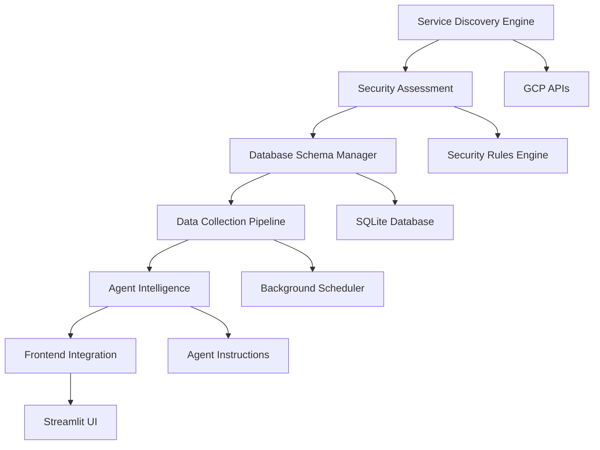

# Technical Implementation Checklist
**STORY-301: New GCP Service Evaluation Framework**

## 🏗️ Architecture Overview



## 📋 Implementation Phases

### **Phase 1: Service Discovery Engine**

#### 1.1 Core Discovery Service
- [ ] **File:** `backend/services/service_discovery.py`
  ```python
  class ServiceDiscoveryEngine:
      def discover_new_services(self) -> List[NewService]
      def analyze_service_capabilities(self, service: str) -> ServiceCapabilities
      def monitor_service_changes(self) -> List[ServiceChange]
  ```

- [ ] **File:** `backend/models/service_models.py`
  ```python
  @dataclass
  class NewService:
      name: str
      api_version: str
      resource_types: List[str]
      iam_permissions: List[str]
      security_implications: SecurityImplications
  ```

- [ ] **Integration Points:**
  - Google Cloud Discovery Service API
  - Resource Manager API for project scanning
  - IAM API for permission discovery

#### 1.2 Service Registry
- [ ] **File:** `backend/services/service_registry.py`
  ```python
  class ServiceRegistry:
      def register_service(self, service: NewService) -> None
      def get_supported_services(self) -> List[str]
      def track_service_evolution(self, service: str) -> ServiceHistory
  ```

- [ ] **Database Table:**
  ```sql
  CREATE TABLE service_registry (
      service_name TEXT PRIMARY KEY,
      api_version TEXT,
      discovery_date TIMESTAMP,
      integration_status TEXT,
      security_assessment_score INTEGER
  );
  ```

### **Phase 2: Security Assessment Framework**

#### 2.1 Security Assessor
- [ ] **File:** `backend/services/security_assessor.py`
  ```python
  class SecurityAssessor:
      def assess_service_security(self, service: NewService) -> SecurityAssessment
      def generate_security_rules(self, service: NewService) -> List[SecurityRule]
      def evaluate_compliance(self, service: NewService) -> ComplianceReport
  ```

#### 2.2 Risk Analysis Engine
- [ ] **File:** `backend/services/risk_analyzer.py`
  ```python
  class RiskAnalyzer:
      def calculate_risk_score(self, service: NewService) -> RiskScore
      def identify_threat_vectors(self, service: NewService) -> List[ThreatVector]
      def recommend_mitigations(self, service: NewService) -> List[Mitigation]
  ```

- [ ] **Risk Assessment Templates:**
  - Data classification framework
  - Network exposure analysis
  - IAM complexity assessment
  - Compliance requirement mapping

### **Phase 3: Database Schema Management**

#### 3.1 Dynamic Schema Manager
- [ ] **File:** `backend/services/schema_manager.py`
  ```python
  class DynamicSchemaManager:
      def create_service_tables(self, service: NewService) -> None
      def migrate_schema(self, service: str, new_version: str) -> None
      def validate_schema_integrity(self) -> ValidationResult
  ```

#### 3.2 Vertex AI Memory Store Schema
- [ ] **Tables to Create:**
  ```sql
  -- Main service table
  CREATE TABLE vertex_ai_memory_stores (
      id INTEGER PRIMARY KEY AUTOINCREMENT,
      name TEXT NOT NULL,
      project_id TEXT NOT NULL,
      location TEXT NOT NULL,
      display_name TEXT,
      
      -- Service-specific configuration
      vector_dimensions INTEGER,
      index_config TEXT, -- JSON
      deployed_indexes TEXT, -- JSON array
      
      -- Security configuration
      encryption_config TEXT, -- JSON
      network_config TEXT, -- JSON
      iam_bindings TEXT, -- JSON
      
      -- Metadata
      state TEXT,
      create_time TIMESTAMP,
      update_time TIMESTAMP,
      labels TEXT, -- JSON
      data TEXT, -- Full API response
      fetched_at TIMESTAMP DEFAULT CURRENT_TIMESTAMP
  );
  
  -- Security findings for the service
  CREATE TABLE vertex_ai_memory_store_findings (
      id INTEGER PRIMARY KEY AUTOINCREMENT,
      resource_name TEXT NOT NULL,
      finding_type TEXT NOT NULL,
      severity TEXT NOT NULL,
      description TEXT,
      recommendation TEXT,
      auto_remediation_available BOOLEAN DEFAULT FALSE,
      detected_at TIMESTAMP DEFAULT CURRENT_TIMESTAMP,
      resolved_at TIMESTAMP,
      
      FOREIGN KEY (resource_name) REFERENCES vertex_ai_memory_stores(name)
  );
  
  -- Compliance tracking
  CREATE TABLE vertex_ai_memory_store_compliance (
      id INTEGER PRIMARY KEY AUTOINCREMENT,
      resource_name TEXT NOT NULL,
      compliance_framework TEXT, -- SOC2, ISO27001, etc.
      requirement_id TEXT,
      status TEXT, -- COMPLIANT, NON_COMPLIANT, UNKNOWN
      evidence TEXT,
      last_checked TIMESTAMP DEFAULT CURRENT_TIMESTAMP
  );
  ```

### **Phase 4: Data Collection Pipeline**

#### 4.1 Service-Specific API Client
- [ ] **File:** `backend/api/vertex_ai_memory_store.py`
  ```python
  from google.cloud import aiplatform_v1
  
  class VertexAIMemoryStoreClient:
      def __init__(self, project_id: str):
          self.client = aiplatform_v1.IndexServiceClient()
          self.endpoint_client = aiplatform_v1.IndexEndpointServiceClient()
      
      def list_instances(self, location: str) -> List[Dict]
      def get_instance_details(self, instance_name: str) -> Dict
      def analyze_security_config(self, instance: Dict) -> SecurityConfig
      def check_compliance_status(self, instance: Dict) -> ComplianceStatus
  ```

#### 4.2 Data Fetcher Integration
- [ ] **File:** `backend/services/data_fetcher.py` (enhancement)
  ```python
  def fetch_vertex_ai_memory_stores(self) -> Dict[str, Any]:
      """Fetch and analyze Vertex AI Memory Store instances"""
      try:
          client = VertexAIMemoryStoreClient(self.project_id)
          instances = []
          findings = []
          
          for location in self.locations:
              # Fetch instances
              location_instances = client.list_instances(location)
              instances.extend(location_instances)
              
              # Security analysis for each instance
              for instance in location_instances:
                  security_config = client.analyze_security_config(instance)
                  instance_findings = self._evaluate_security_rules(instance, security_config)
                  findings.extend(instance_findings)
          
          # Store in database
          self._store_memory_store_data(instances)
          self._store_security_findings(findings)
          
          return {
              "instances": len(instances),
              "security_findings": len(findings),
              "status": "success"
          }
      except Exception as e:
          logger.error(f"Memory Store fetch failed: {e}")
          return {"error": str(e)}
  ```

#### 4.3 Security Rules Implementation
- [ ] **File:** `backend/services/vertex_ai_security_rules.py`
  ```python
  class VertexAISecurityRules:
      def evaluate_memory_store_instance(self, instance: Dict) -> List[SecurityFinding]:
          findings = []
          
          # Rule 1: CMEK Encryption Check
          if not self._has_cmek_encryption(instance):
              findings.append(SecurityFinding(
                  resource_name=instance['name'],
                  finding_type="ENCRYPTION_WEAKNESS",
                  severity="HIGH",
                  description="Memory Store instance not using customer-managed encryption",
                  recommendation="Enable CMEK encryption for sensitive vector data",
                  auto_remediation_available=True
              ))
          
          # Rule 2: Network Security Check
          if self._has_public_access(instance):
              findings.append(SecurityFinding(
                  resource_name=instance['name'],
                  finding_type="NETWORK_EXPOSURE",
                  severity="CRITICAL",
                  description="Memory Store instance allows public access",
                  recommendation="Configure private service connect endpoints"
              ))
          
          # Rule 3: IAM Overprivileged Access
          if self._has_overprivileged_access(instance):
              findings.append(SecurityFinding(
                  resource_name=instance['name'],
                  finding_type="IAM_MISCONFIGURATION",
                  severity="MEDIUM",
                  description="Overly broad IAM permissions detected",
                  recommendation="Apply principle of least privilege"
              ))
          
          return findings
  ```

### **Phase 5: Agent Intelligence Enhancement**

#### 5.1 New Query Functions
- [ ] **File:** `agents/gcp_security/sqlite_tool.py` (enhancement)
  ```python
  # Add to query_security_data function:
  elif query_type == 'vertex_ai_memory_stores':
      return _query_vertex_ai_memory_stores(cursor, params)
  elif query_type == 'memory_store_security':
      return _query_memory_store_security(cursor, params)
  elif query_type == 'ai_service_compliance':
      return _query_ai_service_compliance(cursor, params)
  elif query_type == 'new_service_evaluation':
      return _query_new_service_evaluation(cursor, params)
  
  def _query_vertex_ai_memory_stores(cursor, params: Dict) -> str:
      """Query Vertex AI Memory Store instances with security analysis"""
      
  def _query_memory_store_security(cursor, params: Dict) -> str:
      """Detailed security analysis for Memory Store instances"""
      
  def _query_ai_service_compliance(cursor, params: Dict) -> str:
      """Compliance status for AI/ML services"""
  ```

#### 5.2 Agent Instructions Enhancement
- [ ] **File:** `agents/gcp_security/vertex_sqlite_agent.py` (enhancement)
  ```python
  # Add to instruction string:
  """
  ## New Service Evaluation Query Types:
  
  23. **vertex_ai_memory_stores** - Analyze Vertex AI Memory Store instances
      - Parameters: {"instance_name": "my-store"}, {"location": "us-central1"}
  
  24. **memory_store_security** - Security assessment for Memory Store instances
      - Parameters: {"security_check": "encryption"}, {"compliance_framework": "sox"}
  
  25. **ai_service_compliance** - Compliance analysis for AI/ML services
      - Parameters: {"service": "vertex_ai"}, {"framework": "sox"}
  
  26. **new_service_evaluation** - Evaluation status for newly discovered services
      - Parameters: {"service_name": "vertex_ai_memory_store"}
  
  ## AI/ML Security Remediation Guide:
  
  **For Vertex AI Memory Store:**
  - **Encryption**: Always use CMEK for sensitive vector embeddings
  - **Network Security**: Use private service connect, avoid public endpoints
  - **Access Control**: Implement fine-grained IAM (aiplatform.indexAdmin vs aiplatform.indexViewer)
  - **Data Privacy**: Ensure vector embeddings don't leak sensitive training data
  - **Audit Logging**: Enable comprehensive logging for vector operations
  - **Vector Security**: Implement access patterns that prevent embedding extraction
  - **Integration Security**: Secure connections to Workbench and ML Pipelines
  - **Backup Strategy**: Regular backups of critical vector indexes
  - **Monitoring**: Set up alerts for unusual access patterns or performance anomalies
  """
  ```

### **Phase 6: Frontend Integration**

#### 6.1 AI Services Dashboard
- [ ] **File:** `frontend/unified_streaming_client.py` (enhancement)
  ```python
  def display_ai_services_dashboard():
      """Display comprehensive AI/ML services security dashboard"""
      st.header("🧠 AI/ML Services Security Analysis")
      
      # Service overview metrics
      col1, col2, col3, col4 = st.columns(4)
      with col1:
          memory_store_count = get_service_count("vertex_ai_memory_stores")
          st.metric("Memory Store Instances", memory_store_count)
      
      with col2:
          ai_security_issues = get_ai_security_issues_count()
          st.metric("AI Security Issues", ai_security_issues, 
                   delta="Critical" if ai_security_issues > 0 else "Secure")
      
      with col3:
          compliance_score = calculate_ai_compliance_score()
          st.metric("AI Compliance Score", f"{compliance_score}%")
      
      with col4:
          new_services = get_new_services_count()
          st.metric("New Services Detected", new_services,
                   delta="Requires evaluation" if new_services > 0 else "All evaluated")
      
      # Memory Store analysis section
      display_memory_store_analysis()
      
      # New service evaluation section
      display_new_service_evaluation()
  ```

#### 6.2 Memory Store Analysis Component
- [ ] **Component:** Memory Store Security Analysis
  ```python
  def display_memory_store_analysis():
      st.subheader("🔍 Memory Store Security Analysis")
      
      # Get Memory Store instances
      memory_stores = query_memory_stores()
      
      if not memory_stores:
          st.info("No Vertex AI Memory Store instances found.")
          return
      
      for store in memory_stores:
          with st.expander(f"📊 {store['name']} ({store['location']})"):
              col1, col2, col3 = st.columns(3)
              
              with col1:
                  st.write("**Configuration:**")
                  st.write(f"• Dimensions: {store['vector_dimensions']:,}")
                  st.write(f"• State: {store['state']}")
                  st.write(f"• Created: {store['create_time']}")
              
              with col2:
                  st.write("**Security Status:**")
                  security_status = analyze_memory_store_security(store)
                  
                  if security_status['encryption'] == 'CMEK':
                      st.success("✅ Customer-managed encryption")
                  else:
                      st.warning("⚠️ Google-managed encryption only")
                  
                  if security_status['network'] == 'PRIVATE':
                      st.success("✅ Private network access")
                  else:
                      st.error("🔴 Public network exposure")
              
              with col3:
                  st.write("**Compliance:**")
                  compliance_status = get_compliance_status(store['name'])
                  for framework, status in compliance_status.items():
                      if status == 'COMPLIANT':
                          st.success(f"✅ {framework}")
                      else:
                          st.error(f"❌ {framework}")
              
              # Security findings
              findings = get_security_findings(store['name'])
              if findings:
                  st.write("**Security Findings:**")
                  for finding in findings:
                      severity_color = {
                          'CRITICAL': 'error',
                          'HIGH': 'warning', 
                          'MEDIUM': 'info',
                          'LOW': 'success'
                      }
                      getattr(st, severity_color[finding['severity']])(
                          f"{finding['severity']}: {finding['description']}"
                      )
  ```

#### 6.3 New Service Evaluation Dashboard
- [ ] **Component:** New Service Evaluation Status
  ```python
  def display_new_service_evaluation():
      st.subheader("🆕 New Service Evaluation Status")
      
      # Get services pending evaluation
      pending_services = get_pending_service_evaluations()
      
      if pending_services:
          st.warning(f"⚠️ {len(pending_services)} services require security evaluation")
          
          for service in pending_services:
              with st.expander(f"🔍 {service['name']} - Evaluation Required"):
                  col1, col2 = st.columns(2)
                  
                  with col1:
                      st.write("**Service Details:**")
                      st.write(f"• API Version: {service['api_version']}")
                      st.write(f"• Discovered: {service['discovery_date']}")
                      st.write(f"• Resource Types: {len(service['resource_types'])}")
                  
                  with col2:
                      st.write("**Evaluation Status:**")
                      evaluation_progress = get_evaluation_progress(service['name'])
                      
                      progress_bar = st.progress(evaluation_progress['completion_percentage'] / 100)
                      st.write(f"Progress: {evaluation_progress['completion_percentage']}%")
                      
                      if st.button(f"Start Evaluation for {service['name']}", 
                                 key=f"eval_{service['name']}"):
                          trigger_service_evaluation(service['name'])
                          st.rerun()
      else:
          st.success("✅ All discovered services have been evaluated")
  ```

#### 6.4 Quick Query Updates
- [ ] **Enhancement:** Add AI service quick queries
  ```python
  # Add to quick_queries list in unified_streaming_client.py
  ai_service_queries = [
      "List all Vertex AI Memory Store instances",
      "Show Memory Store security issues", 
      "Check AI service compliance status",
      "What new GCP services need evaluation?",
      "Analyze Memory Store encryption status",
      "Show AI service threat assessment"
  ]
  
  quick_queries.extend(ai_service_queries)
  ```

### **Phase 7: Testing & Validation**

#### 7.1 Unit Tests
- [ ] **File:** `tests/test_service_discovery.py`
- [ ] **File:** `tests/test_security_assessor.py`
- [ ] **File:** `tests/test_schema_manager.py`
- [ ] **File:** `tests/test_vertex_ai_client.py`
- [ ] **File:** `tests/test_agent_queries.py`

#### 7.2 Integration Tests
- [ ] **File:** `tests/integration/test_memory_store_integration.py`
- [ ] **File:** `tests/integration/test_frontend_ai_dashboard.py`
- [ ] **File:** `tests/integration/test_end_to_end_evaluation.py`

#### 7.3 Manual Testing Scenarios
- [ ] **Scenario 1:** New service detection and evaluation
- [ ] **Scenario 2:** Security rule evaluation accuracy
- [ ] **Scenario 3:** Agent query functionality
- [ ] **Scenario 4:** Frontend dashboard rendering
- [ ] **Scenario 5:** Database schema migration

## 🚀 Deployment Checklist

### Pre-Deployment
- [ ] All unit tests passing
- [ ] Integration tests validated
- [ ] Security assessments reviewed
- [ ] Performance benchmarks met
- [ ] Documentation updated

### Deployment Steps
- [ ] Database schema migrations applied
- [ ] New service APIs deployed
- [ ] Agent instructions updated
- [ ] Frontend components deployed
- [ ] Monitoring and alerting configured

### Post-Deployment Validation
- [ ] Service discovery functioning
- [ ] Security rules operating correctly
- [ ] Agent queries responding accurately
- [ ] Frontend dashboards loading
- [ ] Data collection pipeline stable

## 📊 Success Criteria

### Functional Requirements
- [ ] New services detected within 24 hours
- [ ] Security assessment accuracy >95%
- [ ] Agent query response time <3 seconds
- [ ] Frontend dashboard load time <2 seconds
- [ ] Data freshness within 30 minutes

### Non-Functional Requirements
- [ ] System handles 50+ concurrent service evaluations
- [ ] Database performance maintained with new tables
- [ ] Memory usage increase <20%
- [ ] Error rate <1% for new service operations

---

**Implementation Owner:** Platform Engineering Team  
**Review Date:** Weekly during implementation  
**Completion Target:** 6 weeks from start date