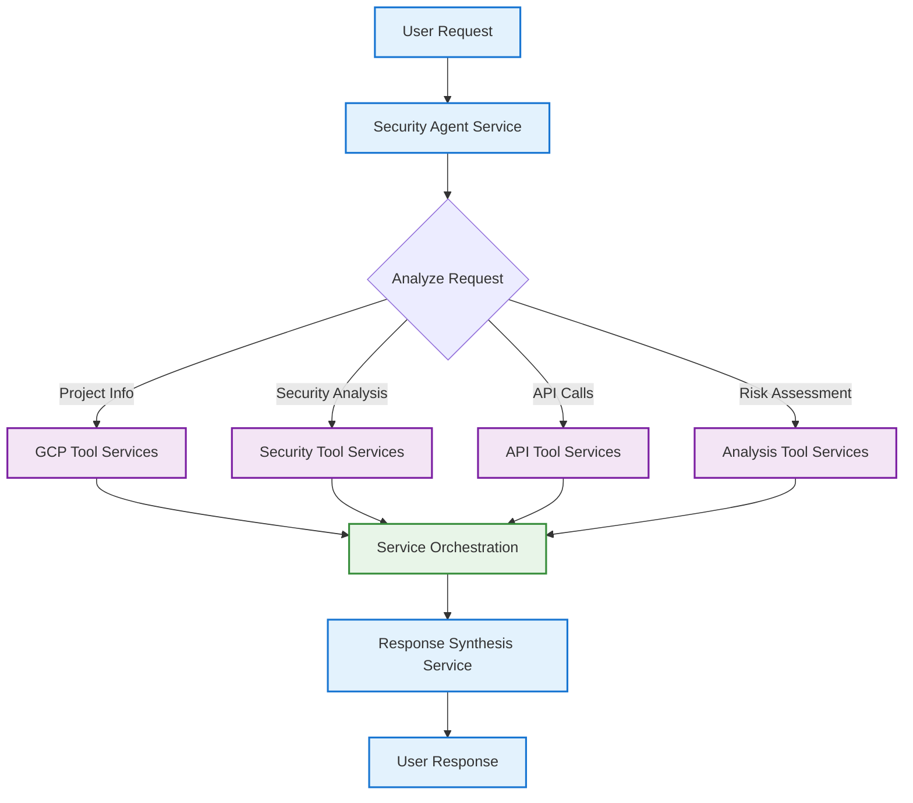

# ADK Agent and Tools Architecture

This document explains the organized structure of agents and tools in the ADK Security Agent system, designed to help customers understand how the multi-agent system works.

## Architecture Overview

The ADK system is organized into two main components:

1. **Agents** - Intelligent entities that coordinate tasks and manage tool usage
2. **Tools** - Specific functions that provide capabilities like API calls, analysis, and data processing

```
contributing/samples/security_agent/
├── agents/                          # Agent definitions and coordination
│   ├── __init__.py                 # Agent module documentation
│   ├── base_agent.py              # Base agent functionality and utilities
│   ├── security_agent.py          # Main security analysis agent
│   └── agent.py                   # Legacy compatibility layer
└── tools/                          # Tool implementations organized by category
    ├── __init__.py                # Tools module documentation
    ├── gcp_tools/                 # Google Cloud Platform tools
    │   ├── __init__.py
    │   ├── project_tools.py       # Project management and information
    │   └── storage_tools.py       # GCS security analysis
    ├── api_tools/                 # Generic API interaction tools
    │   ├── __init__.py
    │   └── google_api_tools.py    # Google API calls and API Hub integration
    ├── security_tools/            # Security-specific analysis tools
    │   ├── __init__.py
    │   └── knowledge_base_tools.py # Security knowledge base and documentation
    └── analysis_tools/            # Data analysis and reporting tools
        ├── __init__.py
        └── dependency_analysis.py # Dependency graphs and risk propagation
```

## Agents

Agents are the intelligent coordinators in the ADK system. They understand user intent, select appropriate tools, and orchestrate complex workflows.

### Main Components


#### `security_agent.py`
The primary security analysis agent that provides comprehensive GCP security evaluation capabilities.

**Key Features:**
- Integrates all security-related tools
- Provides conversational interface for security analysis
- Handles complex multi-step security evaluations
- Manages API Hub tool integration

**Core Capabilities:**
- GCP project analysis and enumeration
- Security posture assessment
- Risk analysis and dependency mapping
- Real-time security recommendations

#### `base_agent.py`
Provides common functionality used by all agents in the system.

**Utilities:**
- Environment configuration and Vertex AI initialization
- Tool collection and management utilities
- Common agent setup patterns

### Agent Service Workflow



## Tools

Tools are specialized functions that provide specific capabilities. They are organized by domain to make the system easier to understand and maintain.

### Tool Categories

#### 1. GCP Tools (`gcp_tools/`)

**Purpose:** Direct integration with Google Cloud Platform services

**`project_tools.py`:**
- `get_gcp_projects()` - List accessible GCP projects
- `get_project_info()` - Get detailed project information
- `get_project_services()` - List enabled services in a project

**`storage_tools.py`:**
- `analyze_gcs_bucket_security()` - Analyze GCS bucket security configurations

#### 2. API Tools (`api_tools/`)

**Purpose:** Generic API interactions and integrations

**`google_api_tools.py`:**
- `call_google_api()` - Make generic Google Cloud API calls
- `create_apihub_toolset()` - Create API Hub toolsets for dynamic tool loading
- `get_available_toolsets()` - List configured API Hub toolsets

#### 3. Security Tools (`security_tools/`)

**Purpose:** Security analysis and evaluation capabilities

**`knowledge_base_tools.py`:**
- `load_security_kb()` - Load security knowledge base from JSON
- `evaluate_api_security()` - Assess API security using knowledge base
- `scrape_api_documentation()` - Extract security info from documentation

#### 4. Analysis Tools (`analysis_tools/`)

**Purpose:** Data analysis, graphing, and reporting

**`dependency_analysis.py`:**
- `get_api_dependency_graph()` - Build API dependency graphs
- `propagate_risk()` - Analyze risk propagation through dependencies

### Tool Service Integration Pattern

```python
# Tool services are integrated into agent services through service registry
from ..tools.gcp_tools.project_tools import get_gcp_projects
from ..tools.security_tools.knowledge_base_tools import evaluate_api_security

# Agent service uses tool services to fulfill user requests
agent_service = AgentService(
    name='security_agent_service',
    service_registry=service_registry,
    tool_services=[
        get_gcp_projects,
        evaluate_api_security,
        # ... other tool services
    ]
)

# Services are managed through the service registry
service_registry.register_service(agent_service)
service_registry.register_tool_services(tool_services)
```

## How It Works for Customers

### 1. Service Initialization

When the system starts:
1. **Service registry** initializes and loads service configurations
2. **Security agent service** registers with available tool services from different categories
3. **API Hub integration service** dynamically loads additional tool services if configured
4. **Service manager** handles service lifecycle and user sessions

### 2. Request Processing

When a customer asks a question:
1. **Agent service** receives the user request through the API gateway
2. **Agent service** analyzes the request to determine which tool services are needed
3. **Tool services** are called through the service registry in the appropriate sequence
4. **Results are synthesized** by the agent service into a comprehensive response

### 3. Service Coordination

The agent service intelligently coordinates tool services:
- **Sequential execution:** Some tool services depend on outputs from others
- **Parallel execution:** Independent tool services can run simultaneously
- **Error handling:** Failed tool services don't crash the entire workflow
- **Service discovery:** Tool services are dynamically discovered through the service registry
- **Context management:** Tool service results are passed between calls when needed

## Example Customer Workflow

```
Customer: "Analyze the security of my GCP project"

1. Agent calls get_gcp_projects() → Lists accessible projects
2. Agent calls get_project_services() → Shows enabled services  
3. Agent calls evaluate_api_security() → Assesses each service
4. Agent calls analyze_gcs_bucket_security() → Checks storage security
5. Agent synthesizes → Provides comprehensive security report
```

## Benefits of This Architecture

### For Customers:
- **Clear separation of concerns:** Easy to understand what each component does
- **Modular capabilities:** Can focus on specific areas (GCP, security, analysis)
- **Extensible:** New tools can be added to specific categories
- **Transparent:** Can see exactly which tools are being used

### For Developers:
- **Organized codebase:** Tools are grouped logically by domain
- **Easy maintenance:** Changes to tools don't affect agents
- **Testable:** Each tool can be tested independently
- **Reusable:** Tools can be shared across different agents

### For Operations:
- **Debuggable:** Can trace exactly which tools were called
- **Monitorable:** Can track tool performance and usage
- **Scalable:** Tools can be optimized or replaced independently

## Migration and Compatibility

The system maintains backward compatibility through the legacy `agent.py` file, which imports from the new organized structure. This allows existing integrations to continue working while providing the benefits of the new architecture.

## Future Extensibility

This architecture makes it easy to add new capabilities:

1. **New tool categories:** Add new directories under `tools/`
2. **New tools:** Add new functions to existing tool modules
3. **New agents:** Create specialized agents for different domains
4. **Cross-agent coordination:** Agents can share tools and coordinate workflows

This organized structure provides a clear foundation for building sophisticated multi-agent systems while remaining understandable and maintainable for customers and developers.