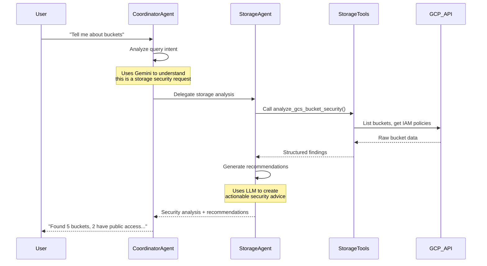

# ADK Security Agent: Overall Architecture

## 🏗️ System Architecture Overview

The ADK Security Agent follows Google ADK best practices, implementing a **multi-agent system** with clear separation between **Agents** (intelligent coordinators) and **Tools** (specialized functions).

```
┌─────────────────────────────────────────────────────────────────┐
│                    FRONTEND (Thin Client)                      │
│  ┌─────────────────┐                                           │
│  │ Streamlit UI    │  - Chat interface                         │
│  │                 │  - Session display                        │
│  │                 │  - Quick actions                          │
│  └─────────────────┘                                           │
└─────────────────┬───────────────────────────────────────────────┘
                  │ HTTP/WebSocket
┌─────────────────▼───────────────────────────────────────────────┐
│                   BACKEND (ADK Platform)                       │
│                                                                 │
│  ┌─────────────────────────────────────────────────────────────┐│
│  │                    AGENT LAYER                              ││
│  │  ┌─────────────────┐  ┌─────────────────┐  ┌──────────────┐││
│  │  │ Coordinator     │  │ Specialist      │  │ Session      │││
│  │  │ Agent           │  │ Agents          │  │ Manager      │││
│  │  │                 │  │                 │  │              │││
│  │  │ • Query routing │  │ • Storage       │  │ • ADK        │││
│  │  │ • Delegation    │  │ • IAM           │  │   Sessions   │││
│  │  │ • Orchestration │  │ • Network       │  │ • Context    │││
│  │  │                 │  │ • Compliance    │  │ • Analytics  │││
│  │  └─────────────────┘  └─────────────────┘  └──────────────┘││
│  └─────────────────────────────────────────────────────────────┘│
│                              │                                  │
│  ┌─────────────────────────────────────────────────────────────┐│
│  │                     TOOL LAYER                              ││
│  │  ┌──────────────┐  ┌──────────────┐  ┌──────────────────┐  ││
│  │  │ GCP Tools    │  │ Security     │  │ Analysis Tools   │  ││
│  │  │              │  │ Tools        │  │                  │  ││
│  │  │ • Storage    │  │ • Knowledge  │  │ • Dependency     │  ││
│  │  │ • Project    │  │   Base       │  │   Analysis       │  ││
│  │  │ • API calls  │  │ • Scanning   │  │ • Reporting      │  ││
│  │  └──────────────┘  └──────────────┘  └──────────────────┘  ││
│  └─────────────────────────────────────────────────────────────┘│
│                              │                                  │
│  ┌─────────────────────────────────────────────────────────────┐│
│  │                  INTEGRATION LAYER                          ││
│  │  ┌──────────────┐  ┌──────────────┐  ┌──────────────────┐  ││
│  │  │ Google Cloud │  │ ADK Platform │  │ External APIs    │  ││
│  │  │ Platform     │  │              │  │                  │  ││
│  │  │ • GCS        │  │ • Vertex AI  │  │ • Security       │  ││
│  │  │ • IAM        │  │ • Gemini     │  │   Sources        │  ││
│  │  │ • Compute    │  │ • Tools API  │  │ • Compliance     │  ││
│  │  └──────────────┘  └──────────────┘  └──────────────────┘  ││
│  └─────────────────────────────────────────────────────────────┘│
└─────────────────────────────────────────────────────────────────┘
```

## 🤖 AGENTS vs 🔧 TOOLS: Key Differences

### **🤖 AGENTS** (Intelligent Coordinators)
**Purpose**: High-level reasoning, decision-making, and orchestration

| Characteristic | Description | Example |
|---------------|-------------|---------|
| **Intelligence** | Use LLMs for reasoning and decision-making | Coordinator Agent uses Gemini to analyze queries and decide which specialist to delegate to |
| **State Management** | Maintain conversation context and session state | Remember that user asked about storage, then follow up with specific bucket recommendations |
| **Orchestration** | Coordinate multiple tools and other agents | Coordinate between storage analysis and IAM review for comprehensive security assessment |
| **Natural Language** | Process and generate human-readable responses | Convert technical findings into actionable business recommendations |
| **Delegation** | Route tasks to appropriate specialists | Route "bucket security" query to StorageSecurityAgent |
| **Context Awareness** | Understand conversational flow and history | Provide contextual suggestions based on previous interactions |

### **🔧 TOOLS** (Specialized Functions)
**Purpose**: Specific, focused functionality with clear inputs/outputs

| Characteristic | Description | Example |
|---------------|-------------|---------|
| **Deterministic** | Predictable, rule-based operations | `analyze_gcs_bucket_security()` always returns bucket configuration analysis |
| **Single Purpose** | One specific function per tool | Check GCS bucket versioning settings |
| **Direct API Access** | Interface directly with external services | Call Google Cloud Storage API to list buckets |
| **Structured Output** | Return data in consistent formats | Return JSON with bucket names, settings, and recommendations |
| **No State** | Stateless operations | Each tool call is independent |
| **Composable** | Can be combined by agents | Storage tools + IAM tools = comprehensive analysis |

## 🏢 Current Implementation

### **Agent Architecture**

#### **1. Coordinator Agent** (`agents/coordinator_agent.py`)
```python
class SecurityCoordinatorAgent:
    def __init__(self, project_id: str, model_name: str = "gemini-2.0-flash-exp"):
        # Uses Vertex AI Gemini model for intelligent reasoning
        
    def send_message(self, query: str) -> str:
        # Analyzes user intent and delegates to appropriate specialists
        # Returns synthesized response from multiple sources
```

**Responsibilities**:
- 🧠 **Query Analysis**: Understanding user intent from natural language
- 🎯 **Smart Routing**: Deciding which specialist agents to engage
- 🔄 **Response Synthesis**: Combining results from multiple specialists
- 💬 **Conversation Management**: Maintaining context across interactions

#### **2. Specialist Agents** (`backend/api/agent_llm.py`)
```python
# Routing logic in process_with_llm_agent()
if "bucket" in query_lower:
    agent_type = "storage"
    agent_name = "StorageSecurityAgent"
elif "iam" in query_lower:
    agent_type = "iam" 
    agent_name = "IAMSecurityAgent"
```

**Current Specialists**:
- **StorageSecurityAgent**: GCS bucket security analysis
- **IAMSecurityAgent**: Identity and access management review  
- **NetworkSecurityAgent**: Firewall and network security
- **ComplianceAgent**: SOC2, GDPR, ISO compliance checks
- **CostOptimizationAgent**: Security-focused cost analysis

### **Tool Architecture**

#### **1. GCP Tools** (`tools/gcp_tools/`)
```python
def analyze_gcs_bucket_security(project_id: str, tool_context: ToolContext) -> str:
    # Direct GCS API calls
    storage_client = storage.Client(project=project_id)
    buckets = storage_client.list_buckets()
    
    # Analyze configurations
    # Return structured findings
```

**Available Tools**:
- `storage_tools.py`: Bucket analysis, IAM policies, encryption
- `project_tools.py`: Project metadata, service enablement

#### **2. Security Tools** (`tools/security_tools/`)
```python
def query_security_knowledge_base(query: str, tool_context: ToolContext) -> str:
    # Access security best practices database
    # Return relevant recommendations
```

#### **3. Analysis Tools** (`tools/analysis_tools/`)
```python
def analyze_dependency_graph(project_id: str, tool_context: ToolContext) -> str:
    # Build resource dependency graphs
    # Identify security impact propagation
```

## 🔄 Agent-Tool Interaction Flow

### **Example: "Tell me about storage buckets in my project"**



## 📊 Comparison Matrix

| Aspect | 🤖 **Agents** | 🔧 **Tools** |
|--------|--------------|--------------|
| **Primary Role** | Reasoning, coordination, conversation | Execution, data retrieval, computation |
| **Technology** | LLM-powered (Gemini, Vertex AI) | Traditional code (Python functions) |
| **Input/Output** | Natural language ↔ Natural language | Structured data ↔ Structured data |
| **State** | Maintains conversation context | Stateless operations |
| **Complexity** | High-level strategic decisions | Low-level specific tasks |
| **User Interaction** | Direct conversation partners | Never interact with users directly |
| **Error Handling** | Explain problems in context | Return error codes/exceptions |
| **Extensibility** | Add new reasoning capabilities | Add new specific functions |
| **Examples** | "Analyze my security posture" | `get_bucket_list(project_id)` |

## 🎯 ADK Best Practices Implementation

### **1. Separation of Concerns**
- **Agents**: Focus on intelligence and user experience
- **Tools**: Focus on reliable, specific functionality
- **Clear Boundaries**: Agents never directly access APIs; Tools never make decisions

### **2. Composability**  
- **Tool Reuse**: Multiple agents can use the same tools
- **Agent Delegation**: Coordinator can orchestrate multiple specialists
- **Layered Architecture**: Clean separation enables independent scaling

### **3. Testability**
- **Tool Testing**: Unit tests for deterministic functions
- **Agent Testing**: Integration tests for conversation flows  
- **Isolation**: Components can be tested independently

### **4. Maintainability**
- **Single Responsibility**: Each component has one clear purpose
- **Interface Contracts**: Clear APIs between layers
- **Documentation**: Self-documenting code with clear naming

## 🚀 Future Extension Points

### **Adding New Agents**
```python
class DataSecurityAgent:
    def __init__(self, project_id: str):
        # Specialist in data classification and protection
        
    async def process_query(self, query: str, context: dict) -> str:
        # Use existing tools: storage_tools, analysis_tools
        # Add new reasoning for data security patterns
```

### **Adding New Tools**  
```python
def analyze_cloud_sql_security(project_id: str, tool_context: ToolContext) -> str:
    # New tool for Cloud SQL security analysis
    # Can be used by multiple agents: StorageAgent, ComplianceAgent
```

### **Adding New Capabilities**
- **Agents**: Add new reasoning patterns, conversation abilities
- **Tools**: Add new GCP service integrations, external API connections
- **Both**: Extend without affecting existing functionality

---

**🎯 Key Takeaway**: Agents provide the "brain" (intelligence, reasoning, conversation), while Tools provide the "hands" (execution, data access, computation). This separation enables the system to be both intelligent and reliable, conversational and precise.