# Recommender Chat Flow Architecture

Comprehensive architecture documentation for the Google Cloud Recommender API integration with chat interfaces.

## Table of Contents

1. [Overview](#overview)
2. [System Architecture](#system-architecture)
3. [Request Flow](#request-flow)
4. [Component Interactions](#component-interactions)
5. [Data Flow](#data-flow)
6. [Error Handling Paths](#error-handling-paths)
7. [Performance Optimization](#performance-optimization)
8. [Scalability Considerations](#scalability-considerations)
9. [Security Architecture](#security-architecture)
10. [Monitoring and Observability](#monitoring-and-observability)

## Overview

The Recommender Chat Flow Architecture enables seamless integration between Google Cloud Recommender API and conversational interfaces, providing users with natural language access to cloud optimization recommendations. The system combines real-time API data with intelligent chat processing to deliver contextual, actionable insights.

### Design Principles

- **Conversational First**: Natural language as the primary interface
- **Context Awareness**: Maintain conversation state and user preferences
- **Performance Optimized**: Caching and concurrent processing
- **Resilient**: Graceful error handling and fallback mechanisms
- **Extensible**: Modular design for adding new recommender types
- **Observable**: Comprehensive logging and metrics

## System Architecture

### High-Level Architecture

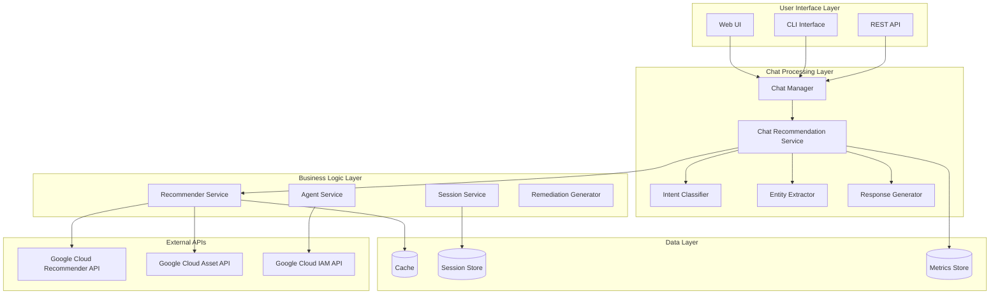

### Component Architecture

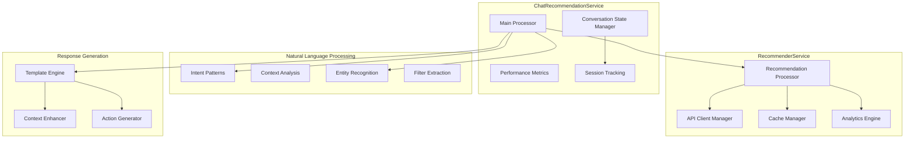

## Request Flow

### 1. User Query Processing Flow

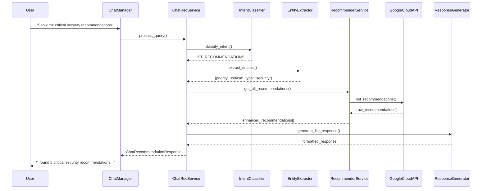

### 2. Recommendation Application Flow

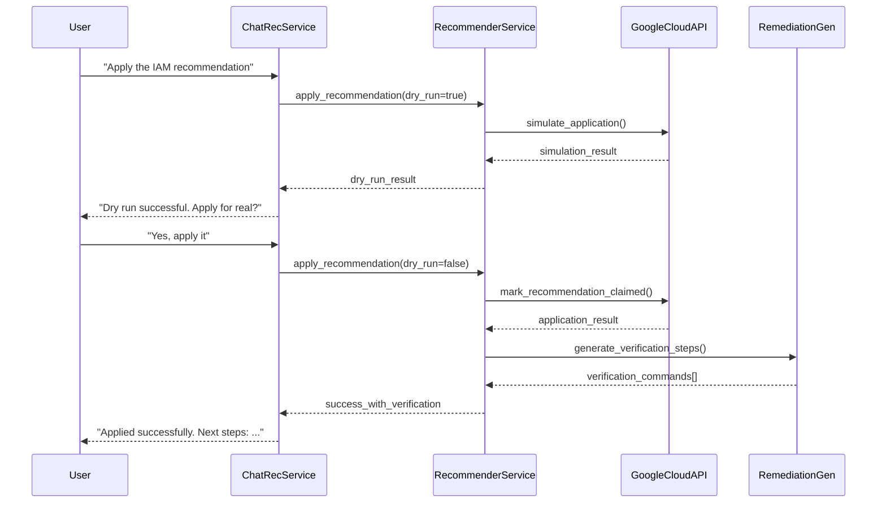

### 3. Error Recovery Flow

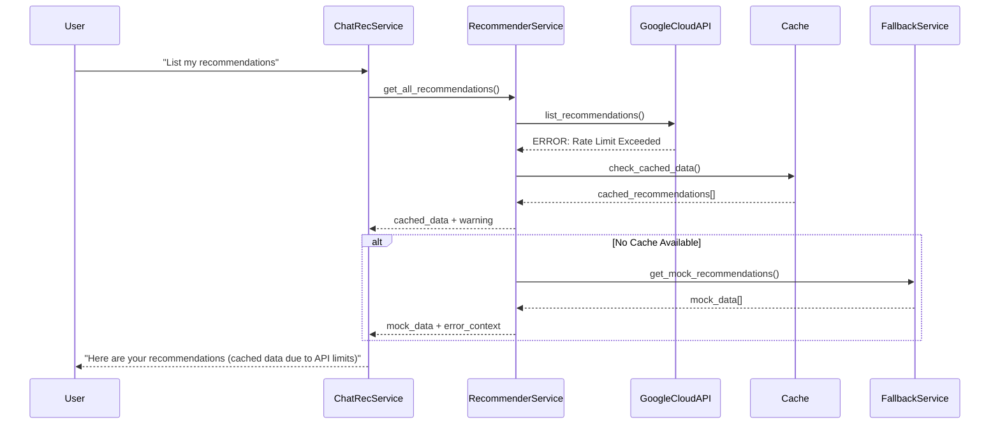

## Component Interactions

### Core Component Relationships

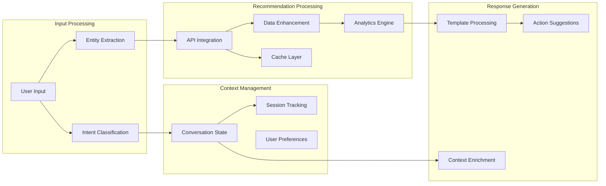

### Service Dependencies

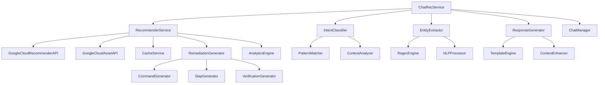

## Data Flow

### Data Transformation Pipeline

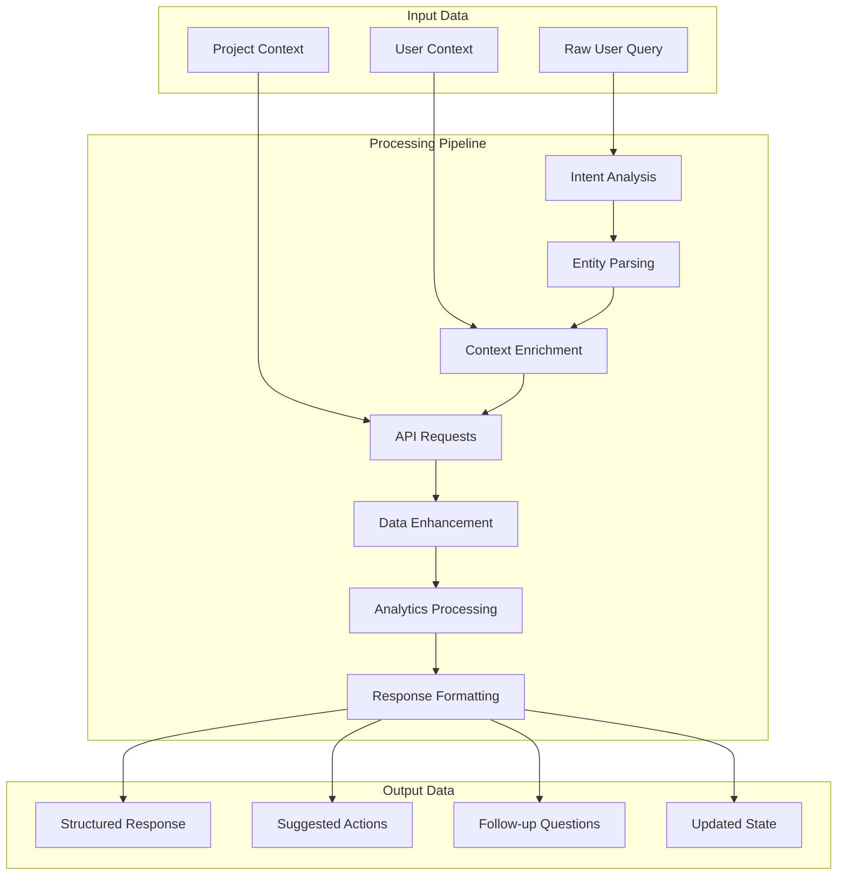

### Data Models Flow

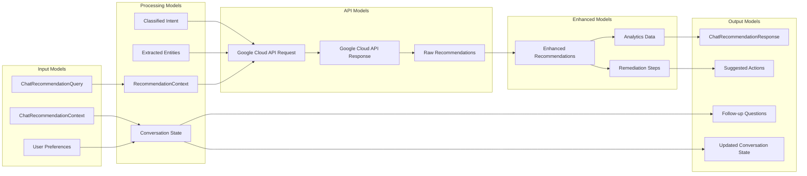

## Error Handling Paths

### Comprehensive Error Flow

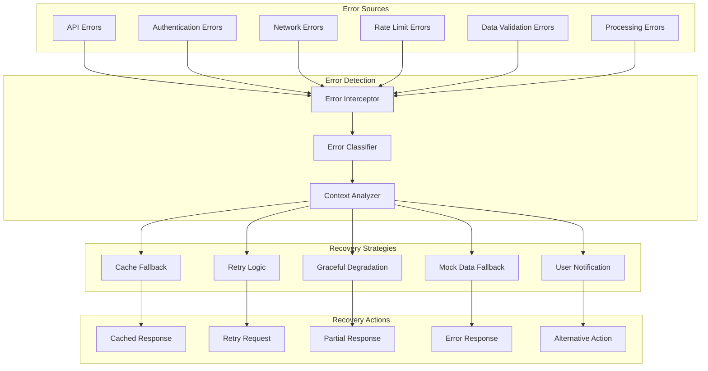

### Error Recovery Decision Tree

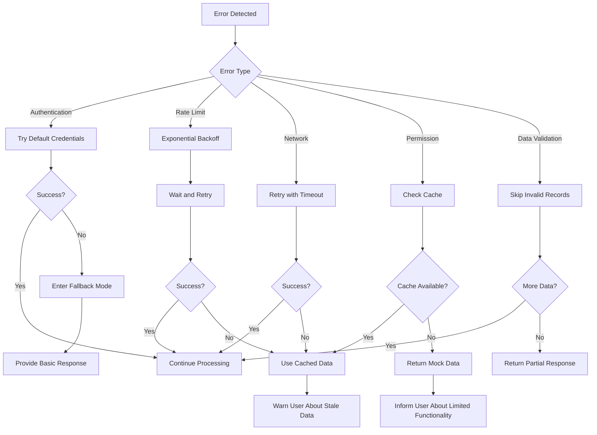

### Error Response Templates

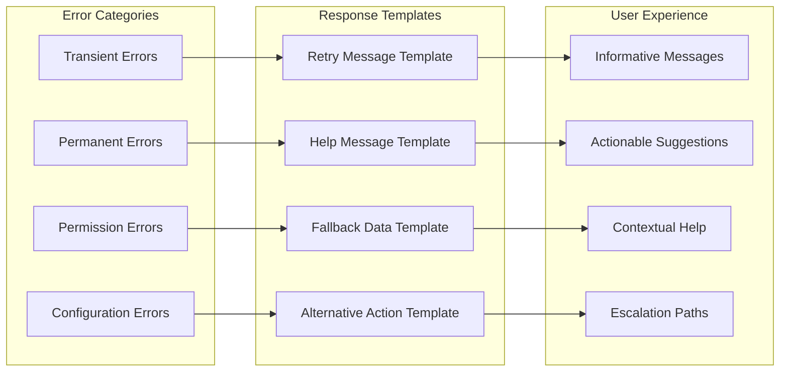

## Performance Optimization

### Caching Strategy Architecture

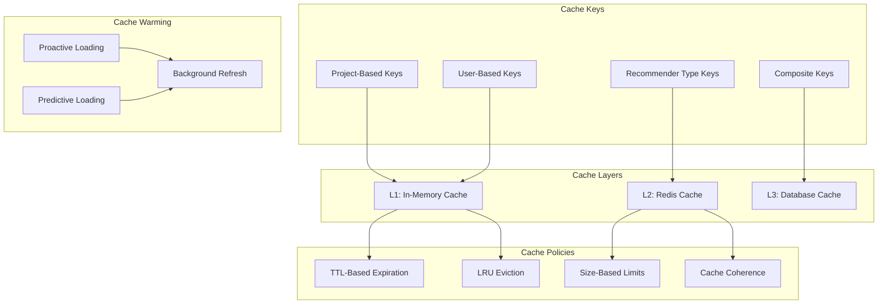

### Concurrent Processing Architecture

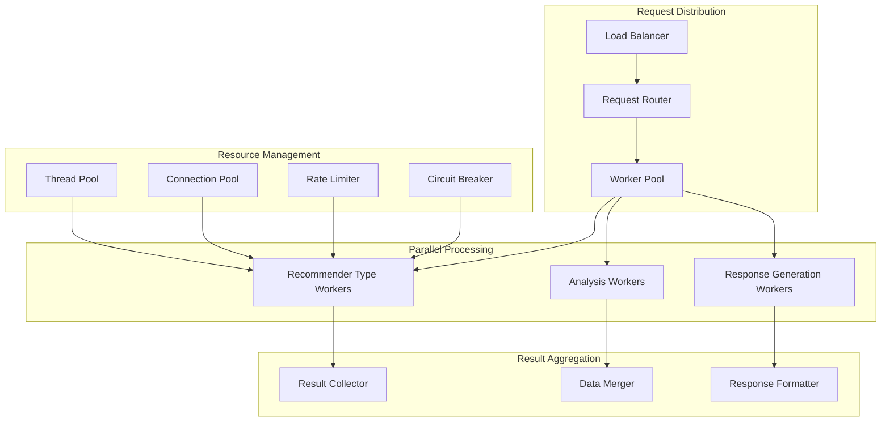

### Performance Monitoring Architecture

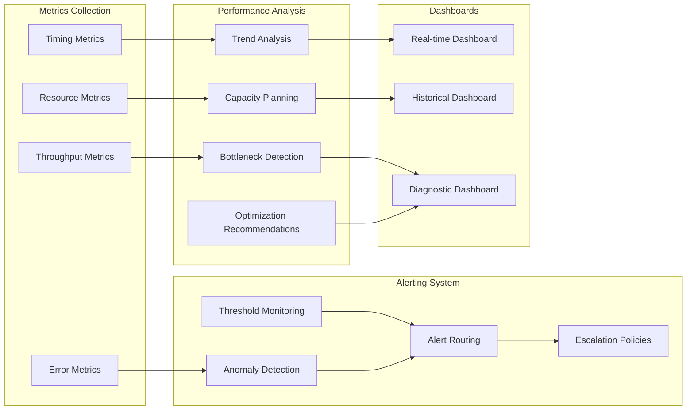

## Scalability Considerations

### Horizontal Scaling Architecture

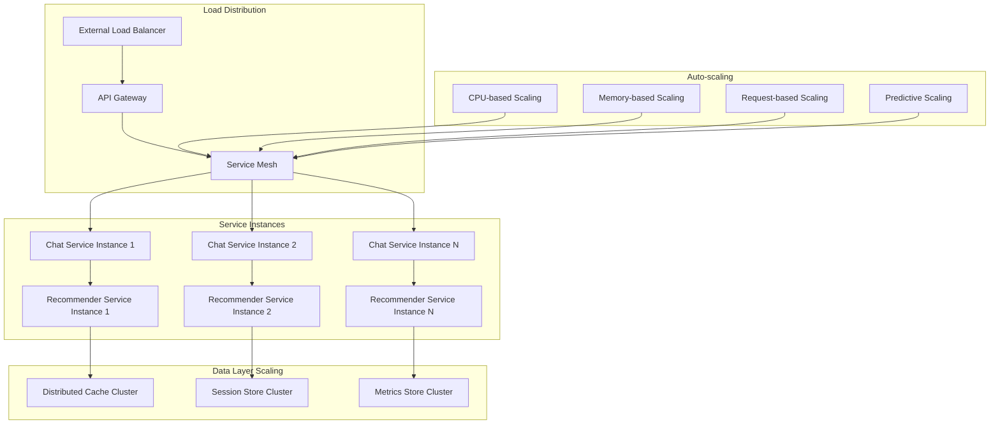

### Microservices Decomposition

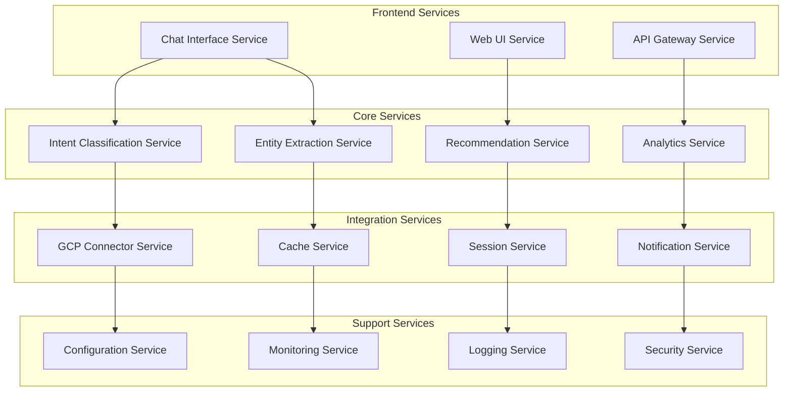

## Security Architecture

### Authentication and Authorization Flow

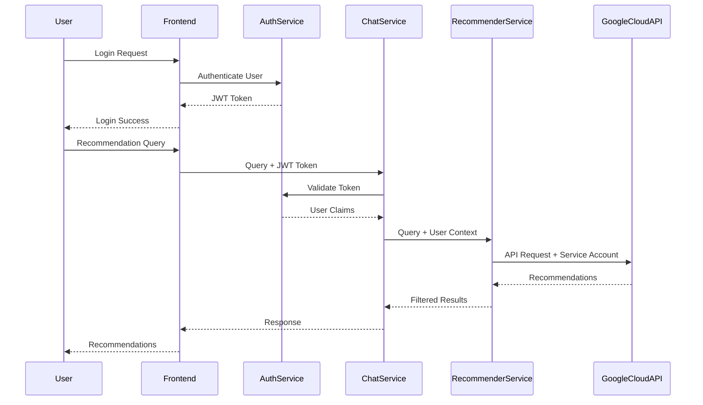

### Security Boundaries

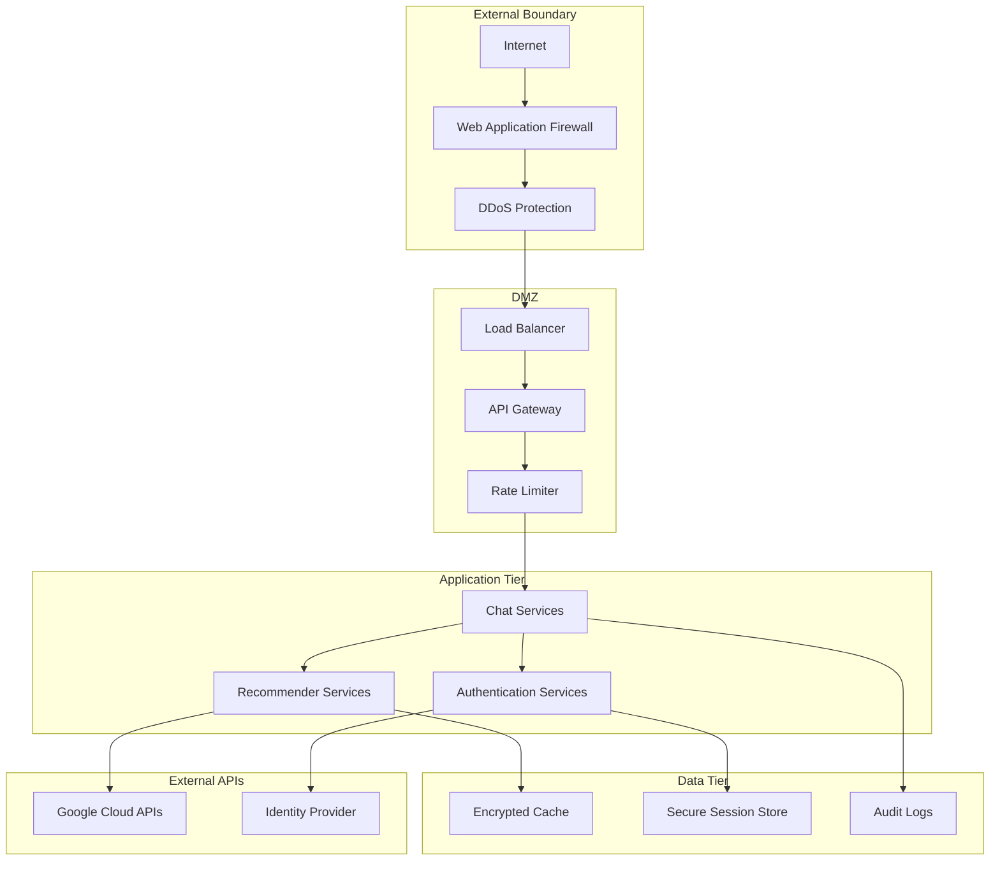

### Data Protection Architecture

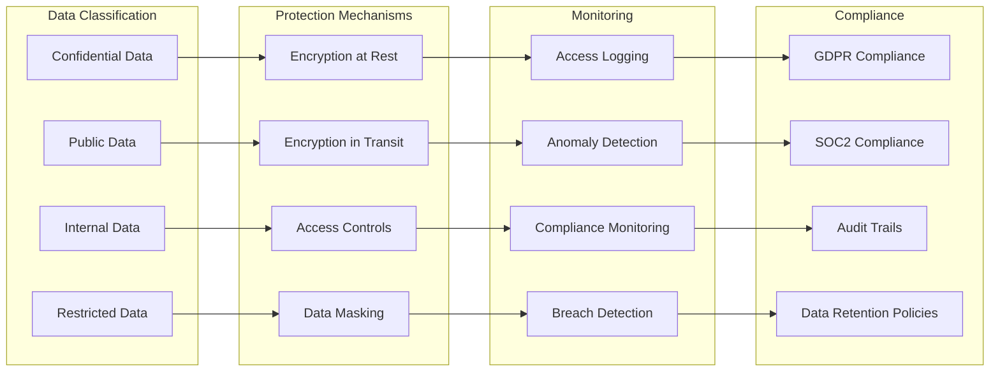

## Monitoring and Observability

### Observability Stack

```mermaid
graph TB
    subgraph "Collection Layer"
        APP_METRICS[Application Metrics]
        SYSTEM_METRICS[System Metrics]
        BUSINESS_METRICS[Business Metrics]
        TRACE_DATA[Trace Data]
        LOG_DATA[Log Data]
    end
    
    subgraph "Processing Layer"
        METRICS_PROCESSOR[Metrics Processor]
        LOG_PROCESSOR[Log Processor]
        TRACE_PROCESSOR[Trace Processor]
        CORRELATION_ENGINE[Correlation Engine]
    end
    
    subgraph "Storage Layer"
        TIME_SERIES_DB[Time Series Database]
        LOG_STORE[Log Store]
        TRACE_STORE[Trace Store]
        INDEX_STORE[Search Index]
    end
    
    subgraph "Analysis Layer"
        DASHBOARD_ENGINE[Dashboard Engine]
        ALERT_ENGINE[Alert Engine]
        ANALYTICS_ENGINE[Analytics Engine]
        ML_ANOMALY_DETECTION[ML Anomaly Detection]
    end
    
    subgraph "Presentation Layer"
        OPERATIONAL_DASHBOARDS[Operational Dashboards]
        BUSINESS_DASHBOARDS[Business Dashboards]
        ALERT_NOTIFICATIONS[Alert Notifications]
        REPORTS[Reports]
    end
    
    APP_METRICS --> METRICS_PROCESSOR
    SYSTEM_METRICS --> METRICS_PROCESSOR
    BUSINESS_METRICS --> METRICS_PROCESSOR
    TRACE_DATA --> TRACE_PROCESSOR
    LOG_DATA --> LOG_PROCESSOR
    
    METRICS_PROCESSOR --> TIME_SERIES_DB
    LOG_PROCESSOR --> LOG_STORE
    TRACE_PROCESSOR --> TRACE_STORE
    CORRELATION_ENGINE --> INDEX_STORE
    
    TIME_SERIES_DB --> DASHBOARD_ENGINE
    LOG_STORE --> ALERT_ENGINE
    TRACE_STORE --> ANALYTICS_ENGINE
    INDEX_STORE --> ML_ANOMALY_DETECTION
    
    DASHBOARD_ENGINE --> OPERATIONAL_DASHBOARDS
    ALERT_ENGINE --> ALERT_NOTIFICATIONS
    ANALYTICS_ENGINE --> BUSINESS_DASHBOARDS
    ML_ANOMALY_DETECTION --> REPORTS
```

### Key Performance Indicators

```mermaid
graph LR
    subgraph "Technical KPIs"
        RESPONSE_TIME[Response Time]
        THROUGHPUT[Throughput]
        ERROR_RATE[Error Rate]
        AVAILABILITY[Availability]
        CACHE_HIT_RATE[Cache Hit Rate]
    end
    
    subgraph "Business KPIs"
        USER_SATISFACTION[User Satisfaction]
        RECOMMENDATION_ADOPTION[Recommendation Adoption]
        COST_SAVINGS_REALIZED[Cost Savings Realized]
        SECURITY_IMPROVEMENTS[Security Improvements]
        TIME_TO_RESOLUTION[Time to Resolution]
    end
    
    subgraph "Operational KPIs"
        INCIDENT_RESPONSE_TIME[Incident Response Time]
        DEPLOYMENT_FREQUENCY[Deployment Frequency]
        CHANGE_FAILURE_RATE[Change Failure Rate]
        MEAN_TIME_TO_RECOVERY[Mean Time to Recovery]
        CAPACITY_UTILIZATION[Capacity Utilization]
    end
    
    subgraph "Quality KPIs"
        TEST_COVERAGE[Test Coverage]
        CODE_QUALITY_SCORE[Code Quality Score]
        DOCUMENTATION_COVERAGE[Documentation Coverage]
        SECURITY_SCAN_RESULTS[Security Scan Results]
        COMPLIANCE_SCORE[Compliance Score]
    end
    
    RESPONSE_TIME --> USER_SATISFACTION
    THROUGHPUT --> RECOMMENDATION_ADOPTION
    ERROR_RATE --> INCIDENT_RESPONSE_TIME
    AVAILABILITY --> DEPLOYMENT_FREQUENCY
    CACHE_HIT_RATE --> CAPACITY_UTILIZATION
    
    USER_SATISFACTION --> TEST_COVERAGE
    RECOMMENDATION_ADOPTION --> CODE_QUALITY_SCORE
    COST_SAVINGS_REALIZED --> DOCUMENTATION_COVERAGE
    SECURITY_IMPROVEMENTS --> SECURITY_SCAN_RESULTS
    TIME_TO_RESOLUTION --> COMPLIANCE_SCORE
```

### Distributed Tracing Architecture

```mermaid
sequenceDiagram
    participant User
    participant ChatService
    participant IntentClassifier
    participant RecommenderService
    participant GoogleCloudAPI
    participant Cache
    participant Analytics
    
    Note over User,Analytics: Trace ID: 12345-abcde
    
    User->>+ChatService: Query [Span: chat-request]
    ChatService->>+IntentClassifier: Classify [Span: intent-classification]
    IntentClassifier-->>-ChatService: Intent Result
    ChatService->>+RecommenderService: Get Recommendations [Span: rec-service]
    
    par Parallel Processing
        RecommenderService->>+GoogleCloudAPI: API Call [Span: gcp-api]
        GoogleCloudAPI-->>-RecommenderService: API Response
    and
        RecommenderService->>+Cache: Check Cache [Span: cache-lookup]
        Cache-->>-RecommenderService: Cache Result
    and
        RecommenderService->>+Analytics: Process Analytics [Span: analytics]
        Analytics-->>-RecommenderService: Enhanced Data
    end
    
    RecommenderService-->>-ChatService: Recommendations
    ChatService-->>-User: Response [Span: response-generation]
    
    Note over User,Analytics: End Trace: 12345-abcde
```

---

This architecture documentation provides a comprehensive view of how the Google Cloud Recommender API integrates with chat interfaces, covering all aspects from high-level architecture to detailed component interactions, data flows, error handling, and monitoring. The modular design ensures scalability, reliability, and maintainability while providing an excellent user experience through natural language interactions.