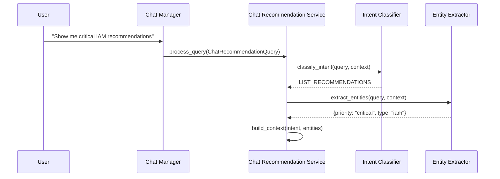
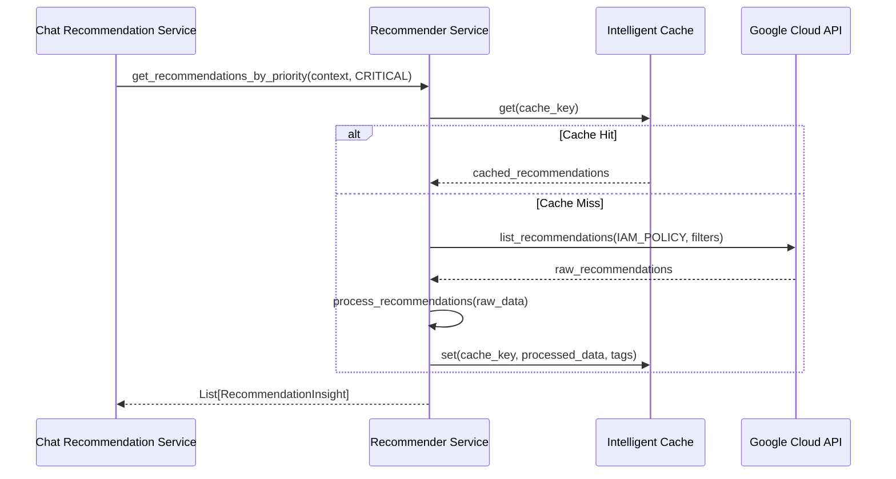
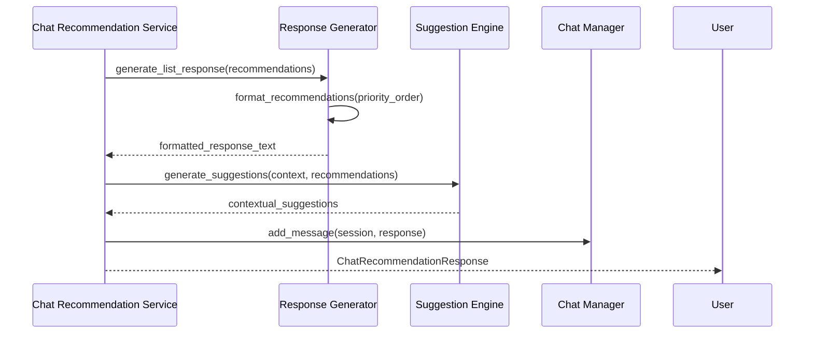

# Google Cloud Recommender API Integration Flow

## System Overview

The Google Cloud Recommender API integration provides comprehensive recommendation management through a multi-layered architecture that seamlessly integrates with the existing ADK security agent chat system.

## Architecture Components

### 1. Chat Interface Layer
```
┌─────────────────┐    ┌─────────────────┐    ┌─────────────────┐
│   User Query    │───▶│ Chat Manager    │───▶│ Intent Classifier│
│                 │    │                 │    │                 │
│ "Show me security"   │ Session State   │    │ NLP Processing  │
│ recommendations     │ Management      │    │                 │
└─────────────────┘    └─────────────────┘    └─────────────────┘
```

### 2. Query Processing Flow
```
┌─────────────────┐    ┌─────────────────┐    ┌─────────────────┐
│ Intent Detection│───▶│ Entity Extract  │───▶│ Context Builder │
│                 │    │                 │    │                 │
│ - List recs     │    │ - Project ID    │    │ - Filter params │
│ - Apply rec     │    │ - Priority      │    │ - User prefs    │
│ - Analyze rec   │    │ - Type filter   │    │ - Session data  │
└─────────────────┘    └─────────────────┘    └─────────────────┘
```

### 3. Service Layer Architecture
```
┌─────────────────┐    ┌─────────────────┐    ┌─────────────────┐
│ Chat Rec Service│───▶│ Recommender Svc │───▶│ Google Cloud    │
│                 │    │                 │    │ Recommender API │
│ - NL Processing │    │ - API Calls     │    │                 │
│ - Intent Routing│    │ - Data Transform│    │ - 7 Recommenders│
│ - Response Gen  │    │ - Analytics     │    │ - All Regions   │
└─────────────────┘    └─────────────────┘    └─────────────────┘
```

## Detailed Integration Flow

### Step 1: User Query Processing


### Step 2: Recommendation Retrieval


### Step 3: Response Generation


## Recommendation Type Processing

### IAM Policy Recommendations
```
Input: google.iam.policy.Recommender
├── Extract: Policy changes, affected bindings
├── Analyze: Security impact, compliance effect
├── Generate: gcloud commands, verification steps
└── Output: IAMPolicyRecommendation model
```

### Firewall Recommendations
```
Input: google.compute.firewall.Recommender
├── Extract: Rule changes, source ranges
├── Analyze: Security risk reduction
├── Generate: Network configuration commands
└── Output: FirewallRecommendation model
```

### Cost Optimization Recommendations
```
Input: Machine Type, Usage Commitment, Idle Resources
├── Extract: Resource specifications, usage patterns
├── Analyze: Cost savings, performance impact
├── Generate: Resource modification commands
└── Output: Cost-focused recommendation models
```

## Caching Strategy Implementation

### Multi-Tier Cache Architecture
```
┌─────────────────┐    ┌─────────────────┐    ┌─────────────────┐
│   Memory Cache  │    │   Redis Cache   │    │   Disk Cache    │
│                 │    │                 │    │                 │
│ - Fast access   │    │ - Distributed   │    │ - Persistent    │
│ - LRU eviction  │    │ - Session share │    │ - Large storage │
│ - 1000 entries  │    │ - Auto expire   │    │ - Backup tier   │
└─────────────────┘    └─────────────────┘    └─────────────────┘
```

### Cache Key Structure
```
operation:project_id:location:recommender_type:filter_hash:params
│         │          │        │              │           │
│         │          │        │              │           └─ Additional parameters
│         │          │        │              └─ MD5 of sorted filters
│         │          │        └─ google.iam.policy.Recommender
│         │          └─ global, us-central1, etc.
│         └─ GCP project identifier
└─ list_recommendations, get_insights, etc.
```

### Smart Invalidation Rules
```yaml
invalidation_triggers:
  project_updated:
    - "project:*"
  recommendation_applied:
    - "type:*"
    - "operation:list_recommendations"
  policy_changed:
    - "type:google.iam.policy.Recommender"
    - "category:security"
  firewall_changed:
    - "type:google.compute.firewall.Recommender"
```

## Session-Based Recommendation Tracking

### Session State Management
```python
ConversationState:
├── session_id: str
├── current_recommendations: List[RecommendationInsight]
├── active_recommendation_id: Optional[str]
├── user_preferences: Dict[str, Any]
├── conversation_context: Dict[str, Any]
└── pending_actions: List[str]
```

### Progress Tracking
```python
RecommendationProgress:
├── recommendation_id: str
├── current_step: int
├── total_steps: int
├── completed_steps: List[int]
├── step_results: Dict[int, Dict[str, Any]]
├── overall_status: str
└── estimated_completion: datetime
```

## Analytics and Metrics

### Portfolio-Level Analytics
```python
RecommendationAnalytics:
├── total_recommendations: int
├── total_cost_savings_usd: float
├── average_security_score: float
├── priority_distribution: Dict[Priority, int]
├── type_distribution: Dict[RecommenderType, int]
├── estimated_implementation_hours: float
└── compliance_gap_closure: Dict[str, float]
```

### Real-Time Metrics
```python
Performance Tracking:
├── Response times per recommender type
├── Cache hit rates by operation
├── User interaction patterns
├── Most common query intents
└── Recommendation application success rates
```

## API Endpoints Architecture

### Core Endpoints
```
POST /recommendations/comprehensive
├── Input: RecommenderContextRequest
├── Process: Multi-type recommendation retrieval
└── Output: RecommendationListResponse with analytics

POST /recommendations/chat/query
├── Input: ChatRecommendationQuery (natural language)
├── Process: Intent classification → Entity extraction → Response generation
└── Output: ChatRecommendationResponse with actions

POST /recommendations/apply
├── Input: RecommendationActionRequest
├── Process: Dry-run validation → Real application → Progress tracking
└── Output: RecommendationActionResponse with status
```

### Session Management
```
GET /recommendations/session/{session_id}
├── Retrieve session-specific recommendations
├── Track conversation context
└── Return personalized recommendations

POST /recommendations/progress/{recommendation_id}
├── Update implementation progress
├── Track step completion
└── Calculate remaining time
```

## Error Handling and Resilience

### Graceful Degradation
```
API Failure Handling:
├── Cache fallback for recent data
├── Partial results when some recommenders fail
├── Clear error messages to users
└── Automatic retry with exponential backoff
```

### Monitoring and Alerting
```
Health Checks:
├── Google Cloud API connectivity
├── Cache system health
├── Response time monitoring
└── Error rate tracking
```

## Security and Compliance

### Authentication Flow
```
Request Processing:
├── Service account authentication to Google Cloud
├── Project-level permission validation
├── Resource access verification
└── Audit logging for all operations
```

### Data Privacy
```
Privacy Controls:
├── No sensitive data in cache keys
├── Configurable data retention periods
├── Encrypted cache storage
└── User consent for recommendation tracking
```

## Deployment Architecture

### Service Dependencies
```
Google Cloud Recommender Integration:
├── google-cloud-recommender >= 2.11.0
├── google-cloud-asset >= 3.15.0
├── redis >= 4.3.0 (optional)
├── fastapi >= 0.95.0
└── pydantic >= 2.0.0
```

### Configuration Management
```yaml
recommender_config:
  cache:
    memory_limit: 1000
    default_ttl: 1800
    redis_url: "redis://localhost:6379"
    disk_cache_path: "./cache"
  
  api:
    timeout_seconds: 30
    retry_attempts: 3
    rate_limit_per_minute: 60
  
  features:
    smart_invalidation: true
    session_tracking: true
    analytics: true
```

## Future Enhancements

### Planned Features
1. **Machine Learning Integration**
   - Recommendation relevance scoring
   - User preference learning
   - Predictive recommendation timing

2. **Advanced Analytics**
   - Cost impact forecasting
   - Security posture trending
   - Compliance dashboard integration

3. **Workflow Automation**
   - Automated recommendation application
   - Approval workflows for high-impact changes
   - Integration with change management systems

4. **Enhanced Chat Features**
   - Multi-turn conversation support
   - Voice command integration
   - Visual recommendation dashboard

This architecture provides a comprehensive foundation for integrating Google Cloud Recommender API into the ADK security agent, ensuring scalability, reliability, and excellent user experience through natural language interactions.