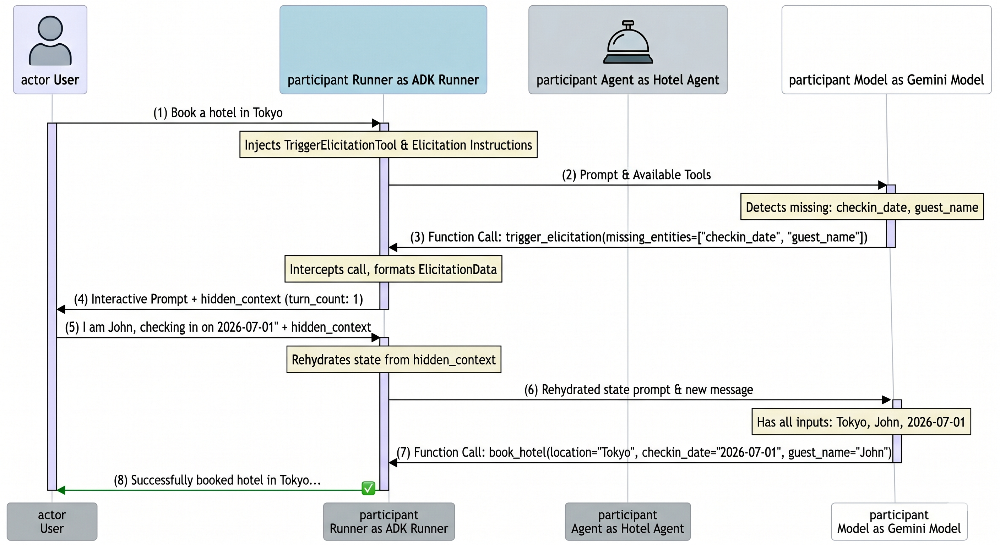

# Stateless Tiered Elicitation Sample

This sample demonstrates how to use the **Stateless Tiered Elicitation Flow** in the Google ADK to resolve ambiguous user requests interactively without relying on backend state stores.

## Overview

When building conversational agents, users often provide ambiguous or incomplete requests. For example, in travel booking, a user might ask to *"Book a hotel in Tokyo"* without specifying a check-in date or passenger name. In data analysis and **NL2SQL solutions**, a user might request *"Show me active customers"* without clarifying what defines an "active" customer (e.g., registered within the last 30 days, or having placed an order recently), which is critical to generating accurate, non-speculative SQL queries.

The **Stateless Tiered Elicitation** feature solves this problem. It allows the agent to request clarification by returning an interactive prompt to the client along with a `hidden_context` payload containing the session's current parameters. When the user provides the missing details, the ADK transparently rehydrates this state on the subsequent turn to complete the execution. This drastically improves conversational accuracy and execution reliability in data pipelines, forms processing, and booking assistants, all without requiring any server-side session storage.


## Core Components

1. **Hotel Booking Assistant** (`agent.py`)
   - Configured with first-class parameters: `allow_elicitation=True` and `elicitation_max_turns=3`.
   - Features instructions detailing that `location`, `checkin_date`, and `guest_name` are all required.
   - Has a `book_hotel` tool to perform the booking.
2. **Elicitation Tooling** (`elicitation_tool.py`)
   - The `TriggerElicitationTool` is conditionally injected by the runner because `allow_elicitation` is enabled.
   - The model invokes this tool when parameters are missing.
3. **Runner Orchestration** (`main.py`)
   - Orchestrates the multi-turn conversation using `InMemoryRunner` and prints out the `hidden_context` at each turn to illustrate how stateless persistence works.

## How It Works

The flow begins when a user issues a hotel booking request missing essential details like the check-in date and guest name. Recognizing these omissions, the Gemini model calls the automatically injected `TriggerElicitationTool` to request clarification, which the ADK runner intercepts to generate an interactive prompt and package existing parameters into a `hidden_context` snapshot sent to the client. When the user responds with the missing information, the runner transparently rehydrates the previous turn's state from `hidden_context` and passes the complete package back to the agent, enabling successful tool execution without server-side state storage.



## Understanding Elicitation & Ambiguity Resolution

In typical conversational AI applications, users rarely provide all the required information in their initial prompt. For instance, they might say *"Book a hotel in Tokyo"* without specifying the dates or the guest name. 

Without elicitation, the agent would either:
- **Fail outright** due to missing arguments.
- **Invent placeholder/fake values** (hallucinating details).
- **Ask a generic text clarification** that requires the developer to maintain state on the server to remember what the user was trying to book when they reply.

**Elicitation** solves this by introducing a structured, turn-based mechanism to actively gather missing fields. By utilizing the `TriggerElicitationTool`, the agent can formally flag exactly which parameters are missing. The ADK runner intercepts this, packages the already gathered parameters into a `hidden_context` state snapshot, and prompts the user for the rest. When the user answers, the next execution turn rehydrates the `hidden_context` transparently, allowing the model to complete the transaction as if it had all the details from the beginning.

---

## Best Practices & Security Guidelines

Stateless elicitation is powerful, but passing conversational state through client-side roundtrips requires careful design to prevent security risks and ensure high reliability.

### 1. Preventing PII and Sensitive Data Leakage

> [!WARNING]
> **The `hidden_context` payload is returned directly to the client/UI layer.** Any information stored within the `context_snapshot` is visible to the client and can be inspected, intercepted, or tampered with.

- **Do Not Store Raw PII**: Avoid keeping raw, unmasked PII (e.g., Social Security Numbers, credit card numbers, passwords) inside the `context_snapshot`.
- **Implement Data Redaction**: Sanitize or redact sensitive information from arguments before they are packed into the `context_snapshot`. If your workflow gathers highly sensitive data, consider keeping it in a secure, temporary server-side cache, using only a masked reference ID in the `hidden_context`.
- **Limit Scope**: Only include parameters in the snapshot that are strictly required to execute the downstream tools.

### 2. Ensuring State Integrity & Tampering Prevention

Since the client manages the state snapshot, a malicious user or application could modify the `hidden_context` payload before sending it back (e.g., changing `price=10` to `price=0`).

- **Cryptographic Signatures (Recommended)**: If deploying to an untrusted client environment (e.g., public web or mobile apps), sign the `hidden_context` payload on your server gateway using an `HMAC-SHA256` signature. When the client returns the payload, verify the signature before processing the request. If the signatures don't match, reject the turn.
- **Payload Encryption**: For high-security environments, encrypt the `hidden_context` payload completely on the server-side before passing it down, so that the client cannot read or alter the contents.

### 3. Effective Usage & Loop Termination

- **Explicit Tool Parameter Descriptions**: Always provide highly descriptive docstrings for your tools and their arguments. The model relies entirely on these descriptions to evaluate whether parameters are missing.
- **Set Realistic Turn Limits**: Always set a reasonable `elicitation_max_turns` parameter (recommended default: `3`). This prevents the LLM from entering infinite conversational loops if the user continuously provides invalid or unrelated answers.
- **Graceful Fallbacks**: When `elicitation_max_turns` is exceeded, the ADK will raise a `RuntimeError`. Ensure your application catches this and routes the user to a human operator or presents a fallback interface.

---

## Prerequisites

Ensure you have set your Gemini API credentials in your environment or a local `.env` file:
```bash
export GOOGLE_API_KEY="your-api-key"
```

## Running the Sample

To run the sample locally, execute the following command from the repository root:
```bash
PYTHONPATH=src .venv/bin/python contributing/samples/stateless_elicitation/main.py
```

## Walkthrough Output

When run successfully, the console output will show the following turns:

### Turn 1: Ambiguous Query
User says: `"Book a hotel in Tokyo"`
*   **Agent Action**: The model recognizes that `checkin_date` and `guest_name` are missing and calls the `trigger_elicitation` tool.
*   **Agent Response**: *Interactive prompt asking for missing details.*
*   **Stateless Hidden Context**: Contains the serialized `ElicitationData` snapshot with:
    *   `turn_count: 1`
    *   `context_snapshot: {"location": "Tokyo"}`

### Turn 2: Providing Missing Details
User says: `"I am John Doe, and my check-in date is 2026-07-01"`
*   **Agent Action**: The ADK rehydrates the context (`location: Tokyo`) from the `hidden_context`, combines it with the new input, and successfully invokes the real `book_hotel` tool.
*   **Agent Response**: `"Successfully booked hotel in Tokyo on 2026-07-01 for John Doe."`
