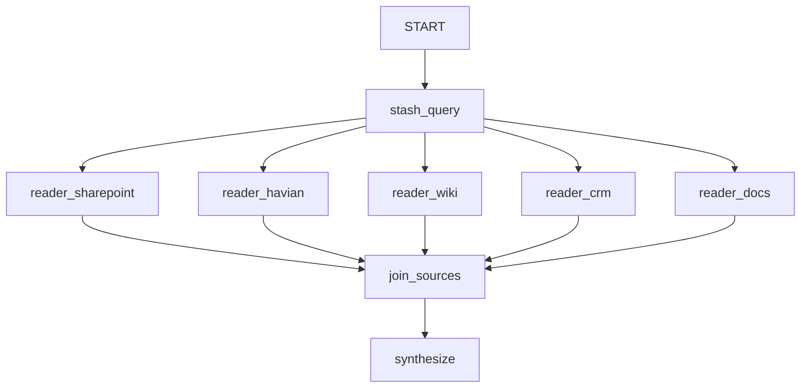

# Parallel Fan-Out with Mid-Stream Preemption

## Overview

Read several data sources **in parallel**, and **stop reading any source the
moment it becomes apparent it's irrelevant** — don't stream 100 pages of
analysis when the model realizes on "page 3" that the source doesn't apply.

Each source is analyzed by its own streaming agent wrapped in a
`StreamingRouterNode`. A `monitor` predicate watches that branch's token
stream; the instant the source declares itself irrelevant, the node commits an
`{"relevant": false}` output and **cancels the rest of that generation** via
ADK's cooperative `aclosing` cancellation. The other branches are untouched.

A `JoinNode` fans the results back in and a synthesizer drops the irrelevant
ones.

## Why it's actually parallel (and fast)

- The workflow scheduler launches every fan-out branch as its own
  `asyncio.create_task` and awaits them together, so the reads truly overlap.
- `enable_uvloop()` puts them on a libuv event loop. Install with
  `pip install "google-adk[uvloop]"` (or set `ADK_UVLOOP=1`).
- Preemption saves wall-clock by killing the tail of an irrelevant read
  instead of paying for tokens nobody uses.

## How the preemption works

```python
def monitor(view: StreamView) -> StreamDecision | None:
    if view.text.lstrip().upper().startswith("IRRELEVANT"):
        return StreamDecision(output={"source": source, "relevant": False})
    return None  # keep reading

StreamingRouterNode(name=f"reader_{source}", agent=reader, monitor=monitor,
                    timeout=60)
```

- Returning a `StreamDecision` commits the output and (by default) cancels the
  remaining generation for that branch.
- Returning `None` keeps streaming; a relevant read finishes normally and its
  final text becomes the branch's output.
- `timeout=60` is a hard cap so a stuck/slow source can never hold up the join.

## Graph



## Notes and limits

- This cancels the **LLM analysis stream**. If the expensive work is the data
  **fetch** itself (a network/tool call), that tool must be async and
  cooperatively cancellable for the cancel to unwind it; consider a cheap
  relevance pre-scan before the deep read.
- `JoinNode` waits for **all** branches. Preemption just makes the irrelevant
  ones return sooner. To proceed the moment the relevant subset is in (dropping
  irrelevant branches from the join entirely), you'd need a custom any/first-N
  join.
