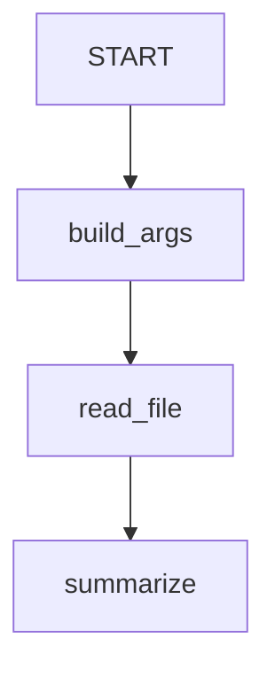

# ADK Workflow MCP Toolset Node Sample

## Overview

This sample demonstrates calling a tool from an **MCP server** as a step in an
**ADK Workflow**, using `ToolsetNode`.

A `BaseTool` can be dropped straight into a workflow's `edges`. An MCP tool
cannot, because it only exists after `await McpToolset.get_tools()` lists it over
a live connection, and `Workflow(...)` is constructed synchronously.
`ToolsetNode` closes that gap: it holds the toolset and the tool's name, and
resolves the tool when the node runs, on the runner's event loop.

The workflow reads a file through the MCP filesystem server:

1. `build_args` turns the user's message into the tool's arguments.
1. `ToolsetNode` resolves `read_file` from the toolset and calls it.
1. `summarize` formats the MCP response.

Resolution goes through `BaseToolset.get_tools_with_prefix()`, which caches per
invocation, so several `ToolsetNode`s sharing one toolset list the server's tools
only once per run.

## Prerequisites

`npx` must be on your `PATH`; the sample launches
`@modelcontextprotocol/server-filesystem` as a stdio subprocess scoped to this
directory. Install the MCP extra with `pip install "google-adk[mcp]"`.

## Sample Inputs

- `README.md`

- `agent.py`

## Graph



## How To

1. **Declare the toolset normally.** No `await` is needed at module scope; the
   server is contacted only while the workflow runs.

   ```python
   filesystem_toolset = McpToolset(
       connection_params=StdioConnectionParams(...),
       tool_filter=['read_file', 'list_directory'],
   )
   ```

1. **Name the tool you want as a node.** The node's input is the tool's argument
   dict (or a JSON object string, or `None` for no arguments), and the tool's
   response becomes the node's output.

   ```python
   ToolsetNode(toolset=filesystem_toolset, tool_name='read_file')
   ```

1. **Name the node explicitly when the tool's name is not a Python
   identifier.** Node names must be identifiers, so a tool named `read-file`
   becomes a node named `read_file` by default. Pass `name=` to choose your own.

   ```python
   ToolsetNode(toolset=toolset, tool_name='read-file', name='reader')
   ```

The `Runner` closes the toolset when it shuts down, including when the toolset
is referenced only by a `ToolsetNode` inside a workflow, so the MCP subprocess
does not outlive the run.
