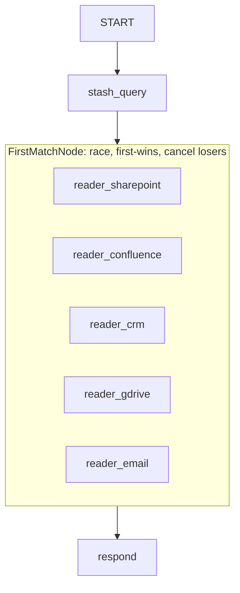

# Search Fan-Out: Answer From the First Source That Has It

## Overview

The enterprise-search shape (Recall@k): a keyword search returns the top-k
candidate sources — SharePoint, Confluence, CRM, a drive, email — and you don't
know which one holds the answer. So you read them **in parallel** and answer the
moment *any* one of them does, without waiting on (or paying to finish) the rest.

This sample combines two mechanisms:

1. **Per-branch preemption** — each source is read by a `StreamingRouterNode`
   whose `monitor` stops that read as soon as the model can say "answer is here"
   or "not here". A single irrelevant source never streams to the end.
2. **Cross-branch first-answer-wins** — `FirstMatchNode` races the branches and,
   the instant one returns `found=True`, **cancels the still-running siblings**
   (tearing down their in-flight model calls) and returns that answer.

`FirstMatchNode` is the complement of `JoinNode`: `JoinNode` waits for **all**
predecessors; `FirstMatchNode` returns the **first** matching one and cancels the
losers.

## How the race works

```python
first_answer = FirstMatchNode(
    name="first_answer",
    nodes=[reader_sharepoint, reader_confluence, reader_crm, ...],
    match=lambda r: isinstance(r, dict) and r.get("found"),
    no_match_output={"found": False, "answer": "Not found in any source."},
)
```

- Every branch is launched concurrently and handed the same input.
- The first result the `match` predicate accepts wins; the rest are cancelled and
  awaited (so their reads are actually torn down before the graph advances).
- A branch that *fails* is logged and skipped, so one flaky source can't deny an
  answer another source can give.
- If no branch matches, the node yields `no_match_output`.

## Why the cancellation is real

Cancelling a branch propagates cooperatively: the `FirstMatchNode` cancels the
branch's `asyncio` task → the dynamic scheduler's `await` on the child unwinds →
`CancelledError` reaches the `StreamingRouterNode`'s `Aclosing` block → the SSE
model call is closed. The loser stops **decoding** immediately.

`enable_uvloop()` puts the concurrent reads on a libuv loop. Install with
`pip install "google-adk[uvloop]"` (or set `ADK_UVLOOP=1`).

## What it saves — and what it doesn't

- **Saves:** the losers' output generation and the wall-clock of waiting on the
  slowest branch. You answer at ~the speed of the fastest source that has it.
- **Does not save:** the input already read. A branch that started still paid to
  *prefill* its source. Preemption/racing is a **decode-side** win.
- **To also cut prefill:** pass sources in rank order and set `max_parallel`
  (e.g. `2`) so an early win short-circuits before lower-ranked sources are ever
  read. With `max_parallel=1` it degrades to a cheap sequential gate.

## Graph


