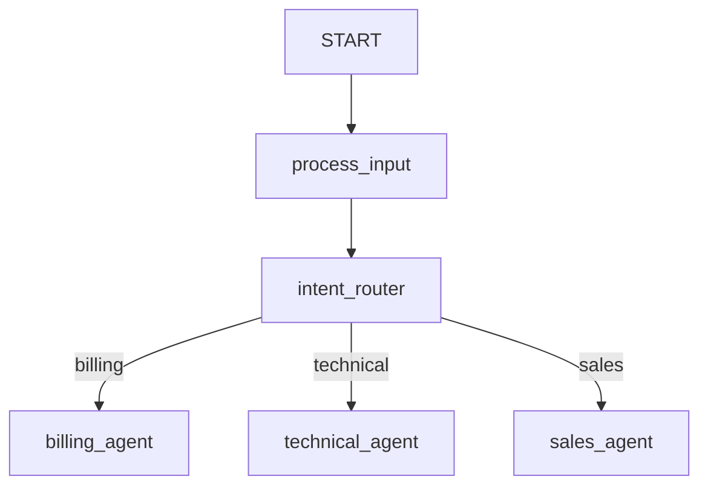

# Streaming (Preemptive) Routing + uvloop Sample

## Overview

This sample demonstrates two speed-oriented features:

1. **Mid-stream preemptive graph advancement** via `StreamingRouterNode`. A
   classifier agent streams its answer token-by-token. The moment the routing
   decision is present in the stream, the node commits the route and cancels
   the rest of the generation — the workflow advances mid-stream instead of
   waiting for the model to finish the turn.
1. **libuv event loop** via `enable_uvloop()`, which puts the whole process on
   a faster asyncio runtime.

## How it works

`StreamingRouterNode` runs a wrapped agent in SSE streaming mode and hands
every streamed delta to a `monitor` predicate. When the monitor returns a
`StreamDecision`, the node:

- commits that decision's `route` / `output` to the context, and
- (by default) closes the model stream, cancelling the remaining generation.

Because the node returns promptly, the scheduler advances the graph on the
committed route. This is deterministic: the graph moves only once the decision
is unambiguously present in the stream, so no branch has to be revised later.

```python
def route_when_category_streams(view: StreamView) -> StreamDecision | None:
    text = view.text.lower()
    for category in ("billing", "technical", "sales"):
        if category in text:
            return StreamDecision(route=category)
    return None

intent_router = StreamingRouterNode(
    name="intent_router",
    agent=classifier,
    monitor=route_when_category_streams,
)
```

## Enabling uvloop

`enable_uvloop()` installs the libuv event-loop policy process-wide. It is a
no-op (with a log line) when uvloop is not installed:

```bash
pip install "google-adk[uvloop]"
```

You can also enable it without touching code by setting `ADK_UVLOOP=1`, which
the synchronous `Runner.run` path honours automatically.

> **Note:** uvloop only accelerates work that actually awaits on an asyncio
> loop. Sync clients offloaded to a thread pool see no benefit until they are
> moved onto the loop (async client + `asyncio.gather`). libuv is the last
> 10%, not a 10x on its own.

## Sample Inputs

- `My invoice charged me twice this month.` → `billing`
- `The app crashes when I click export.` → `technical`
- `Do you offer volume discounts?` → `sales`

## Graph


