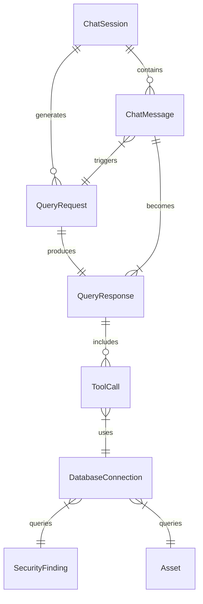

# Data Model: SQLite Database Connection Fix

**Feature**: Fix SQLite Database Connection in Chat Frontend
**Date**: 2025-09-17
**Branch**: `001-review-the-project`

## Entity Definitions

### ChatSession
Represents an active conversation session between a user and the security agent.

**Fields**:
- `session_id`: String (UUID) - Unique identifier for the session
- `user_id`: String - Identifier for the user
- `created_at`: Timestamp - Session creation time
- `last_activity`: Timestamp - Last interaction time
- `messages`: List[ChatMessage] - Conversation history
- `context`: Dict - Session-specific context and state

**Validation Rules**:
- session_id must be valid UUID format
- user_id cannot be empty
- created_at <= last_activity
- messages ordered by timestamp

**State Transitions**:
- NEW → ACTIVE (on first message)
- ACTIVE → IDLE (after timeout)
- IDLE → ACTIVE (on new message)
- * → CLOSED (on explicit end or timeout)

### ChatMessage
Individual message in a chat conversation.

**Fields**:
- `message_id`: String (UUID) - Unique message identifier
- `session_id`: String (UUID) - Parent session reference
- `role`: Enum["user", "assistant", "system"] - Message sender
- `content`: String - Message text
- `timestamp`: Timestamp - Message creation time
- `metadata`: Dict - Tool usage, execution time, etc.

**Validation Rules**:
- message_id must be unique
- session_id must reference existing session
- role must be valid enum value
- content cannot be empty for user/assistant roles
- timestamp must be sequential within session

### QueryRequest
Request from frontend to backend for database query.

**Fields**:
- `request_id`: String (UUID) - Unique request identifier
- `message`: String - Natural language query
- `session_id`: String - Session context
- `user_id`: String - User identifier
- `timestamp`: Timestamp - Request time
- `stream`: Boolean - Stream response flag

**Validation Rules**:
- request_id must be unique
- message length > 0 and < 10000 characters
- session_id format validation
- timestamp must be current (not future)

### QueryResponse
Response from backend containing query results.

**Fields**:
- `response_id`: String (UUID) - Unique response identifier
- `request_id`: String (UUID) - Original request reference
- `response`: String - Formatted response text
- `tool_usage`: List[ToolCall] - Tools invoked
- `execution_time`: Float - Query execution duration (seconds)
- `success`: Boolean - Query success status
- `error`: Optional[String] - Error message if failed
- `data_source`: String - Database or fallback indicator

**Validation Rules**:
- response_id must be unique
- request_id must reference existing request
- execution_time >= 0
- if success=false, error must be present
- if success=true, response must be present

### ToolCall
Record of a tool invocation during query processing.

**Fields**:
- `tool_name`: String - Name of the tool (e.g., "query_security_data")
- `parameters`: Dict - Tool parameters used
- `result`: Any - Tool execution result
- `duration`: Float - Execution time in milliseconds
- `success`: Boolean - Tool execution status

**Validation Rules**:
- tool_name must be registered tool
- parameters must match tool schema
- duration >= 0

### DatabaseConnection
Represents database connection state and configuration.

**Fields**:
- `connection_id`: String - Connection identifier
- `database_path`: String - Absolute path to SQLite file
- `status`: Enum["connected", "disconnected", "error"] - Connection state
- `last_query`: Optional[String] - Most recent query executed
- `last_query_time`: Optional[Timestamp] - Time of last query
- `error_state`: Optional[String] - Current error if any
- `table_count`: Integer - Number of tables in database
- `total_records`: Integer - Approximate total records

**Validation Rules**:
- database_path must be absolute path
- database_path must exist and be readable
- status transitions must be valid
- if status="error", error_state must be present

**State Transitions**:
- DISCONNECTED → CONNECTED (on successful connect)
- CONNECTED → DISCONNECTED (on close)
- * → ERROR (on any connection failure)
- ERROR → CONNECTED (on successful reconnect)

### SecurityFinding
Security issue from the database (existing entity).

**Fields**:
- `id`: Integer - Primary key
- `name`: String - Finding identifier
- `category`: String - Finding category
- `severity`: Enum["CRITICAL", "HIGH", "MEDIUM", "LOW"] - Severity level
- `state`: String - Current state
- `resource_name`: String - Affected resource
- `description`: Text - Detailed description
- `recommendation`: Text - Remediation guidance
- `event_time`: Timestamp - Discovery time

**Validation Rules**:
- severity must be valid enum value
- resource_name format validation
- event_time cannot be future

### Asset
GCP resource from asset inventory (existing entity).

**Fields**:
- `id`: Integer - Primary key
- `name`: String - Resource name
- `asset_type`: String - Full asset type identifier
- `display_name`: String - Human-readable name
- `location`: String - Resource location
- `state`: String - Resource state
- `create_time`: Timestamp - Creation time
- `update_time`: Timestamp - Last update
- `data`: JSON - Full resource data

**Validation Rules**:
- asset_type must be valid GCP type
- location must be valid GCP region/zone
- create_time <= update_time

## Relationships



## Database Schema (Existing Tables)

### Core Tables
- `security_findings` - Security issues and vulnerabilities
- `assets` - GCP resource inventory
- `iam_accounts` - IAM service accounts and users
- `storage_buckets` - Cloud Storage buckets
- `compute_instances` - Compute Engine VMs
- `networks` - VPC networks
- `firewall_rules` - Firewall configurations
- `databases` - Cloud SQL and other databases
- `gke_clusters` - GKE cluster information
- `api_keys` - API key inventory
- `secrets` - Secret Manager entries

### Metadata Tables
- `cache_status` - Cache update timestamps
- `query_logs` - Query execution history (new)
- `session_state` - Session persistence (new)

## Query Patterns

### Pattern 1: Direct Query
```sql
SELECT * FROM security_findings
WHERE severity = ?
ORDER BY event_time DESC
LIMIT ?
```

### Pattern 2: Aggregation Query
```sql
SELECT severity, COUNT(*) as count
FROM security_findings
GROUP BY severity
```

### Pattern 3: Join Query
```sql
SELECT a.name, a.asset_type, sf.severity, sf.description
FROM assets a
LEFT JOIN security_findings sf ON a.name = sf.resource_name
WHERE a.location = ?
```

## Indexes Required

```sql
CREATE INDEX idx_findings_severity ON security_findings(severity);
CREATE INDEX idx_findings_resource ON security_findings(resource_name);
CREATE INDEX idx_assets_type ON assets(asset_type);
CREATE INDEX idx_assets_location ON assets(location);
CREATE INDEX idx_query_logs_session ON query_logs(session_id);
```

## Migration Requirements

No schema migrations required for existing tables. New tables for logging and session management:

```sql
-- Query logging table
CREATE TABLE IF NOT EXISTS query_logs (
    id INTEGER PRIMARY KEY AUTOINCREMENT,
    session_id TEXT NOT NULL,
    user_id TEXT NOT NULL,
    query_text TEXT NOT NULL,
    query_type TEXT,
    execution_time REAL,
    success BOOLEAN,
    error_message TEXT,
    created_at TIMESTAMP DEFAULT CURRENT_TIMESTAMP
);

-- Session state table
CREATE TABLE IF NOT EXISTS session_state (
    session_id TEXT PRIMARY KEY,
    user_id TEXT NOT NULL,
    context TEXT, -- JSON serialized context
    created_at TIMESTAMP DEFAULT CURRENT_TIMESTAMP,
    updated_at TIMESTAMP DEFAULT CURRENT_TIMESTAMP
);
```

---

**Status**: Data Model Complete ✓